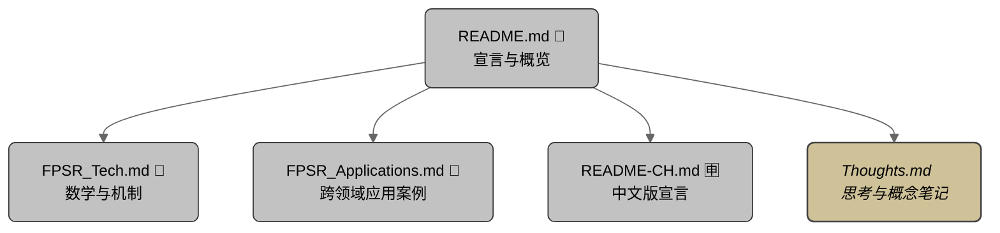
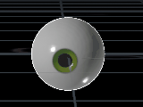
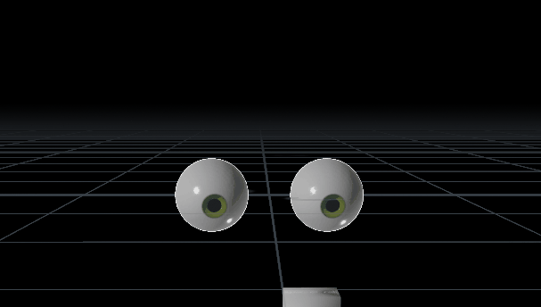

# 🎲 FPS-R: Frame-Persistent Stateless Randomization 静态律动算法

## 目录

- [FPS-R 是什么 ?](#fps-r-是什么-)
  - [FPS-R 简介](#fps-r-简介)
  - [运动哲学](#运动哲学)
- [核心特性](#核心特性)
- [动画中的示例用法](#动画中的示例用法)
- [为什么我们需要新的随机流生成器？](#为什么我们需要新的随机流生成器)
  - [“持续性随机性”的本质](#持续性随机性的本质)
  - [传统方法的局限性](#传统方法的局限性)
  - [FPS-R 的独特之处](#fps-r-的独特之处)
- [FPS-R 的不同模式](#fps-r-的不同模式)
  - [叠模机制](#叠模机制)
  - [量跃机制](#量跃机制)
- [应用场景](#应用场景)
- [工作原理](#工作原理)

---

## 🗺️ 文档结构图

### 📜 Readme — 宣言（简体中文）

**你正在此处**。这是主要文档。它将 FPS-R 介绍为一种动作语法和一组具表现力的工具，同时也是理解 FPS-R 运作方式与其所激发特质的视角。

---

### 🈸 Readme — 宣言、理念描述（简体中文）

[点击此处查看英文版 README.md — Click here for the main English README](README.md)

英文版宣言以英文阐述 FPS-R 的哲学基础和表现逻辑，展开其动态语法和工具体系的理念描述。

---

### 📐 数学与机制

[点击此处查看：FPSR_Tech.md](resources/readme/FPSR_Tech.md)

此扩展文档提供概念框架下的结构基础，概述支撑并塑造 FPS-R 行为的算法、表达式、参数及架构元素。  
**_源代码即在此处。_**

---

### 🍭 应用范畴

此文档补充并扩展了 FPS-R 的应用内容，超越本自述文件所提供的高层概览。  
将更深入地探讨各个领域，并为每个应用方向提供更丰富的使用案例。  
[点击此处查看：FPSR_Applications.md](resources/readme/FPSR_Applications.md)

---

### 📓 开发日志 — 编年记录

[点击此处查看：FPSR_Dev_Journal.md](resources/readme/FPSR_Dev_Journal.md)

一份按时间顺序整理的动态笔记，记录 FPS-R 的研究与设计过程。  
涵盖突破、失败、挣扎与修订，展现塑造现行实现方式的迭代历程。

---

### 🧠 思考笔记 — 概念与反思

[点击此处查看：FPSR_Thoughts.md](resources/readme/FPSR_Thoughts.md)

一份非线性思考的文档，记录理论发散、设计沉思和哲学探索。  
它是概念孵化器和批判草图本，呈现我内在的挣扎与冲突。  
同时为 FPS-R 的演化过程赋予哲理和诗性维度 —— 结构与感知交汇，随机性找寻节奏。

---

## 🎲 FPS-R 是什么？
**_无状态的不可预测性，拥有结构化的灵魂。_**

**FPS-R** 是一个领域中立的调制框架，也是一种信号表达语法，用于描述一种我们称为 **「随机移动与停留」** 的动作原型。  
该框架可跨越时间、空间与认知，应用于与智能相关的领域。

不同于传统模拟方式，它通过结构雕塑不连续性 —— 产生看似本能与有机的行为，  
却无需依赖记忆或状态。

这一概念构成了 FPS-R 哲学的基础…

---

### 🪞 简介

**FPS-R** 全称为 `Frame-Persistent Stateless Randomisation`（中文为 `静态律动算法`）。  
它是一种哲学与框架，驱动一系列轻量级算法模式与数学模型，用于在连续时间轴上模拟持续但无状态的随机性 ——  
非常适用于程序化运动、故障美学、合成有机行为，以及模拟类比特效。

FPS-R 的灵感来自自然行为，如眼球扫视、动物觅食、人类犹豫、掠食者跟踪与结构化噪声。  
它在无需记忆前一帧的前提下生成不可预测性。  
它的节奏仿佛探险者手中的火把照亮黑暗洞穴 —— 停顿、抽动、带着意图地漂移 ——  
又如士兵持枪执行战术清剿般的移动与停留 —— 逐点排查区域威胁，每个停留位置与前一个互不关联。

> _**FPS-R 是时间上的数值操控者，雕塑数值与时间行为。**_

当 FPS-R 的驱动方式从时间转向空间，它则变成另一种形态：  
形式的雕塑者，天际线的建造者。  
其跳跃-停留逻辑变成空间模式，其节奏变成浮雕。  
> _**FPS-R 不只是动作语言 —— 它是一种几何方言。**_

FPS-R 具备 **可重复性**、**可调节性** 与 **帧特异性**，  
使其成为面向时间的内容创作平台（如 Houdini、Maya、3D Studio Max、Nuke、Adobe After Effects）、  
GLSL、P5.js、游戏引擎（Unity、Unreal）及嵌入式环境中的多功能工具。  
由于其结构简洁、运算高效，FPS-R 也可轻松应用于任何支持表达式或脚本语言的 3D 平台。

在空间领域中，FPS-R 可用于着色器中的顶点位移与表面扰动，其效果可通过法线、凹凸、视差等技术呈现。  
结合程序化建模流程时，它成为一种富含细节且可递归分层的几何生成器 ——  
非常适用于 greebling、侵蚀贴图、风格化地形及科幻面板设计。  
尽管 FPS-R 的本质是不重复的，但通过恰当的拼贴技巧，它可在 UV 空间中实现无缝拼贴，或自然包覆曲面，  
实现控制而非拘束。

---
### 🎓 原则与哲学
---

### 🧭 指导原则

“FPS-R 并不是一个单一算法，而是一种用于*塑造信号*的设计哲学。  
无论是通过算术折叠还是信号量化 —— 无论是在时间还是空间维度 ——  
目标都是一致的：赋予结构以行为的许可。”

---

### 🎭 运动哲学

**FPS-R 模拟的是犹豫的不确定性 —— 而在同一框架中，它也可以轻松表达本能。**  
- 当其时间上的停留很短时，它表达的是*冲动*：快速变化，带有抽动感、干脆果断或高度警觉。  
- 当停留时间较长，它唤起的是*犹豫*：思考的暂停、停顿的状态、一种深思熟虑的错觉。

它并不会在模式之间切换 —— 而是雕刻时间本身。  
数值可能是随机的，但它们出现的*时机*由帧计数所引导 ——  
产生一种即便没有记忆，却仍然具有意图的节奏感。

所呈现的不是混乱，而是*由结构塑造的时间行为*。

> 🧒 **这种节奏在各地的“定格游戏”中都有回响** ——  
> 新加坡的 “A-E-I-O-U！”、法国的 “1, 2, 3 Soleil！”、希腊的 “Statues”，  
> 韩国的 “무궁화 꽃이 피었습니다”，华语文化中的 “木头人”，  
> 英国的 “Grandmother's Footsteps”，美国的 “Red Light, Green Light”。  
> 每一次静止都显得既冲动又有结构 ——  
> 是一种潜藏的爆发与克制之间的编舞。

> 🧠 **教学注： “最好的模拟是不模拟。”**  
> 在教授以模拟闻名的 Houdini 时，我常提醒学生，构建一个无帧间依赖的程序系统，  
> 通常优于依赖复杂模拟。  
> 最优雅的系统允许每一帧独立存在 —— 却又能仿佛记得过去。

### 📐 结构与混沌的幻象

FPS-R 或许看起来像是任意漂移的混乱系统，但在其不规则的节奏背后，隐藏着严格的确定性核心。  
其行为通过一组 **调制算子** 展开 —— 可组合的数学表达式，如 `mod()` 和 `rand()` ——  
广泛应用于时间、空间以及输入流等多个领域。这些算子构成了 FPS-R 逻辑的表现底层。

结果并非原始随机性，而是 **结构化的调制**。  
每一次跳跃、每一次停留、每一次重新播种，都来自于节奏层间的摩擦与偏移播种的错位 —— 而非熵的驱动。  
时间上的节奏感，正是周期之间微妙错位所模拟出的自发性。

从这个意义上说，FPS-R 并不模拟行为 —— 它是在 **编排干扰**。  
SM 和 QS 并非简单的技术手段 —— 它们是 **过程语法的原语**，分别掌管不同的表现维度：
- **SM（堆叠取模）**：通过叠加的周期约束来编排数值
- **QS（量化切换）**：用于调制选择行为与类别漂移

这套算子共同构成一个可控涌现的框架：  
每一次状态转变都在数学上可追溯，但在美学上却不可捉摸。

没有使用记忆，却让行为显得富有反思性。  
没有加入随机噪声，却依然闪烁、犹豫、呼吸。

> 💡 *混沌并非源头 —— 而是表象。你所见的是节奏，你所感的是结构。*

这种“定义”与“漂移”之间的张力，不是缺陷，  
而是 FPS-R 的表达核心。

---
## 🗣 一种新的语法：

FPS-R 引入的并不仅仅是一组新的算法，更是一套面向运动的 *新词汇体系*。

### 「随机移动与停留」

FPS-R 所生成的，不是滤波器或曲线 ——  
而是一种构成性的结构：**跳跃 → 停留 → 重新播种 → 重复**

*FPS-R：行为构成结构*

我们称这种行为为 **随机移动与停留**。

它体现了抽动感、深思熟虑的质感，以及那些仿佛正在思考的停顿时刻。

---
## 🎞 FPS-R 的示例应用

### 🧭 FPS-R 在动画中的应用

  
*在 Houdini 中模拟眼球扫视或抽动行为 —— 单只眼球正视前方并伴随快速扫视*🕰️

  
*在 Houdini 中将扫视行为叠加在物体追踪上 —— 双眼注视一个移动盒子并呈现叠加 FPS-R 扫视动作*  

_[眼球模型](#https://sketchfab.com/3d-models/simple-stylised-eye-c26043a12a32447f99f45ac84b4fb570)由 [rosytoonz](#https://sketchfab.com/rosytoonz) 提供。_

---
### 🧱 FPS-R 在几何生成中的应用

（尚未展示内容）

---
### ⏱️ 可视化视频 —— FPS-R 实际运作

以下为一组可视化展示，呈现 FPS-R 在不同系统与情境中如何驱动有意义的行为。  
大多数示例在 Houdini 中创建，并通过 YouTube 视频及 LinkedIn 文章发布。

- [LinkedIn 文章：FPS-R 测试 —— 鼠类运动演示](https://www.linkedin.com/pulse/fps-r-test-rat-movement-demo-patrick-woo-ker-yang-i7foc)  
- [YouTube 视频：鼠类运动演示](https://youtu.be/ZHUvv6YxjKw)  
  

- [LinkedIn 文章：直线与曲径 —— FPS-R，一种模拟现实的新模型](https://www.linkedin.com/pulse/straight-line-crooked-path-fps-r-new-model-simulating-woo-ker-yang-ha9rc)  
- [YouTube 视频：FPS-R 作为群体中的移动目标](https://youtu.be/uQ7krluFvic)  
  

---
## ✨ 核心特性

- 基于帧的 **可重复性**，无需存储状态  
- 可调节的 **混沌特性轮廓**，支持模块化曲线雕塑  
- 兼容无状态着色器、模拟循环和实时系统  
- 理想用于生成具有 **生命感** 而非程式化的行为

---
## 🧩 FPS-R 与母系统的关系

FPS-R 是一种无需指令的调制方式 —— 它塑造表达，却不支配目的。  
在不受约束的状态下，它可自由构句：漂移、转向、曲折穿梭于移动与停留的节奏中，唤起本能与惊喜。  
但在大多数系统中，**目的始终存在** —— 一个指引的手势、一条稳定的肢体、一束导向的视线。

这正是 FPS-R 成为协作者的时刻。它不决定终点 —— 它**影响旅程的走向**。

别将 FPS-R 看作规划者，它是一个节奏引擎。心脏不会决定血液流向 ——  
但若没有心跳，什么都不能运作。在这个比喻中，母系统提供结构、意图与语境：

- 决定节奏应用在哪（关节、声音、表面）
- 指定偏移量需呈现多少才显得自然
- 选择何时调制，何时静止

FPS-R 可以被**束缚或释放** ——  
既可被反应式逻辑控制，也可拥有完全自主权，创作具表现力的变化。  
但无论如何，它始终是**确定性的、无状态的、可重复的** ——  
一套服务于有意义系统的节奏语法。

---

## 💡 在无序的世界里，我们为什么需要另一种“随机性表达器”？

### 🧬 “被保留的随机性”的本质

在自然系统与人工系统中，所谓的随机性很少是真正的纯噪声 ——  
它常常会停留、持续，甚至以某种看似有意的方式演化。  
无论是树影婆娑的光斑、模拟机械的抖动，还是眼球扫视时的抽动搜索，  
我们时常会遇到那些保留形态或随时间漂移的随机行为。

然而，尽管这种现象几乎无处不在，大多数内容创作工具仍缺乏  
以直观、简洁方式对其进行模拟、表达或复现的能力。  
重现这种具结构性的不可预测性，往往意味着耗费精力编写定制代码，  
或不得不采用绕弯的非直觉解决方案。

> ✒️ 隐喻札记：*FPS-R 系统就像邮局柜台上的公共签字笔。*  
> 人来人往：有人拿起它，有人随手放歪，有时几个小时没人碰。  
> 每一次互动都会改变它的朝向、位置或状态 —— 却从不携带记忆。  
> 而当你加速回放一段定点监控画面，它竟仿佛在跳一支带有意图的舞。

 

  
  
  

### 🧱 传统方法的局限性

现有的主流技术通常分为两类：

- **Worley 类噪声函数**：这类算法通常依赖于在空间中散布的特征点（常通过抖动网格或基于哈希的方式生成），并对每个采样点与周围特征点之间的距离进行计算。尽管 Worley 噪声在生成类细胞纹理方面非常有效，但其典型实现中，特征点通常分布均匀，导致 Voronoi 结构的单元尺寸与亮度较为一致。这使得位移映射中各区域的振幅趋于相同，缺乏更具随机性或有机性的变化表现。此外，Worley 噪声的计算步骤较多——包括查表、距离计算、排序等操作，尤其是在使用高阶 Fn 组合、输入扭曲（warping）、或多层 octave 混合时，复杂度和计算开销都会显著增加，也使得其在可视化和直觉控制方面不如一些更为简洁的无状态方法。

- **依赖前帧状态的逻辑**：这种方法通过帧间状态传递来模拟“持有”随机值。然而，它引入了更高的复杂性，并强烈依赖平台对帧间数据共享的支持（如 Houdini）。此外，它通常无法在表达式字段或着色器片段这类轻量环境中实现，从而限制了其可移植性。

### ⚙️ FPS-R 的独特之处

FPS-R（Frame-Persistent Stateless Randomization, 帧持久性无状态随机算法）为这个长期存在的问题提供了一种轻量而高可移植性的解决方案。其核心方法是 **叠模机制（Stacked Modulo, SM）**，通过分层模运算与偏移累加，生成在帧间演化的结构化随机值，**无需状态记录或查表操作**。

主要优势包括：

- ✅ **真正无状态**：FPS-R 完全不依赖前帧数据或任何持久内存缓冲。
- 🧠 **简洁可读**：在 Houdini 表达式中使用 `$F` 或 VEX 中使用 `@Frame`，即可一行实现。
- 🛠️ **平台无关**：在任何支持帧信息的环境中都能无障碍运行，即便不支持高级记忆机制。
- ⚡ **性能友好**：不涉及复杂距离函数、哈希查表或散点生成，非常适合多重叠加、实时或高性能场景。

---
## 🧬 FPS-R 的不同模式

### 🌀 Stacked Modulo（叠模机制）

这是 FPS-R 的原始模式。**叠模机制**通过层叠的模运算和偏移量累加，生成输出值及其“持有帧长”的连贯且不可预测的变化。这种方式极具表现力，能够模拟信号漂移或有机不规则现象。

- 给人以 *“没有记忆的记忆感”*  
- 通过频率、幅度与相位控制进行塑形  
- 轻量，且易于组合嵌套

**叠模机制特点：**

- 可调节的随机值“持有”时长上限  
- 使用平台原生的 `rand()` 或等效随机函数以保持熵  
- 支持高度精简的一行实现，只需满足以下条件：
  - 提供一个随机函数（例如 `rand()`）
  - 提供一个模运算函数（例如 `mod()` 或 `%`）
  - 能获取当前帧号作为整数输入

---

### ✴ Quantised Switching（量跃机制）

**量跃机制**通过确定性伪随机索引，从用户定义的输入中选择离散数值。它非常适合用于触发状态切换、离散闪烁事件或级联逻辑。

该模式具有广泛的灵活性与配置空间：
- 非常适合用于 **故障跳变**、**通道闪烁** 或 **逻辑状态切换**  
- 虽然无状态，但帧间始终保持连贯  
- 支持频率塑形与取值分布控制

**量跃机制特点：**
- 可接受任意输入类型：程序性噪声、参数曲线或查找样条  
- 可选的量化旁路，可输出连续、有序的结果  
- 可选的随机旁路，支持使用原始输入进行完全结构化的状态切换

这两种模式是可互操作的——通过叠加使用，可以将突变的“跳跃”与平滑的“漂移”结合在一起，生成更丰富的行为特征。

---

## 🧪 应用场景

- **程序性动画系统**：用于生成具有结构性的运动，避免机械式重复  
- **模拟伪影仿真**：如色彩偏移、信号跳跃与模拟抖动等模拟美学效果  
- **嵌入式系统与微控制平台**：在内存有限但需要时间变化的场景中表现尤为高效  
- **注意力转移建模**：可用于模拟生物体的凝视、转移、犹豫或锁定行为，具有心理动机的拟真感  
- **人群系统驱动**：用于状态迁移或群体响应，产生局部随机性而不失群体协调（如逃散、涌入等）  
- **游戏与 XR 场景行为生成**：适用于低性能设备上的随机动画、敌人巡视路径、物理反馈或环境扰动  
- **无模拟环境中的行为构建**：无需建立全局状态机或缓存系统，即可生成复杂、动态且“活着”的逻辑响应行为

---

## 🔩 工作原理

FPS-R 利用以帧为索引的逻辑 —— 通常包括叠模运算、节奏拉伸曲线与确定性伪随机方法 —— 在无需内部状态的前提下生成熵值。  
它输出的运动与行为在“无记忆”状态下依然能够演化得可信且自然。
