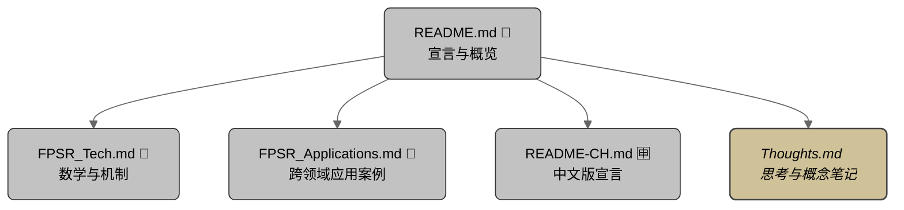

# 🎲 FPS-R: Frame-Persistent Stateless Randomization 静态律动算法

## 目录

- [FPS-R 是什么 ?](#fps-r-是什么-)
  - [FPS-R 简介](#fps-r-简介)
  - [运动哲学](#运动哲学)
- [核心特性](#核心特性)
- [动画中的示例用法](#动画中的示例用法)
- [为什么我们需要新的随机流生成器？](#为什么我们需要新的随机流生成器)
  - [“持续性随机性”的本质](#持续性随机性的本质)
  - [传统方法的局限性](#传统方法的局限性)
  - [FPS-R 的独特之处](#fps-r-的独特之处)
- [FPS-R 的不同模式](#fps-r-的不同模式)
  - [叠模机制](#叠模机制)
  - [量跃机制](#量跃机制)
- [应用场景](#应用场景)
- [工作原理](#工作原理)

---

## 🗺️ 文档结构图

### 📜 Readme — 宣言（简体中文）

**你正在此处**。这是主要文档。它将 FPS-R 介绍为一种动作语法和一组具表现力的工具，同时也是理解 FPS-R 运作方式与其所激发特质的视角。

---

### 🈸 Readme — 宣言、理念描述（简体中文）

[点击此处查看英文版 README.md — Click here for the main English README](README.md)

英文版宣言以英文阐述 FPS-R 的哲学基础和表现逻辑，展开其动态语法和工具体系的理念描述。

---

### 📐 数学与机制

[点击此处查看：FPSR_Tech.md](resources/readme/FPSR_Tech.md)

此扩展文档提供概念框架下的结构基础，概述支撑并塑造 FPS-R 行为的算法、表达式、参数及架构元素。  
**_源代码即在此处。_**

---

### 🍭 应用范畴

此文档补充并扩展了 FPS-R 的应用内容，超越本自述文件所提供的高层概览。  
将更深入地探讨各个领域，并为每个应用方向提供更丰富的使用案例。  
[点击此处查看：FPSR_Applications.md](resources/readme/FPSR_Applications.md)

---

### 📓 开发日志 — 编年记录

[点击此处查看：FPSR_Dev_Journal.md](resources/readme/FPSR_Dev_Journal.md)

一份按时间顺序整理的动态笔记，记录 FPS-R 的研究与设计过程。  
涵盖突破、失败、挣扎与修订，展现塑造现行实现方式的迭代历程。

---

### 🧠 思考笔记 — 概念与反思

[点击此处查看：FPSR_Thoughts.md](resources/readme/FPSR_Thoughts.md)

一份非线性思考的文档，记录理论发散、设计沉思和哲学探索。  
它是概念孵化器和批判草图本，呈现我内在的挣扎与冲突。  
同时为 FPS-R 的演化过程赋予哲理和诗性维度 —— 结构与感知交汇，随机性找寻节奏。

---

## 🎲 FPS-R 是什么？
**_无状态的不可预测性，拥有结构化的灵魂。_**

**FPS-R** 是一个领域中立的调制框架，也是一种信号表达语法，用于描述一种我们称为 **「随机移动与停留」** 的动作原型。  
该框架可跨越时间、空间与认知，应用于与智能相关的领域。

不同于传统模拟方式，它通过结构雕塑不连续性 —— 产生看似本能与有机的行为，  
却无需依赖记忆或状态。

这一概念构成了 FPS-R 哲学的基础…

---

### 🪞 简介

**FPS-R** 全称为 `Frame-Persistent Stateless Randomisation`（中文为 `静态律动算法`）。  
它是一种哲学与框架，驱动一系列轻量级算法模式与数学模型，用于在连续时间轴上模拟持续但无状态的随机性 ——  
非常适用于程序化运动、故障美学、合成有机行为，以及模拟类比特效。

FPS-R 的灵感来自自然行为，如眼球扫视、动物觅食、人类犹豫、掠食者跟踪与结构化噪声。  
它在无需记忆前一帧的前提下生成不可预测性。  
它的节奏仿佛探险者手中的火把照亮黑暗洞穴 —— 停顿、抽动、带着意图地漂移 ——  
又如士兵持枪执行战术清剿般的移动与停留 —— 逐点排查区域威胁，每个停留位置与前一个互不关联。

> _**FPS-R 是时间上的数值操控者，雕塑数值与时间行为。**_

当 FPS-R 的驱动方式从时间转向空间，它则变成另一种形态：  
形式的雕塑者，天际线的建造者。  
其跳跃-停留逻辑变成空间模式，其节奏变成浮雕。  
> _**FPS-R 不只是动作语言 —— 它是一种几何方言。**_

FPS-R 具备 **可重复性**、**可调节性** 与 **帧特异性**，  
使其成为面向时间的内容创作平台（如 Houdini、Maya、3D Studio Max、Nuke、Adobe After Effects）、  
GLSL、P5.js、游戏引擎（Unity、Unreal）及嵌入式环境中的多功能工具。  
由于其结构简洁、运算高效，FPS-R 也可轻松应用于任何支持表达式或脚本语言的 3D 平台。

在空间领域中，FPS-R 可用于着色器中的顶点位移与表面扰动，其效果可通过法线、凹凸、视差等技术呈现。  
结合程序化建模流程时，它成为一种富含细节且可递归分层的几何生成器 ——  
非常适用于 greebling、侵蚀贴图、风格化地形及科幻面板设计。  
尽管 FPS-R 的本质是不重复的，但通过恰当的拼贴技巧，它可在 UV 空间中实现无缝拼贴，或自然包覆曲面，  
实现控制而非拘束。

---
### 🎓 原则与哲学
---

### 🧭 指导原则

“FPS-R 并不是一个单一算法，而是一种用于*塑造信号*的设计哲学。  
无论是通过算术折叠还是信号量化 —— 无论是在时间还是空间维度 ——  
目标都是一致的：赋予结构以行为的许可。”

---

### 🎭 运动哲学

**FPS-R 模拟的是犹豫的不确定性 —— 而在同一框架中，它也可以轻松表达本能。**  
- 当其时间上的停留很短时，它表达的是*冲动*：快速变化，带有抽动感、干脆果断或高度警觉。  
- 当停留时间较长，它唤起的是*犹豫*：思考的暂停、停顿的状态、一种深思熟虑的错觉。

它并不会在模式之间切换 —— 而是雕刻时间本身。  
数值可能是随机的，但它们出现的*时机*由帧计数所引导 ——  
产生一种即便没有记忆，却仍然具有意图的节奏感。

所呈现的不是混乱，而是*由结构塑造的时间行为*。

> 🧒 **这种节奏在各地的“定格游戏”中都有回响** ——  
> 新加坡的 “A-E-I-O-U！”、法国的 “1, 2, 3 Soleil！”、希腊的 “Statues”，  
> 韩国的 “무궁화 꽃이 피었습니다”，华语文化中的 “木头人”，  
> 英国的 “Grandmother's Footsteps”，美国的 “Red Light, Green Light”。  
> 每一次静止都显得既冲动又有结构 ——  
> 是一种潜藏的爆发与克制之间的编舞。

> 🧠 **教学注： “最好的模拟是不模拟。”**  
> 在教授以模拟闻名的 Houdini 时，我常提醒学生，构建一个无帧间依赖的程序系统，  
> 通常优于依赖复杂模拟。  
> 最优雅的系统允许每一帧独立存在 —— 却又能仿佛记得过去。

### 📐 结构与混沌的幻象

FPS-R 或许看起来像是任意漂移的混乱系统，但在其不规则的节奏背后，隐藏着严格的确定性核心。  
其行为通过一组 **调制算子** 展开 —— 可组合的数学表达式，如 `mod()` 和 `rand()` ——  
广泛应用于时间、空间以及输入流等多个领域。这些算子构成了 FPS-R 逻辑的表现底层。

结果并非原始随机性，而是 **结构化的调制**。  
每一次跳跃、每一次停留、每一次重新播种，都来自于节奏层间的摩擦与偏移播种的错位 —— 而非熵的驱动。  
时间上的节奏感，正是周期之间微妙错位所模拟出的自发性。

从这个意义上说，FPS-R 并不模拟行为 —— 它是在 **编排干扰**。  
SM 和 QS 并非简单的技术手段 —— 它们是 **过程语法的原语**，分别掌管不同的表现维度：
- **SM（堆叠取模）**：通过叠加的周期约束来编排数值
- **QS（量化切换）**：用于调制选择行为与类别漂移

这套算子共同构成一个可控涌现的框架：  
每一次状态转变都在数学上可追溯，但在美学上却不可捉摸。

没有使用记忆，却让行为显得富有反思性。  
没有加入随机噪声，却依然闪烁、犹豫、呼吸。

> 💡 *混沌并非源头 —— 而是表象。你所见的是节奏，你所感的是结构。*

这种“定义”与“漂移”之间的张力，不是缺陷，  
而是 FPS-R 的表达核心。

---
## 🗣 一种新的语法：

FPS-R 引入的并不仅仅是一组新的算法，更是一套面向运动的 *新词汇体系*。

### 「随机移动与停留」

FPS-R 所生成的，不是滤波器或曲线 ——  
而是一种构成性的结构：**跳跃 → 停留 → 重新播种 → 重复**

*FPS-R：行为构成结构*

我们称这种行为为 **随机移动与停留**。

它体现了抽动感、深思熟虑的质感，以及那些仿佛正在思考的停顿时刻。

---
## 🎞 FPS-R 的示例应用

### 🧭 FPS-R 在动画中的应用

  
*在 Houdini 中模拟眼球扫视或抽动行为 —— 单只眼球正视前方并伴随快速扫视*🕰️

  
*在 Houdini 中将扫视行为叠加在物体追踪上 —— 双眼注视一个移动盒子并呈现叠加 FPS-R 扫视动作*  

_[眼球模型](#https://sketchfab.com/3d-models/simple-stylised-eye-c26043a12a32447f99f45ac84b4fb570)由 [rosytoonz](#https://sketchfab.com/rosytoonz) 提供。_

---
### 🧱 FPS-R 在几何生成中的应用

（尚未展示内容）

---
### ⏱️ 可视化视频 —— FPS-R 实际运作

以下为一组可视化展示，呈现 FPS-R 在不同系统与情境中如何驱动有意义的行为。  
大多数示例在 Houdini 中创建，并通过 YouTube 视频及 LinkedIn 文章发布。

- [LinkedIn 文章：FPS-R 测试 —— 鼠类运动演示](https://www.linkedin.com/pulse/fps-r-test-rat-movement-demo-patrick-woo-ker-yang-i7foc)  
- [YouTube 视频：鼠类运动演示](https://youtu.be/ZHUvv6YxjKw)  
  

- [LinkedIn 文章：直线与曲径 —— FPS-R，一种模拟现实的新模型](https://www.linkedin.com/pulse/straight-line-crooked-path-fps-r-new-model-simulating-woo-ker-yang-ha9rc)  
- [YouTube 视频：FPS-R 作为群体中的移动目标](https://youtu.be/uQ7krluFvic)  
  

---
## ✨ 核心特性

- 基于帧的 **可重复性**，无需存储状态  
- 可调节的 **混沌特性轮廓**，支持模块化曲线雕塑  
- 兼容无状态着色器、模拟循环和实时系统  
- 理想用于生成具有 **生命感** 而非程式化的行为

---
## 🧩 FPS-R 与母系统的关系

FPS-R 是一种无需指令的调制方式 —— 它塑造表达，却不支配目的。  
在不受约束的状态下，它可自由构句：漂移、转向、曲折穿梭于移动与停留的节奏中，唤起本能与惊喜。  
但在大多数系统中，**目的始终存在** —— 一个指引的手势、一条稳定的肢体、一束导向的视线。

这正是 FPS-R 成为协作者的时刻。它不决定终点 —— 它**影响旅程的走向**。

别将 FPS-R 看作规划者，它是一个节奏引擎。心脏不会决定血液流向 ——  
但若没有心跳，什么都不能运作。在这个比喻中，母系统提供结构、意图与语境：

- 决定节奏应用在哪（关节、声音、表面）
- 指定偏移量需呈现多少才显得自然
- 选择何时调制，何时静止

FPS-R 可以被**束缚或释放** ——  
既可被反应式逻辑控制，也可拥有完全自主权，创作具表现力的变化。  
但无论如何，它始终是**确定性的、无状态的、可重复的** ——  
一套服务于有意义系统的节奏语法。

---

## 💡 无序的世界里，为什么需要另一种“随机性表达器”？

### 🔍 *隐藏在日常中的语汇缺口*

**FPS-R** 不仅仅是一个随机流生成器 —— 它是一种用于表达 *随机移动与停留的微妙行为* 的 **语言**。

本文花费如此多精力来进行 **说明**、**建构语境** 和 **可视化展示**，本身就证明了一个 *潜藏的表达缺口*：  
我们经常观察到 *自然发生的随机性*，它们看似 *具有结构*，  
却缺乏合适的 **语汇** 和 **工具** 来准确地加以描述。

**FPS-R** 提出一种 *构句架构* 来填补这一空白 ——  
不是要替代现有算法，而是为了提供一套 **语法**，去雕刻那些早已存在、却尚未被命名的现象。

那就是……

🎛️ *用数学与算法的语言表达：*  
**静态律动算法 (FPS-R)**

🗣️ *用日常语言表达：*  
**随机移动与停留 (Randomised Move and Hold)** 

---

### 🧬 *“保留式随机性”的本质*

在自然与人工系统中，随机性 *很少是纯粹的噪声* ——  
它常常会 *停留*、*持续*，或 *演变* 为一种具有 **意图感** 的模式。  
无论是 *斑驳光影的闪烁*、*模拟机械的抖动*，  
还是 *眼球扫视时的抽动探索*，  
我们都会遭遇那些 *保留形态或随时间漂移* 的随机行为。

然而，尽管这种现象极为 **普遍**，  
大多数内容创作工具却 *难以胜任* 对其进行模拟、模仿或表达，  
无法以一种 **直观简洁** 且 **轻量高效** 的方式实现。

重现这种 *具结构性的不可预测性* 往往需要  
*高度定制的编码* 或 *不直觉的替代方案*。

> ✒️ 隐喻札记：*FPS-R 系统就像邮局柜台上的公共签字笔。*  
> 人来人往：有人拿起它，有人随手放歪，有时几个小时没人碰。  
> 每一次互动都会改变它的朝向、位置或状态 —— 却从不携带记忆。  
> 而当你加速回放一段定点监控画面，它竟仿佛在跳一支带有意图的舞。

 

  
  
  

### 🧱 常规技术的局限性

#### 当前的计算思维与计算模式

大多数计算系统都被设定为遵循一个核心原则：**效率**。  
从最短路径求解器到渲染流水线，默认的行为路径是笔直、稳定且节约的。  
无论是时间、空间还是数值，系统都倾向于以可预测、渐进的方式接近目标状态。  
这是大多数算法的语法：步骤越少越好、路径越直越佳、偏差最小即优。

而为了模拟自然行为 —— 停顿、漂移、延迟 —— 我们通常需要不断叠加复杂度：  
递归路径搜索、叠加在正弦波上的 Perlin 湍流、基于障碍的路径变形、具状态的随机跳转。  
这些技术模仿了现实世界中的不可预测性，  
但其实现方式却是在 **与系统本身偏好秩序的倾向对抗**。  
复杂度成为了“有机感”的代价。

**FPS-R 颠覆了这一倾向。**  
它从调制出发，以构句为主轴。  
它并非扭曲直线 —— 而是从一开始就以漂移作图。  
而令人矛盾的是，它依然保持着 **无状态、确定性、轻量级** 的特性。  
FPS-R 并非堆积结构来模拟自发性 ——  
它将 *表达性的不规则性* 设为默认行为。

> 如果需要更丰富的行为表现？  
> FPS-R 仍可与传统噪声、物理模拟或响应式输入进行叠加 ——  
> 构建具层级逻辑的系统，同时保持自身的节奏构句能力。

> 🧩 FPS-R 是一种构句引擎，不是行为规划器。  
它与系统共舞，而非取而代之。

---

当系统试图模拟具节奏的不规则行为 —— 偏离、犹豫、不可预测 ——  
往往会依赖两种主流方法。它们各有价值，也各有限制。  
且**都不以“节奏构句”为母语**。

##### 🧊 1. 空间化随机性（如 Worley 噪声与基于距离的字段）

这些技术依赖于预设的特征点 —— 通常是扰动网格或哈希分布 ——  
并通过测量与锚点之间的距离来决定行为模式。  
Worley 噪声、Voronoi 字段等细胞式方法，非常适合生成具有结构的表面随机性。

但它们的优势也限制了表达力：
- 种子分布均匀 → 构句模式也趋于均质化  
- 想要修改 → 需要高成本的操作（如距离计算、重新索引）  
- 表达性受空间规则约束，而非时间节奏驱动  
- 控制手段通常是在**对抗函数本身**，而非与之协作  

因此它们在纹理生成中表现出色，但在时间节奏方面则相对薄弱。

##### 🔁 2. 有状态行为逻辑（如定时器、延迟、暂停、随机游走）

为了在运动或行为中制造偏离，开发者常使用状态机或自定义更新循环来跟踪时间进度。  
这些逻辑层通过中断直线行为不断积累，以期通过延迟、误差或噪声，营造“有意图”的感觉。

这类方法涵盖广泛，但计算负担沉重：

🌀 信号扰动与畸变
- 随机噪声注入，以调制路径或输出抖动  
- 随机游走，用于模拟无方向的漂移  
- 正弦覆盖与贝塞尔振荡，生成平滑颤动  

⏱ 保持、延迟与中断
- 可变速逻辑，模拟漂移、疲劳或延迟感  
- 阶梯函数、级联模式与随机延迟，实现爆发-停顿效果  
- 之字形切换，强制制造方向不稳定性  

🛣️ 间接算法制造路径复杂性
- 使用路径搜索（如 A 算法、Dijkstra）绕过障碍  
- 动态启发式方法，让路径朝向更长路线扭曲  
- 重定向力场（吸引/排斥、磁场等），制造局部曲率偏移  

🌪️ 情境输入与响应式系统
- 用户输入扰动，使行为在外部影响下“摇摆”  
- 环境模拟（风、地形、重力）触发更自然的摇动  
- 基于历史动作调整的反馈回路 —— 将记忆伪装为逻辑  

这些方法 *可以* 生效，许多确实有效。  
但它们有四个共通弱点：

1. 假设存在记忆  
2. 需要复杂支撑结构  
3. 很少具备可移植性  
4. 缺乏可组合性，也没有原生构句能力

---

⚙️ FPS-R 有何不同

大多数系统靠在可预测的逻辑上叠加复杂度来制造不规则性，  
而 **FPS-R** 从一开始就以“调制”作为出发点。  
它不是在“模拟漂移” —— 它是在“构句漂移”。  
不同于传统方法中需要积累状态、搭建逻辑结构、或依赖预设查找表的手法，  
FPS-R 将具表现力的行为 **浓缩为一套具帧意识的语法**。

它的调制方式干净、确定，且可移植 ——  
无需状态，却能表达具结构感的自发性。

主要优势包括：

✅ **真正无状态**：FPS-R 不依赖前一帧数据或持久化的内存缓存  
🔒 **完全确定性**：相同输入始终产生相同输出 —— 无熵，无惊喜  
🧠 **紧凑且易读**：SM 表达式可通过 Houdini 中的 `$F` 或 VEX 中的 `@Frame` 一行实现  
🛠️ **平台无关**：可在任何具有帧上下文的环境中无缝运行  
⚡ **性能友好**：不需耗费计算的距离函数、哈希查找或点散布生成

🪞 多数调制系统通过架构状态来“模拟意图”；  
而 FPS-R 是通过语法设计来“构句意图” —— 并做到**无需记忆**。

这也使得 FPS-R 可以：

- 替代脆弱的支架结构，改用可组合的构句逻辑  
- 在着色器、表达式与并行计算环境中干净运行  
- 按需与传统技术叠加 —— 且不损失确定性  

模拟世界通常靠结构来容纳漂移，  
而 FPS-R 一开始就处在漂移中 —— 并将结构**构句于其中**。

🧩 **确定性复杂性**  
即复杂行为源于可复现规则，而非纯粹随机。

---
## ❓ 为什么不直接使用“状态”？

在一个 **有状态** 的系统中，行为依赖于记住之前发生的事情 ——  
就像舞者需要回忆上一步，才能踏出下一步。  
而在一个 **无状态** 的系统中，比如 FPS-R，行为每次都是根据当前输入重新计算：  
时间、位置，或是 **模式** —— 无需记忆，无需历史，只需清晰响应。

在 FPS-R 出现之前，开发者通常使用一些 **临时性的有状态逻辑** 来实现行为调制 ——  
例如追踪帧计数器、定时器或条件门控，用来“保持”某个值或触发变化。  
你可能已经写过这样的代码：保持一个值、抛硬币跳转、循环执行。确实有效。  
这些方法在简单场景中行之有效。  
但它们依赖状态、支架结构，以及特定语境的逻辑。它们容易碎片化、数量繁杂 ——  
而最关键的是：**它们无法在时间、空间与系统之间扩展。**

**那么 FPS-R 为什么存在？**  
FPS-R 并不是替代有状态的方法 ——  
它是对其的 **超越**。

因为在简单系统之外，我们面对的是一个更广阔的世界：  
**无状态的表面**、**可复现的时间线**、**可模块化的行为** ——  
这些都无法靠零散逻辑与局部记忆来满足。  
这正是传统状态机制难以胜任的地方 ——  
也是 FPS-R 的起点。

---

### 为什么传统状态机制难以胜任？

**🧳 状态无法迁移**  
你的保持/重播跳跃循环在脚本中有效 ——  
但它依赖持久内存。  
在着色器、无状态表达字段、流处理器、GPU 管线等场景中，这类循环会**断裂**。  
FPS-R 呢？它从设计上就是无状态的。  
它能运行在任何函数可达的地方：时间、空间、并行计算。

**🧠 无可追溯的痕迹**  
当一个有状态的循环执行完毕后，过去的轨迹就被覆盖的变量所模糊遮蔽。  
在第 58200 帧突然崩溃？你很难解释为什么保持的值突然跳变 ——  
大多数状态驱动系统无法留下可追踪路径。

相比之下，FPS-R 就像一个 **玻璃盒子**：
- 完全确定性  
- 建构于无状态、可检查的数学逻辑之上  
- 从设计出发就追求透明 —— 而非偶然可见  

它所产生的每一个值都来自清晰可复现的输入 ——  
帧数、种子、模式 —— 而非隐藏的缓存或积累的记忆。  
没有历史的迷雾、没有神秘的跳跃、没有不透明的黑盒行为。  
每一个构句时刻都可以被 **重建、解释、重播**，甚至回溯源头公式。

FPS-R 不会遮掩逻辑 —— 它**揭示逻辑本身**。  
它不仅是一个调制引擎 ——  
**它是一条可回溯、可叙述的程序性时间线。**

**🌌 时间驱动，但不具领域泛化能力**  
有状态循环本质上是依赖时间的。它们依靠时钟运行。  
但如果你想调制一个表面、手势速度或注视字段 ——  
**仅靠时间的逻辑会分裂**。  
FPS-R 能跨越 **输入领域**。  
任何标量、向量、多维流都能成为行为的基底。

**🧭 难以组合**  
多个有状态调制器的整合常常是脆弱的。  
FPS-R 可以被封装为“胶囊” —— 模块化、可链式连接、具命名属性。  
它们可整洁地组合 —— 可堆叠、可分层，且有表达性保障。  
只需提供输入参数，你就能描述意图：犹豫、滑行、惊喜 ——  
胶囊则知晓如何“构句”出这些行为。

---

### 💡 真正的区别

FPS-R 并不依赖内存或计时器来支撑行为 ——  
它直接通过 **确定性的随机性** 与 **无状态的调制** 来组成行为。  
凭借内建的可复现性与对空间和时间领域的支持，  
它不仅是一种方法，更是一种 **语法**：  
可在表面、系统与合成代理中表达漂移、犹豫与惊喜的语法。

> 传统状态将行为“固定”。  
> **FPS-R 让行为流动 —— 跨系统、跨领域、跨思维。**

---
## 📊 探索算法的节奏指纹

FPS-R 算法在时间轴上产生一种独特的“节奏指纹”。  
下方的动画预览展示了来自 Jupyter Notebook 的可滚动时间线图表，  
您可以通过这些图形直观地探索 FPS-R 的行为表现。

  
FPS-R：叠模机制（SM）时间线图预览

  
FPS-R：量跃机制（QS）时间线图预览

您可以亲自尝试，通过 [`nbviewer`](https://nbviewer.org/github/patwooky/FPSR_Algorithm/blob/main/resources/code/python/fpsr_algorithms.ipynb) 观看交互式时间线图表。  
这两个可滚动的图表位于笔记本的最后两个单元格中。

> 注意：GitHub 网站上的 Jupyter Notebook 仅作为静态内容呈现，SM 与 QS 的交互式滚动图不会显示。  
> 如需调整参数、生成不同曲线并检查滚动图表的细节，请下载该笔记本文件，并在本地使用 `Python 3.x` 内核运行 Jupyter Notebook（需安装 `Pandas` 与 `Matplotlib` 依赖）。

---
## 🧬 FPS-R 的风格变体

FPS-R 包含两种独立的数学算法 —— 每种都提供一种无状态、确定性的构句调制方式：
- 🌀 叠模机制（SM，Stacked Modulo）
- ✴ 量跃机制（QS，Quantised Switching）

它们构成 FPS-R 框架中的主要 **调制算子**，既可独立使用，也可并行混合或链式组合。  
共同塑造出一种具表现力的语法 —— 用于描述 _随机跳跃与保持_ 的行为 —— 可调、可叠加、始终可复现。

---

### 🌀 叠模机制（SM，Stacked Modulo）

FPS-R 的原始算子。SM 通过多层模运算构建运动逻辑 —— 每层具有不同的偏移量，  
生成看似自发的跳跃，但其实源于严格的确定性干涉。

- **表现感受**：无记忆的记忆感  
- **构句方式**：由频率、振幅、偏移相位共同塑形  
- **优势特点**：高度可组合，实现紧凑

**SM 特性：**
- 可调节的上限控制值保持时间  
- 可调节的下限影响跳跃之间的最短保持时间  
- 使用当前帧的 `rand()` 与 `mod()` 实现无状态调制  
- 可在 Houdini、VEX、GLSL 等工具中以单行表达式编码实现

---

### ✴ 量跃机制（QS，Quantised Switching）

QS 在多个索引值流之间进行选择与切换 —— 在离散步骤之间闪烁，或在平滑路径间插值。  
它通过确定性的切换逻辑模拟故障式跳跃、逻辑闪变与构句式跳转行为。

**QS 特性：**
- 确定性的伪随机流选择  
- 支持自定义值库与索引行为  
- 可选量化模式，实现阶梯式或平滑插值  
- 可配置的切换节奏与受控重播逻辑

---
## 🏙 空间扩展：从时间到空间

**FPS-R 不只是动画。它可以拉伸、浮雕，甚至是 *生长表面*。**

通过将时间（如 `$F`、`@Frame` 等）替换为空间（如 `x`、`y`、`uv` 或 `position`），FPS-R 成为一个 **程序化建模工具包** —— 非常适合生成块状轮廓、建筑细节和科幻风格的表面特征。

### 空间模式

- **一维 → 二维轮廓**  
  在 `x` 轴上使用一维 FPS-R 输出：  
  - 随机的 *跳跃-保持* 模式模拟建筑轮廓  
  - 非常适合风格化的天际线、条码图案或抽象浮雕

- **二维 → 三维拉伸**  
  将 FPS-R(x, y) 输入到高度场或网格拉伸驱动器中：  
  - 生成基于网格的面板、机械细节和地形  
  - 可与细分/倒角工作流无缝配合

- **曲面与包裹**  
  由于 FPS-R 是无状态的，空间查找可以在 UV 壳或圆柱坐标上自然包裹，无需视觉缝隙  
  - 可在球形头盔、管道或有机拓扑结构上生成图案

 

  
  

### ✴ 空间中的量跃机制（QS）

QS 在空间域中成为一个 **信号切换器**：  
- 切换随机化引擎（如 Perlin、Worley、纹理采样器）  
- 关闭量化以实现流畅过渡  
- 放大以实现粗犷模块化或破碎重复感  
> “就像 QS 通过切换行为机制来调制时间一样，它也可以通过切换表面逻辑来调制空间 —— 以结构化的不可预测性开启或关闭纹理库或高度图引擎。”

---
## 🧠 递归混沌：FPS-R 作为高阶调制器

当“调制”本身成为底层基质时，FPS-R 进入一种递归阶段 ——  
它雕刻的不仅是行为本身，更是行为的“构句方式”。  
在这种分层范式中，一个 FPS-R 信号可以用来调制另一个 FPS-R 流，  
从而创建嵌套式的表现控制模式。

这种自指式构句允许：
- **多尺度调制**：宏观脉冲由粗粒度构句塑形，微观闪变嵌套其中  
- **局部性格区域**：构句机制发生转变的区域 —— 一处犹豫，另一处抽动  
- **信号内省**：行为响应自身的调制轨迹，形成反馈驱动的涌现

这种嵌套结构使得我们能够在调制空间中进行语义导航 ——  
不仅是移动，而是**有意义的移动**。  
最终结果是一种 *生成性语法*，而不仅仅是随机脚本。

  

### 🧪 调制内省

递归式 FPS-R 流不仅是“表演者” —— 它们还是**构句本身的观察者**。
- 信号的调制层不仅输出数值，还能输出 **诊断节奏**  
- 这些节奏可驱动调试叠加层、视觉符号或自适应系统调优  
- 行为变成反馈 —— 是一种“知道自己如何构句”的运动

示例：  
在一个生成式认知引擎中，FPS-R 不只是驱动注意力 ——  
它调制的是“调制本身的演化”。  
犹豫不再是暂停 —— 而是上游信号拐点的回响，  
最终涌现出一种接近“意图”的元状态。

 
   
   

---
## 📈 元信号分析：FPS-R 作为观察者与工具

FPS-R 最初被构想为一种结构化不可预测性的生成器，  
如今已演化为一个能够 **观察自身调制轨迹** 的系统。  
它的输出不仅是信号 —— 更是一种 _自我书写_ 的几何形态。

通过将“跳跃-保持”的构句模式映射为空间形式 ——  
二维图表、三维浮雕或建筑轮廓 ——  
FPS-R 揭示了自身表现节奏中的深层洞察。  
这些信号可视化揭示出以下模式：

- **行为节奏**：如天际线般的轮廓，反映构句的间距与持续时间  
- **决策特征**：波形符号，捕捉调制的性格，如抽动、漂移、犹豫  
- **递归结构**：嵌套的构句区域，显示调制层的汇聚与分离位置

这些表现形式使 FPS-R 同时成为 **表演者** 与 **诊断者** ——  
无需状态或记忆即可自我检查。  
通过确定性复现，即使是最具有机感的运动也能成为可追踪的形态。

> 想象每一次信号跳跃都是时间轴上的一个空间块 —— 一道犹豫的天际线。  
> 将它映射到表面上，你便获得了构句意图的纹理记忆。

### 🪞 元信号映射的应用场景
- 教学构句逻辑与调制风格  
- 通过节奏轮廓追踪调试涌现行为  
- 设计逻辑可视符号，用于构句的存储与命名    
- 在时间、注意力或表面拓扑中进行反馈调优

最终，元信号分析将 FPS-R 从一个引擎重新定义为一种乐器 ——  
一个不仅能构句，更能照亮构句形状的系统。

> 🧠 它不仅在调制。它在记忆 —— 无需记忆。它投射出的形状，就是自身的倒影。

---

## 🧪 应用场景

- **程序性动画系统**：用于生成具有结构性的运动，避免机械式重复  
- **模拟伪影仿真**：如色彩偏移、信号跳跃与模拟抖动等模拟美学效果  
- **嵌入式系统与微控制平台**：在内存有限但需要时间变化的场景中表现尤为高效  
- **注意力转移建模**：可用于模拟生物体的凝视、转移、犹豫或锁定行为，具有心理动机的拟真感  
- **人群系统驱动**：用于状态迁移或群体响应，产生局部随机性而不失群体协调（如逃散、涌入等）  
- **游戏与 XR 场景行为生成**：适用于低性能设备上的随机动画、敌人巡视路径、物理反馈或环境扰动  
- **无模拟环境中的行为构建**：无需建立全局状态机或缓存系统，即可生成复杂、动态且“活着”的逻辑响应行为

---

## 🔩 工作原理

FPS-R 利用以帧为索引的逻辑 —— 通常包括叠模运算、节奏拉伸曲线与确定性伪随机方法 —— 在无需内部状态的前提下生成熵值。  
它输出的运动与行为在“无记忆”状态下依然能够演化得可信且自然。
