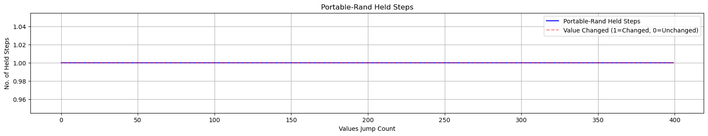
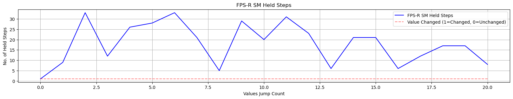
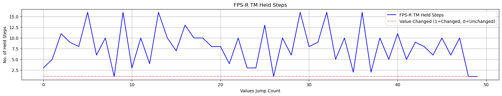
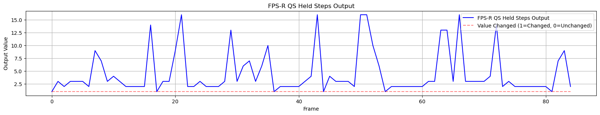
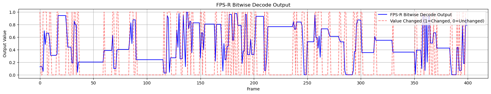
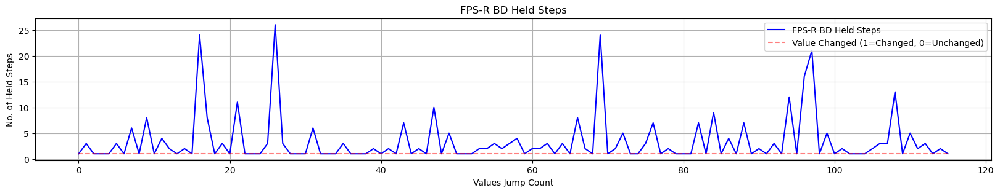
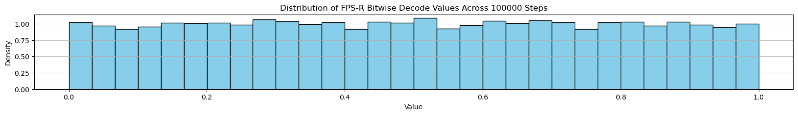

Apache License 2.0 — 详情请见 LICENSE。
Copyright (c) 2025 Woo Ker Yang (Patrick Woo) patrickwoo.1976@gmail.com
若您引用或改编此框架，请注明 Patrick Woo 及此代码仓库。
此文档仍在开发中。
尽管每次更新都旨在确保准确性，但部分内容可能仍然存在不完整或不准确之处。对此我们非常感谢您的理解，并为可能造成的任何不便表示歉意。

# 🎲 FPS-R: Frame-Persistent Stateless Randomisation (静态律动算法)

英文版 | [English README](./README.md)

---
## 音频简介 (英语)
一段播客风格的英语音频简介。

以下是关于后续内容的高层概述播客音频评论。

<a href="https://patwooky.github.io/fpsr/resources/readme/audio/fpsr_readme.mp3" target="_blank">🎧 立即收听：FPS-R 与随机性的本质</a>

---
# 引言：什么是 FPS-R？
**FPS-R 是 Frame Persistent Stateless Randomisation (静态律动算法)。**

FPS-R 是一个具备**时间感知**的伪随机数生成器，能够产生**近乎不重复的模式**。
给定任何递增的输入值序列（例如 `frame`、`training-epoch`、`uv`、`latent-space`、`x-axis`），FPS-R 会产生一个`确定`性的持久随机数序列。
这些数值会在变化前，以不可预测但确定的时间步长保持其值。
FPS-R 也是`无状态`的——它不需要在每个时间步存储状态，从而避免了复杂的逻辑和状态管理。

**跨领域的 FPS-R 语法**
FPS-R 中保持随机性的行为导致了以下涌现和观察到的特性：
- **深思熟虑**、**犹豫**、**意图性**
- 引发**意外惊喜**和**受惊**的感觉

其核心，FPS-R 是一个描述行为和现象的框架和语法，这些短语试图表达：
- **蓄势后发**
- **动后定势**
- **蓄势跳跃**

换言之，FPS-R 在“时间”中引入了负熵（熵的减少），注入了一种时间上的内聚力，这种内聚力在保持周期内是不规则和不均匀的。

这些是可以在多个领域观察到的普遍现象。
以下是在我们现实的各个方面发现的非线性例子，包括物理系统、社会经济系统和情感状态：

**自然系统**
- **鸟群迁徙轨迹**：鸟类或鱼类的运动模式通常表现出非线性动力学，这是个体之间以及与环境因素相互作用的结果。
- **捕食行为**：捕食者和猎物在追逐和逃跑过程中，常常在保持位置和突然爆发速度之间交替。
- **量子粒子跳跃**：在量子力学中，粒子常常通过突然从一个位置“跳跃”到另一个位置来表现出非线性行为。

**人类系统**
- **眼球扫视**：眼球的快速运动在视觉注意力中表现出非线性模式。
- **组织增长率**：组织的增长通常遵循非线性路径，受各种不可预测因素的影响。
- **产品开发速度**：创新的步伐会因市场条件、技术和消费者行为而急剧变化。

**社会经济系统**
- **金融市场崩盘**：市场动态通常是非线性的。小变化可以导致快速且显著的连锁反应，从而导致崩溃。
- **经济增长模型**：在对立各方经过长时间的辩论和审议后，政策迅速转变，可能是由小变化和积累的紧张局势引起的。
- **就业市场**：由于政治稳定性变化、政府激励措施的建立和移民法的通过等各种因素，就业机会的相对快速增加或减少。

**地质/天文系统**
- **板块构造运动**：构造活动中的应力逐渐累积，然后在地震期间突然猛烈释放。
- **行星坍缩**：长时间的引力不稳定性可能导致行星和恒星的突然、快速坍缩。这个过程有时可能导致黑洞的形成。

**情感的漂移与转变**
- **愤怒累积至爆发**：愤怒往往由于各种触发因素而相对缓慢地积累，最终达到一个通常是突然的触发点，从而导致突然爆发。
- **犹豫到瞬间的勇气**：长时间的犹豫可能会突然转变为勇敢的行动。
- **学习内化至顿悟时刻**：学习是非线性的，个人可能会挣扎一段时间，才能获得清晰的理解。

> **[fpsr_unifying_theory.md](resources/readme/FPSR_Unifying_Theory.md)**
  阅读更多关于移动-保持与惊喜原则背后的思考和研究。

## 主要特性与效果
FPS-R 的独特结构使其产生了几种强大的涌现特性：
* **生成近乎不重复的模式。** FPS-R 的分层和组合式结构能够产生复杂且长时的模式，这些模式**近乎不重复**，使其成为有机且不可预测的程序化逻辑的理想来源。
* **抗模式检测。** 其固有的复杂性使其输出难以预测，在安全、程序化生成和高保真模拟等领域中，避免可预测的周期至关重要，而这为其提供了显著的**优势**。
* **创造涌现的“惊喜”。** 通过以不规则的持有值打破可预测的节奏，FPS-R 能够产生**惊喜和犹豫**的节奏。这对于创造更自然、更有意图感的行为至关重要，无论是人工智能、的决策机器人技术还是艺术动画的制作。

## 当前方法及其局限性
目前，模拟这种现实且复杂行为的方法有限。这些方法大多既不简单，也不方便，更不优雅。

### 基于 `rand()` 的方法
> **高层意图：`rand()`**：
  试图在逐帧产生跳跃输出的机制上强加结构，以期实现自然的保持周期。

如前所述，`rand()` 倾向于从一个种子跳到下一个种子。即使输入种子是连续的，它也无法实现连贯性的连续输出。

一个常见的解决方法是使用有状态的逻辑支架，让 `rand()` 在多帧内保持其值。这涉及到维护一个计数器变量，用于跟踪自上次生成随机值以来经过了多少帧。这个过程通常如下：

1. **初始化计数器**：从一个设置为零的计数器开始。
1. **保持值**：每一帧，增加计数器。
1. **条件更新**：使用 `if/else` 语句检查计数器是否达到预定义的阈值（保持时长）。
  - 如果达到阈值，用 `rand()` 生成一个新的随机值，重置计数器，并保持这个新值。
  - 如果没有，则继续保持前一个值。

伪代码示例：
```python
hold_counter = 0
hold_duration = random.randint(min_hold, max_hold)
held_value = rand()

def get_random_value():
   global hold_counter, hold_duration, held_value
   if hold_counter >= hold_duration:
      held_value = rand()
      hold_duration = random.randint(min_hold, max_hold)
      hold_counter = 0
   hold_counter += 1
   return held_value
```
这种方法需要存储状态（如计数器和保持的值），并使用逻辑来决定何时“抛硬币”获取新的随机值。虽然有效，但它引入了复杂性，并需要持续的状态管理，使过程难以追踪和审计。对状态的依赖意味着每个随机流都必须记住其历史，这破坏了透明度和可预测性。

此外，有状态的方法无法轻易用于并行或分布式计算环境，包括 GPU 操作，因为在这些环境中，无状态对于可伸缩性和可复现性至关重要。随着这些有状态流的数量增加，管理它们各自状态的负担也随之增加，导致可伸缩性差和维护开销增加。

### 基于噪声的方法
> **高层意图：噪声函数**：
  目标是为本质上周期性且规律重复的噪声函数强加不规则性，以实现更有机和自然的随机性。

在电影、游戏和互动媒体领域，使用噪声生成随机连续性是一种常见做法。

**Simplex、Perlin 等**
像 Perlin 和 Simplex 这样的噪声函数在整个域上生成平滑变化的确定性输出，从而产生周期性和规则的模式。即使将这些连续梯度量化为离散步骤，其潜在的规律性仍然存在——横截面通常类似于正弦波，量化会产生可预测的、重复的过渡。这种固有的均匀性使得噪声函数无法实现具有不规则保持周期的真正随机值，因为它们的梯度是均匀分布变化的，而不是不可预测的。

**Worley 或元胞噪声**
Worley（元胞）噪声通过为每个点分配一个基于其与网格中最近特征点距离的值，来生成离散的、阶梯状的模式。这会产生稳定区域（保持）和突变（跳跃），但由于网格和距离计算，其底层结构仍然是规则和可预测的。虽然 Worley 噪声通过空间关系引入了复杂性，但其输出本质上是周期性的，缺乏自然时间行为所需的有机、不规则保持的随机性。因此，它无法模拟随机值不可预测的保持和变化。

## 当前方法、局限性与变通方案总结
对这些方法的快速回顾：
- **随机数生成器 过于不规则** - 程序员必须想办法_在多帧内保持其值_。
- **噪声函数 过于规则** - 程序员和艺术家常常必须想办法_引入不规则性_。

上述技术试图从规律性到不规则性的连续谱的两端来实现自然的“蓄势跳跃”行为，但最终仍未能以直观简洁的方式表达和控制自然的“动后定势”现象。

**减轻噪声规律性的变通方案**
为了打破规则模式，程序员和艺术家通常会引入不同、更高频率的噪声函数层，有时还进行额外的后处理，在分层和平滑之前提取“波峰和波谷”。他们还混合少量真正的随机性，例如来自 `rand()` 的随机性，以获得更自然的结果。

然而，这些方法本质上是相同技术的变体，继承了相同的低效率。每增加一层噪声都会增加复杂性，需要进一步的调整和参数的仔细校准。此外，每一层 `rand()` 都需要自己的有状态支架来管理混合和过渡，导致复杂度爆炸性提升。

这些变通方案试图通过增加复杂性来减少瑕疵，迫使原本非为此目的设计的机制以更自然和现实的方式行事。

鉴于此类结构固有的复杂性，任何修改或修订设置的尝试都需要对组件之间错综复杂的逻辑和关系有深入的理解。这种复杂性最终阻碍了表达性的探索。

## 数学与算法上的空缺
尽管讨论了上述各种技术，但没有一种能完全捕捉到现实世界系统中观察到的自然“蓄势后发”现象。这些方法试图从外部“强加”自然行为，通过叠加额外的过程来弥补其固有的局限性。FPS-R 直接解决了这一空缺，它从内部着手，旨在通过内在的数学原理模拟自然的“动后定势”行为，而不是依赖外部机制或支架。

FPS-R 从零开始设计，使用基于简单基础算术运算的数学和逻辑，以及一个无状态、确定性的基础，来模拟、塑造和雕刻“动后定势”的自然行为。通过避免外部支架，FPS-R 为生成不可预测但可复现的序列提供了一个干净、可伸缩且可复现的解决方案。

# 图解
**`rand()` 的特征**
随机数生成器 `rand()` 的示例输出：
```python
[ 0.8160,
 0.9216,
 0.0572,
 0.5582,
 0.3737,
 0.4534,
 0.6260,
 0.1655,
 0.3291,
 0.5396]
```
每个值都与相邻值不同。这是 `rand()` 的目标。

**FPS-R 的特征**
`FPS-R: QS（FPS-R 算法之一`）的示例输出：
```python
[0.9947, # jump
 0.9947,
 0.9947,
 0.4560, # jump
 0.4560,
 0.6687, # jump
 0.6687,
 0.6687,
 0.2174, # jump
 0.3755, # jump
 0.3755]
```
标记为 `jump (跳跃)` 的条目是值的变化。跳跃后的后续条目是保持的值。

这些数值和时机是不可预测的，但完全是确定性的、可复现的和无状态的。通过使用相同的参数值查找帧号，FPS-R 将始终返回相同的输出。

# FPS-R的奇妙特性
## 奇妙的矛盾
接下来的两者是FPS-R的两个支柱，详细内容将在[FPS-R的支柱](#fps-r-的支柱)部分中说明。

**可预测的惊喜**
FPS-R在其保持和值在时间上的跳跃方面令人惊讶，但每个时间步骤的值是完全确定性的。它只需一个递增或变化的帧编号作为输入，就能实现这种移动和保持的行为，但相同的输入帧将始终产生相同的可预测输出。

**无记忆的记忆**
大多数当前实现移动与保持行为的方法采用有状态技术，这些技术依赖于“记忆”（变量）来存储先前的值并为当前帧做出决策。相比之下，FPS-R的纯数学结构在不保留变量的情况下创造了记忆的假象。通过将100个帧编号输入到运行在100个独立线程上的FPS-R，并按顺序组合输出，我们观察到了一种保持和跳跃的行为。输出值似乎保持和跳跃，给人留下了记住之前状态的印象，尽管实际上没有存储变量。这一特性在并行处理环境中特别有利。

## FPS-R输出的多轴特性
FPS-R的输出是一条单一的数值流。这组看似简单的数值列表实际上是一种丰富编码的结果，表达了**两个随机流**：
- **轴 1：数值中的随机性**
  - 如果我们忽略重复的保持值，仅取上面示例输出列表中的唯一值，我们得到`[0.9947, 0.4560, 0.6687, 0.2174, 0.3755]`。这看起来像是随机数生成器在连续调用5次时返回的结果。

  下面是一段示例Python代码，用于生成5个从0到1的随机数：
  ```py
  # Generate a list of 5 random numbers, truncated to 2 decimal places
  [float(f'{random.random():.4f}') for x in range(5)]
  result: [0.9362, 0.007, 0.3853, 0.8503, 0.1027]
  ```
  输出显示了与上面我们的示例输出相同类型的随机、不连续的数值。
- **轴 2：时间中的随机性**
  - 如果我们取每个值在多个帧中保持的持续时间，即 3（对于0.9947）、2（对于0.4560）、3（对于0.6687）等，我们得到 `[3, 2, 3, 1, 2]`。

  这里是一行示例Python代码，用于生成5个从1到5的随机数：
  ```py
  # Generate a list of 5 random integers in the range of 1 to 5.
  [random.randint(1,5) for x in range(5)]
  # result: [3, 5, 3, 4, 1]
  ```
  这反映了我们示例输出中相同的随机性模式和数值范围。

### 奇妙特性总结
FPS-R的**确定性无状态性**使得框架可重复且可检查。它的输出可完全展现在眼前，如同一个无限延伸的时间轴。我们可以“时间旅行”到任意方向，无论是向前还是向后，而无需像当前有状态的方法那样积累状态。这在模拟和可追溯审计等领域是无价的，使FPS-R具备高效和可靠的特性。

**FPS-R的输出是一个丰富的多轴流**，同时携带两个正交的随机轴，压缩并折叠成一条单一的流。


# 四种算法：SM、TM、QS 和 BD
FPS-R 包含 4 种算法。每种算法都以略微不同的方式实现移动-保持行为。

## SM 叠模机制 (Stacked Modulo)
- 通过嵌套的模运算实现稳定的整数保持，驯服了过于活跃的 `rand()`
- 提供了最自然的“不可预测”值跳跃的节奏和韵律。
- 在长时间内产生均匀的输出分布
## TM 切换模机制 (Toggled Modulo)
- 在两个“交替时间线”的周期性之间切换保持行为
- 产生的数值流在其构句上比 SM 具有更结构化的基调。
- 在长时间内产生均匀的输出分布
## QS 量跃机制 (Quantised Switching)
- 是算法中最活泼、主动、富有表现力和清晰的。
- 在其跳跃和闪烁中产生更明显的保持、不可预测性和多变性。
- 不产生均匀的输出值分布
## BD 位运算解码 (Bitwise Decode)
- 通过直接操纵确定性的比特流生成复杂的短语节奏。
- 基于在组合变换流中检测到的“比特翻转”实现保持和跳跃效果。
- 通过组合位运算（移位、旋转、逻辑门、动态控制器）提供最高程度的结构复杂性和对短语“字符”的表达控制。
- 支持多流模式（可选），通过可选择的位运算合并成最终比特流。
- 由于其基于块的多流处理，可能是计算密集型算法，但在出现的新兴节奏结构上提供无与伦比的表达控制。复杂度可进行调整。
- 输出值的分布高度依赖于所选择的操作和参数，通常不均匀。

# FPS-R 的节奏指纹
## 交互式 FPS-R 可视化工具！
这里有一个 HTML 可视化工具，用于展示四种 FPS-R 算法！
与参数互动，实时查看输出值的更新。

点击此处查看：

[FPS-R 算法可视化工具](https://patwooky.github.io/fpsr/resources/code/html_javascript/fpsr_demo.html)

[FPS-R 算法可视化工具: 仓库中 HTML 代码](./resources/code/html_javascript/fpsr_demo.html)

## FPS-R 算法的信号分析
以下图表是 FPS-R 框架中每种算法的示例输出，运行 400 个时间步。

如何阅读图表：
**蓝色实线** - 这是随时间变化的输出值。
**红色虚线** - 这是 0 和 1 的值，当发生新的“跳跃”时变为 1，当值保持时回到 0。每个尖峰都是一次跳跃。

> **[fpsr_algoAnalysis.ipynb](./resources/code/data_analysis/fpsr_algoAnalysis.ipynb)** 
  图表以 Jupyter notebook 的形式存在。欢迎随时探索和尝试！

### 如何阅读图表
FPS-R是两个折叠和压缩轴的丰富输出。它同时表达了值和时间上的随机性。

#### 输出值图
**蓝色实线** - 这些是跨时间的输出值，标准化在0.0到1.0之间。
**红色虚线** - 这些是二进制0和1值。1表示一个新的“跳跃”，0表示从前一帧延续下来的值。每一个峰值都是一次跳跃。

#### 保持步骤图
这是FPS-R中编码的“时间”轴。

保持步骤图表与时间不同步。每个数据点表示生成的随机值保持直到跳跃所经历的帧数。

### `portable_rand()`
通过实现我们自己的伪随机数生成器，能确保结果在不同语言和操作环境中是确定性的。

#### `portable_rand` 输出值

这是 FPS-R 中包含的 `Portable_rand()` 的输出。它的工作方式非常像一般的 `rand()`。输入到 `portable_rand()` 的每一帧都会产生与前一帧截然不同的输出。没有保持数值的行为。

#### `portable_rand` 保持步骤

此图表不断显示1.0的步数，指示每个值到下一个跳跃值的保持帧长度为正好1帧。由于每一帧都是一次“跳跃”，每个值始终保持1帧。

#### `portable_rand` 输出时长
`0.3`秒可生成`100,000`帧。

## FPS-R: SM (叠模机制)
#### SM 输出值

随机输出值各不相同，每个扩展的保持持续时间也不同。通过观察红色峰值之间的间距，我们可以看到不同且不规则的保持时间。时机和间距可以通过参数进行配置。

#### SM 保持步骤

此图显示了SM中每个随机值保持的帧数（或步骤）的变化。每个周期与上一个不同，表达了时间维度上的随机性。

#### SM 输出分布

这是SM在100,000个时间步后的输出分布图。SM在经历多个时间步后可以达到均匀分布。

#### SM 输出时长
`1.9`秒可生成`100,000`帧。

## FPS-R: TM (切换模机制)
#### TM 输出值

在这里，我们看到另一种看似均匀的随机值分布。在TM中，似乎存在一个潜在的节奏，交替出现三种类型的间距：大约30帧的大间距、约15帧的另一种间距以及3到5帧的短暂且不规则的间距。时机和间距可以通过参数进行配置。

#### TM 保持步骤

此图显示了TM中每个随机值保持的帧数（或步骤）的变化。每个周期与上一个不同，表达了时间维度上的随机性。

#### TM 输出分布

这是TM在100,000个时间步后的输出分布图。TM在经历多个时间步后可以达到均匀分布。

#### TM 输出时长
`1.6`秒可生成`100,000`帧。

## FPS-R: QS (量跃机制)
#### QS 输出值

QS算法是FPS-R框架中第二个最具表现力的算法；能够产生广泛的短语模式，并在短暂的结巴或故障与长时间的保持之间形成最强的对比。QS拥有最多的参数。

#### QS 保持步骤

此图显示了QS中每个随机值保持的帧数（或步骤）的变化。每个周期与上一个不同，表达了时间维度上的随机性。

#### QS 输出分布

这是QS在100,000个时间步后的输出分布图。QS的输出值分布并不均匀。这是算法的特性。分布形状（即，哪些值带会是突出且共鸣的）将根据参数的不同而有所变化。

#### QS 输出时长
`3.2`秒可生成`100,000`帧。

## FPS-R: BD
#### BD 输出值

BD算法是FPS-R中最具表现力的算法，得益于算法中实现参数的组合可能性。它还具有奇特的跳跃和抽搐，可能比QS更明显，因为该算法的位翻转特性。

#### BD 保持步骤

此图显示了BD中每个随机值保持的帧数（或步骤）的变化。每个周期与上一个不同，表达了时间维度上的随机性。

#### BD 输出分布

BD在100,000个时间步后的输出分布图显示出相对平坦的结果。其均匀性可与SM和TM相媲美。

#### BD 输出时长
`3.0`秒可生成`100,000`帧，使用1个流。
`3.8`秒可生成`100,000`帧，使用2个流。
`6.2`秒可生成`100,000`帧，使用5个流。


## 极大的灵活性
以上所示图表是示例输出。通过不同的参数，每种算法都可以实现各种各样的保持模式和随机值。对于FPS-R QS和FPS-R BD尤其如此。

---
## FPS-R 的支柱
- **确定性** - _可预测的不可预测性_
  - FPS-R 是_可预测的_。虽然其输出和时机在其值、保持和跳跃上是“不可预测”和“令人惊讶”的，但给定相同的输入（时间、参数等），FPS-R 总是产生相同的结果。
- **无状态** - *无需知晓过去即可记忆*
  - 不依赖历史状态，无需“从头开始”，或执行任何预备任务。纯粹的“当前帧查找”。
  - 这对于在**并行处理环境**和**函数式编程范式**中的使用至关重要。

- **数学纯粹性** - _逻辑上的优雅清晰_
  - FPS-R 使用定义明确、易于理解且不产生副作用的简单算术运算。

- **构造原语的基础**
- FPS-R 是一个**领域无关的构造原语**。当与具有上下文领域逻辑的父系统一起使用时，其输出可以映射到任何值范围（连续或离散），并可进一步处理以表示任何事物。

- **具有表现力**
  - 通过更改参数值，所有 FPS-R 算法都可以实现广泛的表现力输出模式，从而引发同样广泛的涌现“行为”和不可预测性与惊喜的“个性”。换句话说，FPS-R 算法是鼓励探索和发现的工具。

**自组合性**
- 作为基础原语，FPS-R 可以叠加和连接到自身或其他无状态和确定性过程上，并保持相同的无状态和确定性属性。

### 可审计与可追踪
FPS-R 的确定性和无状态属性确保其决策易于遵循、追踪、审计和研究。

### 跨越多种操作环境的雄心
FPS-R 旨在跨越从计算最节俭到功能强大的高端系统的各种操作环境中使用。
**轻量级**
FPS-R 被设计为优化且计算轻量，甚至可以在低功耗和边缘设备上运行。但在增强的包装器版本中，输出可以扩展以在强大的高端计算环境中解锁丰富且具有分析意义的结果。
**精确**
包装器版本实现了比特级的精度。FPS-R 主要使用整数运算来确保精度。
在包装器版本中，浮点小数被放大为大整数以保持精度。

下面将很快详细描述具有丰富输出的增强包装器版本。

### 透明盒框架
由于其**数学纯粹性**、**确定性**和**无状态性**，FPS-R 是一个**透明盒框架**。其逻辑和输出是透明、可预测且无副作用的。

> **[fpsr_manifesto.md](./resources/readme/fpsr_manifesto.md)**
  在此阅读更多关于 FPS-R 的宣言。

---
# 逻辑
在这 4 种算法中，SM 和 TM “比较直接简单”，但非常高效，能够生成高度表达性的输出。它们都可以用单行表达式表示。QS 和 BD 的逻辑比单行表达式所能实际表达的要复杂得多，因此它们没有“单行表达式”版本。

> **[fpsr_tech.md](resources/readme/FPSR_Tech.md)**
  直接在此处查看每种算法的技术文档。

**作为 FPS-R 一部分的 Portable_Rand**
`portable_rand` 函数是 FPS-R 的一个关键组件，它以数学上纯粹、无状态和确定性的方式，根据给定的整数种子生成一个伪随机数。

因为 `portable_rand` 是无状态、确定性且数学上纯粹的，任何使用它的 FPS-R 算法也将继承这些属性。

## 叠模机制 (SM) 的单行数学模型
为简洁起见，本文仅展示 `FPS-R SM` 的逻辑和表达式。
$$
S_H(t) = \text{rand}\left( (t + O_o) - \left( (t + O_o) \pmod{ \lfloor H_{min} + \text{rand}(O_i + \lfloor \frac{t}{P_r} \rfloor \cdot P_r) \cdot (H_{max} - H_{min}) \rfloor } \right) \right)
$$
其中:
- $S_H(t)$ 是保持的稳定浮动状态。
- $t$ 是当前时间或帧编号 (`frame`).
- $O_o$ 是外部种子偏移 (`seedOuter`).
- $H_{min}, H_{max}$ 是最小/最大保持持续时间 (`minHold`, `maxHold`).
- $\text{rand}(seed)$ 是随机数生成器 (`portable_rand()`).
- $O_i$ 是内部种子偏移 (`seedInner`).
- $P_r$ 是重新种子间隔 (`reseedInterval`).

# 代码中的单行表达式
让我们来看一下 `FPS-R: SM` 的单行表达式。
```python
# The FPS-R:SM expression
frame = 100  # Is the current frame value
minHoldFrames = 16  # probable minimum held period
maxHoldFrames = 24  # maximum held period before cycling
reseedFrames = 9  # inner mod cycle timing
seedInner = -41  # offsets the inner frame
seedOuter = 23  # offsets the outer frame

fpsr_sm_expression = portable_rand(
    (seedOuter + frame) - ((seedOuter + frame) % (
        minHoldFrames + int(
            portable_rand(
                (seedInner + frame) - ((seedInner + frame) % reseedFrames)
            ) * (maxHoldFrames - minHoldFrames)
        )
    ))
)
```
## 代码作为函数
每个算法也被表达为一个函数，使其能够与父系统灵活交互并生成更丰富的输出。

### 具有丰富输出的包装版本
这些算法有“包装版本”，拥有丰富的输出结构，能够生成`更深刻`、`有意义`、`分析性`的输出，计算成本更高。这些特性按照细节级别（LOD）从0（最低计算成本）到2（最高计算成本）进行组织。设置一个LOD将启用与该LOD相关的丰富输出集。

#### 帧乘数
这是所有LOD级别都可用的重要包装级特性。为了实现输出值的逐位确定性和准确性，设计上投入了大量的工作和思考。

`frame_multiplier`特性基于一种称为**分层短语量化（HPQ）**的“拉伸与生成”模型。该模型巧妙地将时间线分为两种模式，以处理时间缩放：
1. **“带速可调”（锚点）模式**`：当时间被拉伸（例如，frame_multiplier < 1.0`）时，算法会在拉伸期间重复来自原始“内容时间线”的值。这就像放慢磁带：音高/值被保持，但持续时间更长。
2. **“望远镜扩展”（生成短语）模式**：HPQ模型有一个“跑道”参数（`seg_block_length`），定义了该拉伸的阈值。如果时间拉伸太极端，以至于超过了这个跑道，算法将切换模式。它会停止拉伸原始值，而是生成一段新的独特随机值短语来填补空白。

优化的设计使得即使在需要生成和插入更多帧的非常低速下，其成本几乎可以忽略不计，这些帧位于常规的“实时主帧”之间。

这种双模式系统确保了慢动作在开始时感觉自然且“粘性”十足，但通过在极端时间拉伸期间引入新的、确定性生成的内容，避免了变得静态和无趣。

#### LOD 系统和特性
广义上，这些信息包括：
- **LOD 0** 
  - 当前随机值是什么？`randVal`
- **LOD 1**
  - 当前值与前一帧的值是否不同？`has_changed`
  - 上一帧的值是什么？`randVal_previous`
- **LOD 2**
  - 我在这个保持期中进展到什么程度？`hold_progress`
  - 最后一次跳跃的帧编号是什么？`last_changed_frame`
  - 下一个跳跃的帧编号是什么？`next_changed_frame`
  - 下一个保持的随机值将是什么？`randVal_next_changed_frame`
  - 仅适用于QS
    - 流1和流2的原始值是什么？`randStreams`
    - 当前选择的流是哪一个？`selected_stream_idx`


##### LOD 2的搜索特性 - 时间旅行
LOD 2的更高计算成本是由于其强大的无状态搜索。通过“穿越时间进行搜索”的过程是逐步向前查看以找到`next_changed_frame`和`last_changed_frame`。

为此，包装器执行两阶段搜索（先进行指数探测，然后进行二分搜索），通过递归调用LOD 0的基础算法。这种无状态的“探索”方法保证了准确性而不依赖于记忆或状态，但需要重新计算周围帧的值。

获取`next_changed_frame`和`last_changed_frame`可以解锁以下内容：
- `randVal_next_changed_frame` 是下一个跳跃的随机值。
- `hold_progress` 可以评估，并表达为一个标准化值。

#### 包装版本结论
这些增强功能使FPS-R的输出能够进行有意义的分析，从而实现透明度、可追溯性和可审计的工作流程。

> **[fpsr_tech.md](resources/readme/FPSR_Tech.md)**
  在此阅读有关每个算法的技术细节。

---
# 应用领域
FPS-R 描述了一个在许多领域中发现的基本和可观察现象。因此，它几乎可以应用于任何领域，以注入复杂性和非线性。

> **[fpsr_applications.md](./resources/readme/FPSR_Applications.md)**
  更全面的文档，详细说明潜在的应用领域。

- **现实主义和自然行为**
  - 机器人技术，包括更自然的人类运动、深思、犹豫、停顿和意图。
  - 无人机中的群体行为
  - 游戏，例如不可预测的 NPC 行为、敌人模式、对话分支等。
  - 动画和可视化，
    - 在时间域中使用时，更自然和复杂的时机和措辞
    - 在空间域中使用时，增加非重复的程序化视觉细节
  - 打破逻辑循环，例如，机器人吸尘器卡在一个迂回的循环中，在每个循环中注入随机性
- **有机不可预测性**
  - 模拟电路仿真
  - 引发聊天代理的注意力漂移
  - 对话主题的非线性转变，故意（稍微）偏离主题的分歧
  - 人工智能推理中的故意游荡可以以意想不到但可控的方式引入相邻主题。这些有机分歧的时刻可能激发创造力并导致“灵光一现”的时刻。
- **密码学和压缩**
  - 在文件签名中引入受控随机性（负熵），以提高压缩效率
  - 创建非线性密码和密钥，这些密码和密钥并非完全随机，保持的随机值本身就是一种惊喜
- **网络安全**
  - 协议中的时机：
    - 认证。通过在认证协议中引入无状态和确定性的时间因素，我们增加了一层额外的保护。
    - 通道跳跃行为。通过在时间域中引入无状态、可审计和确定性的同步跳跃模式，增加了安全复杂性。
- **战略、模拟、观察**
  - 高保真度建模复杂系统：模拟大规模系统在多种场景下的非线性动态——从经济政策的涌现效应到**科学**、**金融**、**军事**和**人工智能**中的复杂行为。
  - **注入真实的多层次决策**：FPS-R 在建模这些系统中的细致、人性化决策框架方面表现出色。它可以驱动各个层次的代理行为，从高层战略选择到个体的具体行动。通过引入真实的**深思熟虑**、**延迟采纳**和**犹豫**，模拟可以揭示复杂的涌现现象，真实地反映现实世界系统。
  - **解锁强大的分析优势**：FPS-R 的“透明盒”特性为观察和分析提供了独特的优势：
    - **轻松的“假设”探索**：通过简单调整种子和参数，立即探索替代时间线并测试不同策略，而无需改变模拟的核心逻辑。
    - **完全可追溯性**：每个事件和决策都是完全可审计和可重复的，允许对复杂过程进行细致的研究和理解。
    - **高效的混合状态管理**：通过大幅减少数据记录开销，彻底改变模拟数据的处理方式。虽然模拟的累积状态值（例如，人口数量、资源水平）仍需记录，但 FPS-R 消除了记录导致这些结果的无数基础时间事件和无状态决策的需要。它们可以从一组简洁的键和时间步长完美再生，从而允许在不需要大量存储的情况下进行详细分析。

  - **数字双胞胎系统**
    - 模拟时机现实，以捕捉具有异步组件或可变延迟的物理环境的真实动态。
    - 通过表现力时机揭示边缘案例行为、协调失败和涌现异常。
    - 将数字双胞胎转变为活的诊断工具，能够：
      - 进行抗压测试。
      - 训练适应性反应。
      - 识别由时机问题引起的脆弱性。
  - **现实建模（高级应用）**。
    - 对于具有记录历史事件的历史现实事件，如果我们能找到一组与事件发生的时机（时间适配）和强度（输出值适配）密切匹配的 FPS-R 参数和种子，
      - 我们可以扩展这一匹配时间线的时间范围（向未来和过去看），并推断 FPS-R 信号以建模一个可能的未来，或 n 个下一个最接近匹配的可能未来。
      - 历史数据拟合和预测建模可以应用于：
        - **经济学**、**气候科学**、**流行病学**、**金融和社会科学**

> **[fpsr_applications.md](./resources/readme/FPSR_Applications.md)**
  更全面的文档，详细说明潜在的应用领域。

---
## 未来扩展：胶囊
### 胶囊作为 FPS-R 的构建块
胶囊是一个自包含的、可移植的数据结构，封装了完整的 FPS-R “表现”。可以将其视为预设或片段。每个胶囊存储：
  - 算法：使用哪个 FPS-R 算法（SM、TM 或 QS）。
  - 参数：定义算法独特行为的完整参数集。
  - 持续时间：定义的开始和结束帧，赋予表现特定的长度。

本质上，胶囊是一个单一的、可重用的“块”，具有确定性和非线性行为，存储类似于音频或视频片段的“预设”和“表现”。

这就是胶囊的强大之处。如果一个胶囊是一个“单词”或一个音乐“音符”，那么你可以将它们排列起来，创造复杂的作品。

**时间线**：胶囊可以按顺序放置在“时间线”或“播放列表”上。通过将不同的胶囊串联在一起——例如 `cautious_hesitation.cap` 后接 `erratic_burst.cap`——你可以为 AI、机器人或动画构建复杂的行为叙事。

**真正的语法**：这个系统将 FPS-R 从一个原始生成器转变为一个真正的组合语言。你不再只是雕刻一个单一的、连续的流；你是在将离散的想法排列成短语、句子和故事。这解锁了细致复杂甚至分层的行为。现在想象一下将单一时间线自然扩展为同时存在的多轨道、多通道时间线，片段并行运行，互相添加和减去。这可以创造出有意义的复杂性，从而解锁更深层次的表现力。

### 强大的应用示例：安全性和混淆
- **基于时间的密码短语**：时间线上的特定胶囊序列可以作为复杂的动态密钥。系统可能不仅需要匹配单个值，还需要在数千帧中匹配整个“表现”，使其极难破解。序列 `capsule_A -> capsule_C -> capsule_B` 与 `capsule_B -> capsule_A -> capsule_C` 是完全不同的“密码短语”。
- **多层混淆**：这就是它变得真正优雅的地方。你可以引入一个全局“秘密偏移”，修改时间线上的每个胶囊的种子。
  - 表现的“**灵魂**”——特定算法、它们的参数和相对时机——保持不变。
  - “**信号**”——实际生成的随机值——完全改变。

这创建了一个强大的双因素系统。要解锁内容，攻击者不仅需要正确的胶囊序列（时间线），还需要正确的秘密偏移。这在确定性复杂性的面纱下提供了多个独立的混淆层。

无状态、确定性随机保持和跳跃的可审计、可追踪和可控表现的表现性短语的应用广泛而多样。而在其中的核心，正是**FPS-R 这个基础语法**。

## 结论
**FPS-R** 不仅仅是一个伪随机数流生成器；它是一个精心设计的框架，**填补了混沌随机性与严格可预测性之间的关键空白**。通过提供一种**无状态**、**确定性**和**数学纯粹**的方式来建模自然界中发现的“保持与跳跃”现象，它为广泛的应用提供了一个新的基础原语。

除了作为一个技术原语，FPS-R 还是**观察、表达和组合**我们非线性世界语法的新视角。

从构建更可信的 AI 和弹性系统，到使用胶囊构建复杂的安全协议，FPS-R 提供了超越简单仿真、迈向**真实**、**表现性组合**的工具。它是一个**“**透明盒**”框架**，旨在实现**探索**、**精确**和**可扩展性**，邀请开发者、研究人员和创作者利用可预测的不可预测性的力量。

组合性的潜力使得 FPS-R 能够以多种方式组合其时间短语输出。展望未来，**胶囊**的愿景允许封装捕捉不同“情绪”的性能片段，跨越无限时间线，利用各种参数组合。这进一步解锁了**更丰富且具有深度的‘蓄势跳跃’短语**，使一种**新的表现形式**得以实现，能够与真正的非线性进行交流。

让我们一起探索 FPS-R 的无限可能性，用创意塑造非线性组合的未来！

---
# 其他文档
补充文档参考。

**[fpsr_tech.md](./resources/readme/FPSR_Tech.md)** 
技术文档，展示所有算法的数学逻辑和代码。

**[fpsr_applications.md](./resources/readme/FPSR_Applications.md)**
更全面的文档，详细说明潜在的应用领域。

**[fpsr_unifying_theory.md](./resources/readme/FPSR_Unifying_Theory.md)**
对惊奇的哲学探索，考察自然的复杂性和非线性，以及 FPS-R 如何捕捉这一本质，以增强模拟和仿真中的自然复杂性。

**[Origins, Journals and Reflections](./resources/readme/FPSR_Origins_Journal_Reflections.md)** 
起源、日志和反思 - 我开发旅程的记录，包括沿途遇到的灵感和挑战。

**[fpsr_algoAnalysis.ipynb](./resources/code/data_analysis/fpsr_algoAnalysis.ipynb)** 
一个包含数据图表的 Jupyter 笔记本，供互动探索和实验使用。自己试试看吧！

**[README](./README.md)** 英文版.


