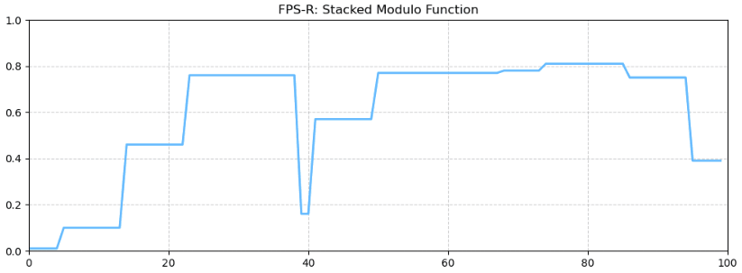
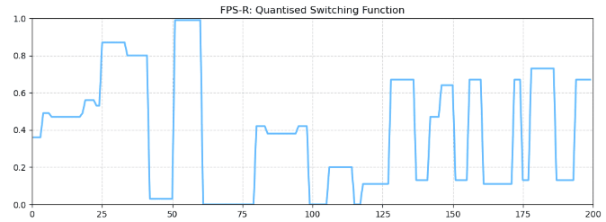

# 🎲 FPS-R Algorithm: Frame-Persistent Stateless Randomisation

# Table of Contents
- [🎲 FPS-R Algorithm: Frame-Persistent Stateless Randomisation](#-fps-r-algorithm-frame-persistent-stateless-randomisation)
- [🗺️ A Site Map of the Documents](#️-a-site-map-of-the-documents)
  - [📜 Readme — Manifesto (English)](#-readme--manifesto-english)
  - [🈸 Readme — 宣言,理念描述 (Chinese)](#-readme--宣言理念描述-chinese)
  - [📐 The Mathematics and Mechanics](#-the-mathematics-and-mechanics)
  - [🍭 Applications](#-applications)
  - [🧠 Thoughts — Reflections and Conceptual Notes](#-thoughts--reflections-and-conceptual-notes)
- [🎲 What is FPS-R?](#-what-is-fps-r)
  - [🪞 Introduction](#-introduction)
- [🎓 Principles and Philosophy](#-principles-and-philosophy)
  - [🧭 Guiding Principle](#-guiding-principle)
  - [🎭 Motion Philosophy](#-motion-philosophy)
  - [📐 Structure and the Illusion of Chaos](#-structure-and-the-illusion-of-chaos)
- [🗣 A New Grammar](#-a-new-grammar)
  - ["Randomised Move-and-Hold"](#randomised-move-and-hold)
- [🎞 Sample Uses of the FPS-R](#-sample-uses-of-the-fps-r)
  - [🧭 FPS-R in Animation](#-fps-r-in-animation)
  - [🧱 FPS-R in Geometry Generation](#-fps-r-in-geometry-generation)
  - [⏱️ Visualisation Videos - FPS-R in Action](#️-visualisation-videos---fps-r-in-action)
- [✨ Key Features](#-key-features)
- [🧩 FPS-R in Relationship to a Parent System](#-fps-r-in-relationship-to-a-parent-system)
- [💡 Why Do I Need Another Random Stream Generator?](#-why-do-i-need-another-random-stream-generator)
  - [🧬 The Nature of "Held" Randomness](#-the-nature-of-held-randomness)
  - [🧱 Limitations of Conventional Techniques](#-limitations-of-conventional-techniques)
    - [The Current State of Computation and Calculations](#the-current-state-of-computation-and-calculations)
    - [🧊 1. Spatialized Randomness (e.g. Worley Noise & Distance-Based Fields)](#-1-spatialized-randomness-eg-worley-noise--distance-based-fields)
    - [🔁 2. Stateful Behavioral Logic (e.g. Timers, Delays, Pauses, Walks)](#-2-stateful-behavioral-logic-eg-timers-delays-pauses-walks)
  - [⚙️ Why FPS-R is Different](#️-why-fps-r-is-different)
- [❓ Why Not Just Use State?](#-why-not-just-use-state)
- [📊 Explore the Algorithm's Fingerprint](#-explore-the-algorithms-fingerprint)
- [🧬 Flavours of FPS-R](#-flavours-of-fps-r)
  - [🌀 Stacked Modulo (SM) or 叠模机制](#-stacked-modulo-sm-or-叠模机制)
  - [✴ Quantised Switching (QS) or 量跃机制](#-quantised-switching-qs-or-量跃机制)
- [🏙 Spatial Extension: From Time to Space](#-spatial-extension-from-time-to-space)
  - [✴ Quantised Switching in Space](#-quantised-switching-in-space)
- [🧠 Recursive Chaos: FPS-R as Higher-Order Modulator](#-recursive-chaos-fps-r-as-higher-order-modulator)
  - [🧪 Modulating Introspection](#-modulating-introspection)
- [📈 Meta-Signal Analysis: FPS-R as Observer and Instrument](#-meta-signal-analysis-fps-r-as-observer-and-instrument)
- [🧭 Application Paradigms](#-application-paradigms)
  - [🎨 Part I — Generative Expression & Organic Simulation](#-part-i--generative-expression--organic-simulation)
    - [🕶️ AR/VR and Human-Centered Interaction](#️-arvr-and-human-centered-interaction)
    - [🤖 Robotics and Embodied Systems](#-robotics-and-embodied-systems)
    - [🛰 Swarms, Drones, and Spatial Coverage Systems](#-swarms-drones-and-spatial-coverage-systems)
    - [💡 Embedded Systems and Ambient Interfaces](#-embedded-systems-and-ambient-interfaces)
    - [🎼 Domains of Application in Audio and Composition](#-domains-of-application-in-audio-and-composition)
  - [🧠 Cognitive Modeling and Generative Thought](#-cognitive-modeling-and-generative-thought)
  - [🌐 Closing Thoughts on Usage](#-closing-thoughts-on-usage)
- [🔩 How FPS-R Works (A Gentle Primer)](#-how-fps-r-works-a-gentle-primer)
  - [🎼 Stacked Modulo (SM)](#-stacked-modulo-sm)
  - [✴️ Quantised Switching (QS)](#️-quantised-switching-qs)
- [⚠️ Tiling Note: Seamlessness in Spatial FPS-R](#️-tiling-note-seamlessness-in-spatial-fps-r)
  - [🪡 Techniques for Seam-Aware Behavior](#-techniques-for-seam-aware-behavior)
- [🚧 Current Status](#-current-status)
- [🗒️ Additional Development Notes](#️-additional-development-notes)
  - [🧠 FPSR Thoughts](#-fpsr-thoughts)
  - [📔 Development Reflections](#-development-reflections)
- [🤝 Contributions](#-contributions)


---

## 🗺️ A Site Map of the Documents

```mermaid
%%{ init: { "theme": "neutral" } }%%
graph TD
  A[README.md 🏁<br>Manifesto & Overview] --> B[FPSR_Tech.md 📐<br>Mathematics & Mechanics]
  A --> C[FPSR_Applications.md 🍭<br>Cross-Domain Use Cases]
  A --> D[README-CH.md 🈸<br>Chinese Manifesto]
  A --> E[Thoughts.md 🧠<br>Reflections & Conceptual Notes]

  classDef fileStyle fill:#C2C2C2,stroke:#333,stroke-width:1px,color:#000,rx:6,ry:6,font-size:14px;
  classDef thoughtHighlight fill:#CFC299,stroke:#444,stroke-width:1.5px,color:#000,rx:6,ry:6,font-size:14px,font-style:italic;

  class A,B,C,D fileStyle
  class E thoughtHighlight
  ``` 

### 📜 Readme — Manifesto (English)
**You are here**. This is the primary document. It presents FPS-R as both a motion grammar and a collection of expressive tools, and serves as a lens through which to understand not only how FPS-R functions, but also why it evokes the qualities it does.

### 🈸 Readme — 宣言,理念描述 (Chinese)
[Click here: 自述文件 — 中文版 (README-CH.md)](README-CH.md)
The Chinese edition of the manifesto, presenting the philosophical and expressive foundation of FPS-R in Mandarin.

### 📐 The Mathematics and Mechanics
[Click here: FPSR_Tech.md](resources/readme/FPSR_Tech.md)
This extension document provides the structural foundation beneath the conceptual framing. It outlines the algorithms, expressions, parameters, and architectural elements that support and shape the behaviour of FPS-R. **_The code lives here._**

### 🍭 Applications 
This document complements and extends the applications of FPS-R beyond the high-level summarised view provided in this ReadMe file. The document will dig deeper into each domain and provide larger number of use cases for each area of use. 
[Click here: FPSR_Applications.md](resources/readme/FPSR_Applications.md)

### 📓 Development Journal — The Chronicle
[Click here: FPSR_Dev_Journal.md](resources/readme/FPSR_Dev_Journal.md)
A chronological account and living notebook of the research and design process. It records breakthroughs, failures, struggles, and revisions, offering insight into the iterative development that shaped the current implementation of FPS-R. 

### 🧠 Thoughts — Reflections and Conceptual Notes
[Click here: FPSR_Thoughts.md](resources/readme/FPSR_Thoughts.md)
An archive of nonlinear reflections, theoretical digressions, and design meditations that contributed to the philosophical development of FPS-R. This document functions as a conceptual incubator and critical sketchpad, recording my internal struggles and conflicts. It also provides the philosophical and poetic dimensions of FPS-R's evolution—where structure meets sensation, and randomness finds rhythm.

---

## 🎲 What is FPS-R?
**_Stateless unpredictability with a structured soul._**

**FPS-R** a domain-agnostic modulation framework, a signal phrasing grammar that expresses a motion archetype we call **"Randomized Move-and-Hold."**  
This framework operates across time, space, and cognition when applied in the fields related to intelligence.

Unlike traditional simulations, it sculpts discontinuity with structure—producing behavior that feels instinctual  
and organic, yet requires no memory or state.

This concept forms the bedrock of FPS-R's philosophy...

### 🪞 Introduction

**FPS-R** stands for `Frame-Persistent Stateless Randomisation` (or `静态律动算法` in Chinese). It is a philosophy and framework behind a collection of lightweight algorithmic pattern and mathematical models for simulating persistent yet stateless randomness across a continuous timeline—ideal for procedural motion, glitch aesthetics, synthesised organic behaviour, and analogue artefact emulation. 

Inspired by natural behaviours such as eye saccades, animal foraging, human hesitation, predatory stalking, and structured noise, FPS-R produces unpredictability without relying on memory of the previous-frame. It mirrors the rhythm of an explorer's torch as he explores a darkened cave—pausing, twitching, drifting with intent—or the room-clearing manoeuvre of a soldier's rifle: moving and holding from one strategic point to another, every new holding position disjointed from what came before.  
> _**FPS-R is a manipulator of values over time, sculpting values and temporal behavior**_

When FPS-R is driven by space instead of time, it becomes something else entirely: a sculptor of forms, a builder of skylines. Its jump-hold logic becomes spatial patterning. Its rhythms become relief.  
> _**FPS-R is not just a motion language—it is a geometry dialect.**_

It is **repeatable**, **tunable**, and **frame-specific**, making it a versatile tool for time-based content creation platforms (Houdini, Maya, 3D Studio Max, Nuke, Adobe After Effects), GLSL, P5.js, game engines (Unity, Unreal), and embedded environments. Thanks to its simplicity and efficiency, FPS-R can also be implemented in any 3D platform that supports expressions or scripting.

In the spatial domain, FPS-R can be implemented into shaders for vertex displacement or surface perturbation, with its effects expressed through normals, bumps, and parallax techniques. When integrated with procedural modeling workflows, it becomes a generator of richly detailed and recursively layered geometry—ideal for greebling, erosion maps, stylised terrain, and sci-fi paneling. While the nature of FPS-R is non-repeating, with appropriate use of tiling techniques it allows spatial patterns to tile seamlessly across UVs or wrap naturally around curved surfaces, offering control without constraint.

---
### 🎓 Principles and Philosophy
---

### 🧭 Guiding Principle
"FPS-R isn't a single algorithm. It's a design philosophy for *shaping signals*. Whether by arithmetic folding or signal quantisation — whether in time or space — the goal is the same: give structure permission to behave."

### 🎭 Motion Philosophy
**FPS-R simulates the unpredictability of hesitation — yet within the same framework, it can just as easily express instinct.**  
- When its temporal holds are short, it expresses *impulse*: quick changes that feel twitchy, clipped, or alert.  
- With longer holding durations, it evokes *hesitation*: thoughtful pauses, lingering states, the illusion of deliberation.

It does not switch modes—it sculpts time. The values may be random, but *when* they appear is guided by the frame count itself—producing a rhythm that feels intentional, even without memory.

What emerges is not chaos, but *temporal behaviour shaped by structure*.

> 🧒 **This rhythm echoes freeze-tag games across cultures** —
> **"A-E-I-O-U!"** in Singapore, **"1, 2, 3 Soleil!"** in France, or **"Statues"** in Greece.  
> **"무궁화 꽃이 피었습니다"** in Korea, **"木头人" in Chinese cultures**,  
> **"Grandmother's Footsteps"** in the UK, **"Red Light, Green Light"** in the U.S.  
> Each moment of stillness feels impulsive yet structured —  
> a hidden choreography of burst and restraint.

> 🧠 **Teaching Note: "No-sim is the best sim."**  
> In teaching Houdini—which is famed for simulation—I often remind students that building a procedural system without frame-to-frame dependencies is often superior to relying on complex simulations.  
> The most elegant systems allow each frame to stand alone—yet somehow feel like they remember the past.

### 📐 Structure and the Illusion of Chaos
FPS-R may appear to drift chaotically, but beneath its phrased irregularity lies a strictly deterministic core. Its behavior unfolds through **modulation operators** — composable mathematical expressions like `mod()` and `rand()` — applied across domains such as time, space, and input streams. These operators form the expressive substrate of FPS-R’s logic.

What results isn’t raw randomness — it’s **structured modulation**. Each jump, each hold, each reseed arises from the friction between layered rhythms and offset reseeds, not from entropy. Temporal phrasing emerges where cycles misalign just enough to simulate spontaneity.

In this sense, FPS-R doesn’t simulate behavior; it **orchestrates interference**. SM and QS aren't mere techniques — they are **procedural grammar primitives**, each governing a different expressive dimension:
- **SM (Stacked Modulo)** phrases values through layered cyclic constraints
- **QS (Quantised Switching)** modulates selection behavior and categorical drift

Together, these operators form a framework for engineered emergence: where each state transition is mathematically traceable, yet aesthetically untraceable.

No memory is used, and yet the behavior feels reflective. No stochastic noise is added, and yet it flickers, hesitates, and breathes.

> *💡 Chaos is not the source — it is the surface. What you see is phrasing. What drives it is structure.*  

This tension—between definition and drift—is not a flaw. It's the expressive core of FPS-R.

---

## 🗣 A New Grammar: 
FPS-R introduces not just a new set of algorithms, but a new *lexicon* for motion.  

### "Randomised Move-and-Hold"
What FPS-R produces is not a filter or a curve — but a compositional structure:  
**jump → hold → reseed → repeat**  

```mermaid
graph LR
  A[**Jump**]:::darkBrown --> B[**Hold**]:::darkYellow 
  B --> C[**Reseed**]:::darkRed --> D[**Repeat**]:::red

classDef darkBrown fill:#654321,stroke:#553311,stroke-width:3px,rx:10,ry:10;

classDef darkYellow fill:#B8860B,stroke:#986609,stroke-width:3px,rx:10,ry:10;

classDef darkRed fill:#8B0000,stroke:#5B0000,stroke-width:3px,rx:10,ry:10;

classDef red fill:#FF0000,stroke:#AA0000,stroke-width:3px,rx:10,ry:10;
```

We call this behavior **Randomised Move-and-Hold**.  

It captures the quality of twitch, of deliberation, of pauses that feel like thought.

---
## 🎞 Sample Uses of the FPS-R

### 🧭 FPS-R in Animation

  
*Eye saccades or darting behaviour in Houdini — Single Eyeball Look Straight Ahead with Saccades*🕰️

  
*Saccades layered on top of object tracking in Houdini — Double Eyeballs Look at a Moving Box with Layered FPS-R Saccades*  

_[Eyeball model](#https://sketchfab.com/3d-models/simple-stylised-eye-c26043a12a32447f99f45ac84b4fb570) courtesy of [rosytoonz](#https://sketchfab.com/rosytoonz)._

### 🧱 FPS-R in Geometry Generation


### ⏱️ Visualisation Videos - FPS-R in Action
Here is a collection of visualisations showing how FPS-R can work within larger systems in different contexts to achieve meaningful behaviour. Mostly created in Houdini, posted on YouTube as videos, and as articles on LinkedIn.

[LinkedIn Article: FPS-R Test: Rat Movement Demo](https://www.linkedin.com/pulse/fps-r-test-rat-movement-demo-patrick-woo-ker-yang-i7foc)
[YouTube - Rat Demo](https://youtu.be/ZHUvv6YxjKw)


[LinkedIn Article: The Straight Line and the Crooked Path: FPS-R, A New Model for Simulating Reality](https://www.linkedin.com/pulse/straight-line-crooked-path-fps-r-new-model-simulating-woo-ker-yang-ha9rc)
[YouTube - FPS-R as a Moving Target on Swarm](https://youtu.be/uQ7krluFvic)


---

## ✨ Key Features

- Frame-anchored **repeatability** without storing state  
- Tunable **chaos profiles** with modular curve sculpting  
- Compatible with stateless shaders, simulation loops, and real-time systems  
- Ideal for generating behaviour that feels **alive**, not algorithmic

---
## 🧩 FPS-R in Relationship to a Parent System
FPS-R is modulation without mandate — it shapes expression, but does not command purpose. Left ungoverned, it phrases freely: drifting, pivoting, zigzagging through move-and-hold rhythms that evoke instinct and surprise. Yet in most systems, **purpose is present** — a gesture to direct, a limb to steady, a gaze to guide.

That’s where FPS-R becomes a collaborator. It doesn’t choose the destination — it **inflects the journey**.

Think of FPS-R not as a planner, but as a phrasing engine. A heart doesn’t decide where blood flows — but without its beat, nothing moves. In this analogy, the parent system supplies structure, intent, and context:
- Defining where phrasing belongs (a joint, a voice, a surface)
- Specifying how much deviation feels organic
- Choosing when to modulate, and when to hold still
FPS-R can be **leashed or liberated** — gated behind reactive logic, or given full autonomy to compose expressive variation. But always, it remains **deterministic, stateless, and repeatable** — a grammar of rhythm that serves systems with meaning.

---
## 💡 Why Do I Need Another Random Stream Generator?
### 🧬 The Nature of "Held" Randomness

In both natural and artificial systems, randomness is rarely pure noise—it often lingers, persists, or evolves in a way that feels intentional. Whether it's the shimmer of dappled light, the jitter of analogue machinery, or the twitchy searching of eye saccades, we encounter random behaviours that hold their shape or drift over time. Yet despite how ubiquitous this phenomenon is, most content creation tools are ill-equipped to simulate, emulate and represent it in an intuitively straightforward and lightweight manner. Replicating this structured unpredictability often requires labour-intensive custom coding or non-intuitive workarounds.

> ✒️ Metaphor Note: *The FPS-R system is like a public pen at the post office.*  
> People come and go: one picks it up, another leaves it askew, sometimes no one touches it for hours.  
> Each interaction changes its orientation, position, or status—but never with memory.  
> Yet from a time-lapse sped-up video review, it appears to dance with intention.  

<br>
<p align="center">
  
  
  
</p>


### 🧱 Limitations of Conventional Techniques
#### The Current State of Computation and Calculations
Most computational systems are wired for one principle: efficiency. From shortest-path solvers to rendering pipelines, the default trajectory is straight, steady, and economical. Time, space, value—they're meant to increment steadily, predictably, toward a desired state. This is the grammar of most algorithms: fewer steps, straighter lines, minimal deviation.

To simulate natural behavior—pause, drift, delay—we layer complexity upon complexity: recursive pathfinding, Perlin-turbulence on top of sine waves, obstacle-based path deformation, stateful random jumps. These additions mimic real-world unpredictability, but they do so by **fighting the system's fundamental bias toward order**. Complexity becomes the price of feeling organic.

**FPS-R flips this tendency**. It starts with modulation. It phrases. It doesn’t bend straight lines—it draws with drift, from the beginning. And yet, paradoxically, it remains **stateless, deterministic, lightweight**. Rather than accumulating structure to simulate spontaneity, FPS-R embodies expressive irregularity as its default form.

> And if richer behavior is required? FPS-R can still be stacked with conventional noise, physics, or reactive inputs—composing layered systems that maintain their phrasing logic even in deeper entanglements.

> 🧩 FPS-R is a phrasing engine, not a planner.
Works _with_ your system. Not to replace it.

When systems attempt to simulate phrased irregularity—deviation, hesitation, unpredictability—they often reach for one of two broad approaches. Both are useful. Both are limited. And neither offers phrasing as its native dialect.

##### 🧊 1. Spatialized Randomness (e.g. Worley Noise & Distance-Based Fields)
These techniques rely on pre-seeded feature points—often jittered grids or hashed distributions—and compute behavior by measuring distance to these anchors. Worley noise, Voronoi fields, and similar cellular approaches are powerful for generating structured randomness across surfaces.

But their strengths are their constraints:
- Uniform seed distributions lead to uniform phrasing patterns
- Modifications require cost-heavy operations (distance calculations, re-indexing)
- Expressiveness is bounded by spatial regularity, not temporal rhythm
- And control often means fighting the function, not collaborating with it

This makes them excellent for texture, weak for time.

##### 🔁 2. Stateful Behavioral Logic (e.g. Timers, Delays, Pauses, Walks)
To generate deviation in motion or behavior, developers often build state machines or custom update loops that track progress over time. These accumulate logic as layers of interrupts against straight-line behavior. The goal: produce a sense of intent through delay, error, or noise.

This family is broad. But its footprint is heavy.
🌀 Signal Distortion and Perturbation
- Random noise injection to modulate path or output jitter
- Random walks to simulate directionless deviation
- Sinusoidal overlays and Bezier oscillations for smooth wiggles

⏱ Holding, Delaying, and Interrupting
- Variable speed logic that simulates drift, fatigue, or lag
- Step functions, staircase patterns, and random delays for hold-and-burst effects
- Zigzag alternation for enforced directional instability

🛣️ Path Complexity via Indirect Algorithms
- Pathfinding (A, Dijkstra)* to intentionally reroute around obstacles
- Dynamic heuristics that distort toward longer routes
- Redirect forces (attraction/repulsion, magnet fields) that bias local curvature

🌪️ Contextual Inputs and Reactive Systems
- User input deviations, causing behavior to “wobble” under influence
- Environment simulation (wind, terrain, gravity) to trigger plausible sway
- Feedback loops that adjust based on previous moves—embedded memory disguised as logic

These approaches _can_ work. Many do. But they share four liabilities:
1. They assume memory
2. They demand scaffolding
3. They are rarely portable
4. They are neither composable nor phrased

### ⚙️ Why FPS-R is Different

Where most systems create irregularity by layering complexity onto predictable logic, FPS-R begins with modulation. It doesn’t simulate drift—it phrases it. And unlike traditional methods that rely on accumulated state, scaffolded logic, or seeded lookup tables, FPS-R distills expressive behavior into a **single, frame-aware grammar**.

Its modulation is clean, deterministic, and portable—expressing structured spontaneity without state.

Key advantages include:

- ✅ **Truly Stateless**: FPS-R does not rely on previous-frame data or persistent memory buffers  
- **🔒 Fully Deterministic**: With the same inputs, FPS-R always produces the same outputs—no entropy, no surprises
- 🧠 **Compact & Readable**: The SM expression can be written in a single line using `$F` in Houdini expressions or `@Frame` in VEX  
- 🛠️ **Platform Agnostic**: Works seamlessly in any environment that exposes frame-based context  
- ⚡ **Performance Friendly**: No costly distance functions, hash lookups, or scatter generation

> 🪞 Most modulation systems simulate intent by scaffolding state. **FPS-R phrases intent by design—and does so without memory**.

That’s why FPS-R can:
- Replace brittle scaffolding with composable phrasing logic
- Operate cleanly in shaders, expressions, and parallel domains
- Stack with traditional techniques when needed—without collapsing determinism

> The world of simulation builds structure to allow drift. FPS-R starts in drift—and phrases structure into it.

> 🧩 Deterministic Complexity
> Where intricate behavior emerges from repeatable rules, not randomness.
---

## ❓ Why Not Just Use State?
In a **stateful** system, behavior depends on remembering what happened before—like a dancer who needs to recall their last step before taking the next. A **stateless** system, like FPS-R, behavior is calculated fresh every time, based on inputs like time, position, or **pattern—no memory, no history, just clean response.**

Before FPS-R, developers often implemented behavior modulation using **ad hoc stateful logic**—tracking frame counters, timers, or conditional gates to "hold" a value or trigger a change. You’ve probably coded this already: hold a value, flip a coin to jump, repeat. It works. These methods are effective in simple contexts. But they are rooted in state, scaffolding, and context-specific logic. They fragment. They proliferate. And most importantly—they don’t scale across time, space, and systems.

**So why does FPS-R exist?**
FPS-R doesn’t replace stateful methods—it transcends it.  

Because beyond simple systems lies a world of **stateless surfaces**, **reproducible timelines**, and **modular behaviors** that demand more than scattered logic and local memory. That’s where traditional state falters—and where FPS-R begins.

**Why Traditional State Falls Short**
**🧳 State Doesn’t Travel** Your hold/reseed-jump loop works in a script—but it relies on persistent memory. That loop breaks in shaders, in stateless expression fields, in stream processors, GPU pipelines—anywhere **state doesn’t persist**. FPS-R? Stateless by design. It runs wherever functions do: in time, in space, in parallel.

**🧠 No Forensic Trail** Once a stateful loop has run, its past is a blur of overwritten variables. A crash at frame 58200? Good luck explaining why your held value jumped. FPS-R is deterministic and leaves a procedural trail: any frame, any capsule, always reproducible. Every decision path is reconstructable from a seed and a frame. FPS-R a glass box—not just a tool, but a timeline.

**🌌 Time-Bound, Not Domain-Agnostic** Stateful loops are temporal by nature. They work on a clock. Try to modulate a surface, a gesture velocity, or a gaze field—**time-only logic fractures**. FPS-R works across **domain inputs**. Any scalar, vector, or multidimensional stream can become a behavior substrate.

**🧭 Hard to Compose** Integrating multiple stateful modulators is brittle. FPS-R capsules are modular, chainable, and named. They compose cleanly—stackable, layerable, with expressive guarantees. With input parameters, you describe intent—hesitate, glide, surprise—and the capsule knows how to phrase it.

**💡 The Real Difference**
FPS-R doesn’t scaffold behavior through memory or timers—it composes it directly, using deterministic randomness and stateless modulation. With reproducibility by design and support for spatial and temporal domains, it acts not just as a method but as a grammar: one that encodes drift, hesitation, and surprise across surfaces, systems, and synthetic agents.

> Traditional state holds behavior in place. **FPS-R lets behavior move—across systems, across domains, across minds.**

---
## 📊 Explore the Algorithm's Fingerprint
The FPS-R algorithms produce a unique rhythmic "fingerprint" over time. The animated preview below shows the scrollable timeline graph from the included Jupyter Notebook, which allows you to explore this behavior visually.

 
FPS-R: Stacked Modulo Timeline Graph Preview


FPS-R: Quantised Switching Timeline Graph Preview

To try it yourself, you can [explore the interactive timeline in a Jupyter notebook on `nbviewer`](https://nbviewer.org/github/patwooky/FPSR_Algorithm/blob/main/resources/code/python/fpsr_algorithms.ipynb)
The interactive scrolling graphs are the last 2 cells at the end of the notebook.

> Note: Jupyter notebooks render only as static content on GitHub's web viewer. Interactive scrolling graphs for SM and QS will not show up. If you want to play around with the parameters and drive a different resulting curve, and inspect the scrolling graphs, please feel free to download the notebook and execute it on your local machine runnning Jupyter notebook on a Python 3.x kernal with the relevant dependencies (`Pandas` and `Matplotlib`). 

---

## 🧬 Flavours of FPS-R
FPS-R comprises two distinct mathematical algorithms — each offering a stateless, deterministic approach to phrased modulation:
- 🌀 Stacked Modulo (SM)
- ✴ Quantised Switching (QS)

These form the primary **modulation operators** within the FPS-R framework, usable independently or composable into parallel blends and chained sequences. Together, they shape the expressive grammar of _randomised move-and-hold_ behavior — tuned, layered, and always reproducible.

### 🌀 Stacked Modulo (SM) or 叠模机制
The original FPS-R operator. SM constructs motion through layered modulus functions with shifting offsets — producing transitions that feel spontaneous, yet arise from strict deterministic interference.  
- **Expressive feel**: memory without memory
- **Phrasing shaped by**: frequency, amplitude, offset phase
- **Strengths**: highly composable, compact implementation

**SM Features:**
- Adjustable upper bound for values hold duration  
- Adjustable lower bound influences the minimum possible hold duration between jumps.
- Stateless modulation via `rand()` and `mod()` using current frame 
- Encodable as single-line expressions in toolkits like Houdini, VEX, GLSL

---

### ✴ Quantised Switching (QS) or 量跃机制
QS selects and switches between indexed value streams — flickering between discrete steps or smoothly interpolated paths. It simulates glitch-like transitions, logical flicker, and compositional jump behavior through deterministic switching logic.

**QS Features:**
- Deterministic pseudo-random stream selection
- Supports custom value banks and indexed behaviors
- Optional quantisation for stepped or smooth interpolation
- Configurable switching cadence with controlled reseed logic

---
## 🏙 Spatial Extension: From Time to Space

**FPS-R doesn't just animate. It extrudes. It embosses. It *grows surfaces*.**

By replacing time (`$F`, `@Frame`, etc.) with space (`x`, `y`, `uv`, or `position`), FPS-R becomes a **procedural modeling toolkit**—ideal for generating blocky silhouettes, architectural detail, and sci-fi surface features.

### Spatial Modes

- **1D → 2D Profiles**  
  Use a 1D FPS-R output along the `x`-axis:  
  - Random *jump-hold* patterns mimic building silhouettes  
  - Perfect for stylised skylines, barcode patterns, or abstract bas-reliefs

- **2D → 3D Extrusions**  
  Feed FPS-R(x, y) into a heightfield or mesh extrusion driver:  
  - Generates grid-based paneling, mechanical greebles, and terrain  
  - Works seamlessly with subdivide/bevel workflows

- **Curved Surfaces and Wrapping**  
  Since FPS-R is stateless, spatial lookups can wrap around UV shells or cylindrical coordinates without visual seams  
  - Enables pattern generation across spherical helmets, pipes, or organic topologies

<br>
<p align="center">
  
  
</p>

### ✴ Quantised Switching in Space

QS becomes a **signal switcher** in the spatial domain:  
- Swap randomisation engines (Perlin, Worley, texture samplers)  
- Turn off quantisation for fluid transitions  
- Amplify for brutalist modularity or broken repetition
> "Just as QS modulates time by switching behavioural regimes, it can modulate space by switching surface logic—turning texture banks or heightmap engines on and off with structured unpredictability."

---
## 🧠 Recursive Chaos: FPS-R as Higher-Order Modulator
When modulation itself becomes the substrate, FPS-R enters a recursive phase — sculpting not just behavior, but the behavior of phrasing. In this layered paradigm, an FPS-R signal can be used to modulate another FPS-R stream, creating nested patterns of expressive control.

This self-referential phrasing allows for:
- **Multi-scale modulation**: macro pulses shaped by coarse phrasing, with micro flickers layered within
- **Localized personality zones**: regions where phrasing regime shifts — one area hesitates, another twitches
- **Signal introspection**: behavior that responds to its own modulation trace, creating feedback-driven emergence

This nesting enables semantic navigation across modulation space — not just movement, but meaningful movement.The result is a *generative grammar*, not just a random script.

<P align="center">
  
</P>

### 🧪 Modulating Introspection
Recursive FPS-R streams aren’t just performers — they are **observers of phrasing itself**.
- A signal’s modulation layer can output not just values, but **diagnostic rhythms**
- These rhythms can drive debug overlays, visual glyphs, or adaptive system tuning
- Behavior becomes feedback — phrased motion that knows how it phrases

Example:
In a generative cognition engine, FPS-R isn’t just driving attention — it’s modulating how modulation evolves. Hesitation isn’t a pause — it’s an echo of a deeper signal inflection upstream, resulting in the emergence of the meta-state of an appearance close to intent.

<P align="center">   </P>

---
## 📈 Meta-Signal Analysis: FPS-R as Observer and Instrument

Originally conceived as a generator of structured unpredictability, FPS-R has evolved into a system capable of **observing its own modulation trace**. Its output is not just signal — it is _self-scribing_ geometry.

By mapping jump-hold phrasing into spatial form — 2D graphs, 3D reliefs, or architectural silhouettes — FPS-R reveals insights into its own expressive rhythm. These signal visualizations uncover patterns in:

- **Behavioural cadence**: skyline-like silhouettes that reflect phrase spacing and duration
- **Decision signature**: waveform glyphs that capture modulation character, such as twitch, drift, hesitation
- **Recursive structure**: embedded phrasing zones that show where modulation layers converge or diverge

These representations let FPS-R become both **performer** and **diagnostician** — capable of inspecting itself without state or memory. Through deterministic reproduction, even the most organic movement becomes a traceable form.

> Imagine each signal transition as a spatial block along a time axis — a skyline of deliberation. Warp it across a surface, and you get textured memory of phrasing intent.

### 🪞 Use Cases for Meta-Signal Mapping
- Teaching phrasing logic and modulation character 
- Debugging emergent behavior by tracing rhythm profile
- Designing visual glyphs of logic for capsule fingerprinting
- Feedback tuning across time, attention, or surface topologies

Ultimately, meta-signal analysis reframes FPS-R from engine to instrument — a system not only capable of phrasing, but of illuminating the shape of phrasing itself.

> 🧠 It doesn’t just modulate. It remembers — without memory. The shape it casts is its own reflection.

---
## 🧭 Application Paradigms

FPS-R serves as an expressive modulation engine operating within larger systems that determine intent—whether that intent is to gaze, to move, to signal, or to wait. These higher-level systems—planners, controllers, inference engines, or decision layers—define the what and why; FPS-R defines the how.

It does not decide. It phrases.

What FPS-R contributes is **behavioral unfolding**: stateless, deterministic modulation that brings human-feeling variation to systems without introducing chaos. Its role is not to improvise beyond the system’s goals, but to render those goals with texture, rhythm, and restraint.

Rather than categorizing its capabilities by industry, we present FPS-R’s expressive range through **three paradigms of integration**. Each reflects a different posture toward modulation:
- One uses phrasing to simulate **naturalistic behavior**
- One uses it to pressure systems into revealing **robustness or failure**
- One uses it to explore **intentional ambiguity and emergent possibility**

Wherever a larger system supplies purpose, FPS-R offers phrased expression. Within the envelope of intent, it breathes.

> The following paradigms offer not simply areas of application, but distinct philosophies of use—revealing how phrasing, when framed by purpose, becomes meaningful motion across domains.

### 🎨 Part I — Generative Expression & Organic Simulation
**FPS-R as a composer of lifelike timing and motion.**

This paradigm explores how FPS-R introduces lifelike irregularity into synthetic systems—animating timing, drift, and hesitation in a way that feels natural, not scripted. It offers structure without repetition, and variation without chaos.

> In these systems, phrasing is not ornament—it's how behavior becomes expressive.

#### 🕶️ AR/VR and Human-Centered Interaction
Enhance gaze realism, avatar subtlety, and user modeling through structured micro-variation. FPS-R simulates organic attention and perceptual drift—ideal for believable interaction, accessibility testing, and immersive behavioral nuance.

#### 🤖 Robotics and Embodied Systems
Infuse robots with micro-behavior that signals awareness, hesitation, or subtle intent. FPS-R drives expressive motion and non-repeating attention patterns—ideal for idle simulation, adaptive control, and believable human-robot interaction.

#### 🧤 Wearables and Assistive Technologies
FPS-R restores expressive nuance to prosthetics, exosuits, and haptic wearables—introducing natural micro-variation that makes robotic extensions feel embodied, familiar, and socially intuitive. It enhances psychological acceptance for users, eases interaction for others, and reintroduces dignity through movement that feels quietly human.

#### 🧬 Biofeedback and Adaptive Expression
FPS-R gives biofeedback systems a voice—translating internal signals into rhythmic, non-repeating feedback that guides, calms, and attunes. It renders physiological data with expressive timing, helping users feel seen, supported, and subtly understood.

#### 🛰 Swarms, Drones, and Spatial Coverage Systems
By modulating micro-deviations, route pauses, and procedural hesitation, FPS-R allows drones and mobile agents to avoid repetitive patterns while maintaining deterministic replayability. It enables expressive decentralization—no memory, no communication overhead, just lifelike modulation at the edge.

#### 💡 Embedded Systems and Ambient Interfaces
Whether it's a kinetic sculpture, an expressive animatronic, or a wearable signaling device, FPS-R enables stateless behavior that feels alive and intentional. Drift, hold, and repeat parameters can be tuned precisely—even in microcontroller environments with limited cycles.

#### 🎼 Domains of Application in Audio and Composition
🎼 Audio Systems and Musical Modulation
FPS-R brings **rhythmic awareness** to generative music, instrument expression, and sound design—aligning modulation with beats, bars, and phrase timing. From glitch textures to analogue warmth, **it enables sonic systems to groove, drift, and phrase with intention**.

### 🧪 Part II — Systemic Resilience & Analysis
FPS-R as phrasing logic under pressure.

This paradigm treats FPS-R as a deterministic stress layer—used to reveal brittleness, surface assumptions, and replay edge conditions across critical systems. It modulates volatility with control, generating structured entropy without memory or chaos.
> Here, phrasing isn’t decorative—it’s diagnostic.

#### 🛡️ Cybersecurity and Adversarial Simulation
Generate procedural threats that are stateless, layered, and perfectly replayable. FPS-R enables red/blue parity, forensic breach capsule logging, and scenario-driven defense training under controlled chaos.

#### 💸 Financial Systems and Economic Simulation
Model structured volatility and regime shifts with deterministic unpredictability. FPS-R enables stress testing of trading algorithms, policy resilience, and systemic stability—without relying on historical data.

#### 🧪 Software Testing and Fuzzing
Simulate unpredictable user and API behavior with structured randomness. FPS-R can expose fragile edge cases and systemic blind spots—offering deterministic chaos for input fuzzing, timing violation, and error cascade discovery.

#### 🧵 Systems-Level Protocol & Infrastructure Simulation
Simulate layered protocol behavior and infrastructure churn using deterministic modulation. Reconstruct systemic failures, timing anomalies, and resilience under pressure.

### ⚔️ Game Theory, Politics, and Strategic Modeling
Model decision rhythms, timing asymmetries, and state transitions across agents and adversaries. FPS-R brings temporal nuance to strategic simulations—mapping escalation, delay, and unpredictability with deterministic control.

### 🧭 Process & Contingency Simulation
Model operational drift, failure cascades, and procedural stress scenarios with structured randomness. Ideal for testing resilience in planning, logistics, and industrial workflows.

### 🧠 Cognitive Modeling & Generative Thought  
**FPS-R as a temporal grammar of cognition**

At its highest abstraction, FPS-R transforms from a motion engine into a **catalyst for cognition itself**—shaping not just what is expressed, but how ideas move, unfold, and resolve.

In generative systems like LLMs, FPS-R serves as a **temporal pacing layer**: modulating drift, hold, and pivot behaviors across attention space. It enables models to **deliberate**, **hesitate**, or **explore tangents** in a way that *feels thoughtful*, not merely statistical.

This rhythm doesn’t dictate content—but it **phrases its emergence**. In doing so, FPS-R brings timing logic to language flow: structured modulation that gives life to curiosity, surprise, and coherence without relying on memory.

In fuzzy logic systems, it allows **rules to breathe**, dynamically warping thresholds based on perceived intent. Structured ambiguity emerges—not through state tracking, but through timed hesitation, soft commitment, or confident acceleration.

In conversational agents, it acts as **dialogue dramaturgy**—regulating the rise and fall of engagement, metaphor pivots, and slow returns to dropped threads. Topic continuity no longer requires explicit memory—it rides on modulation shape alone.

Most profoundly, FPS-R may enable **path-dependent cognition**: where ideas do not merely jump between nodes in latent space, but **follow phrased trajectories**. Between a prompt and a goal, the system *curves* through language space, guided by expressive grammar—unlocking a new kind of **semantic drift** that is not random, but choreographed.

> This is not next-token prediction. It’s **temporal navigation** across concept space—intelligent movement as modulation.

With FPS-R:
- A tangent becomes discovery.
- A delay becomes style.
- A drift becomes metaphor.

And when phrasing is embedded in structure, **personality becomes tunable**. Capsules that simulate focus, spontaneity, or mischief become interchangeable dramaturgical lenses—crafting behavior that feels lived-in, reflective, or even inspired.

> Not just behavior generation. Not just modeling.  
> FPS-R is **how synthetic thought can phrase itself**—with rhythm, hesitation, missteps, and meaning.

### 🕰️ Expressive Forecasting & Temporal Reconstruction  
**FPS-R as a grammar for the unfolding of time**

Beyond behavior generation, FPS-R introduces a rare capability: **procedural reconstruction**. Given an observed motion—or any temporal phenomenon with phrasing character—FPS-R can match it to a deterministic modulation profile and extrapolate *in both directions*: generating plausible pasts and futures within a structured expressive envelope.

This isn’t prediction. It’s **phrased inference**.

By parameterizing observed values—via rhythm, drift, spacing, and inflection—researchers can align behavior with an FPS-R modulation curve. Once the match is made, the curve doesn’t just describe what happened. It *continues* it.

- What came before the twitch?
- What does this hesitation resolve into?

This creates a kind of **temporal grammar**—not just for animation or simulation, but for any system where expressive modulation emerges: political sentiment, network collapse, affective cadence, infrastructure stress, emotional arc.

The matching process can be approached multiple ways:
- Brute-force parametric search  
- Capsule library lookup  
- Manual profiling  
- Or AI-assisted reverse inference via an FPS-R “Behavioral Spectrometer”

The better the match, the higher the confidence. From there, **narrative completion**, **agent forecasting**, and **causal reconstruction** all become procedurally available—using phrasing logic as scaffolding.

> What begins as phrasing becomes a lens into continuity—an unfolding that never needed memory, just structure.

In a real-time use case: point a camera at a candle’s flicker. The system matches its flutter to an FPS-R configuration. You instantly receive a three-line phrasing display:

- **Present**: matched modulation values  
- **Past**: extrapolated gesture that likely preceded it  
- **Future**: continuation as dictated by expressive rhythm

That’s not a prediction. That’s **recomposed possibility**, grounded in expressive logic.

With FPS-R, every behavior becomes a portal. Every phrased moment becomes a **modulatable entry point**—into what could have been, and what might still become.

---

### 🌐 Closing Thoughts on Usage

The examples above trace a constellation, not a boundary. As FPS-R pulses into prosthetics, haptic grammars, biofeedback loops, vision rhythms, and musical phrasing, its grammar still remains unfinished.

It doesn't simulate intelligence—it expresses modulation. Not a model of thought, but a choreography of response.

Whether nested in a footstep, a glance, a circuit, or a breath, FPS-R speaks where behavior meets texture—and every new context awaits translation.

So take it. Reshape it. Let it hesitate where no behavior has paused before.

🚀 *To modulate boldly, where no signal has modulated before.*


---

## 🔩 How FPS-R Works (A Gentle Primer)

At its heart, FPS-R is a rhythm machine—generating unpredictable but *structured* signals over time or space.  
It doesn't store memory. It doesn't know what came before.  
Yet what emerges feels like hesitation, twitch, or drift.

You tell FPS-R which frame (or position) it's in, and it sculpts a value based on simple math:  
modular rhythms, seeded randomness, layered transitions.  
From that alone, it creates the illusion of thought—without ever thinking.

FPS-R unfolds through two intertwined methods.  
Each one offers a unique lens—structured pulses that unlock different facets of unpredictability.
  

Here's the basic idea:

### 🎼 Stacked Modulo (SM)
Like overlapping metronomes—each frame lands within multiple rhythm layers, each with its own time signature.   
Some tick slowly, some twitch fast. Where their cycles overlap, a value is held… until one metronome hits the end of its measure—and triggers a jump.  

When does the signal hold?
- The current frame lands within a stable rhythm layer intersection.
- None of the modulo layers reach the end of their cycle.

When does the signal jump?
- One or more rhythm layers complete a cycle (reach "end of measure").
- The modular alignment causes a break in value continuity.
- A new composite rhythm is formed, triggering the next held value.

### ✴️ Quantised Switching (QS)
In its most basic form, Quantised Switching is a signal selector. Two signals (typically sine waves) are generated—each with its own time signature, much like SM's layered rhythms.  
But instead of flowing smoothly, each signal is sliced into discrete steps. Another rhythm governs the selector itself.  
When the selector reaches the end of its measure, a jump occurs—triggering a *probable* switch to the alternate signal (though it may stay).  
Separately, if the currently selected signal jumps between steps, a jump in the final value also happens.  

When does the signal hold?
- The stepped value from the selected signal remains unchanged.
- The selector rhythm is still mid-cycle (not yet at the end of a measure).

When does the signal jump?
- The selector rhythm completes its measure → probabilistic switch occurs.
- The stepped value of the selected signal changes between frames.
- Either event causes a discrete jump in output—without memory of prior state.

These layered, deterministic jumps—both in selection and value—offer stylistic glitch, rhythmic flicker, and behavioral unpredictability.


Each method is stateless. Each moment is decided without memory.  
And yet, the result feels strangely alive.

👉 *Want to unpack the full mechanism, token by token? Dive into the technical breakdown here:*  
**[Read FPSR_Tech.md →](resources/readme/FPSR_Tech.md)**


---
## ⚠️ Tiling Note: Seamlessness in Spatial FPS-R

By default, FPS-R generates *non-repeating, stateless randomness*, which means it does **not** seamlessly tile across UV space or fixed spatial domains out of the box. This unpredictability is part of its power—but for workflows requiring smooth tiling or seamless textures (e.g. UDIM-based materials, game-ready UV atlases), FPS-R can be gently adapted to behave.

### 🪡 Techniques for Seam-Aware Behavior

Here are strategies to coax FPS-R into cooperating across tile boundaries:

- **Modulus-Based Tiling**  
  Wrap UVs explicitly using `mod(uv, tileSize)`. This forces periodicity while keeping the jump-hold quality within each tile.

- **Mirrored Wrapping**  
  Use a reflected modulus: `abs(mod(uv, 2.0) - 1.0)` for soft continuity at edges—great for symmetric patterns or organic wrapping.

- **Quantised Phase Locking**  
  Divide UV space into quantised cells and derive a consistent `rand()` seed per cell. This syncs pattern phases across borders.

- **Edge Crossfade (Mask Blending)**  
  Blend FPS-R lookups with slight UV offsets near seam edges. Use `smoothstep()` masks to interpolate between directions.

- **Layered Distraction**  
  Accept tiling at a coarse base layer, then modulate with finer FPS-R overlays. Even if the base repeats, the compound result feels rich and unresolved.

> 🧵 Seamlessness is not default—but it is *composable*. By embracing layering, offset masking, and structured quantisation, FPS-R can be shaped into tileable, patch-based, or wrapped surface logic without losing its essence.

---

## 🚧 Current Status

FPS-R is under active development and currently private during cleanup. Planned improvements:

- Modular utilities  
- Plug-and-play GLSL and Houdini expressions  
- Ready-made presets and chaos profiles

---
## Future Developments

### Capsules
#### What are capsules?
Capsules parameterised modulation profiles. 

Capsules are **parameterized modulation profiles** that record phrasing behavior over time. Each capsule encapsulates both:

- a sequence of observed output values — the _jumps_ and _holds_ within a time window (e.g. frames 200 to 250)
- and the precise **settings** that generated them: algorithm type (SM or QS), signal frequencies, modulo durations, switching intervals, and reseed logic.

This pairing allows users to **reproduce expressive behavior deterministically** — not as an approximation, but as a perfect playback of phrased motion within its original modulation context.

At their core, capsules store two categories of data:
1. **Time-Based Performance**
  - Start and end frame of the modulation clip
  - Value at every frame across the timeline

2. **Parameter Configuration**
  - Algorithmic choices and tunings
  - Modulation settings and domain inputs

A collection of capsules forms a **library of expressive phrasing**: Each clip represents a distinct behavior profile — some intentional, some discovered through emergent “happy accidents.” Over time, these capsules serve not just as utility, but as a creative archive: **motion phrases with poetic structure**, reusable across domains.

> Capsules exist because FPS-R is fully deterministic and stateless. Every phrased drift can be traced, stored, and recalled — performance becomes grammar.

#### Why do We Need Capsules?
Given the unpredictable and continuous nature of FPS-R's performances, it is easy to get lost with endlessly tweaking seed values and parameters without being able to get the exact performance we want. Capsules serve as a collection of "moments". Giving descriptive names to the observed behaviour and performance characteristics of captured clips allow us to store and exactly reproduce these results when the context calls for it.

#### What can we do with capsules?

---
## 🗒️ Additional Development Notes
### 🧠 FPSR Thoughts
[(click here)](resources\readme\fpsr_thoughts.md)  
This is a the thoughts about the tools I have created. 

### 📔 Development Reflections
[(click here)](resources\readme\development_reflections.md)  
This is the chronological diary of the events leading to the discovery of these methods and techniques.

---

## 🤝 Contributions

If you're into procedural chaos, analogue aesthetics, or the poetry of entropy—your thoughts are welcome once it returns to public life.
