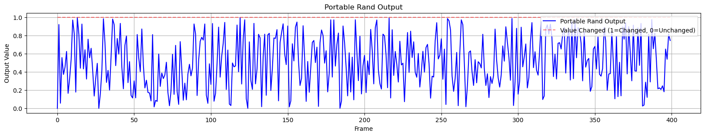
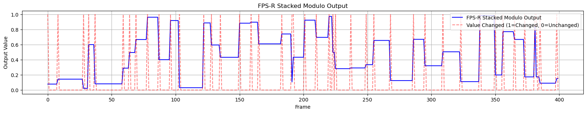
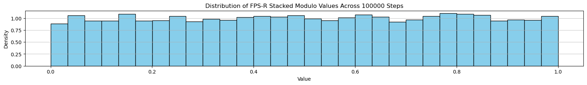
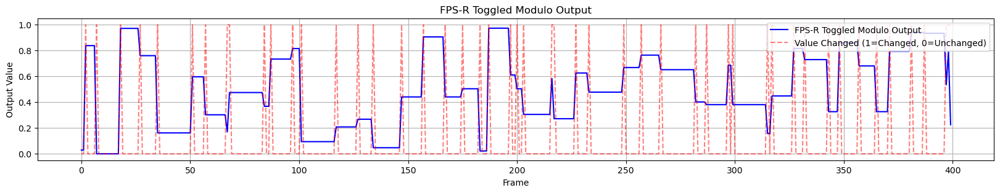
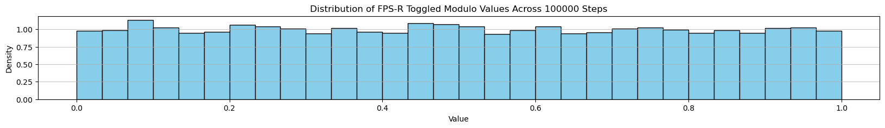
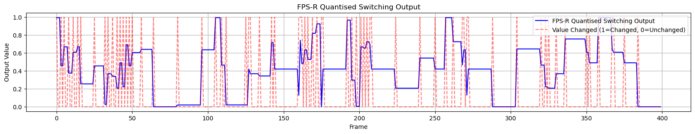
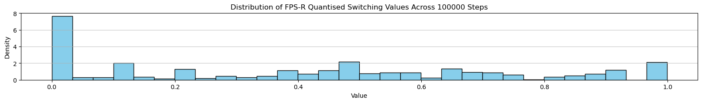

Apache License 2.0—[see LICENSE](LICENSE.md) for details.  
Copyright (c) 2025 Woo Ker Yang (Patrick Woo) patrickwoo.1976@gmail.com  
If you reference or adapt this framework, please credit Patrick Woo and this repository.  
**This documentation is still in development.**  
While every update strives to be more accurate, there will be parts that are incomplete or inaccurate. 

# 🎲 FPS-R: Frame-Persistent Stateless Randomisation

# Table of Contents
- [Introduction: What is FPS-R?](#introduction-what-is-fps-r)


---
# Introduction: What is FPS-R?
**FPS-R** is **Frame Persistent Stateless Randomisation**.

FPS-R is a **time-aware** pseudo-random number generator.  
Given any series of incrementing input values (e.g., `frame`, `training-epoch`, `uv`, `latent-space`, `x-axis`), FPS-R produces a persistent sequence of **deterministic** random numbers.  
These numbers hold their values for unpredictable, yet deterministic, time steps before changing.  
FPS-R is also **stateless**—it does not need to store state at each time-step, which avoids complex logic and state management.

**The Grammar of FPS-R Across Domains**
The behaviour of held-randomness in FPS-R leads to the following emergent and observed properties:
- **deliberation**, **hesitation**, **intentionality**
- evoked feelings of **unexpected surprise** and **being startled**

At the core, FPS-R is a framework and a grammar that describes a behaviour and phenomenon that these phrases try to express: 
- **hold-then-break**
- **move and hold**
- **hold and jump**

In other words, FPS-R introduces negentropy (reduction of entropy) across "time", injecting some temporal cohesion that is irregular and non-uniform across holding periods.

These are pervasive phenomena that can be observed across domains.
Here are a few examples of non-linearity found in various aspects of our reality, including physical systems, socio-economic systems, and emotional states:

**Natural Systems**
  - **Flock Migration Trajectories**: The movement patterns of birds or fish often show non-linear dynamics, which result from interactions among individuals and environmental factors.
  - **Predatory Movement**: Predators and prey often alternate between holding their positions and making sudden bursts of speed during the chase and escape process.
  - **Quantum Particle Jumps**: In quantum mechanics, particles often exhibit non-linear behavior by suddenly 'jumping' from one position to another.

**Human Systems**
  - **Eye Saccades**: The rapid movements of the eye exhibiting non-linear patterns in visual attention.
  - **Growth Rates in Organisations**: The growth of organisations often follows non-linear paths, shaped by a variety of unpredictable influences.
  - **Product Development Speeds**: The pace of innovation can vary dramatically depending on market conditions, technology, and consumer behaviour.

**Socio-Economic Systems**
  - **Financial Market Crashes**: Market dynamics are often non-linear. Small changes can lead to rapid and significant chain reactions, resulting in crashes.
  - **Plate Tectonic Movements**: Stress gradually builds up in tectonic activities and is then released suddenly and violently during earthquakes.
  - **Planetary Collapses**: Gravitational instability over time can result in the sudden, rapid collapse of planets and stars. This process may sometimes lead to the formation of black holes.

**Emotional Drifts and Shifts**
  - **Building Anger to Outburst**: Anger often accumulates over time due to various triggers, building up to a final trigger the leads to a sudden outburst. 
  - **Hesitation to Sudden Courage**: Individuals may experience prolonged periods of hesitation or doubt before suddenly acting with courage. 
  - **Learning and Internalising to Moments of Understanding**: Learning is a non-linear process, where individuals may struggle with concepts for a period before suddenly achieving clarity and understanding.

> **[fpsr_unifying_theory.md](resources/readme/FPSR_Unifying_Theory.md)**
  Read more about the thoughts and research behind the principle of move-hold and surprise.

## Current Methods and Limitations
Currently, there are limited methods to emulate this realistic and complex behaviour. Most of these methods are neither simple, convenient nor elegant.

### `rand()`-based Methods
**Stateful Logic Scaffolding: Holding `rand()` Across Frames**
As mentioned, `rand()` tends to jump values from one seed to the next. It cannot achieve a continuous output even when the input seeds are continuous.

A common workaround to make `rand()` hold its value across frames is to use a stateful logic scaffolding. This involves maintaining a counter variable that tracks how many frames have passed since the last random value was generated. The process typically looks like this:

1. **Initialise a Counter:** Start with a counter set to zero.
2. **Hold Value:** For each frame, increment the counter.
3. **Conditional Update:** Use an `if/else` statement to check if the counter has reached a predefined threshold (the hold duration).
  - If the threshold is reached, generate a new random value with `rand()`, reset the counter, and hold this new value.
  - If not, continue holding the previous value.

Example pseudocode:
```python
hold_counter = 0
hold_duration = random.randint(min_hold, max_hold)
held_value = rand()

def get_random_value():
   global hold_counter, hold_duration, held_value
   if hold_counter >= hold_duration:
      held_value = rand()
      hold_duration = random.randint(min_hold, max_hold)
      hold_counter = 0
   hold_counter += 1
   return held_value
```
This approach requires storing state (such as counters and held values) and using logic to decide when to "toss the coin" for a new random value. While effective, it introduces complexity and demands ongoing state management, making the process difficult to trace and audit. The reliance on state means that each random stream must remember its history, which undermines transparency and predictability.

Furthermore, stateful methods cannot be easily used in parallel or distributed computing environments, including GPU operations, where statelessness is essential for scalability and reproducibility. As the number of these stateful streams increases, so does the burden of managing their individual states, leading to poor scalability and increased maintenance overhead.

### Noise-based Methods
In the world of film, games and interactive media, using noise to generate random continuity is a common practice.

**Simplex, Perlin, etc**
Noise functions like Perlin and Simplex generate smoothly varying, deterministic outputs across a domain, resulting in periodic and regular patterns. Even when these continuous gradients are quantised into discrete steps, the underlying regularity remains—cross-sections often resemble sine waves, and quantisation produces predictable, repeating transitions. This inherent evenness prevents noise functions from achieving truly random values with irregularly held periods, as their gradients distribute changes uniformly rather than unpredictably.

**Worley or Cellular Noise**
Worley (cellular) noise generates discrete, stepped patterns by assigning each point a value based on its distance to the nearest feature in a grid. This produces regions of stability (holds) and abrupt transitions (jumps), but the underlying structure remains regular and predictable due to the grid and distance calculations. While Worley noise introduces complexity through spatial relationships, its output is fundamentally periodic and lacks the organic, irregularly held randomness needed for naturalistic temporal behaviors. Thus, it cannot emulate the unpredictable holding changing of random values.

**Workarounds to Mitigate Noise Regularity**
To try to break up these regular patterns, programmers may layer more noise, commonly varying frequency, or blend in small amounts of true randomness (for example, `rand()`), but this increases complexity, increases the additional parameters to manage, and often requires stateful scaffolding to manage transitions. 

These workarounds wrestle with artifacts by adding more complexity to make these mechanisms—which were not designed for this purpose—behave in a naturalistic way. 

## A Mathematical and Algorithmic Gap
Despite the variety of techniques discussed above, none fully capture the naturalistic "hold and jump" phenomenon observed in real-world systems. Traditional random number generators and noise-based methods often produce overly regular transitions or rely on complex, stateful scaffolding to approximate irregularly held randomness. These approaches attempt to "force" naturalistic behavior from the outside, layering additional processes to compensate for their inherent limitations.

FPS-R directly addresses this gap by working from the inside. Designed from the ground up, it uses elegant mathematics and logic to emulate, shape, and sculpt the natural behavior of "move and hold." By avoiding external scaffolding and embracing a stateless, deterministic foundation, FPS-R provides a clean, scalable, and reproducible solution to generating unpredictable yet repeatable sequences.

---
# An Illustration
**The Profile of `rand()`**
Example output of a random number generator `rand()`:
```python
[ 0.8160,
 0.9216,
 0.0572,
 0.5582,
 0.3737,
 0.4534,
 0.6260,
 0.1655,
 0.3291,
 0.5396]
```
Every value is different from neighbouring ones. This is the objective of `rand()`.

**The Profile of FPS-R**
Example output of `FPS-R: QS` (one of the FPS-R algorithms):
```python
[0.9947, # jump
 0.9947,
 0.9947,
 0.4560, # jump
 0.4560,
 0.6687, # jump
 0.6687,
 0.6687,
 0.3755, # jump
 0.3755]
```
The entries marked `jump` are changes in values. Subsequent entries after the jumps are held-values.

These numbers and timing are unpredictable but totally deterministic, repeatable and stateless. By looking up the frame number with the same parameter values, FPS-R will always return the same output.

# The 3 Algorithms: SM, TM and QS
FPS-R consists of 3 algorithms. Each one achieves the move-and-hold behaviour in a slightly different way.
## SM (Stacked Modulo)
  - achieves stable integer holds through nested modulo, taming the over-enthusiastic `rand()`
  - gives the most natural pacing and rhythm of "unpredictable" jumps in values.
  - produces an even distribution of output over extended time
## TM (Toggled Modulo)
  - toggles the holding behaviour between 2 "alternate timelines" of periodicty
  - produces a stream of values that has a more structured undertone in its phrasing compared to SM.
  - produces an even distribution of output over extended time
## QS (Quantised Switching)
  - is the most lively, active, expressive and articulate of the algorithms.
  - produces more prounounced holds, unpredictability and fickleness in its jumps and flickers.
  - does not produce an even distribution of output values

# The Fingerprints of FPS-R
The following graphs are sample output of each algorithm in the FPS-R framework, running for 400 time-steps. 

How to read the graphs:
**Blue Solid Lines** - These are the output values across time.
**Red Dotted Lines** - These are 0 and 1 values, goes to 1 when a new "jump" occurs, goes back to 0 when values are holding. Every spike is a jump.

> **[fpsr_algoAnalysis.ipynb](./resources/code/data_analysis/fpsr_algoAnalysis.ipynb)** 
The graphs exist as a Jupyter notebook. Feel free to explore and try it out! 

### `Portable_rand()`

This is the output of the `Portable_rand()` included in FPS-R. It is like a `rand()`. Every frame input into portable_rand() yields a very different output. There is no holding behaviour.

## FPS-R: SM

The random output values are varied, and their hold durations for each stretch are different. By watching the spacing between the red spikes, we can see different and irregular hold times.


This is the distribution graph of SM's output after 100,000 time-steps. SM can achieve even distribution after many time-steps.

## FPS-R: TM

Here we see another seemingly even distribution of random values. In TM, there seems to be an underlying rhythm, alternating between 3 kinds of spacings, a large 30 frame spacing, another about 15 frames kind of spacking, then another short glitchy 3 to 5 frames type of spacing.


This is the distribution graph of TM's output after 100,000 time-steps. TM can achieve even distribution after many time-steps.

## FPS-R: QS

The last algorithm is the most expressive with a highest contrasting short stuttering/glitching values and long holds. 


This is the distribution graph of QS's output after 100,000 time-steps. The distribution of the output values from QS are not evenly distributed. This is the nature of the algorithm. The distribution shape (ie, which band of values will be the prominent resonant one) will differ depending on the parameters.

## Great Flexibility
The graphs shown above are example outputs. With different parameters, each algorithm can achieve a wide variety of holding patterns and random values. This is especially true of FPS-R QS.

---
## Pillars of FPS-R
- **Deterministic** - *predictable unpredictability*
  - FPS-R is *predictable*. While its output and timing are "unpredictable" and "surprising" in their values, holds and jumps, FPS-R always produces the same result given the same inputs (time, parameters, etc)

- **Stateless** - *remembering without knowing the past*
  - no dependency on historical states, no need to "start from the beginning", or to perform any run-up tasks. Pure "current frame look-up".
  - critical for use in **parallel processing** environments and **functional programming** paradigms

- **Mathematical Purity** - *elegant clarity in logic*
  - FPS-R uses simple arithmetic operations that are well defined, well understood and do not produce side effects.

- **Foundational**
  - FPS-R is a construction primitive that is domain agnostic. When used together with a parent system with contextual domain logic, its output can be mapped onto any value range (continuous or discrete) and further processed to represent any number of things.

- **Self-Composable**
  - As fundamental primitives, FPS-R can be stacked onto and joined with itself or other stateless and deterministic processes, and will keep the same stateless and deterministic properties.

### Auditable & Traceable
FPS-R's deterministic and stateless properties ensure that its decisions are easy to follow, trace, audit, and study.

### Glass-Box Framework
FPS-R is a **glass-box framework** due to its **mathematical purity**, **determinism**, and **statelessness**. Its logic and outputs are transparent, predictable, and free from side effects.

> **[fpsr_manifesto.md](./resources/readme/fpsr_manifesto.md)**
  Read here for more FPS-R's manifesto.

---
# The Logic
Out of the 3 algorithms, SM and TM are "less complex". They can each be expressed in a single line expression. QS has more complex logic than can be practically expressed in a single line.

> **[fpsr_tech.md](resources/readme/FPSR_Tech.md)**
  Go straight to the technical document that covers all three algorithms here. 

**Portable_Rand as part of FPS-R**
The `portable_rand` function is a critical component of FPS-R, generating a pseudo-random number based on a given integer seed in a mathematically pure, stateless, and deterministic manner.

Because `portable_rand` is stateless, deterministic, and mathematically pure, any FPS-R algorithm that uses it will also inherit these properties.

## Stacked Modulo (SM) One-Line Mathematical Model
For the sake of brevity this article will only show the logic and expression for `FPS-R SM`.

$$
S_H(t) = \text{rand}\left( (t + O_o) - \left( (t + O_o) \pmod{ \lfloor H_{min} + \text{rand}(O_i + \lfloor \frac{t}{P_r} \rfloor \cdot P_r) \cdot (H_{max} - H_{min}) \rfloor } \right) \right)
$$

Where:
- $S_H(t)$ is the stable float state that is held.
- $t$ is the current time or frame number (`frame`).
- $O_o$ is the outer seed offset (`seedOuter`).
- $H_{min}, H_{max}$ are the min/max hold durations (`minHold`, `maxHold`).
- $\text{rand}(seed)$ is the random number generator (`portable_rand()`).
- $O_i$ is the inner seed offset (`seedInner`).
- $P_r$ is the reseed interval (`reseedInterval`).

# The One-Line Expression in Code
Let us take a look at `FPS-R: SM` in a single-line expression.  
```python
# The FPS-R:SM expression
frame = 100  # Is the current frame value
minHoldFrames = 16  # probable minimum held period
maxHoldFrames = 24  # maximum held period before cycling
reseedFrames = 9  # inner mod cycle timing
seedInner = -41  # offsets the inner frame
seedOuter = 23  # offsets the outer frame

fpsr_sm_expression = portable_rand(
    (seedOuter + frame) - ((seedOuter + frame) % (
        minHoldFrames + int(
            portable_rand(
                (seedInner + frame) - ((seedInner + frame) % reseedFrames)
            ) * (maxHoldFrames - minHoldFrames)
        )
    ))
)
```
**The Code as a Function**
Each algorithm is also expressed as a function, enabling flexible interaction with parent systems and richer outputs.

> **[fpsr_tech.md](resources/readme/FPSR_Tech.md)**
  Read more about the technical detail of all three algorithms here.

---
# Fields of Applications
FPS-R describes a fundamental and observable phenomenon found across many fields. As such, it can be applied to almost any area to inject complexity and non-linearity.

> **[fpsr_applications.md](./resources/readme/FPSR_Applications.md)**
  A more comprehensive document detailing potential areas of application.

- **Realism and Naturalistic Behaviour**
  - robotics, including more natural human-like movement, deliberation, hesitation, pauses, and intentionality.
  - swarm behaviour in drones
  - games eg. unpredictable NPC behaviour, enemy patterns, conversational branches, etc.
  - animation and visualisation, 
    - when used in temporal domain, more natural and complex timing and phrasing
    - when used in spatial domains, it increases non-repeating procedural visual detail
  - breaking out of logic loops, eg. a robot vacuum cleaner stuck in a circuitous loop, with injected randomness in each loop
- **Organic Unpredictability**
  - analogue circuit emulation 
  - invoking chat agent attention drift
  - non-linear shifts in conversation topics, intentional (slightly) off-topic diversions
  - intentional wandering in AI inferences can introduce neighbouring topics in an unexpected but controlled manner. These moments of organic divergence may spark creativity and lead to "light-bulb moments."
- **Cryptography and Compression**
  - introducing controlled randomness (negentropy) into file signatures to enhance compression efficiency
  - creating non-linear ciphers and keys that are not purely random, random values that hold is a surprise in itself
- **Cybersecurity**
  - Timing in protocols:
    - Authentication. By introducing a stateless and deterministic time factor into authentication protocols, we add an extra layer of protection.
    - Channel Hopping behaviour. By introducing a stateless, auditable, and deterministic synchronised hopping pattern in the temporal domain, security complexity is increased.
- **Systems Testing**
  - **Emulating Timing Realism**  
    - Simulate staggered causality and expressive timing to uncover latent vulnerabilities in complex systems with asynchronous components.  
    - Catch bugs caused by timing issues, such as race conditions, synchronisation failures, and cascading delays.  

  - **Uncovering Edge-Case Behaviours**  
    - Test how long signals hold, when subsystems react, and how delays propagate across networks.  
    - Mirror real-world dynamics where systems rarely shift in perfect unison.  

  - **Traceability and Debugging**  
    - Use FPS-R's deterministic and stateless properties to easily identify causes and points of failure.  
    - Ensure robustness by testing resilience to timing drift and propagation lag.
- **Strategic Simulation: Observation, Extrapolation**
  - Emulate the non-linear behaviour of processes across diverse scenarios, including **science, finance, military, government, and artificial intelligence**.
    - Traceability and auditibility of a glass-box system means that all processes can be traced, studied and understood.
    - Directly adjust algorithm seeds and FPS-R parameters to easily explore "what-if" scenarios or alternate timelines.
    - Reduce the need to log large amounts of data by using a concise set of keys (seed, fpsr-parameters) that can deterministically generate values without relying on stored state.
  - **Digital Twin Systems**  
    - Emulate timing realism to capture the true dynamics of physical environments with asynchronous components or variable latency.  
    - Reveal edge-case behaviours, coordination failures, and emergent anomalies through expressive timing.  
    - Transform digital twins into living diagnostic tools capable of:  
      - Stress-testing resilience.  
      - Training adaptive responses.  
      - Identifying vulnerabilities caused by timing issues.  
  - **Reality modeling (advanced application)**. For a real world event that has a recorded history of occurrences, if we can find a set of FPS-R parameters and seed that closely matches the timing of occurrences (temporal fit) and intensity (output value fit) of the event, we can extend the timeline (look into the future and the past) of this FPS-R "timeline" and model a probable future, or probable futures for `n` number of closest matches.

> **[fpsr_applications.md](./resources/readme/FPSR_Applications.md)**
  A more comprehensive document detailing potential areas of application.

---
# Other Documents
Supplementary documents referenced.

**[fpsr_tech.md](./resources/readme/FPSR_Tech.md)** 
Technical docs showing the math logic and code for all the algorithms.

**[fpsr_applications.md](./resources/readme/FPSR_Applications.md)**
A more comprehensive document detailing potential areas of application.

**[fpsr_unifying_theory.md](./resources/readme/FPSR_Unifying_Theory.md)**
A philosophical exploration of the element of surprise, examining nature's complexity and non-linearity, and how FPS-R can capture this essence to elevate simulations and emulations through natural complexity.

**[Origins, Journals and Reflections](./resources/readme/FPSR_Origins_Journal_Reflections.md)** 
A record of my development journey, including inspirations and challenges encountered along the way.

**[fpsr_algoAnalysis.ipynb](./resources/code/data_analysis/fpsr_algoAnalysis.ipynb)** 
A Jupyter notebook containing data graph plots for you to explore and experiment with.
