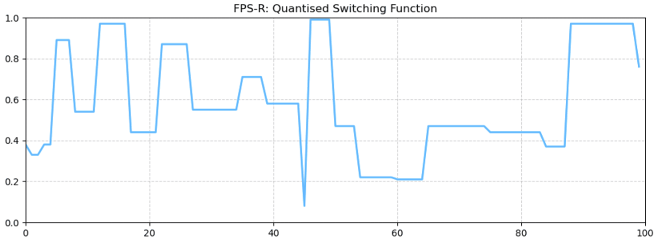

# 🎲 FPS-R Algorithm: Frame-Persistent Stateless Randomisation
MIT License—[see LICENSE](../../LICENSE) for details.  
Copyright (c) 2025 Woo Ker Yang (Patrick Woo) patrickwoo.1976@gmail.com
If you reference or adapt this framework, please credit Patrick Woo and this repository.
**This documentation is still in development.** 
While every update strives to be more accurate, there will be parts that are incomplete or inaccurate. 

# Table of Contents
- [🎲 FPS-R Algorithm: Frame-Persistent Stateless Randomisation](#-fps-r-algorithm-frame-persistent-stateless-randomisation)
- [🗺️ A Site Map of the Documents](#️-a-site-map-of-the-documents)
  - [📜 Readme — Manifesto (English)](#-readme--manifesto-english)
  - [🈸 Readme — 宣言,理念描述 (Chinese)](#-readme--宣言理念描述-chinese)
  - [📐 The Mathematics and Mechanics](#-the-mathematics-and-mechanics)
  - [🍭 Applications](#-applications)
  - [🧬 Origins](#-origins)
  - [📓 Development Journal — The Chronicle](#-development-journal--the-chronicle)
  - [🧠 Thoughts — Reflections and Conceptual Notes](#-thoughts--reflections-and-conceptual-notes)
- [🎲 What is FPS-R?](#-what-is-fps-r)
  - [🪞 Introduction](#-introduction)
- [🎓 Principles and Philosophy](#-principles-and-philosophy)
  - [🧭 Guiding Principle](#-guiding-principle)
  - [🎭 Motion Philosophy](#-motion-philosophy)
  - [📐 Structure and the Illusion of Chaos](#-structure-and-the-illusion-of-chaos)
- [🗣 A New Grammar](#-a-new-grammar)
  - ["Random Move-and-Hold"](#random-move-and-hold)
- [🎞 Sample Uses of the FPS-R](#-sample-uses-of-the-fps-r)
  - [🧭 FPS-R in Animation](#-fps-r-in-animation)
  - [🧱 FPS-R in Geometry Generation](#-fps-r-in-geometry-generation)
  - [⏱️ Visualisation Videos - FPS-R in Action](#️-visualisation-videos---fps-r-in-action)
- [✨ Key Features](#-key-features)
- [🧩 FPS-R in Relationship to a Parent System](#-fps-r-in-relationship-to-a-parent-system)
- [💡 Why Do I Need Another Random Stream Generator?](#-why-do-i-need-another-random-stream-generator)
  - [🧬 The Nature of "Held" Randomness](#-the-nature-of-held-randomness)
  - [🧱 Limitations of Conventional Techniques](#-limitations-of-conventional-techniques)
    - [The Current State of Computation and Calculations](#the-current-state-of-computation-and-calculations)
    - [🧊 1. Spatialised Randomness (e.g. Worley Noise & Distance-Based Fields)](#-1-spatialised-randomness-eg-worley-noise--distance-based-fields)
    - [🔁 2. Stateful behavioural Logic (e.g. Timers, Delays, Pauses, Walks)](#-2-stateful-behavioural-logic-eg-timers-delays-pauses-walks)
  - [⚙️ Why FPS-R is Different](#️-why-fps-r-is-different)
- [❓ Why Not Just Use State?](#-why-not-just-use-state)
- [📊 Explore the Algorithm's Fingerprint](#-explore-the-algorithms-fingerprint)
- [🧬 Flavours of FPS-R](#-flavours-of-fps-r)
  - [🌀 Stacked Modulo (SM) or 叠模机制](#-stacked-modulo-sm-or-叠模机制)
  - [🔁 Toggled Modulo (TM) or 切模机制](#-toggled-modulo-tm-or-切模机制)
  - [✴ Quantised Switching (QS) or 量跃机制](#-quantised-switching-qs-or-量跃机制)
- [🏙 Spatial Extension: From Time to Space](#-spatial-extension-from-time-to-space)
  - [🧬 FPS-R in the Spatial Context](#-fps-r-in-the-spatial-context)
    - [🪡 Topology Wrapping and Surface Application](#-topology-wrapping-and-surface-application)
  - [🌀 Stacked Modulo in Space](#-stacked-modulo-in-space)
  - [🔁 Toggled Modulo in Space](#-toggled-modulo-in-space)
  - [✴ Quantised Switching in Space](#-quantised-switching-in-space)
- [🧠 Nested Modulation: Using FPS-R to Drive FPS-R](#-nested-modulation-using-fps-r-to-drive-fps-r)
  - [🧪 Modulating Introspection](#-modulating-introspection)
- [📈 Meta-Signal Analysis: FPS-R as Observer and Instrument](#-meta-signal-analysis-fps-r-as-observer-and-instrument)
  - [🪞 Common Uses of Signal Mapping](#-common-uses-of-signal-mapping)
- [🧭 Application Paradigms](#-application-paradigms)
  - [🎨 Part I — Generative Expression & Organic Simulation](#-part-i--generative-expression--organic-simulation)
    - [🕶️ AR/VR and Human-Centered Interaction](#️-arvr-and-human-centered-interaction)
    - [🤖 Robotics and Embodied Systems](#-robotics-and-embodied-systems)
    - [🛰 Swarms, Drones, and Spatial Coverage Systems](#-swarms-drones-and-spatial-coverage-systems)
    - [💡 Embedded Systems and Ambient Interfaces](#-embedded-systems-and-ambient-interfaces)
    - [🎼 Domains of Application in Audio and Composition](#-domains-of-application-in-audio-and-composition)
  - [🧪 Part II — Systemic Resilience & Analysis](#-part-ii--systemic-resilience--analysis)
    - [🛡️ Cybersecurity and Adversarial Simulation](#️-cybersecurity-and-adversarial-simulation)
    - [💸 Financial Systems and Economic Simulation](#-financial-systems-and-economic-simulation)
    - [🧪 Software Testing and Fuzzing](#-software-testing-and-fuzzing)
    - [🧵 Systems-Level Protocol & Infrastructure Simulation](#-systems-level-protocol--infrastructure-simulation)
  - [🧠 Part III — Generative Scenario Planning & Speculative Design](#-part-iii--generative-scenario-planning--speculative-design)
    - [⚔️ Game Theory, Politics, and Strategic Modeling](#️-game-theory-politics-and-strategic-modeling)
    - [🧭 Process & Contingency Simulation](#-process--contingency-simulation)
    - [🧠 Cognitive Modeling & Generative Thought](#-cognitive-modeling--generative-thought)
      - [Thought as Temporal Behaviour](#thought-as-temporal-behaviour)
      - [Structured Ambiguity Without Memory](#structured-ambiguity-without-memory)
      - [Dialogue as Timing Logic](#dialogue-as-timing-logic)
      - [Latent Drift and Composed Cognition](#latent-drift-and-composed-cognition)
      - [Tunable Personality and Emergent Creativity](#tunable-personality-and-emergent-creativity)
    - [🕰️ Exploring Plausible Past and Future in Observable Phenomena ](#️-exploring-plausible-past-and-future-in-observable-phenomena)
      - [How the Matching Works](#how-the-matching-works)
      - [What This Unlocks](#what-this-unlocks)
      - [It Goes Beyond Motion](#it-goes-beyond-motion)
      - [Understanding System Readiness](#understanding-system-readiness)
      - [📽️ Implications](#️-implications)
      - [📡 A Real-Time Scenario](#-a-real-time-scenario)
  - [🌐 Closing Thoughts on Usage](#-closing-thoughts-on-usage)
- [🔩 How FPS-R Works (A Gentle Primer)](#-how-fps-r-works-a-gentle-primer)
  - [🎼 Stacked Modulo (SM)](#-stacked-modulo-sm)
  - [✴️ Quantised Switching (QS)](#️-quantised-switching-qs)
- [⚠️ Tiling Note: Seamlessness in Spatial FPS-R](#️-tiling-note-seamlessness-in-spatial-fps-r)
  - [🪡 Techniques for Seam-Aware behaviour](#-techniques-for-seam-aware-behaviour)
- [🚧 Current Status](#-current-status)
- [🗒️ Additional Development Notes](#️-additional-development-notes)
  - [🧠 FPSR Thoughts](#-fpsr-thoughts)
  - [📔 Development Reflections](#-development-reflections)
- [🤝 Contributions](#-contributions)


---

## 🗺️ A Site Map of the Documents

```mermaid
%%{ init: { "theme": "neutral" } }%%
graph TD
  A[**README.md** 🏁<br>Manifesto & Overview] --> A2[Read-Me] 
  A2 --> A3[Technical]
  A2 --> A4[Thoughts, Philosophy,<br>and History]
  C[**README-CH.md** 🈸<br>Manifesto in Chinese] --> A2
  A3 --> B[**Tech.md** 📐<br>Maths & Code]
  A3 --> D[**Applications.md** 🍭<br>Cross-Domain<br>Use Cases]
  A4 --> E[**Dev_Journal.md** 📓<br>Developer's<br>Journal]

  A4 --> F[**Origins.md** 🧬<br>Origin Story] 
  A4 --> G[**Thoughts.md** 🧠<br>Reflections &<br> Conceptual Notes]

  classDef fileStyle fill:#A2A2A2,stroke:#333,stroke-width:1px,color:#000,rx:16,ry:16,font-size:15px;
  classDef techHighlight fill:#799F92,stroke:#444,stroke-width:1.5px,color:#E8E8E8,rx:16,ry:16,font-size:15px,font-style:italic;
  classDef thoughtsHighlight fill:#AFA279,stroke:#444,stroke-width:1.5px,color:#E8E8E8,rx:16,ry:16,font-size:15px,font-style:italic;
  

  class A,C,A2,A3 fileStyle
  class B,D,A3 techHighlight
  class A4,E,F,G thoughtsHighlight
  ``` 

### 📜 Readme — Manifesto (English)
**You are here**. This is the primary document. It presents FPS-R as both a motion grammar and a collection of expressive tools, and serves as a lens through which to understand not only how FPS-R functions, but also why it evokes the qualities it does.

### 🈸 Readme — 宣言,理念描述 (Chinese)
[Click here: 自述文件 — 中文版 (README-CH.md)](README-CH.md)
The Chinese edition of the manifesto, presenting the philosophical and expressive foundation of FPS-R in Mandarin.

### 📐 The Mathematics and Mechanics
[Click here: FPSR_Tech.md](resources/readme/FPSR_Tech.md)
This extension document provides the structural foundation beneath the conceptual framing. It outlines the algorithms, expressions, parameters, and architectural elements that support and shape the behaviour of FPS-R. **_The code lives here._**

### 🍭 Applications 
[Click here: FPSR_Applications.md](resources/readme/FPSR_Applications.md)
This document complements and extends the applications of FPS-R beyond the high-level summarised view provided in this ReadMe file. The document will dig deeper into each domain and provide larger number of use cases for each area of use. 

### 🧬 Origins
[Click here: FPSR_Origins.md](resources/readme/FPSR_Origins.md)
This is the history and the story of FPS-R. It recounts the events that led to the discovery of each algorithm, and tells about the persistent pursue of the language of motion, about discovering meaning and refining the mechanics behind move and hold. It will also tell how each algorithm revealed itself, and how they come together to form the FPS-R framework. 

### 📓 Development Journal — The Chronicle
[Click here: FPSR_Dev_Journal.md](resources/readme/FPSR_Dev_Journal.md)
A chronological account and living notebook of the research and design process. It records breakthroughs, failures, struggles, and revisions, offering insight into the iterative development that shaped the current implementation of FPS-R. 

### 🧠 Thoughts — Reflections and Conceptual Notes
[Click here: FPSR_Thoughts.md](resources/readme/FPSR_Thoughts.md)
An archive of nonlinear reflections, theoretical digressions, and design meditations that contributed to the philosophical development of FPS-R. This document functions as a conceptual incubator and critical sketchpad, recording my internal struggles and conflicts. It also provides the philosophical and poetic dimensions of FPS-R's evolution—where structure meets sensation, and randomness finds rhythm.

---

## 🎲 What is FPS-R?
**_Stateless unpredictability with a structured soul._**

**FPS-R** a domain-agnostic modulation framework, a signal phrasing grammar that expresses a motion archetype I call **"Random Move-and-Hold."**  
This framework operates across time, space, and cognition when applied in the fields related to intelligence.

### 🪞 Introduction

**FPS-R** stands for **`Frame-Persistent Stateless Randomisation`** (or **`静态律动算法`** in Chinese). 
FPS-R is a grammar and philosophy of motion born from a simple observation: in nature, human interaction and organisational behaviour, randomness is rarely pure noise. It has rhythm, it hesitates, it holds, and it jumps. It feels structured.

This philosophy has been distilled into a set of lightweight, universal mathematical algorithms. These have been further developed into a framework of expressions and functions that are simple, portable, and can be easily adapted into a wide variety of languages (C, Python, VEX, GLSL), running on countless platforms, for an even larger number of applications.

Inspired by these natural behaviours, FPS-R produces structured unpredictability. It describes natural behaviours such as human eye saccades (shifting and darting around), animal foraging, human hesitation, predatory stalking. It mirrors the rhythm of an explorer's torch in a darkened cave—pausing, twitching, drifting with intent—or the room-clearing maneuver of a soldier's rifle: moving and holding from one strategic point to another, with every new position disjointed from the last.

I call it **the Random Move and Hold.**

> _**FPS-R is a manipulator of values over time, sculpting values and temporal behaviour**_

At its core, FPS-R is defined by three unique strengths:
- **Stateless:** In computing, a "stateful" system needs memory of past events to decide its next action. **FPS-R is stateless**—it requires zero memory of the previous frame. Its behaviour is calculated fresh every time, making it incredibly robust, efficient, and portable.
- **Deterministic:** An algorithm is "deterministic" if the same input always produces the exact same output. FPS-R is fully deterministic, which is critical for reproducible results. You can scrub to any point in time and be 100% certain the output will be identical, every single time. This provides ultimate artistic control and simplifies debugging. With this deterministic nature, we can _extend the timeline indefinitely_ and _get a deterministic past and future_. This opens up _traceable futures and pasts_, which is great for analytical patterns and diagnostic footprints when used to test systems with vulnerabilities and studies on unpredictability.
- **Organic & Tweakable:** Despite its mathematical precision, the framework is designed to be highly expressive. By tweaking a few core parameters, its output can be sculpted to match a wide variety of observable emotions and intentions—from the nervous, high-frequency twitch of an alert creature to the slow, deliberate hesitation of thought.

This framework is not just for motion over time. FPS-R can be applied to any continuous, time-like axis, including spatial coordinates. This means it can be used to sculpt forms and generate geometry, turning its temporal rhythms into physical patterns. Extending further, it can operate in latent and cognitive spaces, contributing to naturalistic AI processes that enable more human-like traits such as focus drift, attention shifts, and even directed, creative "daydreaming."

> _**FPS-R is not just a motion language—it is a dialect of form and thought.**_

Ultimately, FPS-R is a collaborator. It can be allowed to roam free for total, wild unpredictability, or it can be given clear boundaries to inject a rich, organic texture into otherwise predictable systems.

---
### 🎓 Principles and Philosophy
---

### 🧭 Guiding Principle
"FPS-R isn't a single algorithm. It's a design philosophy for *shaping signals*. Whether by arithmetic folding or signal quantisation — whether in time or space — the goal is the same: give structure permission to behave."

### 🎭 Motion Philosophy
**FPS-R simulates the unpredictability of hesitation — yet within the same framework, it can just as easily express instinct.**  

FPS-R algorithms do not switch modes—they **sculpt time**. Each algorithm is able to express a wide gamut of behaviour, from **quick holding twitches and ticks** to **long and slow deliberate holds** that take their own unpredictable time. All these can be achieved by any one of the FPS-R algorithms, with correct settings in their parameters. But the only variable input they really need is just time (in frames).

- When its temporal holds are short, it expresses *impulse*: quick changes that feel twitchy, clipped, or alert.  
- With longer holding durations, it evokes *hesitation*: thoughtful pauses, lingering states, the illusion of deliberation.

The values may appear to be random, but *when* they appear is guided by time (the frame count) itself—producing a rhythm that feels intentional, even without memory. Both values and timing of jumps are totally deterministic.

What emerges is not chaos, but *temporal behaviour shaped by structure*.

> 🧒 **This rhythm echoes freeze-tag games across cultures** —
> **"A-E-I-O-U!"** in Singapore, **"1, 2, 3 Soleil!"** in France, or **"Statues"** in Greece.  
> **"무궁화 꽃이 피었습니다"** in Korea, **"木头人" in Chinese cultures**,  
> **"Grandmother's Footsteps"** in the UK, **"Red Light, Green Light"** in the U.S.  
> Each moment of stillness feels impulsive yet structured —  
> a hidden choreography of burst and restraint.

> 🧠 **Teaching Note: "No-sim is the best sim."**  
> In teaching Houdini—which is famed for simulation—I often remind students that building a procedural system without frame-to-frame dependencies is often superior to relying on complex simulations.  
> The most elegant systems allow each frame to stand alone—yet somehow feel like they remember the past.

### 📐 Structure and the Illusion of Chaos
FPS-R may appear to drift chaotically, but beneath its phrased irregularity lies a strictly deterministic core. Its behaviour unfolds through **modulation operators** — composable mathematical expressions like `mod()` and `rand()` — applied across domains such as time, space, and input streams. These operators form the expressive substrate of FPS-R’s logic.

What results isn’t raw randomness — it’s **structured modulation**. Each jump, each hold, each reseed arises from the friction between layered rhythms and offset reseeds, not from entropy. Temporal phrasing emerges where cycles misalign just enough to simulate spontaneity.

In this sense, FPS-R doesn’t simulate behaviour; it **orchestrates interference**. SM and QS aren't mere techniques — they are **procedural grammar primitives**, each governing a different expressive dimension:
- **SM (Stacked Modulo)** phrases values through layered cyclic constraints
- **QS (Quantised Switching)** modulates selection behaviour and categorical drift

Together, these operators form a framework for engineered emergence: where each state transition is mathematically traceable, yet aesthetically untraceable.

No memory is used, and yet the behaviour feels reflective. No stochastic noise is added, and yet it flickers, hesitates, and breathes.

> *💡 Chaos is not the source — it is the surface. What you see is phrasing. What drives it is structure.*  

This tension—between definition and drift—is not a flaw. It's the expressive core of FPS-R.

---

## 🗣 A New Grammar: 
FPS-R introduces not just a new set of algorithms, but a new *lexicon* for motion.  

### "Random Move-and-Hold"
What FPS-R produces is not a filter or a curve — but a compositional structure:  
**jump → hold → reseed → repeat**  

```mermaid
graph LR
  A[**Jump**]:::darkBrown --> B[**Hold**]:::darkYellow 
  B --> C[**Reseed**]:::darkRed --> D[**Repeat**]:::red

classDef darkBrown fill:#654321,stroke:#553311,stroke-width:3px,rx:10,ry:10;

classDef darkYellow fill:#B8860B,stroke:#986609,stroke-width:3px,rx:10,ry:10;

classDef darkRed fill:#8B0000,stroke:#5B0000,stroke-width:3px,rx:10,ry:10;

classDef red fill:#FF0000,stroke:#AA0000,stroke-width:3px,rx:10,ry:10;
```

I call this behaviour **Random Move-and-Hold**.  

It captures the quality of twitch, of deliberation, of pauses that feel like thought.

---
## 🎞 Sample Uses of the FPS-R

### 🧭 FPS-R in Animation

  
*Eye saccades or darting behaviour in Houdini — Single Eyeball Look Straight Ahead with Saccades*🕰️

  
*Saccades layered on top of object tracking in Houdini — Double Eyeballs Look at a Moving Box with Layered FPS-R Saccades*  

_[Eyeball model](#https://sketchfab.com/3d-models/simple-stylised-eye-c26043a12a32447f99f45ac84b4fb570) courtesy of [rosytoonz](#https://sketchfab.com/rosytoonz)._

### 🧱 FPS-R in Geometry Generation


### ⏱️ Visualisation Videos - FPS-R in Action
Here is a collection of visualisations showing how FPS-R can work within larger systems in different contexts to achieve meaningful behaviour. Mostly created in Houdini, posted on YouTube as videos, and as articles on LinkedIn.

[LinkedIn Article: FPS-R Test: Rat Movement Demo](https://www.linkedin.com/pulse/fps-r-test-rat-movement-demo-patrick-woo-ker-yang-i7foc)
[YouTube - Rat Demo](https://youtu.be/ZHUvv6YxjKw)


[LinkedIn Article: The Straight Line and the Crooked Path: FPS-R, A New Model for Simulating Reality](https://www.linkedin.com/pulse/straight-line-crooked-path-fps-r-new-model-simulating-woo-ker-yang-ha9rc)
[YouTube - FPS-R as a Moving Target on Swarm](https://youtu.be/uQ7krluFvic)


---

## ✨ Key Features

- Frame-anchored **repeatability** without storing state  
- Tunable **chaos profiles** with modular curve sculpting  
- Compatible with stateless shaders, simulation loops, and real-time systems  
- Ideal for generating behaviour systems that feels **alive**, not algorithmic

---
## 🧩 FPS-R in Relationship to a Parent System
FPS-R is modulation without mandate — it shapes expression, but does not command purpose. Left ungoverned, it phrases freely: drifting, pivoting, zigzagging through move-and-hold rhythms that evoke instinct and surprise. Yet in most systems, **purpose is present** — directing the gesture of a virtual character, a to make a robotic or prosthetic limb feel more natural with micro movements present in humans, or to guide a the focus of an artificial intelligence system.

That’s where FPS-R becomes a collaborator. It doesn’t choose the destination — it **inflects the journey**.

Think of FPS-R not as a planner, but as a phrasing engine. A heart doesn’t decide where blood flows — but without the beating action, circulation cannot happen. In this analogy, the parent system supplies structure, intent, and context:
- Defining where phrasing belongs (a joint, a voice, a surface)
- Specifying how much deviation feels organic
- Choosing when to modulate and let FPS-R roam, and when to hold still to minimise the contribution of FPS-R to the final result.
FPS-R can be **leashed or liberated** — gated behind reactive logic, or given full autonomy to compose expressive variation. But always, it remains **deterministic, stateless, and repeatable** — a grammar of rhythm that serves systems with meaning.

---
## 💡 Why Do I Need Another Random Stream Generator?

### 🔍 *A Lexicon Gap, Hidden in Plain Sight*

**FPS-R** is not just a random stream generator — it’s a **language** for articulating the *elusive behaviour* of random moving and holding.  

The fact that this article devotes so much effort to **illustrating**, **contextualizing**, and **visualizing** examples is itself proof of a *quiet gap* in our expressive vocabulary:  
we often observe *naturally occurring randomness* that *feels structured*,  
yet lack the **vocabulary** and **tools** to describe it faithfully.  

**FPS-R** proposes a *phrasing architecture* to address that void —  
not by replacing existing algorithms, but by offering a **grammar** to sculpt what’s always been there, *waiting to be named*.

And that is...

🎛️ *In the language of math and algorithm*:  
**FPS-R (Frame-Persistent Stateless Randomisation)**

🗣️ *In everyday spoken English*:  
**Random Move and Hold**

---

### 🧬 *The Nature of "Held" Randomness*

In both natural and artificial systems, randomness is *rarely pure noise* —  
it often *lingers*, *persists*, or *evolves* in a way that feels **intentional**.  
Whether it's the *shimmer of dappled light*, the *jitter of analogue machinery*,  
or the *twitchy searching* of eye saccades,  
we encounter random behaviours that *hold their shape* or *drift over time*.

Yet despite how ubiquitous this phenomenon is, most content creation tools are *ill-equipped* to simulate, emulate and represent it in an **intuitively straightforward** and **lightweight** manner.  

Replicating this structured unpredictability often requires *labour-intensive custom coding* or *non-intuitive workarounds*.


> ✒️ Metaphor Note: *The FPS-R system is like a public pen at the post office.*  
> People come and go: one picks it up, another leaves it askew, sometimes no one touches it for hours.  
> Each interaction changes its orientation, position, or status—but never with memory.  
> Yet from a time-lapse sped-up video review, it appears to dance with intention.


<br>
<p align="center">
  
  
  
</p>


### 🧱 Limitations of Conventional Techniques
#### The Current State of Computation and Calculations
Most computational systems are wired for one principle: _efficiency_. From shortest-path solvers to rendering pipelines, the default trajectory is straight, steady, and economical. Time, space, value—they're meant to increment steadily, predictably, toward a desired state. This is the grammar of most algorithms: fewer steps, straighter lines, minimal deviation.

To simulate natural behaviour—pause, drift, delay—we layer complexity upon complexity: recursive pathfinding, Perlin-turbulence on top of sine waves, obstacle-based path deformation, stateful random jumps. These additions mimic real-world unpredictability, but they do so by **fighting the system's fundamental bias toward order**. Complexity becomes the price of feeling organic. Results that act and feel natural come at the cost of additional computation on top of straight paths.

**FPS-R flips this tendency around**. It starts with modulation. It phrases. From the beginning, it wants to jump and drift, it wants to wait and hold, and it wants move forward only to delay and perhaps come back on itself. And yet, paradoxically, it remains **stateless, deterministic, lightweight**. Rather than accumulating structure to simulate spontaneity, FPS-R embodies and expresses irregularity even as its default form.

> And if richer behaviour is required? FPS-R can still be stacked with conventional noise, physics, or reactive inputs—composing layered systems that maintain their phrasing logic even in deeper entanglements.

> 🧩 FPS-R is a phrasing engine, not a planner.
Works _with_ your system. Not to replace it.

When systems attempt to simulate phrased irregularity—deviation, hesitation, unpredictability—they often reach for one of two broad approaches. Both are useful. Both are limited. And neither offers phrasing as its native dialect.

##### 🧊 1. Spatialised Randomness (e.g. Worley Noise & Distance-Based Fields)
These techniques rely on pre-seeded feature points—often jittered grids or hashed distributions—and compute behaviour by measuring distance to these anchors. Worley noise, Voronoi fields, and similar cellular approaches are powerful for generating structured randomness across surfaces.

But their strengths are their constraints:
- Uniform seed distributions lead to uniform phrasing patterns
- Modifications require cost-heavy operations (distance calculations, re-indexing)
- Expressiveness is bounded by spatial regularity, not temporal rhythm
- And control often means fighting the function, not collaborating with it

This makes them excellent for texture, weak for time.

##### 🔁 2. Stateful behavioural Logic (e.g. Timers, Delays, Pauses, Walks)
To generate deviation in motion or behaviour, developers often build state machines or custom update loops that track progress over time. These accumulate logic as layers of interrupts against straight-line behaviour. The goal: produce a sense of intent through delay, error, or noise.

This family is broad. But its footprint is heavy.
🌀 Signal Distortion and Perturbation
- Random noise injection to modulate path or output jitter
- Random walks to simulate directionless deviation
- Sinusoidal overlays and Bezier oscillations for smooth wiggles

⏱ Holding, Delaying, and Interrupting
- Variable speed logic that simulates drift, fatigue, or lag
- Step functions, staircase patterns, and random delays for hold-and-burst effects
- Zigzag alternation for enforced directional instability

🛣️ Path Complexity via Indirect Algorithms
- Pathfinding (A, Dijkstra)* to intentionally reroute around obstacles
- Dynamic heuristics that distort toward longer routes
- Redirect forces (attraction/repulsion, magnet fields) that bias local curvature

🌪️ Contextual Inputs and Reactive Systems
- User input deviations, causing behaviour to “wobble” under influence
- Environment simulation (wind, terrain, gravity) to trigger plausible sway
- Feedback loops that adjust based on previous moves—embedded memory disguised as logic

These approaches _can_ work. Many do. But they share four liabilities:
1. They assume memory
2. They demand scaffolding
3. They are rarely portable
4. They are neither composable nor phrased

---
### ⚙️ Why FPS-R is Different

Where most systems create irregularity by layering complexity onto predictable logic, FPS-R begins with modulation. It doesn’t simulate drift—it phrases it. And unlike traditional methods that rely on accumulated state, scaffolded logic, or seeded lookup tables, FPS-R distills expressive behaviour into a **single, frame-aware grammar**.

Its modulation is clean, deterministic, and portable—expressing structured spontaneity without state.

Key advantages include:

- ✅ **Truly Stateless**: FPS-R does not rely on previous-frame data or persistent memory buffers  
- **🔒 Fully Deterministic**: With the same inputs, FPS-R always produces the same outputs—no entropy, no surprises
- 🧠 **Compact & Readable**: The SM expression can be written in a single line using `$F` in Houdini expressions or `@Frame` in VEX  
- 🛠️ **Platform Agnostic**: Works seamlessly in any environment that exposes frame-based context  
- ⚡ **Performance Friendly**: No costly distance functions, hash lookups, or scatter generation

> 🪞 Most modulation systems simulate intent by scaffolding state. **FPS-R phrases intent by design—and does so without memory**.

That’s why FPS-R can:
- Replace brittle scaffolding with composable phrasing logic
- Operate cleanly in shaders, expressions, and parallel domains
- Stack with traditional techniques when needed—without collapsing determinism

> The world of simulation builds structure to allow drift. FPS-R starts in drift—and phrases structure into it.

> 🧩 Deterministic Complexity
> Where intricate behaviour emerges from repeatable rules, not randomness.

---
## ❓ Why Not Just Use State?
In a **stateful** system, behaviour depends on remembering what happened before—like a dancer who needs to recall their last step before taking the next. A **stateless** system, like FPS-R, behaviour is calculated fresh every time, based on inputs like time, position, or **pattern—no memory, no history, just clean response.**

Before FPS-R, developers often implemented behaviour modulation using **ad hoc stateful logic**—tracking frame counters, timers, or conditional gates to "hold" a value or trigger a change. You’ve probably coded this already: hold a value, flip a coin to jump or to continue holding, then repeat. It works. These methods are effective in simple contexts. But they are rooted in state, scaffolding, and context-specific logic. They fragment. They proliferate. And most importantly—they don’t scale across time, space, and systems.

In a spatial context, a stateful method is path-dependent; to find the value at any given point, it must sequentially simulate the entire history of steps from the origin. This "run-up" process makes it computationally impractical for applications like shaders or procedural geometry that require instant, random access. In contrast, a stateless system like FPS-R provides this random access, evaluating any point directly in a single step. Furthermore, while a stateful pattern is unpredictably tied to its simulation step size, FPS-R's equivalent scale is a controllable, global parameter, ensuring predictable and efficient results.

**So why does FPS-R exist?**  

FPS-R doesn’t replace stateful methods—it transcends it.  

Because beyond simple systems lie a world of **stateless surfaces**, **reproducible timelines**, and **modular behaviours** that demand more than scattered logic and local memory. That’s where traditional state falters—and where FPS-R begins.

**Why Traditional State Falls Short**
**🧳 State Doesn’t Travel** Your hold/reseed-jump loop works in a script—but it relies on persistent memory. That loop breaks in shaders, in stateless expression fields, in stream processors, GPU pipelines—anywhere **state doesn’t persist**. FPS-R? Stateless by design. It runs wherever functions do: in time, in space, in parallel.

**🧠 No Forensic Trail** Once a stateful loop has run, its past is a blur of overwritten variables. A crash at frame 58200? Good luck explaining why your held value jumped — most state-driven systems leave no traceable path.

FPS-R, by contrast, is a glass box:
- It’s fully deterministic
- Built on stateless, inspectable math
- Transparent by design, not by accident

Every value it produces is derived from visible, reproducible inputs — frame, seed, pattern — not hidden buffers or accumulated memory. There’s no fog of history, no mystery behaviour, no black-box opacity. Every phrased moment can be **reconstructed**, **explained**, and **replayed** from a single formula.

FPS-R doesn’t obscure logic — it **exposes** it. It’s not just a modulation engine — **it’s a procedural timeline you can rewind, inspect, and narrate**.

**🌌 Time-Bound, Not Domain-Agnostic** Stateful loops are temporal by nature. They work on a clock. Try to modulate a surface, a gesture velocity, or a gaze field—**time-only logic fractures**. FPS-R works across **domain inputs**. Any scalar, vector, or multidimensional stream can become a behaviour substrate.

**🧭 Hard to Compose** Integrating multiple stateful modulators is brittle. FPS-R can be encapsulated into "capsules" that are modular, chainable, and named. They compose cleanly—stackable, layerable, with expressive guarantees. With input parameters, you describe intent—hesitate, glide, surprise—and the capsule knows how to phrase it.

**💡 The Real Difference**
FPS-R doesn’t scaffold behaviour through memory or timers—it composes it directly, using deterministic randomness and stateless modulation. With reproducibility by design and support for spatial and temporal domains, it acts not just as a method but as a grammar: one that encodes drift, hesitation, and surprise across surfaces, systems, and synthetic agents.

> Traditional state holds behaviour in place. **FPS-R lets behaviour move—across systems, across domains, across minds.**

---
## 📊 Explore the Algorithm's Fingerprint
The FPS-R algorithms produce a unique rhythmic "fingerprint" over time. The animated preview below shows the scrollable timeline graph from the included Jupyter Notebook, which allows you to explore this behaviour visually.

 
FPS-R: Stacked Modulo Timeline Graph Preview

 
FPS-R: Toggled Modulo Timeline Graph Preview


FPS-R: Quantised Switching Timeline Graph Preview

To try it yourself, you can [explore the interactive timeline in a Jupyter notebook on `nbviewer`](https://nbviewer.org/github/patwooky/FPSR_Algorithm/blob/main/resources/code/python/fpsr_algorithms.ipynb)
The interactive scrolling graphs are the last 2 cells at the end of the notebook.

> Note: Jupyter notebooks render only as static content on GitHub's web viewer. Interactive scrolling graphs for SM and QS will not show up. If you want to play around with the parameters and drive a different resulting curve, and inspect the scrolling graphs, please feel free to download the notebook and execute it on your local machine runnning Jupyter notebook on a `Python 3.x` kernel with the relevant dependencies (`Pandas` and `Matplotlib`). 

---
## 🧬 Flavours of FPS-R
FPS-R comprises two distinct mathematical algorithms — each offering a stateless, deterministic approach to phrased modulation:
- 🌀 Stacked Modulo (SM)
- 🔁 Toggled Modulo (TM)
- ✴ Quantised Switching (QS)

These form the primary **modulation operators** within the FPS-R framework, usable independently or composable into parallel blends and chained sequences. Together, they shape the expressive grammar of _randomised move-and-hold_ behaviour — tuned, layered, and always reproducible.

### 🌀 Stacked Modulo (SM) or 叠模机制
The original FPS-R operator. SM constructs motion through layered modulus functions with shifting offsets — producing transitions that feel spontaneous, yet arise from strict deterministic interference.  

The signature feel of the SM algorithm comes from its "stacked" or nested rhythmic structure. It's an interference pattern created by two different clocks running at the same time.
- **Expressive feel**: memory without memory
- **Phrasing shaped by**: frequency, amplitude, offset phase
- **Strengths**: highly composable, compact implementation

> **SM gives the most natural and organic expression** of the Random Move and Hold phenomenon.

**SM Features:**
- Adjustable upper bound for values hold duration  
- Adjustable lower bound influences the minimum possible hold duration between jumps.
- Stateless modulation via `rand()` and `mod()` using current frame 
- Encodable as single-line expressions in toolkits like Houdini, VEX, GLSL

---
### 🔁 Toggled Modulo (TM) or 切模机制
TM modulates hold durations by toggling between two predefined time periods, producing rhythmic variation without introducing random noise. It retains the stateless determinism of FPS-R, but with explicit and controllable alternation — a midpoint between SM’s nested unpredictability and QS’s stream swapping.

Where SM reshapes time using internal modulation and QS switches outputs across streams, TM adjusts duration logic itself — controlling the pace of phrased persistence through toggled timing.

> Switching between the two configurable fixed-value cycle durations, while still organically and deterministically "unpredictable", **TM gives the most consistent and structured output pacing**  compared to SM and QS. There is a sense of mechanical stability underpinning the structure of unpredictability.

**TM Features:**
- Stateless and structured cadence modulation via conditional selection between `periodA` and `periodB` resulting in discrete tempo shifts
- Nested modulo structure similar to SM, but with deterministic switching logic
- Offers a "gear-switch" model of phrased modulation — alternating between two rhythm profiles
- Efficient and compact implementation, ideal for intentional timing control, offering high controllability

---

### ✴ Quantised Switching (QS) or 量跃机制
Quantised Switching (QS) generates two independently modulated signal streams from sine-based functions, each quantised to a randomly selected level within a defined range. These quantisation levels are refreshed deterministically on separate timing cycles, with configurable durations and offsets per stream. A switching mechanism alternates between the streams, and the compound interplay between quantisation, reseed cycles, and switching cadence drives the final output.

This behaviour is inherently more volatile than SM's and TM's, as a change in any of its layered rhythms can trigger a jump in the final output. 

> QS is the most _"lively"_ and _"active"_ of the FPS-R algorithms. It only holds its random value when all the individual time cycles fall within their modulo periods. **QS wants to glitch and jump**.

**QS Features:**
- Deterministic pseudo-random stream selection
- Supports custom value banks and indexed behaviours. _The default sine wave engine that generates for each stream can be swapped out_ for any other periodic or non periodic signal generators or purely a supplied look-up table of values that cycle and repeat over time.
- Optional quantisation for stepped or smooth interpolation
- Configurable switching cadence with controlled reseed logic

---
## 🏙 Spatial Extension: From Time to Space

**FPS-R doesn’t just animate motion—it builds form.** By substituting temporal input ($F, @Frame) with spatial coordinates (x, y, uv, position), FPS-R algorithms become surface-shaping operators: capable of driving heightfields, silhouette generation, panel logic, and procedural texturing. Each algorithm expresses its phrased modulation logic across spatial domains—ideal for modeling, tiling, and stylised segmentation.

### 🧬 FPS-R in the Spatial Context

- **1D → 2D Profiles** Apply FPS-R(x) along the horizontal axis:  
  - Creates rhythmic jump-hold outlines, ideal for skyline profiles and barcode motifs
  - Stylised segmentation for generative wall facades or abstract reliefs

- **2D → 3D Extrusions** Evaluate FPS-R(x, y) as displacement or extrusion drivers:  
  - Useful for terrain, mechanical greebles, or grid-based paneling
  - Pairs well with subdivision, beveling, and height masking workflows

#### 🪡 Topology Wrapping and Surface Application
FPS-R isn’t limited to flat grids or linear mappings. When evaluated over spatial coordinates like normals, UV shells, or surface position vectors, its stateless and deterministic nature makes it compatible with complex topology.
- Suitable for driving displacement along undulating normals, producing natural surface variation
- Effective on curved or organic meshes, enhancing non-planar geometry without artefacts
- Can be mapped across UV domains, enabling coordinated modulation of texture, color, or surface features

> FPS-R’s phrased logic transfers smoothly to surface behavior—enabling modulation on curved geometry without relying on periodic tiling. Edge blending, mirroring, or domain conditioning may be used for controlled repetition where needed.

<br>
<p align="center">
  
  
</p>

### 🌀 Stacked Modulo in Space
SM generates nested interference from layered clocks—ideal for architectural repetition, facade tiling, and rhythmic modulation in detail density.
- Use fpsr_sm(x, y) to control extrusion cadence, surface pattern pacing, or nested grain
- Vary input periods to layer slow vs fast modulation effects
- Enables compression of complex rhythmic behaviour into compact expressions

### 🔁 Toggled Modulo in Space
TM introduces structured rhythm via toggled durations—useful for spatial alternation of components, extrusion heights, or element spacing.
- Apply fpsr_tm(x, y) to alternate modulation profiles along rows or grid bands
- Tune `periodA` and `periodB` for binary rhythm control
- Useful for layouts where predictable but non-uniform repetition is desired

### ✴ Quantised Switching in Space
QS functions as a stream selector across space—switching between signal banks, texture generators, or quantisation modes based on coordinate rhythm.
- Modulate sine-derived patterns, or completely replace them with any signal generator or lookup-table using fpsr_qs(x, y)
- Stream 1 and 2 run independent frequency and quantisation cycles
- Switch logic adds structured unpredictability via offset cadence
- Ability to turn off quantisation to expose switched continuous from underlying signal streams  
- Ideal for glitch-art surfaces, mixed tiling, and volatile material zones

> "Just as QS modulates time by switching behavioural regimes, it can modulate space by switching surface logic—turning texture banks or heightmap engines on and off with structured unpredictability."

---
## 🧠 Nested Modulation: Using FPS-R to Drive FPS-R
FPS-R algorithms can be used as inputs to other FPS-R functions, creating layered modulation—where one phrasing signal controls or reshapes another. This allows for multi-level behaviour in a single system, without needing external state or complex dependency chains.

Common uses include:
- **Multi-scale phrasing**: Use a slow-varying FPS-R to shape the parameters (e.g., hold durations or frequency) of a faster stream—creating macro/micro motion contrast.
- **Zone-based behaviour**: Modulate output based on spatial location or time region—e.g., different phrasing styles in different parts of a mesh or timeline.
- **Algorithm switching**: One FPS-R output can control which algorithm variant (SM, TM, QS) is active—resulting in dynamic logic transitions.

This nesting doesn’t break statelessness—it preserves it. Each output is still deterministic, but the control logic becomes more expressive. Instead of flat randomness, you get structured variation driven entirely by compact expression layers.

<P align="center">
  
</P>

### 🧪 Modulating Introspection
FPS-R streams can be used not only for output generation, but for **self-monitoring and diagnostic feedback**. This means a modulation signal can expose internal timing, phrasing decisions, or regime shifts—making it useful for adaptation, analysis, or visualization.

Possible applications:
- **Debug overlays**: Use phrasing signals to trigger visual markers or annotations during modulation events.
- **Adaptive logic**: Drive parameter tuning based on phrasing behaviour—e.g., increase resolution during steady states, reduce complexity during bursts.
- **Behaviour tracing**: Record phrasing signatures over time or across space for later analysis.

Example: In a cognitive system, one FPS-R stream modulates visible behavior, while another monitors phrasing structure—revealing when a modulation shift occurs, how long holds persist, or when a behavioural loop emerges. This can produce introspection signals that explain the _why_ behind modulation, not just the _what_.

<P align="center">   </P>

---
## 📈 Meta-Signal Analysis: FPS-R as Observer and Instrument

FPS-R doesn’t just generate phrased signals — it also makes it possible to study and interpret them. By turning phrased outputs into shapes, graphs, or surface features, FPS-R exposes the structure of its own modulation patterns. This helps users understand timing, variation, and layered behaviour.

Key patterns that become visible include:
- **Phrasing cadence**: Regular or irregular spacing of holds and jumps, often appearing as step-shaped or skyline profiles
- **Modulation style**: Clear visual signatures of twitching, drifting, or pulsing behaviour
- **Nested structure**: Layered phrasing zones where modulation density shifts — either from recursive input or algorithm switching

Because FPS-R is stateless and deterministic, these outputs are consistent every time. That makes them ideal for debugging, classification, or teaching — especially when visual feedback reveals why a pattern behaves the way it does.

> When a phrasing signal is plotted across time or space, it becomes not just output — but insight. A rhythm that can be analysed, reused, or named.

### 🪞 Common Uses of Signal Mapping
- Teaching how phrased modulation works — including signature types
- Diagnosing unexpected phrasing or debugging transitions between states
- Creating reusable glyphs or tags to identify modulation types
- Feeding modulation profiles into feedback loops or other systems

Signal mapping makes FPS-R not only a generator of behaviour, but also a way to describe and reuse it.

> 🧠 The signal itself becomes a record — encoding phrasing behaviour through deterministic structure, not saved state.

---
## 🧭 Application Paradigms
FPS-R is a modulation engine that adds phrasing to behavior. It doesn’t make decisions — it shapes how those decisions play out.

In larger systems that define intent — whether it’s to look, move, signal, or wait — FPS-R handles the expressive timing. Planners, inference engines, and control logic decide what should happen and why. FPS-R determines how it happens.

Its key contribution is **behavioural unfolding**: stateless, deterministic phrasing that feels intentional without introducing randomness. It doesn’t generate chaos or improvise — it adds structure, rhythm, and nuance to existing plans.

> FPS-R doesn’t lead the system. It makes the output feel deliberate.

Rather than organizing FPS-R by industries like animation, robotics, or interaction design, we can describe its expressive range through **three integration patterns**. Each highlights a different way phrasing can support a system’s goals.

FPS-R doesn’t replace decision-making logic — it works alongside it. When a larger system defines what to do, FPS-R defines how that action unfolds over time or space.

These three paradigms show how phrasing can:
- **Simulate naturalistic behaviour** — making outputs feel lifelike or varied
- **Stress-test system robustness** — revealing failure points or brittle timing
- **Explore controlled ambiguity** — using phrasing to discover unexpected paths or emergent states

Where a system brings purpose, FPS-R adds timing, rhythm, and modulation — making even simple decisions feel intentional and expressive.

> These paradigms aren’t just use cases. They reflect design choices in how phrasing can serve clarity, resilience, or exploration.

### 🎨 Part I — Generative Expression & Organic Simulation
**FPS-R as a composer of lifelike timing and motion.**

This paradigm focuses on using FPS-R to make synthetic systems feel more natural. Instead of looping animations or hardcoded delays, FPS-R produces patterns that change over time without chaos. The result is behaviour that appears intentional but isn’t repetitive.

Systems that benefit from this include those dealing with attention, motion, feedback, or signaling—especially when variation helps maintain realism or avoid mechanical output

> In these cases, phrasing isn’t decoration — it’s what gives behaviour its expressiveness and timing.

#### 🕶️ AR/VR and Human-Centered Interaction
FPS-R helps make avatars and user interfaces behave more naturally by adding small, structured timing variations to gaze, motion, and feedback. These phrasing patterns simulate attention drift, subtle delays, and non-repetitive reactions—enhancing realism and immersion.

It’s especially useful in accessibility testing, human modeling, and mixed-reality environments where predictable but expressive behaviour improves the sense of presence.

#### 🤖 Robotics and Embodied Systems
In robotics, FPS-R creates motion patterns that feel intentional but don’t repeat. It can drive idle movement, small gestures, or gaze shifts that show awareness, hesitation, or readiness—without complex logic or stored state.

This improves human-robot interaction, supports adaptive control, and helps machines signal responsiveness in a way that feels believable and readable.

#### 🧤 Wearables and Assistive Technologies
FPS-R adds subtle timing to prosthetics, exosuits, and haptic systems—making automated motion feel less mechanical and more human. By introducing quiet variation in phrasing, it improves the sense of embodiment for users and creates more intuitive feedback for others interacting with the device.

This modulation helps restore dignity through expressive movement, improves social acceptance of assistive tools, and supports personalization without increasing system complexity.

#### 🧬 Biofeedback and Adaptive Expression
FPS-R translates internal signals—like heart rate or breath—into phrased output that guides or calms without looping or erratic changes. Whether driving light patterns, tactile feedback, or ambient cues, its modulation reflects physiological shifts in a subtle and readable way.

Because phrasing evolves without needing historical data, feedback feels responsive but not reactive—useful for wellness, meditation, and supportive interfaces.

#### 🛰 Swarms, Drones, and Spatial Coverage Systems
In distributed systems, FPS-R avoids rigid repetition by modulating timing in movement, signal updates, or positional changes. Each agent behaves deterministically but with unique phrasing—supporting expressive decentralization and predictable diversity.

This makes swarm behavior more lifelike and adaptive, without the need for centralized communication or memory-sharing across agents.

#### 💡 Embedded Systems and Ambient Interfaces
For low-resource platforms like microcontrollers or kinetic installations, FPS-R offers expressive modulation with minimal footprint. It enables timing logic that feels intentional—without non-deterministic random generators or the overheads of memory buffers or stateful computation logic.

Use cases include motor control, reactive lighting, or ambient feedback loops where phrased motion improves perceived intelligence and user engagement.

#### 🎼 Domains of Application in Audio and Composition
FPS-R introduces phrasing logic into sound design and generative music systems—allowing rhythm, texture, and variation to emerge deterministically. Instead of looping envelopes or stochastic triggers, phrased modulation lets sonic elements move with intent across beats and transitions.

It can drive modulation depth, switch synthesis modes, or reshape filter timing—creating sounds that drift, glitch, pulse, or pause in structured but unpredictable ways. Useful for both micro-level shaping and macro-level pattern composition.

### 🧪 Part II — Systemic Resilience & Analysis
**FPS-R as a modulation layer for testing, simulation, and system diagnostics.**

This paradigm uses FPS-R to probe system reliability and surface hidden weaknesses. Its phrasing introduces variation that looks unpredictable, but is fully reproducible—useful for stress testing, edge case discovery, and behavioural simulation.

FPS-R doesn't mimic chaos—it replaces it with structured modulation. That makes failure points easier to find, replay, and analyze.
> In these cases, phrasing isn’t aesthetic — it’s functional and diagnostic.

#### 🛡️ Cybersecurity and Adversarial Simulation
FPS-R generates procedural threat patterns that are stateless and replayable—ideal for training, penetration testing, and scenario simulation. Modulation can reveal brittle timing, unexpected event sequences, or exploitable behaviours without relying on external randomness.

It supports parity between red and blue teams, simulation values can be logged and captured in capsules (captured snippets of FPS-R logging, capturing settings and frame numbers enabling deterministic repeatable replays and analysis). These will enable breach replay, and helps test system response under structured pressure.

#### 💸 Financial Systems and Economic Simulation
Use phrased modulation to model volatility, market timing shifts, or policy effects—all without historical datasets. FPS-R creates deterministic scenarios that simulate instability, helping stress-test algorithms and observe long-term behaviour under shifting conditions.

This is useful for testing risk strategies, resilience logic, and regulatory response.

#### 🧪 Software Testing and Fuzzing
FPS-R acts as a phrased input generator, simulating user interaction or API calls with changing cadence, timing, and payloads. Unlike true randomness, it allows full replay and analysis—making it easier to isolate bugs, discover edge cases, or trace timing violations.

Useful for testing sequence-dependent logic, state transitions, and modular fault tolerance.

#### 🧵 Systems-Level Protocol & Infrastructure Simulation
Apply FPS-R to modulate protocol timing, system churn, or distributed coordination patterns. It can reproduce structured network degradation, simulate infrastructure failure, or reveal limits of resilience in layered systems.

Because it’s stateless and compact, phrased modulation fits into low-level simulations without requiring overhead or state tracking.

### 🧠 Part III — Generative Scenario Planning & Speculative Design
**FPS-R as phrasing logic for emergent futures and cognitive drift.**

This paradigm uses FPS-R to explore how systems behave when context shifts, goals change, or multiple agents interact under uncertainty. Instead of just simulating motion or pressure, it helps model timing logic within complex decision environments—where phrasing affects escalation, attention, or strategy.

FPS-R brings deterministic modulation to forecasting, planning, and design exploration. It supports scenario building, timing asymmetry, and emergent behaviour—all without needing memory or external noise. That makes it especially useful for designing what could happen next, under varied but controlled conditions.

> Here, phrasing is a lens—not just for describing action, but for discovering possibility.

### ⚔️ Game Theory, Politics, and Strategic Modeling
FPS-R adds timing variation to simulations of strategy, competition, and negotiation. It can drive delayed responses, sudden shifts, or staggered transitions between states—making agent behavior feel more tactical and less scripted.

Useful for modeling escalation, timing asymmetry, or unpredictable decision pacing between adversaries, all while keeping outputs deterministic and replayable.

### 🧭 Process & Contingency Simulation
FPS-R helps simulate how systems respond under drift, delay, or pressure. It modulates task timing, failure onset, or recovery pacing—useful for testing operations, logistics, or procedural reliability.

Ideal for exploring how structured randomness affects workflow resilience, especially when planning for uncertain scenarios or stress conditions.

### 🧠 Cognitive Modeling & Generative Thought  
**FPS-R as a timing engine for synthetic cognition**

At its most advanced use, FPS-R isn’t just a modulation engine—it becomes a framework for modeling how systems think. In this speculative but increasingly real application space, FPS-R modulates not what is thought, but how thought unfolds. It shapes attention flow, deliberation rhythm, and conceptual transitions—providing timing logic for cognition.

#### Thought as Temporal Behaviour

In systems like large language models, FPS-R can act as a **temporal pacing layer**—modulating attention as it moves through ideas.
- A “hold” in phrasing produces apparent **deliberation**
- A “jump” resembles a **pivot** across semantic topics
- A “drift” signals **exploratory tangent behavior**

This doesn’t change the model’s knowledge. It changes _how knowledge is surfaced_—giving timing and texture to idea flow. Cognition becomes not just a sequence of outputs, but a shaped journey through context.

#### Structured Ambiguity Without Memory
In fuzzy logic or threshold-driven systems, FPS-R enables **procedural hesitation**. Instead of using saved state or reprogramming rules, the system adapts through phrasing:
- Timing becomes the tool for expressing uncertainty, confidence, or pause
- Rules behave more flexibly without actually changing—boundaries “breathe,” responses adjust rhythmically

This modulation offers ambiguity without chaos—and adaptability without overhead.

#### Dialogue as Timing Logic
In conversational agents, FPS-R shapes the **rhythm of interaction**. It manages when a system pauses, returns to earlier points, or pivots to new topics:
- Holding creates emphasis
- Jumping triggers topic shift
- Drifting supports metaphor or exploration

Importantly, this coherence doesn’t require memory **tracking—phrasing alone can create continuity**, making conversations feel more natural and intentional.

#### Latent Drift and Composed Cognition

FPS-R can also guide how synthetic systems **move through latent space**. Between a starting concept and a goal, FPS-R produces a **modulated trajectory** rather than a straight interpolation. That means:
- Ideas can be sampled along curved paths
- Conceptual drift emerges through phrased modulation
- What looks like wandering attention is actually structured exploration

This enables **path-dependent creativity**—where the shape of traversal influences the outcome. Expression is shaped not just by content, but by **how the system arrives there**.

#### Tunable Personality and Emergent Creativity
By embedding phrasing logic into cognitive systems, designers can tune behaviour capsules:
- Some phrasing profiles simulate focus or precision
- Others promote curiosity, detours, or playfulness
- Structured delay and drift can simulate “cleverness” or insight

Systems start to behave less like completion engines and more like thoughtful partners—modulating not just meaning, but the **style of its emergence**.

> FPS-R enables systems to show hesitation, curiosity, or drift—not through changing what they think, but how their thoughts emerge.

Once a behaviour is captured and phrased, it’s no longer just an isolated motion—it becomes a reusable signal of intent. FPS-R transforms cognitive behaviour into a **modulatable reality**: accessible, repeatable, and expressive.

You’re not just animating thought. You’re **anchoring cognition to timing**—giving systems a grammar for thinking with rhythm.


### 🕰️ Exploring Plausible Past and Future in Observable Phenomena 
**Using phrasing logic to reconstruct behaviour over time**

FPS-R isn’t just for generating behaviour—it can also be used to analyze and extend real-world motion or events. Because it’s deterministic and parameterized, FPS-R provides a consistent way to describe how something unfolded, and how it might continue. This makes it especially powerful for **fitting observed behaviour to structured phrasing** and projecting it forward or backward.

#### How the Matching Works
When a researcher notices a specific rhythm or motion—like a twitch, pulse, or drift—they can try to match it to an FPS-R signal. This means adjusting phrasing parameters until the modulation shape aligns with the observed behaviour.

Matching methods include:
- **Brute-force search**: Testing combinations of algorithm type, seed, and phrasing settings
- **Capsule library lookup**: Browsing saved configurations that resemble the observed pattern
- **Manual profiling**: Tweaking parameters until the phrasing structure matches
- **AI-assisted modeling**: Using a trained system to infer likely FPS-R settings from observed behaviour—like a “behavioral spectrometer” that decodes phrasing structure

When multiple phrasing traits align—timing cadence, modulation shape, drift/hold balance—confidence increases. A short match might be coincidence. A long one often reveals expressive resonance between system and signal.

#### What This Unlocks
Once a match is made, FPS-R becomes a **generative analog** of the behaviour. It allows for procedural reconstruction in both time directions:
- **Backward**: What kind of phrasing likely led up to the observed motion? Was there build-up or hesitation?
- **Forward**: Given the phrasing so far, what’s a plausible continuation? Escalation, resolution, or drift?

This produces what’s called a **temporal grammar**—a phrasing scaffold that models not just events, but their expressive trajectory.

#### It Goes Beyond Motion
This approach can be used with any observable pattern that shows phrased character:
- Crowd behavior or shifts in mood
- Political sentiment across time
- Technical instability in networks or infrastructure
- Emotional dynamics in speech or interaction

FPS-R isn’t guessing the future. It’s generating structured possibilities—using phrasing to define what’s plausible, not what’s random.

#### Understanding System Readiness
By matching phrasing to systems—whether physical, behavioral, or procedural—we gain insight into their ability to handle state changes. Studying both extrapolated past and future phrasing offers visibility into potential responses, risk, or expressive continuity.

#### 📽️ Implications
- **Narrative Completion**: Fill in gaps or extend sequences without guessing
- **Behavioral Interpolation**: Bridge moments with phrased continuity
- **Agent Forecasting**: Project likely behaviour paths with expressive consistency
- **Forensic Reconstruction**: Simulate plausible lead-ups based on rhythm

> Phrasing doesn’t just animate—it becomes a way to read and extend time itself, with structure instead of random memory or speculation.

#### 📡 A Real-Time Scenario
Imagine an AI trained to extract motion—such as the horizontal flicker of a candle—and fit it to an FPS-R phrasing model. In real time, it could output:
- **A Present line**: showing current matched phrasing values
- **A Past line**: projecting what came before
- **A Future line**: extrapolating what comes next

The result isn’t just playback—it’s a **procedural timeline** built from modulation logic.

And because FPS-R is fully deterministic, these outputs are reproducible, analyzable, and portable. The phrasing curve becomes a tool for **studying the behavior’s shape**, not just observing it.

> FPS-R turns events into modulation fields—spaces where timing becomes explanation, and phrasing becomes structure.
---

### 🌐 Closing Thoughts on Usage

The examples above trace a constellation, not a boundary. As FPS-R pulses into prosthetics, haptic grammars, biofeedback loops, vision rhythms, and musical phrasing, its grammar still remains unfinished.

It doesn't simulate intelligence—it expresses modulation. Not a model of thought, but a choreography of response.

Whether nested in a footstep, a glance, a circuit, or a breath, FPS-R speaks where behaviour meets texture—and every new context awaits translation.

So take it. Reshape it. Let it hesitate where no behaviour has paused before.

🚀 *To modulate boldly, where no signal has modulated before.*


---

## 🔩 How FPS-R Works (A Gentle Primer)

At its heart, FPS-R is a rhythm machine—generating unpredictable but *structured* signals over time or space.  
It doesn't store memory. It doesn't know what came before.  
Yet what emerges feels like hesitation, twitch, or drift.

You tell FPS-R which frame (or position) it's in, and it sculpts a value based on simple math:  
modular rhythms, seeded randomness, layered transitions.  
From that alone, it creates the illusion of thought—without ever thinking.

FPS-R unfolds through two intertwined methods.  
Each one offers a unique lens—structured pulses that unlock different facets of unpredictability.
  

Here's the basic idea:

### 🎼 Stacked Modulo (SM)
Like overlapping metronomes—each frame lands within multiple rhythm layers, each with its own time signature.   
Some tick slowly, some twitch fast. Where their cycles overlap, a value is held… until one metronome hits the end of its measure—and triggers a jump.  

When does the signal hold?
- The current frame lands within a stable rhythm layer intersection.
- None of the modulo layers reach the end of their cycle.

When does the signal jump?
- One or more rhythm layers complete a cycle (reach "end of measure").
- The modular alignment causes a break in value continuity.
- A new composite rhythm is formed, triggering the next held value.

### ✴️ Quantised Switching (QS)
In its most basic form, Quantised Switching is a signal selector. Two signals (typically sine waves) are generated—each with its own time signature, much like SM's layered rhythms.  
But instead of flowing smoothly, each signal is sliced into discrete steps. Another rhythm governs the selector itself.  
When the selector reaches the end of its measure, a jump occurs—triggering a *probable* switch to the alternate signal (though it may stay).  
Separately, if the currently selected signal jumps between steps, a jump in the final value also happens.  

When does the signal hold?
- The stepped value from the selected signal remains unchanged.
- The selector rhythm is still mid-cycle (not yet at the end of a measure).

When does the signal jump?
- The selector rhythm completes its measure → probabilistic switch occurs.
- The stepped value of the selected signal changes between frames.
- Either event causes a discrete jump in output—without memory of prior state.

These layered, deterministic jumps—both in selection and value—offer stylistic glitch, rhythmic flicker, and behavioural unpredictability.


Each method is stateless. Each moment is decided without memory.  
And yet, the result feels strangely alive.

👉 *Want to unpack the full mechanism, token by token? Dive into the technical breakdown here:*  
**[Read FPSR_Tech.md →](resources/readme/FPSR_Tech.md)**


---
## ⚠️ Tiling Note: Seamlessness in Spatial FPS-R

By default, FPS-R generates *non-repeating, stateless randomness*, which means it does **not** seamlessly tile across UV space or fixed spatial domains out of the box. This unpredictability is part of its power—but for workflows requiring smooth tiling or seamless textures (e.g. UDIM-based materials, game-ready UV atlases), FPS-R can be gently adapted to behave.

### 🪡 Techniques for Seam-Aware behaviour

Here are strategies to coax FPS-R into cooperating across tile boundaries:

- **Modulus-Based Tiling**  
  Wrap UVs explicitly using `mod(uv, tileSize)`. This forces periodicity while keeping the jump-hold quality within each tile.

- **Mirrored Wrapping**  
  Use a reflected modulus: `abs(mod(uv, 2.0) - 1.0)` for soft continuity at edges—great for symmetric patterns or organic wrapping.

- **Quantised Phase Locking**  
  Divide UV space into quantised cells and derive a consistent `rand()` seed per cell. This syncs pattern phases across borders.

- **Edge Crossfade (Mask Blending)**  
  Blend FPS-R lookups with slight UV offsets near seam edges. Use `smoothstep()` masks to interpolate between directions.

- **Layered Distraction**  
  Accept tiling at a coarse base layer, then modulate with finer FPS-R overlays. Even if the base repeats, the compound result feels rich and unresolved.

> 🧵 Seamlessness is not default—but it is *composable*. By embracing layering, offset masking, and structured quantisation, FPS-R can be shaped into tileable, patch-based, or wrapped surface logic without losing its essence.

---

## 🚧 Current Status

FPS-R is under active development and currently private during cleanup. Planned improvements:

- Modular utilities  
- Plug-and-play GLSL and Houdini expressions  
- Ready-made presets and chaos profiles

---
## Future Developments

### Capsules
#### What are capsules?
Capsules parameterised modulation profiles. 

Capsules are **parameterised modulation profiles** that record phrasing behaviour over time. Each capsule encapsulates both:

- a sequence of observed output values — the _jumps_ and _holds_ within a time window (e.g. frames 200 to 250)
- and the precise **settings** that generated them: algorithm type (SM or QS), signal frequencies, modulo durations, switching intervals, and reseed logic.

This pairing allows users to **reproduce expressive behaviour deterministically** — not as an approximation, but as a perfect playback of phrased motion within its original modulation context.

At their core, capsules store two categories of data:
1. **Time-Based Performance**
  - Start and end frame of the modulation clip
  - Value at every frame across the timeline

2. **Parameter Configuration**
  - Algorithmic choices and tunings
  - Modulation settings and domain inputs

A collection of capsules forms a **library of expressive phrasing**: Each clip represents a distinct behaviour profile — some intentional, some discovered through emergent “happy accidents.” Over time, these capsules serve not just as utility, but as a creative archive: **motion phrases with poetic structure**, reusable across domains.

> Capsules exist because FPS-R is fully deterministic and stateless. Every phrased drift can be traced, stored, and recalled — performance becomes grammar.

#### Why do We Need Capsules?
Given the unpredictable and continuous nature of FPS-R's performances, it is easy to get lost with endlessly tweaking seed values and parameters without being able to get the exact performance we want. Capsules serve as a collection of "moments". Giving descriptive names to the observed behaviour and performance characteristics of captured clips allow us to store and exactly reproduce these results when the context calls for it.

#### What can we do with capsules?

---
## 🗒️ Additional Development Notes
### 🧠 FPSR Thoughts
[(click here)](resources\readme\fpsr_thoughts.md)  
This is a the thoughts about the tools I have created. 

### 📔 Development Reflections
[(click here)](resources\readme\development_reflections.md)  
This is the chronological diary of the events leading to the discovery of these methods and techniques.

---

## 🤝 Contributions

If you're into procedural chaos, analogue aesthetics, or the poetry of entropy—your thoughts are welcome once it returns to public life.
