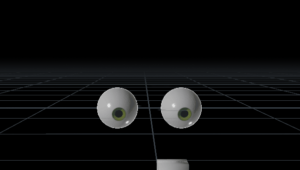

# 🎲 FPS-R Algorithm: Frame-Persistent Stateless Randomisation  

# Table of Contents

- [A Site Map of the Documents](#a-site-map-of-the-documents)
- [What is FPS-R?](#what-is-fps-r)
- [Principles and Philosophy](#principles-and-philosophy)
  - [🧭 Guiding Principle](#🧭-guiding-principle)
  - [🎭 Motion Philosophy](#🎭-motion-philosophy)
- [A New Grammar: "Randomised Move-and-Hold"](#a-new-grammar-randomised-move-and-hold)
- [✨ Key Features](#✨-key-features)
- [🎞 Sample Uses in Animation](#🎞-sample-uses-in-animation)
- [🧱 Sample Uses in Geometry Generation](#🧱-sample-uses-in-geometry-generation)
- [💡 Why Do I Need Another Random Stream Generator?](#💡-why-do-i-need-another-random-stream-generator)
  - [🧬 The Nature of "Held" Randomness](#🧬-the-nature-of-held-randomness)
  - [🧱 Limitations of Conventional Techniques](#🧱-limitations-of-conventional-techniques)
  - [⚙️ Why FPS-R is Different](#⚙️-why-fps-r-is-different)
- [🧬 Flavours of FPS-R](#🧬-flavours-of-fps-r)
  - [🌀 Stacked Modulo (SM) or 叠模机制](#🌀-stacked-modulo-sm-or-叠模机制)
  - [✴ Quantised Switching (QS) or 量跃机制](#✴-quantised-switching-qs-or-量跃机制)
- [🏙 Spatial Extension: From Time to Space](#🏙-spatial-extension-from-time-to-space)
  - [Spatial Modes](#spatial-modes)
  - [✴ Quantised Switching in Space](#✴-quantised-switching-in-space)
- [🧠 Recursive Chaos: FPS-R as Modulator](#🧠-recursive-chaos-fps-r-as-modulator)
  - [Fractal Modulation](#fractal-modulation)
- [📈 Meta-Signal Analysis: FPS-R as Its Own Observer](#📈-meta-signal-analysis-fps-r-as-its-own-observer)
- [🧪 Domains of Application](#🧪-domains-of-application)
  - [🕶️ AR/VR and Human-Centered Interaction](#🕶️-arvr-and-human-centered-interaction)
  - [🤖 Robotics and Embodied Systems](#🤖-robotics-and-embodied-systems)
  - [🛰 Swarms, Drones, and Spatial Coverage Systems](#🛰-swarms-drones-and-spatial-coverage-systems)
  - [💡 Embedded Systems and Ambient Interfaces](#💡-embedded-systems-and-ambient-interfaces)
  - [🎼 Domains of Application in Audio and Composition](#🎼-domains-of-application-in-audio-and-composition)
  - [👟 Foley and Movement Stylisation](#👟-foley-and-movement-stylisation)
  - [📡 Ambient Soundscape Evolution](#📡-ambient-soundscape-evolution)
  - [🗣️ Dynamic Speech Cadence](#🗣️-dynamic-speech-cadence)
  - [🧠 Cognitive Modeling and Generative Thought](#🧠-cognitive-modeling-and-generative-thought)
- [🌐 Closing Thoughts on Usage](#🌐-closing-thoughts-on-usage)
- [🔩 How FPS-R Works (A Gentle Primer)](#🔩-how-fps-r-works-a-gentle-primer)
  - [🎼 Stacked Modulo (SM)](#🎼-stacked-modulo-sm)
  - [✴️ Quantised Switching (QS)](#✴️-quantised-switching-qs)
- [⚠️ Tiling Note: Seamlessness in Spatial FPS-R](#⚠️-tiling-note-seamlessness-in-spatial-fps-r)
  - [🪡 Techniques for Seam-Aware Behavior](#🪡-techniques-for-seam-aware-behavior)
- [🚧 Current Status](#🚧-current-status)
- [Additional Development Notes](#additional-development-notes)
  - [FPSR Thoughts](#fpsr-thoughts-click-here)
  - [Development Reflections](#development-reflections-click-here)
- [🤝 Contributions](#🤝-contributions)

---
## A Site Map of the Documents

### Readme — Manifesto (English)
This is the primary document. It presents FPS-R as both a motion grammar and a collection of expressive tools, and serves as a lens through which to understand not only how FPS-R functions, but also why it evokes the qualities it does.

### Readme — 宣言，理念描述 (Chinese)
[Click here: 自述文件 — 中文版 (README-CH.md)](README-CH.md)
The Chinese edition of the manifesto, presenting the philosophical and expressive foundation of FPS-R in Mandarin.

### The Mathematics and Mechanics
[Click here: FPSR_Tech.md](resources/readme/FPSR_Tech.md)
This companion document provides the structural foundation beneath the conceptual framing. It outlines the algorithms, expressions, parameters, and architectural elements that support and shape the behaviour of FPS-R.

### Thoughts — Reflections and Conceptual Notes
[Click here: FPSR_Thoughts.md](resources/readme/FPSR_Thoughts.md)
An archive of nonlinear reflections, theoretical digressions, and design meditations that contributed to the philosophical development of FPS-R. This document functions as a conceptual incubator and critical sketchpad.

### Development Journal — The Chronicle
[Click here: FPSR_Dev_Journal.md](resources/readme/FPSR_Dev_Journal.md)
A chronological account of the research and design process. It records breakthroughs, failures, and revisions, offering insight into the iterative development that shaped the current implementation of FPS-R.


---

## What is FPS-R?
#### _Stateless unpredictability with a structured soul._

**FPS-R** is a system that expresses a motion archetype we call  **"Randomized Move-and-Hold."**  
Unlike traditional simulations, it sculpts discontinuity with structure—producing behavior that feels instinctual  
and organic, yet requires no memory or state.

This concept forms the bedrock of FPS-R's philosophy...

### Introduction

**FPS-R** stands for `Frame-Persistent Stateless Randomisation` (or `静态律动算法` in Chinese). It is a philosophy behind a collection of lightweight algorithmic pattern for simulating persistent yet stateless randomness across a continuous timeline—ideal for procedural motion, glitch aesthetics, synthesised organic behaviour, and analogue artefact emulation.

Inspired by natural behaviours such as eye saccades, animal foraging, human hesitation, predatory stalking, and structured noise, FPS-R produces unpredictability without relying on memory of the previous-frame. It mirrors the rhythm of an explorer's torch as he explores a darkened cave—pausing, twitching, drifting with intent—or the room-clearing manoeuvre of a soldier's rifle: moving and holding from one strategic point to another, every new holding position disjointed from what came before.  
> _**FPS-R is a manipulator of values over time, sculpting values and temporal behavior**_

When FPS-R is driven by space instead of time, it becomes something else entirely: a sculptor of forms, a builder of skylines. Its jump-hold logic becomes spatial patterning. Its rhythms become relief.  
> _**FPS-R is not just a motion language—it is a geometry dialect.**_

It is **repeatable**, **tunable**, and **frame-specific**, making it a versatile tool for time-based content creation platforms (Houdini, Maya, 3D Studio Max, Nuke, Adobe After Effects), GLSL, P5.js, game engines (Unity, Unreal), and embedded environments. Thanks to its simplicity and efficiency, FPS-R can also be implemented in any 3D platform that supports expressions or scripting.

In the spatial domain, FPS-R can be implemented into shaders for vertex displacement or surface perturbation, with its effects expressed through normals, bumps, and parallax techniques. When integrated with procedural modeling workflows, it becomes a generator of richly detailed and recursively layered geometry—ideal for greebling, erosion maps, stylised terrain, and sci-fi paneling. While the nature of FPS-R is non-repeating, with appropriate use of tiling techniques it allows spatial patterns to tile seamlessly across UVs or wrap naturally around curved surfaces, offering control without constraint.

---
### Principles and Philosophy
---
### 🧭 Guiding Principle  
"FPS-R isn't a single algorithm. It's a design philosophy for *shaping signals*. Whether by arithmetic folding or signal quantisation — whether in time or space — the goal is the same: give structure permission to behave."


### 🎭 Motion Philosophy  
**FPS-R simulates the unpredictability of hesitation — yet within the same framework, it can just as easily express instinct.**  
- When its temporal holds are short, it expresses *impulse*: quick changes that feel twitchy, clipped, or alert.  
- With longer holding durations, it evokes *hesitation*: thoughtful pauses, lingering states, the illusion of deliberation.

It does not switch modes—it sculpts time. The values may be random, but *when* they appear is guided by the frame count itself—producing a rhythm that feels intentional, even without memory.

What emerges is not chaos, but *temporal behaviour shaped by structure*.

> 🧒 This rhythm echoes freeze-tag games across cultures — **"A-E-I-O-U!"** in Singapore,  
> **"Red Light, Green Light"** in the U.S., **"무궁화 꽃이 피었습니다"** in Korea, **"木头人" in Chinese cultures**,  
> **"Grandmother's Footsteps"** in the UK, **"1, 2, 3 Soleil!"** in France, or **"Statues"** in Greece.  
> Each moment of stillness feels impulsive yet structured —  
> a hidden choreography of burst and restraint.

> 🧠 Teaching Note: "No-sim is the best sim."  
> In teaching Houdini—which is famed for simulation—I often remind students that building a procedural system without frame-to-frame dependencies is often superior to relying on complex simulations.  
> The most elegant systems allow each frame to stand alone—yet somehow feel like they remember the past.

---

## 🗣 A New Grammar: "Randomised Move-and-Hold"

FPS-R introduces not just a new fet of algorithms, but a new *lexicon* for motion.  
What it produces is not a filter or a curve — but a compositional structure:  
**jump → hold → reseed → repeat**  

*FPS-R: Behaviour Compositional Structure*

``` 

We call this behavior **Randomised Move-and-Hold**.  

It captures the quality of twitch, of deliberation, of pauses that feel like thought.

<p align="center">
  <b>
   → 
   → 
   → 
  
  </b>
</p>


---

## ✨ Key Features

- Frame-anchored **repeatability** without storing state  
- Tunable **chaos profiles** with modular curve sculpting  
- Compatible with stateless shaders, simulation loops, and real-time systems  
- Ideal for generating behaviour that feels **alive**, not algorithmic

---

## 🎞 Sample Uses in Animation

  
*Eye saccades or darting behaviour in Houdini — Single Eyeball Look Straight Ahead with Saccades*

  
*Saccades layered on top of object tracking in Houdini — Double Eyeballs Look at a Moving Box with Layered FPS-R Saccades*

---
## 🧱 Sample Uses in Geometry Generation

---

## 💡 Why Do I Need Another Random Stream Generator?

### 🧬 The Nature of "Held" Randomness

In both natural and artificial systems, randomness is rarely pure noise—it often lingers, persists, or evolves in a way that feels intentional. Whether it's the shimmer of dappled light, the jitter of analogue machinery, or the twitchy searching of eye saccades, we encounter random behaviours that hold their shape or drift over time. Yet despite how ubiquitous this phenomenon is, most content creation tools are ill-equipped to simulate, emulate and represent it in an intuitively straightforward and lightweight manner. Replicating this structured unpredictability often requires labour-intensive custom coding or non-intuitive workarounds.

> ✒️ Metaphor Note: *The FPS-R system is like a public pen at the post office.*  
> People come and go: one picks it up, another leaves it askew, sometimes no one touches it for hours.  
> Each interaction changes its orientation, position, or status—but never with memory.  
> Yet from a time-lapse sped-up video review, it appears to dance with intention.  

<br>
<p align="center">
  
  
  
</p>


### 🧱 Limitations of Conventional Techniques

The most common approaches tend to fall into two camps:

- **Worley-like noise functions**: These typically rely on spatially seeded feature points—often distributed via jittered grids or hash-based schemes—and compute distances between each sample and its surrounding points. 
While powerful for generating cellular textures, standard Worley noise tends to use evenly spaced seed distributions, leading to Voronoi-like cells with relatively uniform size and brightness. This results in predictable distance falloffs and similar displacement amplitudes across the field, which limits its expressiveness in simulating more erratic or organic behaviours.  
Additionally, it requires multiple computation steps—lookup tables, distance evaluations, sorting—which can be costly, especially when combining higher-order Fn layers, applying input warping, or layering across octaves.  
These techniques increase complexity and make Worley noise more difficult to visualise or intuitively control compared to simpler stateless methods. 

- **Previous-frame dependent logic**: This method can emulate "held" randomness by passing state from frame to frame. However, it introduces complexity and tightly couples your logic to platforms that support such state sharing (e.g., Houdini). Furthermore, it often cannot be implemented in lightweight contexts like expression fields or shader snippets, limiting its portability.

### ⚙️ Why FPS-R is Different

FPS-R introduces a lightweight and highly portable solution to this long-standing problem. At its core is the **Stacked Modulo (SM)** method, which generates structured, frame-evolving randomness without relying on state or lookup tables.

Key advantages include:

- ✅ **Truly Stateless**: FPS-R does not rely on previous-frame data or persistent memory buffers  
- 🧠 **Compact & Readable**: The SM expression can be written in a single line using `$F` in Houdini expressions or `@Frame` in VEX  
- 🛠️ **Platform Agnostic**: Works seamlessly in any environment that exposes frame-based context  
- ⚡ **Performance Friendly**: No costly distance functions, hash lookups, or scatter generation

---

## 🧬 Flavours of FPS-R

### 🌀 Stacked Modulo (SM) or 叠模机制  
The original FPS-R method. Uses layered modulus operations and shifting offsets to produce coherent but unpredictable transitions.  
- Feels like *memory without memory*  
- Shaped by frequency, amplitude, and phase  
- Lightweight and highly composable

**SM Features:**

- Adjustable upper bounds for how long values are held  
- Uses `rand()` and `mod()` functions on current frame  
- Works in one-liner form in many toolkits

---

### ✴ Quantised Switching (QS) or 量跃机制  
A deterministic pseudo-random index selector for flickering, logic switching, and glitch-like transitions.

**QS Features:**

- Supports custom value banks  
- Can bypass randomness for structured switching  
- Quantisation optional for smooth interpolation

---
## 🏙 Spatial Extension: From Time to Space

**FPS-R doesn't just animate. It extrudes. It embosses. It *grows surfaces*.**

By replacing time (`$F`, `@Frame`, etc.) with space (`x`, `y`, `uv`, or `position`), FPS-R becomes a **procedural modeling toolkit**—ideal for generating blocky silhouettes, architectural detail, and sci-fi surface features.

### Spatial Modes

- **1D → 2D Profiles**  
  Use a 1D FPS-R output along the `x`-axis:  
  - Random *jump-hold* patterns mimic building silhouettes  
  - Perfect for stylised skylines, barcode patterns, or abstract bas-reliefs

- **2D → 3D Extrusions**  
  Feed FPS-R(x, y) into a heightfield or mesh extrusion driver:  
  - Generates grid-based paneling, mechanical greebles, and terrain  
  - Works seamlessly with subdivide/bevel workflows

- **Curved Surfaces and Wrapping**  
  Since FPS-R is stateless, spatial lookups can wrap around UV shells or cylindrical coordinates without visual seams  
  - Enables pattern generation across spherical helmets, pipes, or organic topologies

<br>
<p align="center">
  
  
</p>

### ✴ Quantised Switching in Space

QS becomes a **signal switcher** in the spatial domain:  
- Swap randomisation engines (Perlin, Worley, texture samplers)  
- Turn off quantisation for fluid transitions  
- Amplify for brutalist modularity or broken repetition
> "Just as QS modulates time by switching behavioural regimes, it can modulate space by switching surface logic—turning texture banks or heightmap engines on and off with structured unpredictability."

---
## 🧠 Recursive Chaos: FPS-R as Modulator

FPS-R can **modulate itself**, creating layered complexity with no external drivers.

### Fractal Modulation

- Use one FPS-R stream as a **mask** to blend or gate other FPS-R-driven elements  
  - Example: A coarse FPS-R field dictates *where* a finer FPS-R field is active  
  - Creates nested, self-similar regions with varied character

- Enables **multi-scale detailing** without visible repetition  
  - Large jumps define macro structure  
  - Inner layers fill those zones with micro-patterns

> 🪨 Like natural erosion: cliffs shaped by tectonics, then chipped by rain

This approach keeps procedural output feeling coherent but rich—and helps avoid the flatness of a single noise function. The result is a *generative grammar*, not just a random script.

<P align="center">
  
</P>

---
## 📈 Meta-Signal Analysis: FPS-R as Its Own Observer

While FPS-R was born as a generator of structured unpredictability, its signal output can be **reprojected into geometry**—turning behaviour over time into readable *form*. By mapping its jump-hold patterns into 2D or 3D space, we can analyse:

- **Behavioural rhythms** as architectural silhouettes  
- **Decision states** as temporal glyphs or waveform landscapes  
- **Modulation layers** as recursive embedded zones

This enables FPS-R to serve as both *performer* and *diagnostician*: a self-scribing signal whose own visualisations can uncover insight into its frequency, persistence, and switch thresholds.

> Imagine plotting each state-switch as a block on a time axis—producing a skyline of decisions. Or warping that same skyline into spatial slices—creating a textured audit trail of signal intent.

Such representations can be useful for:
- Teaching and debugging FPS-R behaviour  
- Designing visual encodings of abstract logic  
- Using geometry as feedback for **temporal tuning**

Ultimately, this reframes FPS-R as more than procedural fodder—it becomes a **conceptual instrument**, capable of looking back at itself through form.

---
## 🧪 Domains of Application

FPS-R operates as an expressive behavioral layer in systems that separate **intent selection** from **motion execution**. Across the following domains, a higher-level system defines **Macro-Intent** (goals, modes, or states), while FPS-R provides **Micro-Behavior**—organic, stateless texture that enriches execution with non-repetitive nuance. 

Though the examples listed above aim to be comprehensive, they remain but fragments of FPS-R's expressive reach. Forasmuch as a system can be stateless yet evocative, the potential applications of FPS-R extend beyond simulation—into domains where behavior must be shaped, described, or perpetuated with nuance.

Whether used to animate hesitation, actuate impulsive drift, or mathematically encode deliberation itself, FPS-R offers a generative framework for organic unpredictability—adaptable wherever signal and intention intersect.


### 🕶️ AR/VR and Human-Centered Interaction
- **Synthetic User Gaze Generation**  
  Simulates realistic eye movement patterns (e.g., drift, tremor, micro-saccades) within goal-driven gaze pathways, enabling scalable A/B testing and heatmap analytics without human data collection.

- **Avatar and NPC Gaze Realism**  
  Enhances digital characters with lifelike attention patterns. FPS-R drives continuous, subconscious eye motion while higher-level logic determines gaze targets, creating the illusion of true engagement.

- **Interaction Modeling and Accessibility Testing**  
  Simulates user attention profiles with tunable randomness—ideal for evaluating interfaces under distracted, focused, or fatigued conditions.

### 🤖 Robotics and Embodied Systems
- **Behavioral Texturing for Expressive Motion**  
  Applies organic variation to idle gestures, resting postures, or transitional movements. FPS-R modulates wrist angles, finger articulations, and head gaze during macro-controlled behaviors.

- **Contemplation and Idle Simulation**  
  Replaces scripted loops with natural micro-movements. Robots in idle states use FPS-R to animate non-repeating gaze shifts and head posture drifts, projecting intentionality without costly simulations.

### 🛰 Swarms, Drones, and Spatial Coverage Systems
- **Organic Path Diversification**  
  Injects non-repeating movement variation within structured patrol routes. FPS-R modulates micro-deviations, orbit pauses, and jitter profiles to avoid predictable flight behavior.

- **Swarm Personality Mapping**  
  Enables subtle differentiation across agents without increasing system complexity. Each member can exhibit unique drift and hesitation behavior based on independent FPS-R signals.

### 💡 Embedded Systems and Ambient Interfaces
- **Non-Static Actuation and Response Patterns**  
  Modulates lights, sounds, or haptics with organic variability across predefined ranges. Useful for ambient signaling, wearable UX, or expressive animatronics.

- **Stateless Behavioral Synthesis under Constraint**  
  Generates expressive behavior in low-memory, low-latency contexts. Ideal for microcontroller-controlled installations, generative art, and deterministic chaos systems.

### 🎼 Domains of Application in Audio and Composition
FPS-R can be synced not just to arbitrary time, but to **musical time signatures**—enabling rhythmic awareness that aligns with compositional intent.  
This lets the algorithm behave meaningfully within structured beats, bars, and measures.  
  
Instead of treating "time" as a generic linear input, FPS-R can use **beat-level granularity**—quarter notes, eighths, swing grids, syncopations—mapped onto modular or switching logic.  
  
This transforms FPS-R into a **musical decision engine**:

- It can recognize **downbeats and offbeats** as strategic moments for modulation.
- It allows probabilistic jumps **at musically significant intervals** (e.g., bar endings, phrase transitions).
- It enables behavior that feels **groove-aware**, supporting both glitch aesthetics and compositional phrasing.  

**🎵 Generative Composition Tool**
  - Use FPS-R to modulate motifs, insert fills, or reshape melodic contours *only at measure endings* or rhythmic breakpoints.  
  - Create phrases that never loop identically but feel anchored in musical logic.  

**🥁 Rhythmic Texture Driver**
  - Apply SM logic across fractional beat durations—like 1/8, 1/3, 5/16—to produce polyrhythmic overlays and emergent groove.  
  - Ideal for percussion sequencing and FX automation.  

**🔀 Live Remix Engine**
  - Route loop elements through a QS-style selector synced to BPM.  
  - At rhythmic thresholds (e.g., every 4 bars), FPS-R decides: *switch loop, glitch FX, or re-affirm current pattern.*

**🎹 Expressive Instrument Behavior**  
- Modulate synth parameters (e.g., cutoff, resonance, pitch, LFO rate) at rhythmic or non-linear intervals using SM or QS logic.  
- Apply subtle variations to dynamics, attack profiles, or phrasing, making instruments feel more "performed" than programmed.  
- Use FPS-R to subtly enhance or completely automate continuous controllers like modulation wheels, glide amounts, or per-note expression—*depending on how much expressive control you choose to surrender*.  
- Ideal for ambient layers, modular rigs, generative soundscapes, or adaptive scoring systems—where nuance matters more than predictability.  
- Enables real-time performance augmentation without memory or automation curves.

**📻 Analogue Circuit Emulation**  
- Emulates instability in analogue gear—bias drift, oscillator inconsistencies, noisy feedback loops—using structured randomness.  
- Introduces non-repeating quirks like filter wobbles, gain surges, capacitor fatigue, or thermal modulation—without needing sample-perfect modeling.  
- QS logic can simulate behavioral regime switches—e.g., a tube "warming up," or an overdriven circuit jumping behavior modes.  
- Works at modulation layer (flutter), output stage (saturation jump), or control envelope (detuned unpredictability).  
- FPS-R's stateless nature ensures low CPU usage—perfect for real-time plugin environments or embedded DSP.  
- Complements machine-learning-based approaches, offering procedural texture that bridges expressive realism and computational tractability.
> 🎛️ *FPS-R doesn't mimic circuits—it replicates their temperament.*


**👟 Foley and Movement Stylisation**
  - Apply QS jumps to footstep EQ, reverb, or timing—triggering stylistic shifts at grid-aligned pulses (e.g. floor changes, gait pivots).

**📡 Ambient Soundscape Evolution**
  - Use beat-aware SM rhythms to drive background environmental audio (wind, rain, hums).  
  - Subtle shifts feel natural and musically tuned.

**🗣️ Dynamic Speech Cadence**
  - Modulate speech timing, emphasis, or pitch based on rhythmic mapping.  
  - FPS-R shapes phrase delivery without memory, yet sounds intentional and emotionally varied.

> 🎵 Note: By syncing modular and switching logic to musical timing grids, FPS-R becomes not just a procedural tool—but a **tempo-sensitive composer**, capable of phrasing with nuance and glitching with groove.


### 🧠 Cognitive Modeling and Generative Thought

FPS-R extends beyond expressive motion into **synthetic cognition**, where it serves as a catalyst for emergent reasoning and idea synthesis. This represents the apex of its conceptual reach—where simulation becomes origination.

- **Thought Flow Modulation in LLMs**  
  Functions as a temporal pacing engine. FPS-R modulates attention across tokens, simulating deliberation (hold), exploration (jump), and drift—producing responses with nuanced cognitive rhythm.

- **Fuzzy Logic Adaptation**  
  Continuously modulates inference thresholds and rule boundaries to reflect evolving ambiguity or multi-modal conditions—without requiring persistent state or retraining.

- **Procedural Dialogue and Conversational Tangents**  
  Shapes conversational rhythm and thematic fluidity in synthetic agents. FPS-R enables natural topic retention, intentional pivots, and pacing realism.

- **Conceptual Trajectory Sampling: FPS-R as Path and Behavior**  
  When FPS-R initiates a transition between semantic regions (start_vector to end_vector), it defines a trajectory—an active signal stream rather than a static interpolation. This trajectory itself can be structured by FPS-R, exhibiting jump-hold dynamics along its arc. At each sampled waypoint, related tokens are drawn not only from proximity but through **layered randomness**, allowing bursts of associative insight or tangential grabs that echo creative intuition.

  The result is a synthesized idea that is not merely a blend of endpoints, but a **path-dependent composition**—one where the journey shapes the destination, and stochastic sampling enriches conceptual texture. This moves beyond simulating the appearance of cognition and into the territory of **generating synthetic thought** with structured expressive motion.

### 🌐 Closing Thoughts on Usage

The examples above chart a mere perimeter. FPS-R's grammar has not reached its edge.

Whether embedded in a gesture, a skyline, a decision, or a whisper of thought—this system awaits new translations.

So take it. Reshape it. Let it hesitate where no behavior has paused before.

🚀 *To modulate boldly, where no signal has modulated before.*


---

## 🔩 How FPS-R Works (A Gentle Primer)

At its heart, FPS-R is a rhythm machine—generating unpredictable but *structured* signals over time or space.  
It doesn't store memory. It doesn't know what came before.  
Yet what emerges feels like hesitation, twitch, or drift.

You tell FPS-R which frame (or position) it's in, and it sculpts a value based on simple math:  
modular rhythms, seeded randomness, layered transitions.  
From that alone, it creates the illusion of thought—without ever thinking.

FPS-R unfolds through two intertwined methods.  
Each one offers a unique lens—structured pulses that unlock different facets of unpredictability.
  

Here's the basic idea:

### 🎼 Stacked Modulo (SM)
Like overlapping metronomes—each frame lands within multiple rhythm layers, each with its own time signature.   
Some tick slowly, some twitch fast. Where their cycles overlap, a value is held… until one metronome hits the end of its measure—and triggers a jump.  

When does the signal hold?
- The current frame lands within a stable rhythm layer intersection.
- None of the modulo layers reach the end of their cycle.

When does the signal jump?
- One or more rhythm layers complete a cycle (reach "end of measure").
- The modular alignment causes a break in value continuity.
- A new composite rhythm is formed, triggering the next held value.

### ✴️ Quantised Switching (QS)
In its most basic form, Quantised Switching is a signal selector. Two signals (typically sine waves) are generated—each with its own time signature, much like SM's layered rhythms.  
But instead of flowing smoothly, each signal is sliced into discrete steps. Another rhythm governs the selector itself.  
When the selector reaches the end of its measure, a jump occurs—triggering a *probable* switch to the alternate signal (though it may stay).  
Separately, if the currently selected signal jumps between steps, a jump in the final value also happens.  

When does the signal hold?
- The stepped value from the selected signal remains unchanged.
- The selector rhythm is still mid-cycle (not yet at the end of a measure).

When does the signal jump?
- The selector rhythm completes its measure → probabilistic switch occurs.
- The stepped value of the selected signal changes between frames.
- Either event causes a discrete jump in output—without memory of prior state.

These layered, deterministic jumps—both in selection and value—offer stylistic glitch, rhythmic flicker, and behavioral unpredictability.


Each method is stateless. Each moment is decided without memory.  
And yet, the result feels strangely alive.

👉 *Want to unpack the full mechanism, token by token? Dive into the technical breakdown here:*  
**[Read FPSR_Tech.md →](resources/readme/FPSR_Tech.md)**


---
## ⚠️ Tiling Note: Seamlessness in Spatial FPS-R

By default, FPS-R generates *non-repeating, stateless randomness*, which means it does **not** seamlessly tile across UV space or fixed spatial domains out of the box. This unpredictability is part of its power—but for workflows requiring smooth tiling or seamless textures (e.g. UDIM-based materials, game-ready UV atlases), FPS-R can be gently adapted to behave.

### 🪡 Techniques for Seam-Aware Behavior

Here are strategies to coax FPS-R into cooperating across tile boundaries:

- **Modulus-Based Tiling**  
  Wrap UVs explicitly using `mod(uv, tileSize)`. This forces periodicity while keeping the jump-hold quality within each tile.

- **Mirrored Wrapping**  
  Use a reflected modulus: `abs(mod(uv, 2.0) - 1.0)` for soft continuity at edges—great for symmetric patterns or organic wrapping.

- **Quantised Phase Locking**  
  Divide UV space into quantised cells and derive a consistent `rand()` seed per cell. This syncs pattern phases across borders.

- **Edge Crossfade (Mask Blending)**  
  Blend FPS-R lookups with slight UV offsets near seam edges. Use `smoothstep()` masks to interpolate between directions.

- **Layered Distraction**  
  Accept tiling at a coarse base layer, then modulate with finer FPS-R overlays. Even if the base repeats, the compound result feels rich and unresolved.

> 🧵 Seamlessness is not default—but it is *composable*. By embracing layering, offset masking, and structured quantisation, FPS-R can be shaped into tileable, patch-based, or wrapped surface logic without losing its essence.

---

## 🚧 Current Status

FPS-R is under active development and currently private during cleanup. Planned improvements:

- Modular utilities  
- Plug-and-play GLSL and Houdini expressions  
- Ready-made presets and chaos profiles
---
## Additional Development Notes
### FPSR Thoughts [(click here)](resources\readme\fpsr_thoughts.md)
This is a the thoughts about the tools I have created. 

### Development Reflections [(click here)](resources\readme\development_reflections.md)
This is the chronological diary of the events leading to the discovery of these methods and techniques.

---

## 🤝 Contributions

If you're into procedural chaos, analogue aesthetics, or the poetry of entropy—your thoughts are welcome once it returns to public life.