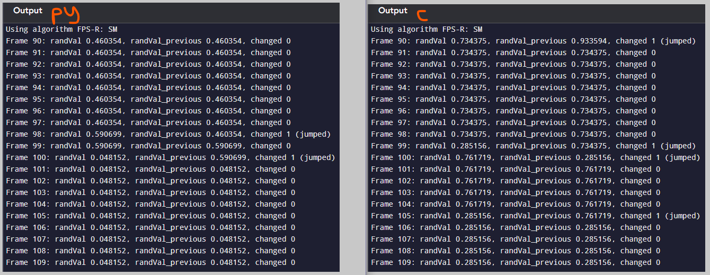
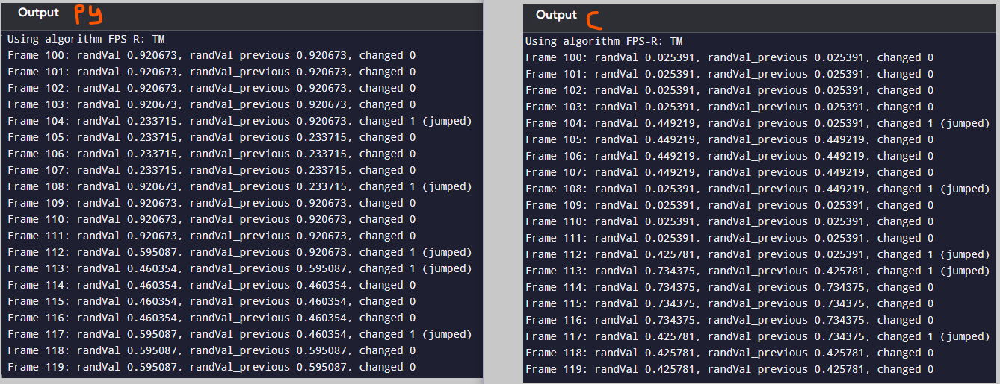
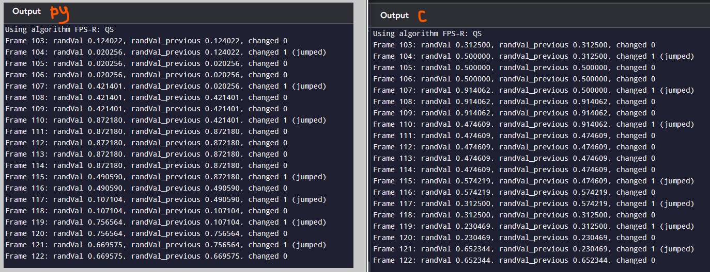

# FPS-R Test

## Details
**Date**: 21 Sep 2025
**Test No.**: 20250921_01
**Tester**:  Patrick Woo

**Platform**: 
- [www.programiz.com Online C Compiler](https://www.programiz.com/c-programming/online-compiler/)
- [www.programiz.com Online Python Interpreter](https://www.programiz.com/python-programming/online-compiler/)

## Description
To test the core base algorithm output of SM, TM and QS. Compare the outputs between C `fpsr_algorithm_reference.c` and Python `fpsr_algorithm.py`.
    - check for parity (make sure the output matches)

## Test Screenshots
### SM

**Notes**:
- different values
- different jump frames

### TM

**Notes**:
- different values
- same jump frames

### QS

**Notes**:
- different values
- same jump frames

## Observations
- The output mismatch but synchronised and matching jump frames from TM and QS are curious features. 
- Need to find a way to make them deterministic as proof of parity of the core algorithm

## Pass / Fail: 
**Failed**