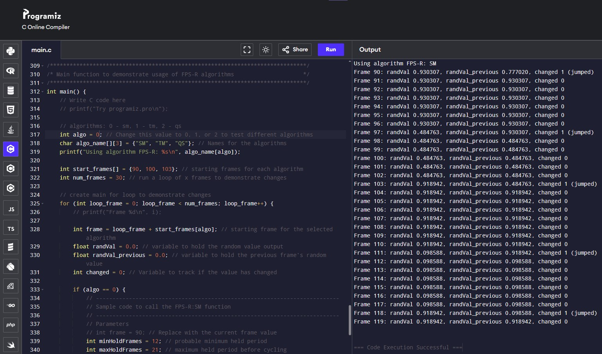
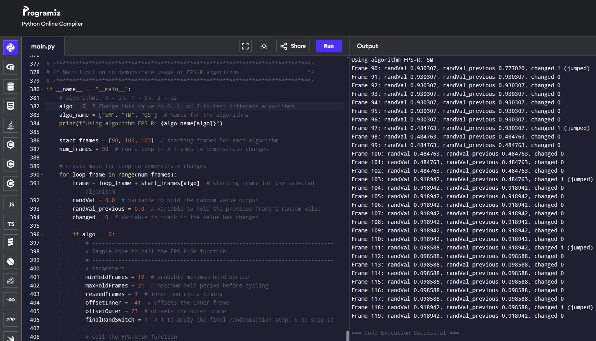
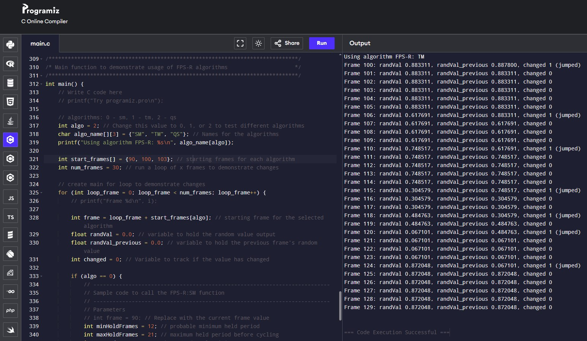
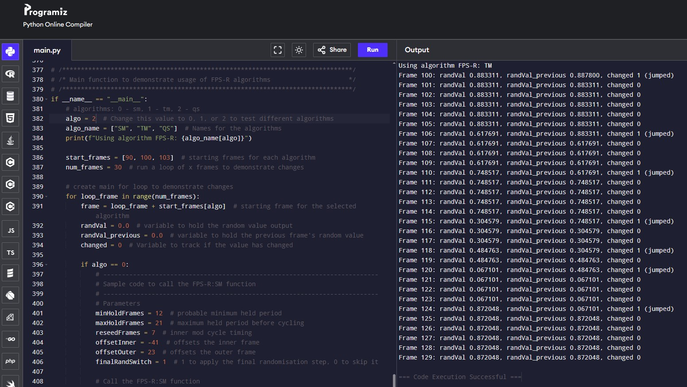
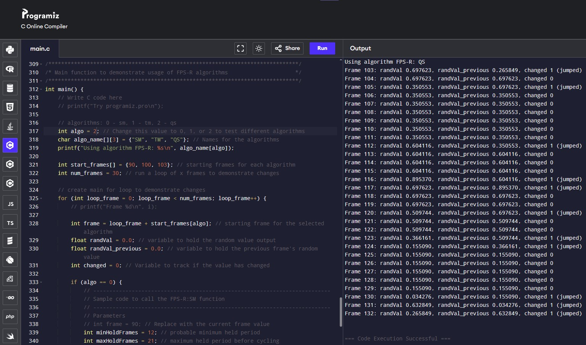
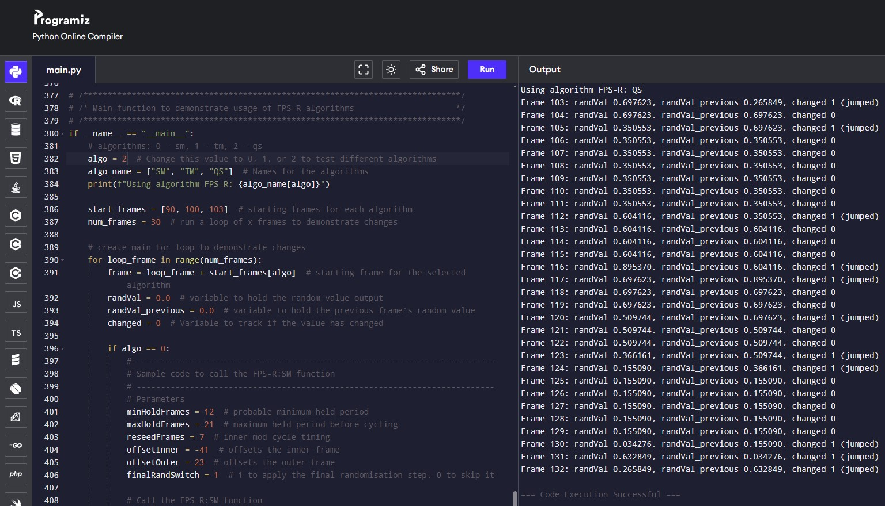

# FPS-R Test

## Details
**Date**: 22 Sep 2025
**Test No.**: 20250921_02
**Tester**:  Patrick Woo

**Platforms**: 
- [www.programiz.com Online C Compiler](https://www.programiz.com/c-programming/online-compiler/)
- [www.programiz.com Online Python Interpreter](https://www.programiz.com/python-programming/online-compiler/)
- Local PC Python Interpreter:
    - Windows 10
    - Python 3.13.5

## Description
To test the core base algorithm output of SM, TM and QS. Compare the outputs between C `fpsr_algorithm_reference.c` and Python `fpsr_algorithm.py`.
    - check for parity (make sure the output matches)

## Test Screenshots
### SM
SM C output

SM Python Output

SM Python local Output
.jpg)
**Notes**:
- same values
- same jump frames

### TM
TM C output

TM Python output

TM Python local output
.jpg)
**Notes**:
- same values
- same jump frames

### QS
QS C output

QS Python output

QS Python local output
.jpg)
**Notes**:
- same values
- same jump frames

## Observations
- Values and jump frames are now matching and replicated across C and Python implementations 

## Pass / Fail: 
**Pass**