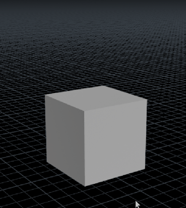

# FPS-R Technical Documentation
##### This documentation is still in development. While every update strives to be accurate, there will be parts that are incomplete or inaccurate. 

# Table of Contents

- [The Purpose of This Document](#the-purpose-of-this-document)
  - [A Word of Thanks](#a-word-of-thanks)
  - [⚖️ Attribution Note](#️-attribution-note)
  - [👥 Who This Document Is For](#-who-this-document-is-for)
- [Algorithmic Detail, Code Structure, Usage Notes](#algorithmic-detail-code-structure-usage-notes)
  - [🧾 Code Snippets Provided in this Repository](#-code-snippets-provided-in-this-repository)
- [🔩 How FPS-R Works](#-how-fps-r-works)
- [⚙️ Features of FPS-R](#️-features-of-fps-r)
  - [🧳 Stateless](#-stateless)
  - [🧩 Deterministic](#-deterministic)
- [🌀 How It Works: Stacked Modulo (SM)](#-how-it-works-stacked-modulo-sm)
  - [Core Mechanism](#core-mechanism)
  - [Behavior](#behavior)
- [✴ How It Works: Quantised Switching (QS)](#-how-it-works-quantised-switching-qs)
  - [Core Mechanism](#core-mechanism-1)
  - [Behavior](#behavior-1)
- [Combining FPS-R Algorithms](#combining-fps-r-algorithms)
  - [FPS-R Algorithms Working Together](#fps-r-algorithms-working-together)
  - [FPS-R Algorithms Working with Other Algorithms](#fps-r-algorithms-working-with-other-algorithms)
- [Show Me the Code!](#show-me-the-code)
- [Stacked Modulo (SM) - Mathematical Model](#stacked-modulo-sm---mathematical-model)
- [Stacked Modulo (SM) - Code](#stacked-modulo-sm---code)
  - [One-Line Compact](#one-line-compact)
  - [🧩 Component Breakdown](#-component-breakdown)
  - [Stacked Modulo - A Defined Function](#stacked-modulo---a-defined-function)
  - [Behavior of the Stacked Modulo Function](#behavior-of-the-stacked-modulo-function)
- [Quantised Switching (QS) - Mathematical Model](#quantised-switching-qs---mathematical-model)
- [Quantised Switching (QS) - Code](#quantised-switching-qs---code)

---
# The Purpose of This Document
This document explains and explores the algorithms that constitute **Frame-Persistent Stateless Randomisation (FPS-R)**. It breaks down the mechanics of its modulation logic—revealing how structure, randomness, and phrasing combine to form behavior that feels intentional, yet requires no memory.

### A Word of Thanks
Thank you for taking the time to explore these notes on the algorithm and its inner workings. Whether you’re here out of curiosity, critique, or collaboration—welcome.

#### ⚖️ Attribution Note 
FPS-R is released under the MIT License, which means you're free to use it in commercial, private, and artistic projects without restriction.

In many contexts—SaaS platforms, embedded systems, or creative outputs like VFX shots, motion design, and procedural soundscapes—the code never ships. In those cases, attribution isn’t legally required.

But if FPS-R helped phrase the blink in your commercial, the irregular glitch in your shader, or the drift in your kinetic sculpture—it would mean a lot to be credited. Even a quiet mention in your documentation or acknowledgments helps others discover the grammar behind your motion.

> The code may stay invisible. But if the phrasing speaks? Give it a name.

### 👥 Who This Document Is For
This document is for anyone who wants to see what lives behind the phrasing.

🧑‍💻 Developers will find structured breakdowns of how randomness, modularity, and statelessness combine—ready for implementation across timelines, shaders, or signal streams.

🎨 Designers and motion artists who have used FPS-R instinctively can now peek behind the curtain—understanding what shaped the gestures they've phrased.

🧠 Thinkers, tinkerers, and curious system-builders are welcome too. If you’ve ever wondered how behavior can breathe without memory—this is your invitation to explore.

> There’s no pre-requisite here—just an interest in what modulation can do when left to its own logic.

Come as you are. Stay as long as you like. The phrasing engine is always running.

### Algorithmic Detail, Code Structure, Usage Notes
In this document, we will unpack the FPS-R methods by deconstructing their code into modular components. Each section examines how a fragment contributes to the resulting phrasing—allowing you to understand, modulate, and compose behavior with precision.

### 🧾 Code Snippets Provided in this Repository
The code examples in this repository are **platform-conscious**, not platform-specific. Each snippet has been deliberately shaped for **clarity of intent**, avoiding language-dependent operators (like ternaries), environment-specific idioms, or dependency-bound functions. Where expressive quirks exist (e.g. modulus, quantisation rhythms), they are surfaced with **plain logic and comments that explain the phrasing**, not just the math.

These implementations prioritize **readability, reproducibility, and minimal refactoring cost** across most C-family and expression-bound languages—including C++, Java, JavaScript, GLSL, HLSL, MEL, and Houdini VEX.

While some language-specific adjustment may still be necessary—such as:
- Array declarations ([] vs {} syntax)
- Math operations (floor, mod, frac) depending on standard library access
- Type casting and rounding functions

…the core logic is designed to port cleanly, and has been tested for deterministic phrasing integrity across platforms.

> These snippets are not drop-in libraries—they're reference phrasing kernels. Use them to reconstruct modulation logic in your language of choice, knowing that the behavior should survive the translation.

## FPS-R Re-Introduction
First introduced in the `README.md` manifesto, I shall re-introduce it here again in a more objective manner.

The FPS-R framework is designed to produce pseudo-random values that remain constant for a specific, but randomly determined, duration. This "frame persistence" is essential for applications like animation, visual effects, and procedural content generation where randomness is desired, but it needs to be stable from one frame to the next to create coherent and visually pleasing results. The "stateless" nature means it doesn't need to store any values between frames; the result is calculated purely from the input parameters, making it highly portable and efficient.

## 🔩 How FPS-R Works

At its core, FPS-R operates through **coordinate-indexed determinism**. Whether evaluated over time (e.g., `$F`, `@Frame`) or space (`@P`, `uv`, `x`), it applies arithmetic logic—such as `mod()` cycles, `floor()` binning, and seeded `rand()` functions—to produce values that appear to hold, snap, or jump across defined intervals.

Despite its expressive output, FPS-R is strictly **stateless**. Each evaluation is contextually local: it derives its result solely from the current coordinate, without referencing previous frames or adjacent spatial samples.

This yields a surprising property: **discontinuities feel intentional**, and regions of apparent memory emerge—without any simulation or history tracking. It's a sleight of hand through math:  
**perceived temporal coherence from purely evaluative logic.**

---

## ⚙️ Features of FPS-R

Understanding how FPS-R achieves its behavior requires a closer look at what we mean by "stateless" and "deterministic":

### FPS-R Seems to Remember
Due to how the algorithms are formulated and constructed, FPS-R algorithms behave like they remember. This means that a random value is held for a number of frames before "moving on" to the next random value. Before FPS-R, this behaviour is usually achieved through stateful methods. If the result of FPS-R is shown to a programmer or technical artist for the first time, he or she would probably believe this to be coming from a stateful technique that involves remembering that random number from the previous frame and holding it the value with a counter until the next reseed.

This is the foundation of what we've come to call:
> **🪞 Memoryless Mimicry**
> A simulation remembers so it can anticipate. FPS-R forgets, but still manages to feel like it remembers.

### 🧳 FPS-R is Stateless

Stateful systems rely on memory—they accumulate, simulate, or propagate values over time. In contrast, **FPS-R is stateless**: it evaluates in-place, without any dependency on past or future frames.

A typical FPS-R expression evaluates a jump or hold using only the current frame index and seeded math functions. No buffers. No temporal recursion. Just present-tense logic that _feels_ retrospective.

This quality makes FPS-R not only performant, but also **portable and resilient**. Its behavior can be trusted in multi-threaded, parallel, or distributed contexts without simulation overhead.

### 🧩 FPS-R is Deterministic

With the same inputs—frame number, seed parameters, and method—FPS-R always produces the same output. This deterministic footprint enables:

- 🧪 Reproducible behavior across simulations, tests, or procedural evaluations
- 🛠️ Reliable debugging and tuning—behavior is traceable and consistent
- 🎛️ Composable structure—multiple FPS-R layers can interact without uncertainty
- 📈 Cross-domain applicability—whether in robotics, interaction design, motion synthesis, or data-driven generative tools, repeatability ensures trust
- 🧠 Expressive layering: deterministic scaffolds enable deliberate rhythm clashes, controlled glitches, and predictable emergent timing behaviors between the signal systems

### FPS-R Plays Well with Others
#### Playing Well with Everybody
As a modulation framework that adds to the behavior of larger systems, it can create its deterministic move-and-hold behaviour in both stateful and stateless environments.

#### Playing Better with Stateless Operators
The true power of FPS-R’s stateless determinism emerges when paired with other stateless systems. In such a case, **the final result will be equally stateless**.

> The section “**Combining FPS-R Algorithms**” explores how these principles can be layered, stacked, and merged with other systems to unlock deeper phrasing behavior.

---

## 🌀 How It Works: Stacked Modulo (SM)
SM uses **layered modulus operations** combined with shifting `rand()` seeds to create output that seems to "hold" values across multiple frames or spatial coordinates. The result: a pattern of persistent values interrupted by unexpected jumps.

### Core Mechanism
The Stacked Modulo (SM) method generates its unique "move-and-hold" rhythm through a nested, procedural process. Instead of using fixed holding zones, it creates a variable-length rhythm where the duration of each hold is itself determined by a nested FPS-R pattern.
1. **Procedural Hold Duration**  
   At the core of the function, a simple, high-frequency FPS-R pattern generates a random value. This value is then used to calculate an adaptive hold duration, H, that falls between a defined `minHold` and `maxHold`. This `H` value itself holds steady for a short period before being re-randomized.
2. **Variable-Length Modulo Cycle**
   This procedurally generated hold duration, `H`, is then used as the modulus in the main timing operation (`frame % H`). This creates a primary rhythmic cycle whose length is not constant but changes dynamically over time.

3. **Phase-Shifted Seeding**
   The result of this variable-length modulo is used to create a phase-shifted offset. This offset is subtracted from the main `frame` counter to produce a final, complex seed. It is this constantly shifting, rhythmically inconsistent seed that is fed into the final `rand()` function to produce the output.

### Behavior
- Short mod spans → twitchy impulse
- Long mod spans → hesitant deliberation
- Layered mods → emergent switching logic, without simulation

---

## ✴ How It Works: Quantised Switching (QS)

While SM focuses on **temporal rhythm**, QS enables **value switching** across discrete options—like glitch matrices, logic multiplexers, or stylistic gates. QS can use any input signal (not just random) and quantise it into hold states.

### Core Mechanism

1. **Value Bank**  
   Define a set of discrete outcomes—values, palettes, animation states, functions.

2. **Signal Lookup**  
   Use a deterministic signal (random or procedural) to select an index:  
   `int index = floor(rand(@Frame) * numOptions);`  
   `output = valueBank[index];`

3. **Optional Quantisation**  
   Apply stepped or smoothed quantisation to the input signal to make transitions feel chunky, abrupt, or smooth.

### Behaviour
- Acts like a **switcher**: swaps logic branches, colour palettes, or procedural regimes  
- (Time) Ideal for glitch logic, state machines, or recursive style variation
- (Space) Ideal for creating procedural geometrical structures.

### Advanced Forms and Features
The form of the supplied QS function is only one of the possible forms it can take on. QS approaches stateless randomness differently—by layering continuous signal streams. When quantising and randomising stages are removed, it unlocks richly varied and often surprising behaviours. 

These features can also serve as debugging or visualising tools to reveal the characteristics of the streams of signals underneath to observe how it works before turning them off again for more controlled sculpting.
- Can bypass `rand()` entirely to create *structured switching* revealing the quantised signal streams—stepped but coherent—behind the `rand()` operation.
- Can bypass quantisation or posterisation entirely to reveal the original coherent continuous streams that feed the switcher. This will then become a very regular switching jump between 2 continuous signals.
- Can swap out the default sine wave streams for any signal generating function (noise, look-up array) to achieve completely different behaviours (in the temporal domain), and different aesthetic looks (in the spatial domain).

> QS is not about rhythm—it's about **selection**. And it works beautifully when combined with SM to modulate *when* changes happen, and *what* they reveal.

---
## Combining FPS-R Algorithms
### FPS-R Algorithms Working Together
FPS-R methods can be stacked, nested, or intertwined to unlock even richer phrasing behaviors.
- A Quantised Switching (QS) output can be fed into one or both frame inputs of a Stacked Modulo (SM) instance—overlaying unpredictable switching on top of rhythmic structure.
- Algorithms can also be self-nesting: QS driving QS, SM shaping SM—allowing phrasing to modulate itself recursively.

> Even when layered, the resulting motion remains deterministic, stateless, and reproducible. The phrasing may feel unpredictable—but it will always remember how it moved.

### FPS-R Algorithms Working with Other Algorithms
FPS-R plays well with others. As long as the external algorithms are **stateless and deterministic**, their outputs can be safely embedded or layered into FPS-R phrasing systems without breaking reproducibility.

Below is a non-exhaustive list of common stateless functions and procedural sources:

| Category | Stateless Function Examples |
| :--- | :--- |
| **Mathematical & Trigonometric** | `sin`, `cos`, `pow`, `sqrt`, `floor`, `ceil`, `round`, `min`, `max`, `clamp`, `abs`, `mod`, `frac`, `lerp`, `smoothstep` |
| **Procedural Noise & Patterns** | `Perlin Noise`, `Simplex Noise`, `Worley Noise (Voronoi)`, `Value Noise`, `Fractal Brownian Motion (fBm)` |
| **Hashing & Pseudo-Random** | `Seeded rand(seed)`, various hash functions that convert coordinates or seeds into repeatable numbers |
| **Geometric & Coordinate-Based**| `dot`, `cross`, `normalize`, `distance`, `length`, `SDFs (Signed Distance Functions)`, `Texture Lookups` |
| **Logic & Data Manipulation** | `step`, `mix`, `Bitwise Operations (AND, OR, XOR)` |

> ⚠️ FPS-R can coexist with non-deterministic or stateful sources, but the resulting phrasing will not be traceable or reproducible. That may be an intentional choice—but it's a choice worth naming.

---
## Show Me the Code!
Implementation of the algorithms in a variety of software and environments. 

[**Code Implementations**](../code/) This high level directory in the repository contains the code implemented in several languages and platforms.

### C
[**Code in C**](../code/c/fpsr_algorithms.c) FPS-R SM and QS in portable C code that would run with minimal modifications in many c-style languages. 

### Python
[**Code in Python**](../code/python/fpsr_algorithms.py) FPS-R SM and QS in a Python `.py` file.

### Jupyter Notebook
[**Code in Jupyter Notebook**](../code/python/fpsr_algorithms.ipynb) FPS-R SM and FPS-R QS Python code in notebook cells, in a visually pleasant layout. For the most intuitive and hands-on exploration, the Jupyter Notebook provides interactively scrollable graphs. This is the recommended way to visually understand the characteristics and "fingerprint" of each algorithm's output.

FPS-R: Stacked Modulo Timeline Graph Preview

FPS-R: Quantised Switching Timeline Graph Preview
> Note: Jupyter notebooks render only as static content on GitHub's web viewer. Interactive scrolling graphs for SM and QS will not show up. If you want to play around with the parameters and drive a different resulting curve, and inspect the scrolling graphs, please feel free to download the notebook and execute it on your local machine runnning Jupyter notebook on a Python 3.x kernal with the relevant dependencies (`Pandas` and `Matplotlib`). 

To access the read-only notebook with the interactive scrolling graphs, you can: [explore the interactive timeline in a Jupyter notebook on `nbviewer`](https://nbviewer.org/github/patwooky/FPSR_Algorithm/blob/main/resources/code/python/fpsr_algorithms.ipynb)
The interactive scrolling graphs are the last 2 cells at the end of the notebook.

### SideFX Houdini
[**Houdini `Vex` file**](../code/houdini/fpsr_algorithms.vex) This file contains the vex code for both `FPS-R: SM` and `FPS-R: QS` algorithms in a plain text file. 
[**Houdini `.hip` File**](../code/houdini/h_fpsr_code_v001_01.hip) This is a Houdini project file that has a geometry node. Inside are two `point wrangle` nodes that provide `FPS-R: SM` and `FPS-R: QS`. Both will produce a FPS-R signal to drive the y-axis position of a box.


### Autodesk Maya
[**Maya `.mel` Script**](../code/maya/fpsr_algorithms.mel) The Mel expressions, same as those used in the `.ma` file, but in a easy to read plain text format.
[**Maya `.ma` File**](../code/maya/fpsr_algorithms.ma) Maya file a group node. In its `attribute Editor -> notes section` there are the expressions for both `FPS-R: SM` and `FPS-R: QS`. There are also 2 boxes with expression-driven by the 2 FPS-R algorithms in their y- and z- position values.

---
## Stacked Modulo (SM)
The Stacked Modulo (SM) algorithm uses nested modulo operations to create a stable value that persists for a variable number of frames. It first determines a random "hold duration" and then generates a consistent value that lasts for that duration.

## Stacked Modulo (SM) - Mathematical Model
The output is a function of a composite seed, which is the sum of multiple layered rhythm functions.
<!-- latex markdown -->
$$
Seed(t) = \sum_{i=1}^{n} \left\lfloor \frac{t}{P_i} + O_i \right\rfloor
$$
$$
f(t)_{\text{SM}} = \text{rand}\left(Seed(t)\right)
$$
**$f(t)$** is the final output of FPS-R:SM.
Where $P\_i$ is the period and $O\_i$ is the phase offset for the $i$-th rhythm layer.

## Stacked Modulo (SM) - Code
The Stacked Modulo (SM) algorithm uses nested modulo operations to create a stable value that persists for a variable number of frames. It first determines a random "hold duration" and then generates a consistent value that lasts for that duration.

It is presented here in two forms: a compact one-liner for expression-based systems, and a more readable expanded function.

### One-Line Compact
This version is a highly compact form of the SM logic, suitable for environments that only allow for simple expressions, like shader node graphs or embedded systems.
```c 
frame - (23 + frame % (minHold + floor(rand(23 + frame - (frame % 10)) * (maxHold - minHold))))
```
At the heart, FPS-R:SM is a temporal modulation function, where the output adjusts the current frame value in a structured-random way. Let’s unpack it inside-out:

#### 🧩 Component Breakdown
Here’s how the expression works, from the inside out:
1. `(frame % 10)`
   - **What it does:** This calculates the remainder when the current `frame` number is divided by 10.
   - **Observable Outcome:** It produces a simple, repeating sequence of integers: `0, 1, 2, 3, 4, 5, 6, 7, 8, 9, 0, 1, 2, 3...`.
   - **Intent:** This creates a short, rhythmic, 10-frame cycle that acts as the foundational "pacemaker" for the entire system. It defines the smallest unit of time before a _potential_ change can be evaluated.
2. `(23 + frame - (frame % 10))`
   - **What it does:** It subtracts the 10-frame cycle from the current `frame` and adds a prime number offset (`23`).
   - **Observable Outcome:** This calculation effectively quantizes time into 10-frame blocks. For frames 0 through 9, the output is 23. For frames 10 through 19, the output is 33, and so on. The value remains constant for 10-frame intervals.
   - **Intent:** This is the core of the **reseeding mechanism**. By creating a stable value that only changes every 10 frames, it ensures that the random number generator produces the same result for that entire duration, establishing the "hold" phase. The `23` is a "magic number" used to create a unique starting point for the randomness. This ensures that the "outer" `frame` and the "inner" `frame` do not start off at the same time, minimising unexpected accumulated resonance and cancellation effects.
3. `rand(...) * (maxHold - minHold)`
   - **What it does:**  It uses the 10-frame seed to generate a random number between 0.0 and 1.0, then multiplies it by the _range_ of possible hold durations.
   - **Observable Outcome:** A random floating-point number between 0 and (`maxHold` - `minHold`). Because the seed is stable for 10 frames, this value is also stable for that duration.
   - **Intent:** This step calculates a random duration within your specified range.
4. `floor(...)`
   - **What it does:** It truncates the floating-point result from the previous step, converting it into an integer.
   - **Observable Outcome:** A random integer between 0 and (`maxHold - minHold - 1`).
   - **Intent:** This ensures the duration is a whole number, which is cleaner for frame-based calculations.
5. `minHold + floor(...)`
   - **What it does:** It adds the `minHold` value to the random integer.
   - **Observable Outcome:** A final random integer that is guaranteed to be between `minHold` and `maxHold - 1`.
   - **Intent:** It establishes the final, random hold duration. By adding minHold, you enforce a minimum holding time and, most importantly, prevent the duration from ever being zero, which would cause a "divide by zero" error in the outer modulo operation.
6. `frame % (minHold + ...)`
   - **What it does:** The primary **"Stacked Modulo"** operation. The current `frame` is divided by the final, clamped random hold duration, and the remainder is taken.
   - **Observable Outcome:** A sawtooth wave that ramps from 0 up to the hold duration minus one, then resets to 0.
   - **Intent:** This generates the core dynamic that resets or "jumps" when the frame count exceeds the calculated hold period.
7. `frame - (...)`
   - **What it does:** Subtracts the entire ramping value from the current `frame`.
   - **Observable Outcome:** A value that remains constant for the duration determined in step 5, and then jumps to a new constant value.
   - **Intent:** This final step **locks the value**, creating the explicit "hold" state. The subtraction cancels out the frame's increment, resulting in a stable output until the modulo operation triggers a jump.

#### The Core Mechanism: Hold vs. Jump in the One-Liner
The expression's behaviour is governed by the interplay between an "outer" and "inner" modulo operation.
- **The Outer Modulo:** `frame % (hold_duration)` is the **primary engine for the jump**. It creates a ramping value that, when subtracted from `frame`, produces the stable "held" output.
- **The Inner Modulo:** `frame % 10` is the engine for the **reseed**. It ensures the `hold_duration` itself only changes at a fixed interval.

##### When does the value HOLD?
The final output value holds steady only when **both** the inner and outer modulo operations are in a stable state. This occurs during the frames between jump events.

##### When does the value JUMP?
A jump in the final output occurs if **either** the inner or outer modulo resets its cycle.
1. **Outer Modulo Jump (Natural Expiration):** The value jumps when the `frame` counter completes the current `hold_duration` cycle. This is the natural end of a hold period.
2. **Inner Modulo Jump (Forced Reseed):** The value also jumps every 10 frames when the inner modulo (frame % 10) resets. This forces a recalculation of the hold_duration. Because the system is stateless, the frame enters this new hold cycle at an arbitrary point, almost always resulting in an immediate change to the final output value.

##### When does the HOLD DURATION itself change?
This is the "stacked" part of the algorithm. The length of the hold is determined by the `rand()` function. The seed for this function is controlled by the inner modulo (`frame % 10`). This means a new `hold_duration` is only calculated every 10 frames. **This creates the signature FPS-R rhythm**: the value jumps at a variable rate, and the rate of that variation itself changes at a fixed, slower interval.

**Summary of the "Randomised Move-and-Hold" Behavior**
   - **Hold:** For a random number of frames, the expression outputs a constant, unchanging integer. This duration is controlled by `minHold` and `maxHold` parameters, guaranteeing the hold period falls within a specific, use-defined range. This is the "hold" phase, which creates the illusion of a system that is deliberately pausing or waiting.
   - **Jump:** Once the current frame count surpasses the randomly generated hold duration, the `frame % (duration)` operation resets. This causes a sudden, discontinuous "jump" in the final output value.
   - **Reseed:** The seed for the random hold duration is itself updated every 10 frames. This ensures that the system doesn't fall into a simple, repeating loop and that the lengths of the "hold" periods feel unpredictable and organic.

In essence, the expression uses nested, deterministic cycles to create a larger, seemingly random behavior without ever storing information from one frame to the next. By incorporating `minHold` and `maxHold`, it provides direct control over the rhythm of this behavior, perfectly embodying the FPS-R philosophy of generating structured, stateless unpredictability.

### Stacked Modulo - A Defined Function
This is a more readable and flexible implementation of the same core logic. It breaks the process into clear, understandable steps with named variables and parameters for greater control.

The function is defined in C and should be portable across languages and platforms.
```c
/**
 * @file fpsr_algorithms.c
 * @brief Portable C implementation of FPS-R: Stacked Modulo (SM) algorithm
 * @details This file contains the stateless, frame-persistent randomisation Stacked Modulo algorithm.
 * It uses a custom portable_rand() function to ensure deterministic and
 * consistent results across any platform.
 */

#include <math.h> // For sin() and floor()
#include <stdio.h> // For NULL

/**
 * A simple, portable pseudo-random number generator.
 * @brief Generates a deterministic float between 0.0 and 1.0 from an integer seed.
 * @param seed An integer used to generate the random number.
 * @return A pseudo-random float between 0.0 and 1.0.
 */
float portable_rand(int seed) {
    // A common technique for a simple hash-like random number.
    // The large prime numbers are used to create a chaotic, unpredictable result.
    // The frac() part (or fmod(x, 1.0)) ensures the result is in the [0, 1) range.
    float result = sin((float)seed * 12.9898) * 43758.5453;
    return result - floor(result);
}


 /******************************************************************************/
 /* FPS-R: Stacked Modulo (SM)                            */
 /******************************************************************************/
 
 /**
  * @brief Generates a persistent random value that holds for a calculated duration.
  * @details This function uses a two-step process. First, it determines a random
  * "hold duration". Second, it generates a stable integer for that duration,
  * which is then used as a seed to produce the final, held random value.
  *
  * int frame: The current frame or time input.
  * int minHold: The minimum duration (in frames) for a value to hold.
  * int maxHold: The maximum duration (in frames) for a value to hold.
  * int reseedInterval: The fixed interval at which a new hold duration is calculated.
  * int seedInner: An offset for the random duration calculation to create unique sequences.
  * int seedOuter: An offset for the final value calculation to create unique sequences.
  * int finalRandSwitch: A flag that can turn off the final randomisation step.
  * return 
  *     when finalRandSwitch is 0: 
  *         An integer value representing the currently held frame 
  *         that remains constant for the hold duration.
  *     when finalRandSwitch is 1: 
  *         A float value between 0.0 and 1.0 that remains constant for the hold duration.
  */
float fpsr_sm(
    int frame, int minHold, int maxHold,
    int reseedInterval, int seedInner, int seedOuter)
{
    // --- 1. Calculate the random hold duration ---
    if (reseedInterval < 1) { reseedInterval = 1; } // Prevent division by zero.

    float rand_for_duration = portable_rand(seedInner + frame - (frame % reseedInterval));
    int holdDuration = (int)floor(minHold + rand_for_duration * (maxHold - minHold));

    if (holdDuration < 1) { holdDuration = 1; } // Prevent division by zero.

    // --- 2. Generate the stable integer "state" for the hold period ---
    // This value is constant for the entire duration of the hold.
    int held_integer_state = (seedOuter + frame) - ((seedOuter + frame) % holdDuration);

    // --- 3. Use the stable state as a seed for the final random value ---
    // Because the seed is stable, the final value is also stable.
    float fpsr_output = 0.0;
    if (finalRandSwitch) {
        // If finalRandSwitch is true, we apply the final randomisation step.
        fpsr_output = portable_rand(held_integer_state);
    } else {
        // If finalRandSwitch is false, we return the active stream value directly.
        fpsr_output = held_integer_state; 
    }
    return fpsr_output;
}
```

#### A Sample call to the FPS-R:SM function
```c
// Sample code to call the FPS-R:SM function
// Parameters
int frame = 100; // Replace with the current frame value
int minHoldFrames = 16; // probable minimum held period
int maxHoldFrames = 24; // maximum held period before cycling
int reseedFrames = 9; // inner mod cycle timing
int offsetInner = -41; // offsets the inner frame
int offsetOuter = 23; // offsets the outer frame
int finalRandSwitch = 1; // 1 to apply the final randomisation step, 0 to skip it

// Call the FPS-R:SM function
float randVal = 
    fpsr_sm(
        int(frame), minHoldFrames, maxHoldFrames, 
        reseedFrames, offsetInner, offsetOuter, finalRandSwitch);
float randVal_previous = 
    fpsr_sm(
        int(frame-1), minHoldFrames, maxHoldFrames, 
        reseedFrames, offsetInner, offsetOuter, finalRandSwitch);
int changed = 0;
if (randVal != randVal_previous) {
    changed = 1; // value has changed from the previous frame
}
```
#### 🧩 Component Breakdown
Here’s how the function works, step-by-step:

**Part 1:** Calculate the Random Hold Duration

1. `frame - (frame % reseedInterval)`
- **What it does:** It subtracts the remainder of `frame / reseedInterval` from the `frame` number.
- **Observable Outcome:** An integer that remains constant for `reseedInterval` frames and then jumps. For a reseedInterval of 20, it would be 0 for frames 0-19, then 20 for frames 20-39, and so on.
- **Intent:** This is the **reseeding mechanism**. It quantises time into fixed blocks, creating a stable value that will be used as the basis for the random seed. This ensures the `holdDuration` is only recalculated periodically, not every frame.
2. `portable_rand(seedInner + ...)`
- **What it does:** It calls the random number generator using the quantized time value from the previous step. `seedInner` is added to offset the sequence, preventing different instances from being synchronised.
- **Observable Outcome:** A pseudo-random float between 0.0 and 1.0 that is constant for `reseedInterval` frames.
- **Intent:** To generate a stable random value that will determine the length of the next hold period.
3. `minHold + rand_for_duration * (maxHold - minHold)`
- **What it does:** A standard linear mapping formula. It scales the 0-to-1 random value to the desired range defined by `minHold` and `maxHold`.
- **Observable Outcome:** A floating-point number between `minHold` and `maxHold`. This value is also stable for `reseedInterval` frames.
- **Intent:** To translate the base random value into a meaningful duration range.
4. `holdDuration = (int)floor(...)`
- **What it does:** It truncates the floating-point duration to get a whole number.
- **Observable Outcome:** The final, integer `holdDuration`, which is stable for `reseedInterval` frames.
- **Intent:** To establish the precise, non-fractional number of frames that the final output value will hold for. The `if (holdDuration < 1)` guard prevents a value of zero, which would cause a division-by-zero error.

**Part 2:** Generate and Hold the Final Value

5. `(seedOuter + frame) % holdDuration`
- **What it does:** The primary **"Stacked Modulo"** operation. The current `frame` (offset by `seedOuter` for variation) is divided by the `holdDuration` calculated in _Part 1_, and the remainder is taken.
- **Observable Outcome:** A sawtooth wave that ramps from 0 up to `holdDuration - 1`, then resets to 0. The length of this ramp is variable, determined by `holdDuration`.
- **Intent:** This generates the core dynamic that resets or "jumps" when the frame count exceeds the calculated hold period.

6. `held_integer_state = (seedOuter + frame) - (...)`
- What it does: It subtracts the ramping sawtooth value from the current (offset) `frame`.
- **Observable Outcome:** An integer that remains constant for the entire `holdDuration`, and then jumps to a new constant value.
- **Intent:** This final step **locks the value**, creating the explicit "hold" state. The subtraction cancels out the frame's continuous increment, resulting in a stable integer until the modulo operation triggers a jump.

**Part 3:** Final Output Selection

7. `if (finalRandSwitch) { ... } else { ... }`
- **What it does:** This is a bypass switch for the final randomisation step. It checks the boolean value of `finalRandSwitch`.
- **Observable Outcome:** 
    - If `true`, the `held_integer_state` is used as a seed for `portable_rand()`, and the output is a pseudo-random float between 0.0 and 1.0.
    - If `false`, the final hashing step is skipped, and the raw `held_integer_state` is returned directly (cast to a float). The output is a stepped, non-random integer value reflecting the current "frame" of the spatial/temporal system.
- **Intent:** 
    - To produce the final, frame-persistent random output. Because its seed is stable, the value itself is stable. To provide direct access to the underlying stable integer signal. 
    - The bypass feature of `finalRandSwitch` is incredibly useful for debugging, visualisation, or for driving systems that require a predictable, stepped integer input rather than a randomized float. It allows you to "see" the raw rhythm of the hold mechanism.

#### The Core Mechanism: Stacked Rhythms and Hashing
The signature feel of the SM algorithm comes from its "stacked" or nested rhythmic structure. It's an interference pattern created by two different clocks running at the same time.
- **The Reseed Clock:** This is a fixed, metronome-like rhythm controlled by `reseedInterval`. Its only job is to decide _when_ to pick a new random hold duration.
- **The Hold Clock:** This is a chaotic, variable-length rhythm controlled by the `holdDuration`. Its job is to determine _how_ long the current value will actually persist.
- **The Hashing:** The final step converts the stable integer state from the "Hold Clock" into a pseudo-random value. This ensures the output feels unpredictable, even though the underlying hold mechanism is a simple mathematical pattern.

The final behaviour emerges from the interplay of these two clocks. The predictable Reseed Clock periodically forces a change upon the unpredictable Hold Clock, creating a unique rhythm of structured chaos.

#### The Core Mechanism: When Does the Value Hold vs. Jump?
The algorithm's rhythm is defined by two distinct types of "jump" events.

##### When does the random value HOLD?
The final random value remains **constant** only during the frames between jump events. For the value to be stable, the underlying `held_integer_state` must also be stable.

##### When does the random value JUMP?
A jump occurs whenever the `held_integer_state` changes. This can be triggered in two ways:
1. **Natural Jump (Hold Expiration):** The value jumps when the `frame` counter completes the current `holdDuration` cycle. This is the "natural" end of a hold, happening when `(frame) % holdDuration` resets.
2. **Forced Jump (Reseed Event):** The value also jumps whenever the `reseedInterval` is crossed (e.g., every 20 frames). At this moment, a new `holdDuration` is calculated. Because the system is stateless, the `frame` enters this new duration cycle at an arbitrary point, which almost always changes the `held_integer_state` and forces an immediate jump in the final output, regardless of whether the previous hold period had finished.

This two-tiered jump system is what creates the signature FPS-R behaviour: a value holds for a variable period, but the length of that period is itself reassessed at a fixed, rhythmic interval.

##### The `portable_rand` Helper Function
This is a simple, deterministic pseudo-random number generator. It's not cryptographically secure, but it's perfect for graphics.
- **Deterministic:** For the same `seed`, it will always produce the same output. This is the key to the entire FPS-R framework.
- **`sin(...) * large_number`**: This is a classic technique to create a chaotic, hash-like function. The sine function provides a non-linear distribution, and multiplying by large prime numbers helps to spread the results out, making them appear random.
- **`result - floor(result)`**: This is a mathematical trick to get the fractional part of a number (equivalent to `fmod(result, 1.0)`). It ensures the final output is always a float between 0.0 and 1.0.


#### A Note on Typical Application: Controlling the Rhythm
The final rhythm of the algorithm is dictated by whichever cycle is shorter: the fixed `reseedInterval` or the variable `holdDuration`. You can leverage this interplay to create different rhythmic feels.

**Approach 1:** The Metronome (More Predictable Rhythm)
For a slightly more predictable rhythm where the output jumps at a consistent primary interval, you should make the `reseedInterval` **the dominant (shorter) cycle**.
- How to set it up:
    1. Decide your primary rhythm: e.g., a new value every **20 frames**. Set `reseedInterval` to `20`.
    2. Make the hold duration longer: Set `minHold` and `maxHold` to be greater than `reseedInterval`. For example, `minHold = 25` and `maxHold = 50`.
- **Why this works:** By ensuring the `holdDuration` is always longer than the `reseedInterval`, you make the "Natural Jump" (hold expiration) a rare event. The "Forced Jump" (reseed event) becomes the main driver of change. The output will reliably jump every 20 frames, with unpredictable texture within that block.

**Approach 2:** The Organic Rhythm (Centered and Chaotic)
For a more natural and less rigid rhythm that still feels anchored, you can create a dynamic tension between the two jump types.
- How to set it up:
    1. Decide your target average rhythm: e.g., a jump roughly every 20 frames. Set `reseedInterval` to `20`.
    2. Bracket the `reseedInterval` with your hold durations. For example, set `minHold = 11` and `maxHold = 22`.
- **Why this works:** This setup creates a competition between the two jump events.
    - If the randomly chosen `holdDuration` is less than 20 (e.g., 15), the "Natural Jump" will happen first, creating a shorter, unexpected hold.
    - If the chosen `holdDuration` is greater than 20 (e.g., 21), the "Forced Jump" at frame 20 will happen first, creating a predictable hold.
- This approach embraces the stateless chaos. It acknowledges that `minHold` doesn't guarantee a minimum hold time but rather influences the probability. The result is a rhythm that feels centered around your target interval but is punctuated by organic variation.

### SM Summary: Behaviour of the Stacked Modulo Function
The expressive range of the Stacked Modulo (SM) method is controlled by the selection of its core timing parameters. The relationship between cycle lengths and their interaction dictates the character of the output signal.

**High-Frequency Modulation (Twitch & Impulse)**
When the modulo spans (P_i in the formula) are set to small values, the individual rhythm layers complete their cycles at a high frequency. This causes the composite Seed(t) to change rapidly and frequently. The resulting output is a high-frequency signal with short hold durations, producing a behavior that feels twitchy, alert, or like stochastic noise.

**Low-Frequency Modulation (Hesitation & Deliberation)**
Conversely, using large values for the modulo spans results in long cycle lengths. The Seed(t) remains stable for extended periods, only changing when one of the slow-moving layers completes its long cycle. This creates significant temporal stability, where a single random value is held for a long duration before jumping. This behavior is perceived as hesitation, deliberation, or a state-like persistence.

**Rhythmic Interference (Emergent Logic)**
The true complexity emerges from layering multiple modulo functions with non-harmonious periods (e.g., using prime numbers like 13, 31, 97). The cycles of these layers go in and out of phase at irregular intervals. A "jump" in the final output is triggered whenever any of the layers completes its cycle, creating a complex interference pattern. This composite rhythm produces state-like transitions that are not explicitly programmed, mimicking the emergent logic of a complex state machine without storing any state.

---
## Quantised Switching (QS)
The Quantised Switching (QS) algorithm generates complex, rhythmic, and often "glitchy" patterns. It does this by creating two independent, quantised (or "stepped") sine waves and rapidly switching between them. The final stepped value is then used as a seed to produce a frame-persistent random number, converting the predictable wave into an unpredictable but stable output.

Unlike Stacked Modulo, QS does not have a compact one-liner form due to its structural complexity.

## Quantised Switching (QS) - Mathematical Model
The output is determined by a selector function choosing from a set of source functions.
<!-- latex markdown -->
$$
Selector(t) = \left\lfloor \frac{t}{P_s} \right\rfloor \pmod{N}
$$
$$
f(t)_{\text{QS}} = \text{Source}_{Selector(t)}(t)
$$
Where $P\_s$ is the period of the selector and N is the number of available sources.

## Quantised Switching (QS) - Code
This is the full implementation of the QS logic, with parameters for controlling the frequencies, quantisation levels, and switching speeds of the two internal streams.

The function is defined in C and should be portable across languages and platforms.

### Quantised SWitching - A Defined Function
```c
/**
 * @file fpsr_algorithms.c
 * @brief Portable C implementation of FPS-R: Quantised Switching (QS) algorithm
 * @details This file contains the stateless, frame-persistent randomisation Quantised Switching algorithm.
 * It uses a custom portable_rand() function to ensure deterministic and
 * consistent results across any platform.
 */

#include <math.h> // For sin() and floor()
#include <stdio.h> // For NULL

/**
 * A simple, portable pseudo-random number generator.
 * @brief Generates a deterministic float between 0.0 and 1.0 from an integer seed.
 * @param seed An integer used to generate the random number.
 * @return A pseudo-random float between 0.0 and 1.0.
 */
float portable_rand(int seed) {
    // A common technique for a simple hash-like random number.
    // The large prime numbers are used to create a chaotic, unpredictable result.
    // The frac() part (or fmod(x, 1.0)) ensures the result is in the [0, 1) range.
    float result = sin((float)seed * 12.9898) * 43758.5453;
    return result - floor(result);
}

/******************************************************************************/
/* FPS-R: Quantised Switching (QS)                         */
/******************************************************************************/

/**
 * @brief Generates a flickering, quantised value by switching between two sine wave streams.
 * @details This function creates two separate, quantised sine waves and switches
 * between them at a fixed interval to create complex, glitch-like patterns.
 *
 * int frame: The current frame or time input.
 * float baseWaveFreq: The base frequency for the modulation wave of stream 1.
 * float stream2FreqMult: A multiplier for the second stream's frequency. If < 0, a default is used.
 * int quantLevelsMinMax: An array of two integers for the min and max quantisation levels.
 * int streamsOffset: An array of two integers to offset the frame for each stream.
 * int streamSwitchDur: The number of frames after which the streams switch. If < 1, a default is derived.
 * int stream1QuantDur: The duration for stream 1's quantisation switch. If < 1, a default is derived.
 * int stream2QuantDur: The duration for stream 2's quantisation switch. If < 1, a default is derived.
 * int finalRandSwitch: A flag that can turn off the final randomisation step.
 * return: A float value between 0.0 and 1.0 that remains constant for the hold duration.
 */
float fpsr_qs(
    int frame, float baseWaveFreq, float stream2FreqMult,
    const int quantLevelsMinMax[2], const int streamsOffset[2],
    int streamSwitchDur, int stream1QuantDur, int stream2QuantDur,
    int finalRandSwitch)
{
    // --- 1. Set default durations if not provided ---
    // This pattern allows for optional parameters in a portable C-style.
    if (streamSwitchDur < 1) {
        streamSwitchDur = (int)floor((1.0 / baseWaveFreq) * 0.76);
    }
    if (stream1QuantDur < 1) {
        stream1QuantDur = (int)floor((1.0 / baseWaveFreq) * 1.2);
    }
    if (stream2QuantDur < 1) {
        stream2QuantDur = (int)floor((1.0 / baseWaveFreq) * 0.9);
    }
    // Ensure durations are at least 1 frame to prevent division by zero.
    if (streamSwitchDur < 1) { streamSwitchDur = 1; }
    if (stream1QuantDur < 1) { stream1QuantDur = 1; }
    if (stream2QuantDur < 1) { stream2QuantDur = 1; }

    // --- 2. Calculate quantisation levels for each stream ---
    // The quantisation level itself switches halfway through its own duration cycle.
    int s1_quant_level;
    if ((streamsOffset[0] + frame) % stream1QuantDur < stream1QuantDur * 0.5) {
        s1_quant_level = quantLevelsMinMax[0];
    } else {
        s1_quant_level = quantLevelsMinMax[1];
    }

    int s2_quant_level;
    // Magic numbers are used to create more variation in the second stream's character.
    // Stream 2 uses these values as a multiplier of Stream 1's quantisation levels.
    const float STREAM2_QUANT_RATIO_MIN = 1.24;
    const float STREAM2_QUANT_RATIO_MAX = 0.66;
    if ((streamsOffset[1] + frame) % stream2QuantDur < stream2QuantDur * 0.5) {
        s2_quant_level = (int)floor(quantLevelsMinMax[0] * STREAM2_QUANT_RATIO_MIN);
    } else {
        s2_quant_level = (int)floor(quantLevelsMinMax[1] * STREAM2_QUANT_RATIO_MAX);
    }
    // Ensure quantisation levels are at least 1.
    if (s1_quant_level < 1) { s1_quant_level = 1; }
    if (s2_quant_level < 1) { s2_quant_level = 1; }


    // --- 3. Generate the two quantised sine wave streams ---
    float STREAM2_DEFAULT_FREQ_MULT = 3.7; // Default multiplier for stream 2.
    if (stream2FreqMult < 0) { stream2FreqMult = STREAM2_DEFAULT_FREQ_MULT; } 

    float stream1 = floor(sin((float)(streamsOffset[0] + frame) * baseWaveFreq) 
                        * s1_quant_level) / s1_quant_level;
    float stream2 = floor(sin((float)(streamsOffset[1] + frame) * baseWaveFreq * stream2FreqMult) 
                        * s2_quant_level) / s2_quant_level;

    // --- 4. Switch between the two streams ---
    float active_stream_val = 0.0;
    if ((frame % streamSwitchDur) < streamSwitchDur / 2) {
        active_stream_val = stream1;
    } else {
        active_stream_val = stream2;
    }

    // --- 5. Hash the final output to create a random-looking value ---
    // The stepped sine wave output is converted to a large integer and used
    // as a seed to produce the final, held random value.
    float fpsr_output = 0.0;
    if (finalRandSwitch) {
        // If finalRandSwitch is true, we apply the final randomisation step.
        fpsr_output = portable_rand((int)(active_stream_val * 100000.0));
    } else {
        // If finalRandSwitch is false, we need to scale down the sine curve ranges (-1 to 1)
        // to 0 to 1 before we can return the active stream value directly.
        fpsr_output = 0.5 * active_stream_val + 0.5; // Scale from [-1, 1] to [0, 1];
    }

     return fpsr_output;
}
```

#### A Sample call to the FPS-R:QS function
```c
// Sample code to call the FPS-R:QS function
// Parameters
int frame = 103; // Current frame number
float baseWaveFreq = 0.012; // Base frequency for the modulation wave of stream 1
float stream2freqMult = 3.1; // Multiplier for the second stream's frequency
int quantLevelsMinMax[2] = {12, 22}; // Min, Max quantisation levels for the two streams
int streamsOffset[2] = {0, 76}; // Offset for the two streams
int streamSwitchDur = 24; // Duration for switching streams in frames
int stream1QuantDur = 16; // Duration for the first stream's quantisation switch cycle in frames
int stream2QuantDur = 20; // Duration for the second stream's quantisation switch cycle in frames
int finalRandSwitch = 1; // 1 to apply the final randomisation step, 0 to skip it

float randVal = fpsr_qs(
    frame, baseWaveFreq, stream2freqMult, quantLevelsMinMax, 
    streamsOffset, streamSwitchDur, stream1QuantDur, stream2QuantDur, finalRandSwitch);

// another call to fpsr_qs for the previous frame
float randVal_previous = fpsr_qs(
    int(@Frame - 1), baseWaveFreq, stream2freqMult, quantLevelsMinMax, 
    streamsOffset, streamSwitchDur, stream1QuantDur, stream2QuantDur, finalRandSwitch);

int changed = 0; // Variable to track if the value has changed
if (randVal != randVal_previous) {
    changed = 1; // Mark as changed if the value has changed from the previous frame
} 
```

### 🧩 Component Breakdown
Here’s how the function works, step-by-step:

**Part 1:** Setting Default Durations
- **What it does:** The initial block of `if` statements checks if valid durations have been provided for switching. If a negative or zero value is passed, it calculates a default duration based on the `baseWaveFreq`.
- **Observable Outcome:** The variables `streamSwitchDur`, `stream1QuantDur`, and `stream2QuantDur` are guaranteed to be at least 1, preventing any division-by-zero errors later.
- **Intent:** This provides flexibility, allowing the user to omit detailed timing parameters for simpler use cases. The defaults are derived from the base frequency to ensure they are musically and rhythmically related to the main wave.

**Part 2:** Calculating Quantisation Levels
- **What it does:** This section determines the number of "steps" each sine wave will be broken into. It uses a modulo operation (`%`) to switch between a `min` and `max` quantisation level at a fixed interval (`stream1QuantDur` and `stream2QuantDur`).
- **Observable Outcome:** The variables `s1_quant_level` and `s2_quant_level` hold integer values that periodically switch back and forth. For example, `s1_quant_level` might be 3 for 20 frames, then jump to 8 for the next 20 frames. Stream 2 uses "magic number" multipliers to give it a different character from stream 1.
- **Intent:** To create a dynamic texture where the "resolution" or "crunchiness" of each sine wave changes over time. This is a key source of the algorithm's complex, evolving patterns.

**Part 3:** Generating the Sine Wave Streams
- **What it does:** This is where the two core, quantised sine waves are generated using the formula `floor(sin(...) * level) / level`.
- **Observable Outcome:** `stream1` and `stream2` hold the values of two stepped waves. Instead of a smooth curve, their output is a series of flat "steps," like a staircase. The number of steps is determined by the s_quant_level variables from the previous part.
- **Intent:** To create two distinct, predictable, and rhythmically stepped signals. stream2FreqMult and streamsOffset ensure the two streams have different frequencies and phases, so they are out of sync and create interesting interplay when switched.

**Part 4:** Switching Between the Two Streams
- **What it does:** A simple `if/else` block checks the frame number against the `streamSwitchDur`. For the first half of the duration, it selects `stream1`; for the second half, it selects `stream2`.
- **Observable Outcome:** The `active_stream_val` variable holds the value of either `stream1` or `stream2`, flipping between them at a fixed rate.
- **Intent:** This is the primary switching mechanism. It creates an audible or visible "flicker" as the output jumps between the two different underlying patterns.

**Part 5:** Final Output Selection
- **What it does:** This is a bypass switch for the final randomisation step. It checks the boolean value of `finalRandSwitch`.
- **Observable Outcome:** 
    - If `true`, the function behaves as before: the `active_stream_val` is hashed by `portable_rand()`, and the output is a pseudo-random float between 0.0 and 1.0.
    - If `false`, the final hashing step is skipped, and the raw `active_stream_val` is returned directly. The output is a predictable, stepped, flickering signal.
- **Intent:** 
    - To convert the predictable, stepped wave into an unpredictable, frame-persistent random value. This is the final step that fulfills the FPS-R philosophy: it takes a deterministic, rhythmic pattern and uses it to drive a chaotic but stable output.
    - The bypass feature of `finalRandSwitch` provides direct access to the underlying rhythmic signal created by the switching streams. This is invaluable for debugging, for creating predictable glitch effects, creative variations, or for driving systems that require a stepped, deterministic input rather than a randomized one.

##### The `portable_rand` Helper Function
This is a simple, deterministic pseudo-random number generator. It's not cryptographically secure, but it's perfect for graphics.
- **Deterministic:** For the same `seed`, it will always produce the same output. This is the key to the entire FPS-R framework.
- **`sin(...) * large_number`**: This is a classic technique to create a chaotic, hash-like function. The sine function provides a non-linear distribution, and multiplying by large prime numbers helps to spread the results out, making them appear random.
- **`result - floor(result)`**: This is a mathematical trick to get the fractional part of a number (equivalent to `fmod(result, 1.0)`). It ensures the final output is always a float between 0.0 and 1.0.

#### The Core Mechanism: Layered Rhythms and Hashing
The unique feel of the QS algorithm comes from its layers of nested, rhythmic switching.

- **The Primary Switch:** The output signal jumps between `stream1` and `stream2` at a fixed interval defined by `streamSwitchDur`. This creates the most noticeable, top-level flicker.
- **The Quantisation Switch:** Within each stream, the resolution of the wave changes at its own interval (`stream1QuantDur`, `stream2QuantDur`). This means that even when the active stream is `stream1`, its texture can suddenly become more or less "chunky," adding a secondary layer of variation.
- **The Stepped "Hold":** The final output of `portable_rand` holds its value as long as the active stream's output is on the same quantised step.
- **The Hashed "Jump":** The final value jumps to a new random number the instant the underlying stepped wave moves to a new level. This can be triggered either by the sine wave naturally moving to its next step, the quantisation level changing, or the primary stream switch occurring.

This combination of layered, deterministic switching, followed by a final random hash, creates results that feel both structured and chaotic at the same time.

#### The Core Mechanism: When Does the Value Hold vs. Jump?
The unique feel of the QS algorithm comes from its layers of nested, rhythmic switching. Because there are many moving parts, the final value is more volatile than in the SM algorithm. For a value to remain stable, more "stars must align."

##### When does the random value JUMP?
A jump in the final output occurs if any of the following events happen:
1. **The Primary Stream Switch:** The value jumps when `(frame % streamSwitchDur)` crosses its halfway point, causing the active stream to flip from `stream1` to `stream2` or vice-versa.
2. **A Quantisation Level Switch:** The value jumps if either `stream1QuantDur` or `stream2QuantDur` completes its half-cycle, changing the number of steps in the underlying sine wave.
3. **A Natural Step Change:** Even if all timers are stable, the value will jump if the active sine wave naturally progresses to its next quantised step.

##### When does the random value HOLD?
The final random value holds **only when all three of the above factors are stable simultaneously**. The primary stream switch timer must not be at its halfway point, both quantisation timers must be stable, and the active sine wave must remain on the same quantised step.

#### A Note on Typical Application
##### 1. Taming the Chaos
The QS algorithm has many sensitive, interacting parameters. To avoid being overwhelmed by chaotic output when first using it, a methodical approach is recommended.
1. **Start Slow and Stable:** Begin with a very low `baseWaveFreq` (e.g., in the range of `0.005` to `0.012` for a 24fps system) and a long `streamSwitchDur` (e.g., 30 frames or more). This slows down all the moving parts.
2. **Adjust Incrementally:** Make small, isolated changes to one parameter at a time. For instance, slightly increase the `baseWaveFreq` or slightly decrease the `streamSwitchDur`. Observe the effect before changing another parameter.
3. **Understand Frequency:** The `baseWaveFreq` is the most sensitive parameter. It controls how quickly the sine waves oscillate. Even a small change can dramatically increase the rate of "Natural Step Changes," leading to much faster output.

By starting slow and making gradual adjustments, you can build an intuition for how the different rhythmic layers interact, allowing you to sculpt the chaos intentionally rather than being confused by it.

##### 2. Bypassing for Analysis and Simpler Effects
The algorithm includes two "bypass" mechanisms that let you peel back the layers of complexity:
- Bypass 1 (Final Randomisation): Setting `finalRandSwitch` to `false` disables the final `portable_rand()` hash. This exposes the raw, stepped signal, which is useful for debugging or creating predictable, ordered glitch patterns.
- Bypass 2 (Quantisation): By setting the `quantLevelsMinMax` to a very high number (e.g., `100`), the quantisation artefacts become so small that they effectively disappear. The output will be the two original, smooth sine waves switching back and forth.

By using both bypasses at once, FPS-R: QS transforms into a simple, versatile signal switcher, toggling between two smooth waves at a regular interval.

##### 3. Advanced Customisation with Custom Signals
For ultimate flexibility, the internal signal generators can be replaced entirely. The `sin()` functions are merely defaults. You can modify the function to use any signal-generating algorithm you choose, such as:
- Other mathematical waves (triangle, square, sawtooth).
- Noise functions (Perlin, Simplex, Worley).
- Pre-defined arrays or lookup tables for specific animation curves.

The only requirement is that the chosen signal generator must be stateless—its output should depend only on the `frame` and its parameters, not on previous results. This ensures that the entire FPS-R: QS function remains true to its stateless philosophy.

### QS Summary: Behaviour of the Quantised Switching Function
The expressive range of the Quantised Switching (QS) method is controlled by the interplay of its multiple core timing cycles. Its behaviour is inherently more volatile than SM's, as a change in any of its layered rhythms can trigger a jump in the final output.

#### High-Frequency Modulation (Glitch & Flicker)
When the timing parameters (`streamSwitchDur`, `stream1QuantDur`, `stream2QuantDur`) are set to small values, the system switches rapidly between streams and their quantisation levels. Combined with a high `baseWaveFreq`, this causes the underlying stepped sine waves to change constantly. The resulting output is a high-frequency, chaotic signal that feels like digital static, a broken signal, or a fast, nervous flicker.

#### Low-Frequency Modulation (Stateful Drifting)
Conversely, using large values for the timing parameters creates long cycles. The system will hold on one stream for an extended period, and that stream's quantisation level will also remain stable for a long time. This produces behaviour that feels like the system is switching between two distinct, persistent "states" or "personalities." The holds are long, the transitions are deliberate, and the overall feel is one of slow, intentional drifting between modes.

#### Rhythmic Interference (Complex Textures)
The true complexity of QS emerges from setting the three timing cycles to non-harmonious values (e.g., primes like 17, 23, 31). The main switch, and the quantisation switches for each stream, go in and out of phase at irregular intervals. This creates a deeply layered texture where the active stream, its frequency, and its "chunkiness" all evolve independently. The output is not just a simple switch between two values, but a switch between two _behaviours_, each with its own changing rhythm, resulting in complex and unpredictable patterns.