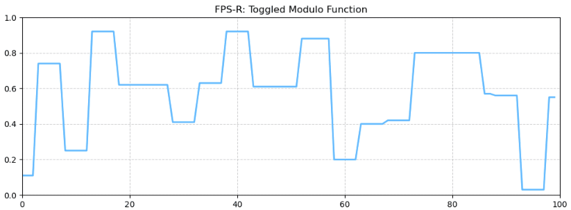
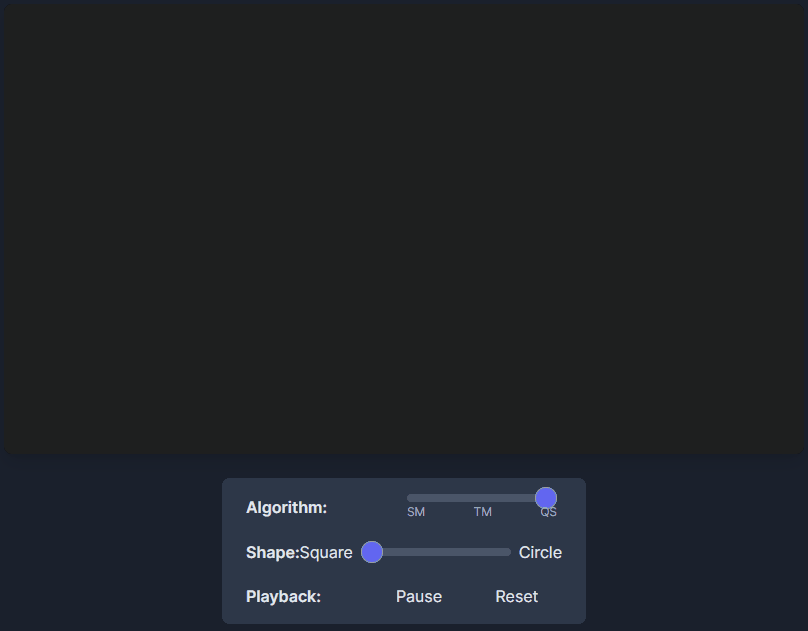

# FPS-R Technical Documentation
MIT License—[see LICENSE](../../LICENSE) for details.  
Copyright (c) 2025 Woo Ker Yang (Patrick Woo) patrickwoo.1976@gmail.com
If you reference or adapt this framework, please credit Patrick Woo and this repository.
**This documentation is still in development.** 
While every update strives to be more accurate, there will be parts that are incomplete or inaccurate. 


# Table of Contents

- [The Purpose of This Document](#the-purpose-of-this-document)
  - [A Word of Thanks](#a-word-of-thanks)
  - [⚖️ Attribution Note](#️-attribution-note)
  - [👥 Who This Document Is For](#-who-this-document-is-for)
- [Algorithmic Detail, Code Structure, Usage Notes](#algorithmic-detail-code-structure-usage-notes)
  - [🧾 Code Snippets Provided in this Repository](#-code-snippets-provided-in-this-repository)
- [FPS-R Introduction](#fps-r-introduction)
- [🔩 How FPS-R Works: The Core Principles](#-how-fps-r-works-the-core-principles)
    - [🧮 FPS-R Functions are Mathematically Pure](#-fps-r-functions-are-mathematically-pure)
- [⚙️ Key Features & Benefits](#️-key-features--benefits)
  - [🧠 Implicit Memory: The Illusion of Intent](#-implicit-memory-the-illusion-of-intent)
  - [🌐 Portable by Design: Cross-Platform Integrity](#-portable-by-design-cross-platform-integrity)
  - [⚡ Extremely Lightweight: Computationally Frugal](#-extremely-lightweight-computationally-frugal)
  - [⚖️ FPS-R Plays Well with Others: Safe Composability](#️-fps-r-plays-well-with-others-safe-composability)
    - [Playing Well with Everybody](#playing-well-with-everybody)
    - [The Stateful Wrapper: Achieving Determinism with Memory](#the-stateful-wrapper-achieving-determinism-with-memory)
    - [Deterministic Rules, Even When They Change](#deterministic-rules-even-when-they-change)
    - [Playing Better with Stateless Operators](#playing-better-with-stateless-operators)
- [🧠 The FPS-R Design Philosophy](#-the-fps-r-design-philosophy)
  - [🧮 Input `frame` as an Integer](#-input-frame-as-an-integer)
    - [🧭 Integer `Frame` Input: The Gun Analogy](#-integer-frame-input-the-gun-analogy)
  - [🧭 FPS-R: The Naïve Framework](#-fps-r-the-naïve-framework)
  - [🗂️ FPS-R: The Indexer](#️-fps-r-the-indexer)
  - [📊 Putting It Altogether: A Game Theory Tactical Simulation Example](#-putting-it-altogether-a-game-theory-tactical-simulation-example)
    - [The Brief - Missile Incoming](#the-brief---missile-incoming)
    - [The Possible Defense Strategies](#the-possible-defense-strategies)
    - [The Adversary: Brings Its Own Surprise](#the-adversary-brings-its-own-surprise)
    - [⚡ Observable Points from the Example](#-observable-points-from-the-example)
    - [🧠 The Takeaway: FPS-R as a Universal, Domain-Agnostic Phrasing Primitive](#-the-takeaway-fps-r-as-a-universal-domain-agnostic-phrasing-primitive)
    - [🎲 How to Adopt FPS-R in Your Domain](#-how-to-adopt-fps-r-in-your-domain)
- [🌀 How It Works: Stacked Modulo (SM)](#-how-it-works-stacked-modulo-sm)
  - [SM: Core Mechanism](#sm-core-mechanism)
  - [SM Behaviour](#sm-behaviour)
- [🔀 How It Works: Toggled Modulo (TM)](#-how-it-works-toggled-modulo-tm)
  - [TM: Core Mechanism](#tm-core-mechanism)
  - [TM: Behaviour](#tm-behaviour)
- [🎚️ How It Works: Quantised Switching (QS)](#️-how-it-works-quantised-switching-qs)
  - [QS: Core Mechanism](#qs-core-mechanism)
  - [QS: Behaviour](#qs-behaviour)
  - [QS: Advanced Forms and Features](#qs-advanced-forms-and-features)
- [Combining FPS-R Algorithms](#combining-fps-r-algorithms)
  - [FPS-R Algorithms Working Together](#fps-r-algorithms-working-together)
  - [FPS-R Algorithms Working with Other Algorithms](#fps-r-algorithms-working-with-other-algorithms)
- [Show Me the Code!](#show-me-the-code)
- [🧱 Stacked Modulo (SM)](#-stacked-modulo-sm)
- [Stacked Modulo (SM) One-Line Compact Form](#stacked-modulo-sm-one-line-compact-form)
  - [Stacked Modulo (SM) One-Line Mathematical Model](#stacked-modulo-sm-one-line-mathematical-model)
  - [Stacked Modulo (SM) One Line Code in C](#stacked-modulo-sm-one-line-code-in-c)
  - [🧩 Stacked Modulo (SM) One-Line - Component Breakdown](#-stacked-modulo-sm-one-line---component-breakdown)
  - [SM Mechanism: Hold vs. Jump in the One-Liner](#sm-mechanism-hold-vs-jump-in-the-one-liner)
    - [SM One-Line: When does the value HOLD?](#sm-one-line-when-does-the-value-hold)
    - [SM One-Line: When does the value JUMP?](#sm-one-line-when-does-the-value-jump)
    - [SM One-Line: When Does the HOLD DURATION Change?](#sm-one-line-when-does-the-hold-duration-change)
- [Stacked Modulo (SM) Expanded Form](#stacked-modulo-sm-expanded-form)
  - [Stacked Modulo (SM) Expanded Mathematical Model](#stacked-modulo-sm-expanded-mathematical-model)
  - [Stacked Modulo (SM) - A Defined Function](#stacked-modulo-sm---a-defined-function)
  - [A Sample Call to the FPS-R:SM Function](#a-sample-call-to-the-fps-rsm-function)
  - [🧩 SM Function - Component Breakdown](#-sm-function---component-breakdown)
  - [SM Function: Stacked Rhythms and Hashing](#sm-function-stacked-rhythms-and-hashing)
  - [SM Function: When Does the Value Hold vs. Jump?](#sm-function-when-does-the-value-hold-vs-jump)
    - [SM Function: When does the random value HOLD?](#sm-function-when-does-the-random-value-hold)
    - [SM Function: When does the random value JUMP?](#sm-function-when-does-the-random-value-jump)
  - [SM Function: Summary of the "Random Move-and-Hold" Behaviour](#sm-function-summary-of-the-random-move-and-hold-behaviour)
  - [SM: The `portable_rand` Helper Function](#sm-the-portable_rand-helper-function)
    - [SM: Using a Custom Random Number Generator](#sm-using-a-custom-random-number-generator)
  - [SM - Note on Typical Application](#sm---note-on-typical-application)
  - [SM Summary: Behaviour of the Stacked Modulo Function](#sm-summary-behaviour-of-the-stacked-modulo-function)
    - [SM Summary: High-Frequency Modulation (Twitch & Impulse)](#sm-summary-high-frequency-modulation-twitch--impulse)
    - [SM Summary: Low-Frequency Modulation (Hesitation & Deliberation)](#sm-summary-low-frequency-modulation-hesitation--deliberation)
    - [SM Summary: Rhythmic Interference (Emergent Logic)](#sm-function-summary-of-the-random-move-and-hold-behaviour)
- [🔀 Toggled Modulo (TM)](#-toggled-modulo-tm)
- [Toggled Modulo (TM) One-Line Compact Form](#toggled-modulo-tm-one-line-compact-form)
  - [Toggled Modulo (TM) One-Line Mathematical Model](#toggled-modulo-tm-one-line-mathematical-model)
  - [Toggled Modulo (TM) One-Line Code in C](#toggled-modulo-tm-one-line-code-in-c)
  - [🧩 Toggled Modulo (TM) One-Line - Component Breakdown](#-toggled-modulo-tm-one-line---component-breakdown)
  - [Toggled Modulo (TM) Mechanism: Hold vs. Jump in the One-Liner](#toggled-modulo-tm-mechanism-hold-vs-jump-in-the-one-liner)
    - [TM One-Line: When does the value Hold?](#tm-one-line-when-does-the-value-hold)
    - [TM One-Line: When does the value JUMP?](#tm-one-line-when-does-the-value-jump)
    - [TM One-Line: When Does the HOLD DURATION Change?](#tm-one-line-when-does-the-hold-duration-change)
- [Toggled Modulo (TM) Expanded Form](#toggled-modulo-tm-expanded-form)
  - [Toggled Modulo (TM) - Expanded Mathematical Model](#toggled-modulo-tm---expanded-mathematical-model)
  - [Toggled Modulo (TM) - A Defined Function](#toggled-modulo-tm---a-defined-function)
  - [A Sample Call to the FPS-R:TM Function](#a-sample-call-to-the-fps-rtm-function)
  - [Toggled Modulo (TM) - Function Breakdown](#toggled-modulo-tm---function-breakdown)
  - [🧩 TM Function - Component Breakdown](#-tm-function---component-breakdown)
  - [TM Function: Toggled Rhythms and Hashing](#tm-function-toggled-rhythms-and-hashing)
  - [TM Function: When Does the Value Hold vs. Jump?](#tm-function-when-does-the-value-hold-vs-jump)
    - [TM Function: When does the value HOLD?](#tm-function-when-does-the-value-hold)
    - [TM Function: When does the value JUMP?](#tm-function-when-does-the-value-jump)
  - [TM Function: Summary of the "Random Move-and-Hold" Behaviour](#tm-function-summary-of-the-random-move-and-hold-behaviour)
  - [TM: The `portable_rand` Helper Function](#tm-the-portable_rand-helper-function)
    - [TM: Using a Custom Random Number Generator](#tm-using-a-custom-random-number-generator)
  - [🔀 TM Summary: Behaviour of the Toggled Modulo Function](#-tm-summary-behaviour-of-the-toggled-modulo-function)
    - [TM Summary: Rhythmic Stability (Clocked Alternation)](#tm-summary-rhythmic-stability-clocked-alternation)
    - [TM Summary: Long Hold Cycles (Pendulum Behaviour)](#tm-summary-long-hold-cycles-pendulum-behaviour)
    - [TM Summary: Offset De-Synchronisation (Subtle Expressivity)](#tm-summary-offset-de-synchronisation-subtle-expressivity)
- [🎚️ Quantised Switching (QS)](#️-quantised-switching-qs)
  - [Quantised Switching (QS) - Mathematical Model](#quantised-switching-qs---mathematical-model)
  - [Quantised Switching (QS) - Code](#quantised-switching-qs---code)
  - [A Sample Call to the FPS-R:QS Function](#a-sample-call-to-the-fps-rqs-function)
  - [🧩 QS Function - Component Breakdown](#-qs-function---component-breakdown)
  - [QS Function: Layered Rhythms and Hashing](#qs-function-layered-rhythms-and-hashing)
  - [QS Function: When Does the Value Hold vs. Jump?](#qs-function-when-does-the-value-hold-vs-jump)
    - [QS Function: When does the random value HOLD?](#qs-function-when-does-the-random-value-hold)
    - [QS Function: When does the random value JUMP?](#qs-function-when-does-the-random-value-jump)
  - [QS Function: Summary of the "Random Move-and-Hold" Behaviour](#qs-function-summary-of-the-random-move-and-hold-behaviour)
  - [QS Function: The `portable_rand` Helper Function](#qs-function-the-portable_rand-helper-function)
    - [QS Function: Using a Custom Random Number Generator](#qs-function-using-a-custom-random-number-generator)
  - [QS - A Note on Typical Application](#qs---a-note-on-typical-application)
  - [🎚️ QS Summary: Behaviour of the Quantised Switching Function](#️-qs-summary-behaviour-of-the-quantised-switching-function)
    - [QS Summary: High-Frequency Modulation (Glitch & Flicker)](#qs-summary-high-frequency-modulation-glitch--flicker)
    - [QS Summary: Low-Frequency Modulation (Stateful Drifting)](#qs-summary-low-frequency-modulation-stateful-drifting)
    - [QS Summary: Rhythmic Interference (Complex Textures)](#qs-summary-rhythmic-interference-complex-textures)

---
# The Purpose of This Document
This document explains and explores the algorithms that constitute **Frame-Persistent Stateless Randomisation (FPS-R)**. It breaks down the mechanics of its modulation logic—revealing how structure, randomness, and phrasing combine to form behaviour that feels intentional, yet requires no memory.

### A Word of Thanks
Thank you for taking the time to explore these notes on the algorithm and its inner workings. Whether you’re here out of curiosity, critique, or collaboration—welcome.

#### ⚖️ Attribution Note 
FPS-R is released under the MIT License, which means you're free to use it in commercial, private, and artistic projects without restriction.

In many contexts—SaaS platforms, embedded systems, or creative outputs like VFX shots, motion design, and procedural soundscapes—the code never ships. In those cases, attribution isn’t legally required.

But if FPS-R helped phrase the blink in your commercial, the irregular glitch in your shader, or the drift in your kinetic sculpture—it would mean a lot to be credited. Even a quiet mention in your documentation or acknowledgments helps others discover the grammar behind your motion.

> The code may stay invisible. But if the phrasing speaks? Give it a name.

### 👥 Who This Document Is For
This document is for anyone who wants to see what lives behind the phrasing.

🧑‍💻 Developers will find structured breakdowns of how randomness, modularity, and statelessness combine—ready for implementation across timelines, shaders, or signal streams.

🎨 Designers and motion artists who have used FPS-R instinctively can now peek behind the curtain—understanding what shaped the gestures they've phrased.

🧠 Thinkers, tinkerers, and curious system-builders are welcome too. If you’ve ever wondered how behaviour can breathe without memory—this is your invitation to explore.

> There’s no pre-requisite here—just an interest in what modulation can do when left to its own logic.

Come as you are. Stay as long as you like. The phrasing engine is always running.

### Algorithmic Detail, Code Structure, Usage Notes
In this document, we will unpack the FPS-R methods by deconstructing their code into modular components. Each section examines how a fragment contributes to the resulting phrasing—allowing you to understand, modulate, and compose behaviour with precision.

### 🧾 Code Snippets Provided in this Repository
The code examples in this repository are **platform-conscious**, not platform-specific. This is especially true for the C language implementation that has a diverse number of variants. Each snippet has been deliberately shaped for **clarity of intent**, avoiding language-dependent operators (like ternaries), environment-specific idioms, or dependency-bound functions. Where expressive quirks exist (e.g. modulus, quantisation rhythms), they are surfaced with **plain logic and comments that explain the phrasing**, not just the math.

These implementations prioritise **readability, reproducibility, and minimal refactoring cost** across most C-family and expression-bound languages—including C++, Java, JavaScript, GLSL, HLSL, MEL, and Houdini VEX.

While some language-specific adjustment may still be necessary—such as:
- Array declarations ([] vs {} syntax)
- Math operations (floor, mod, frac) depending on standard library access
- Type casting and rounding functions

…the core logic is designed to port cleanly, and has been tested for deterministic phrasing integrity across platforms.

> These snippets are not drop-in libraries—they're reference phrasing kernels. Use them to reconstruct modulation logic in your language of choice, knowing that the behaviour should survive the translation.

## FPS-R Introduction
### What is FPS-R?
FPS-R is Frame-Persistent Stateless Randomisation. 

The inspiration for FPS-R comes from a widely observed pattern of non-linear motion. This pattern, which I call the 'random move-and-hold,' appears to be remarkably scale-invariant. We can identify its signature across a vast spectrum of systems: from the microscopic level of cellular motion, to the group dynamics of animal flocks, all the way to the planetary scale of tectonic motion; from miniscule timescales of near-instantaneous jumps of quantum quarks, to hesitation and bursts of decisions in humans, to yearly indeterminate patterns of weather occurances, to continental reshaping across centuries, and planetary collapse, stars diminishment across billions of years. 

In each of these scenarios, we observe alternating periods of movement, progress, and activity, followed by periods of "holds", held states that persist, "pausing" with "hesitation", for a non-consistent and undeterminable periods of time, before further activity begin to happen again followed by a holding period of reduced action or motion again. 

This repeating structure—the unpredictably timed shift between action and pause—is what I call the **Random Move and Hold**.

> While FPS-R is not yet a fully formalized theory of emergent motion, its grammar reflects a recurring structural motif—a phrasing dynamic that appears to underlie diverse systems from quarks to collapses.

- **A grammar**, giving a language to describing this observed phenomenon of motion and timing in nature. This universal rhythm expands to human activity, social interaction, and organisational behaviour in growth and interaction with the larger world. **FPS-R** is the formal system that encodes this **"Random Move and Hold"** phenomenon into a programmable structure that can be described by mathematics.
- **A framework** of tools to enable mathematical models and software applications to articulate in this grammatical space, to describe the observed phenomenon of Move and Hold.
- A collection of **pure mathematical algorithms** and **programming functions** that enables the expression of this phenomenon through maths and computation. 

FPS-R is all of the above.

FPS-R expresses this phenomenon through the numerical grammar of random values that hold and jump with natural freedom. 

The tools feature parameters that allows for the intentional control and shaping of their output signals. Through these controls, FPS-R is able replicate and create a wide gamut of modulation phrasing behaviours, expressing movement and modulation of states in scenarios across wide-ranging time-frames:
- micro-seconds: the bursts and holds of human eye saccades, "instantaneous" change of positions and flight paths in small insects like mosquitoes and flies
- real-time: expression of decisions and hesitations in a chess game by players.
- weeks/months: animal migration patterns that are non linear in direction and progression.
- decades: simulating the progressive growth of organic vegetation reclaiming abandoned structures, or the weathering and erosion of geographic formations.
- centuries: tectonic shifts of the Earth's crust or volcanic activities. 

This modulated cadence and non-linearity is also expressed across spatial scales:
- Quantum and Molecular scales: quantum particles exhibit unpredictable movements and molecular interactions 

> On Universality: FPS-R doesn’t invent the “Random Move and Hold” pattern—it formalizes it. Across nature, cognition, and synthetic systems, this rhythm appears again and again. FPS-R provides the mathematical and programmatic lens to describe it—faithfully, portably, and at any scale.

In all these cases, the FPS-R signals can configured to trigger and select from a variety of discrete states across a variety of intensities. These can then simulate, emulate observed and recorded phenomenon, and even create new situations to study what-if scenarios.

In fact, the FPS-R framework comprises of 3 characteristically distinct algorithms that achieve the Random Move and Hold phenomenon while preserving a set of core algorithmic properties — **stateless**, **deterministic** and **traceable**.

The FPS-R framework is designed to produce pseudo-random values that remain constant for a specific, but randomly determined, duration. This "frame persistence" is essential for applications with simulated organic behaviour, such as:
- natural motion in robotics, 
- human-like hesitation and feeling of intent in game theory and strategic planning and simulations, 
- natural agents in games, animation, visual effects, 
- natural occurrences and organic variation in procedural content generation
- unpredictable, deterministic stateless output yet traceable and repeatable for stress testing (software, complex systems, cyber-security) for unpredictable situations and adaptability studies and analysis
- natural attention shifts and focus drifts in intelligent cognitive systems.
> For a full list of suggested applications please visit [FPSR_Applications](FPSR_Applications.md)

In these cases, randomness in output is not the only desired component.

_When_ these random outputs change their values also makes a huge difference. These random values that hold for pseudo-random periods of time need to be stable from one frame to the next during their holding periods to create coherent and structured results. 

## 🔩 How FPS-R Works: The Core Principles
At their centre, FPS-R algorithms are designed and built around these core principles.

### 🧩 Deterministic: Perfect Repeatability
With the same inputs—such as frame, modulation ranges, and seed—FPS-R will always produce the exact same output. This ensures reproducible behavior across simulations, systems and operating platforms. It also enables reliable debugging, and composable structure.

### 🧳 Stateless: No Memory Required
FPS-R evaluates in-place, without any dependency on past or future frames. It doesn't track history, carry memory between evaluations, or require temporal recursion. Each result is derived solely from the current coordinate and parameters. This makes FPS-R highly portable across parallel systems, shader environments, and reactive pipelines.

### 🧮 Mathematically Pure: Safe and Predictable
All core FPS-R functions are pure mathematical algorithms. They are deterministic and have no side effects, meaning they do not alter global state, write to disk, or mutate their inputs. This purity guarantees repeatability, composability, and safety in any environment.

The result yields a surprising property, enabling a kind of expressive paradox: **discontinuities feel intentional**, and **apparent memory without simulation**. 

> Perceived temporal coherence from purely evaluative logic.

---
## ⚙️ Key Features & Benefits
The core principles behind FPS-R algorithms unlock powerful and unique uses cases that emerge from them.

### 🧠 Implicit Memory: The Illusion of Intent
The emergence of "memory" is implicit and inherently encoded into the algorithm's output. This creates the effect of **Memoryless Mimicry**—a system that feels like it remembers and holds values for a duration, all without using any stateful techniques or simulation buffers.

### 🌐 Portable by Design: Cross-Platform Integrity
The framework was developed to be compatible with a wide number of languages and platforms. The code is intentionally "platform-conscious, not platform-specific," using plain logic and fundamental operations to ensure the core phrasing ports cleanly to C++, JavaScript, GLSL, VEX, MEL, and more.

### ⚡ Extremely Lightweight: Computationally Frugal
The framework is highly efficient by design, making it suitable for real-time applications and performance-critical environments. This is achieved through:
- **Integer-Based Core:** An intentional use of integer math for core timing and state logic avoids common floating-point inaccuracies and is computationally efficient.
- **Simple Functions:** It relies on pure, uncomplicated math functions (`sin`, `floor`, `%`(modulo)) with no heavy dependencies or external libraries.
- **Modular Randomness:** FPS-R includes a lightweight, deterministic random generator (`portable_rand()`), designed for portability and predictability across platforms. This enables consistent pseudo-random behavior without external dependencies. For domains requiring cryptographic strength, domain-specific entropy, or proprietary randomness, `portable_rand()` can be seamlessly replaced with a custom generator—without disrupting the framework’s stateless core.

### 📈 Scalable Functionality: Power on Demand
The framework is designed to be scalable, offering advanced features with additional, optimised computation overheads. A **Level of Detail (LOD)** parameter allows users to request deeper analysis only when needed, giving them direct control over the performance/power trade-off. This unlocks powerful features such as:
- **`has_changed` awareness** to indicate when the value has changed from the previous frame.
- **Normalised hold-cycle progress awareness** a value of (0.0 to 1.0) to indicate the progress of the current frame through the current holding period. _(yet to implement)_
- **Last-changed and next-change frame awareness** to be able to give explicit frame numbers for the start and end of the current hold cycle. _(yet to implement)_
- **Next Segment Random Value** returns the next random value that will be produced at the next-change frame. _(yet to implement)_
- **Last and Next Segment look-back and look-ahead** an even deeper insight (more compute overheads) into the previous hold segment and the next hold segment. _(yet to implement)_

### ⚖️ FPS-R Plays Well with Others: Safe Composability
#### Playing Well with Everybody
As a modulation framework that adds to the behaviour of larger systems, it can create its deterministic move-and-hold behaviour in both stateful and stateless environments.

#### The Stateful Wrapper: Achieving Determinism with Memory
A common and powerful pattern is to use FPS-R as a "suggestion engine" inside a larger, stateful system that holds memory and enforces rules. Even though the parent system is stateful, the entire process remains **100% deterministic and reproducible** if the rules are consistent.

Consider a system modelling a phenomenon that can only progress forward, like erosion depth or resource accumulation. The parent system remembers the previous value and uses it to validate FPS-R's suggestion.

```c
// State stored by the parent system
float previous_value = get_previous_state();

// 1. Get the raw, stateless suggestion from FPS-R
float suggested_value = fpsr_sm(frame, ...);

// 2. The parent system applies its deterministic rule
float final_value;
if (suggested_value < previous_value) {
    // Rule: "This phenomenon can only progress forward."
    // Decision: Ignore the suggestion and hold the state.
    final_value = previous_value;
} else {
    // Rule: "Forward progress is allowed."
    // Decision: Accept the new state.
    final_value = suggested_value;
}

// 3. Deterministically update the state for the next frame
store_current_state(final_value);

```
This combined system is guaranteed to be reproducible because every step in the causal chain is deterministic: the source (FPS-R), the rules (the `if` statement), and the state update.

#### Deterministic Rules, Even When They Change
This principle of reproducibility extends even further. The rules within the stateful wrapper do not have to be fixed; they can be dynamic and variable, and the entire system will `still` remain deterministic, as long as the process driving the rule changes is also deterministic.

For example, the threshold for accepting a new value could be modulated by a second, independent FPS-R function.
```c
// State stored by the parent system
float previous_value = get_previous_state();

// 1. Get the raw, stateless suggestion from FPS-R:SM
float suggested_value = fpsr_sm(frame, ...);

// 2. Get a dynamic threshold from another FPS-R function
float dynamic_threshold = fpsr_tm(frame, ...); // This rule now changes over time

// 3. The parent system applies its DYNAMIC but DETERMINISTIC rule
float final_value;
if (suggested_value < dynamic_threshold) {
    // Rule: "The suggestion is below our current modulated threshold."
    // Decision: Ignore the suggestion.
    final_value = previous_value;
} else {
    // Rule: "The suggestion is acceptable."
    // Decision: Accept the new state.
    final_value = suggested_value;
}

// 4. Deterministically update the state for the next frame
store_current_state(final_value);
```
This entire system, with its nested modulations and stateful memory, remains perfectly reproducible. Determinism is preserved across the entire chain because every component—the initial suggestion, the dynamic rule, and the state update—is itself deterministic. This demonstrates the profound composability of the framework, allowing for incredibly complex and layered behaviours that are still fully traceable and repeatable.

#### Playing Better with Stateless Operators
The true power of FPS-R’s stateless determinism emerges when paired with other stateless systems. In such a case, **the final result will be equally stateless**.

> The section “**Combining FPS-R Algorithms**” explores how these principles can be layered, stacked, and merged with other systems to unlock deeper phrasing behaviour.

## 🧠 The FPS-R Design Philosophy
### 🧮 Input `frame` as an Integer
In FPS-R, the decision to use integer frame inputs is foundational. While floating-point values offer infinite granularity, they also introduce ambiguity - there’s always a finer resolution, always another decimal. This makes phrasing boundaries fuzzy and undermines the determinism FPS-R is built on.

#### 🧭 Integer `Frame` Input: The Gun Analogy
Think of it like observing a gun. At one zoom level, it’s a single object. Zoom in, and it’s a 17-part assembly. Zoom further, and you see grime, molecules, even air particles within its volume. The question “what is one gun?” depends entirely on your observational scale. Floats behave the same way: there is no fixed boundary, only deeper zoom.

By contrast, integer frames commit to a phrasing resolution. They define exact modulation points, align with system architecture’s compute units, and allow phrasing to be auditable, reproducible, and expressive. In a world of infinite density, integers give FPS-R the courage to phrase with clarity.

> **Zoom Level** The conceptual granularity at which a unit is observed. In FPS-R, integer frames represent discrete phrasing steps. Floating-point frames introduce ambiguity, akin to observing an object at molecular or subatomic resolution. The choice of unit reflects the system’s epistemic boundary.

### 🧭 FPS-R: The Naïve Framework
FPS-R is built to be naïve. It does not—and should not—know what a `frame` means to the parent system that calls it.

The term frame can be misleading. It suggests a passage of time, as in frames-per-second. But in FPS-R, a frame is not time—it’s a **step**. A unit of phrasing. What that unit represents—seconds, beats, ticks, or epochs—is entirely up to the parent system.

That’s why we call it the **internal unit**. FPS-R increments its phrasing timeline by **one internal unit per call**. It has no awareness of domain semantics. The parent system holds that context and interprets the phrasing output accordingly.

Originally designed to run every frame in a real-time system—evaluating phrasing holds and jumps for random values—FPS-R has since evolved into a **domain-agnostic phrasing engine**. Because it knows nothing about any domain, it can be used in every domain.

The responsibility for domain knowledge lies entirely with the parent system. FPS-R is invoked within that context, and the `randVal` it returns is interpreted through the lens of the parent’s **domain unit**. One internal unit might represent a complete orbit around the sun, an audit cycle, a training epoch, a pregnancy trimester, the meantime between system updates, a threat level escalation, or the distance of one light-year. FPS-R doesn’t know—but it phrases with precision.

To use FPS-R in a meaningful way, every step increment should be exactly one internal unit. The previous phrasing step is frame - 1, and the next is frame + 1. In that way, it is possible to check if the previous frame has changed in a stateless and straightforward manner. In fact we can query the entire future and history of the FPS-R timeline by supplying a **domain time unit**.

### 🗂️ FPS-R: The Indexer 
Due to its inherently domain-agnostic nature, FPS-R can be conceptualised as an infinitely long, perfectly discrete array of values. When a parent system interacts with FPS-R, it's essentially using a domain-specific index to look up a value on FPS-R's internal timeline. Each increment in this internal timeline is precisely **1 internal unit**, and FPS-R's functions are designed to operate solely within this defined internal context.

The responsibility for interpreting these 1-unit increments and for managing domain-specific knowledge and context rests entirely with the parent system. This clear separation allows FPS-R to remain untangled from external definitions of time or meaning, making it universally applicable across diverse domains.

### 📊 Putting It Altogether: A Game Theory Tactical Simulation Example
#### The Brief - Missile Incoming
Imagine a game theory simulation where a defending country reaches DEFCON 4 as an enemy missile is launched. The parent system of the defending country initiates a T-minus 30-minute countdown.

As the missile enters striking range, within 20 minutes of contact, FPS-R activates. The parent system, now operating on a "minute-to-contact" domain unit, begins querying FPS-R. For instance:

- At T-minus 20 minutes, the parent system calls FPS-R with `frame = 0`.
- At T-minus 19 minutes, it calls FPS-R with `frame = 1`.

And so on, with each increment of FPS-R's internal `frame` representing one minute in the tactical countdown.
#### The Possible Defense Strategies
Within this scenario, FPS-R might deterministically decide to hold on deploying sea-to-air missiles from its navy fleet for three domain units (three minutes). Then, in the next two domain units, it shifts to intercepting with air defense, deploying a squadron of fighter jets. As the missile enters T-minus 15 minutes and moves over land, the parent system dynamically updates its available defensive options. FPS-R's `randVal` output, still between 0 and 1, is now mapped to a new discrete list of actions, potentially selecting ground-based surface missiles or even gatling cannons.
#### The Adversary: Brings Its Own Surprise
In a sophisticated simulation, the invading missile could also have its own strategising mechanism driven by FPS-R. It might operate on a different domain unit. Missile timer has started at launch, so it is now 15 minutes since launched and increasing. It is running on 4-minute cycles with a different seed and FPS-R parameters. This would invoke a different rhythm of decision, expressing itself as different character, personality and emergent strategy. With these differences, the missile hold its current course steady, or it may decide to drop its altitude to minimise its radar signature, or may decide to change its phrasing and course-divert to a densely populated city center instead of a military installation.

At the end of any scenario run, FPS-R's core strength becomes evident: it can precisely repeat every decision made by both sides. This is how FPS-R brings unique value to the table, enabling the exact reproduction and analysis of complex, human-like unpredictability that traditional pre-programmed or standard random methods cannot offer. It allows for auditing not just the outcome, but the deterministic emergence of strategic behavior.

#### ⚡ Observable Points from the Example
The example above serves to illustrate the synergetic collaboration between the parent system and FPS-R. Here are a few points that can be observed. 
- **Different Timelines and Timing policies:**
    - **for the missile** - called once every 4 minutes
        - Missile Time: expressed as incrementing in minutes since launch, ie T-30 at defending country's clock.
        - FPS-R Time-Step: passed into FPS-R as incrementing from 0 since launch.
    - **for the defending country** - called once every minute
        - Simulator Time: expressed as decrementing T-minus minutes
        - FPS-R Time-Step: passed into FPS-R as incrementing since defending country's clock at T-20 minutes.
- **The Separation of Concerns** between domain knowledge and FPS-R returns.
    - **The Simulator's Concerns** are to know and keeps separate timelines between the defending country as well as the attacking missile, managing each entity's domain timeline simultaneously.
    - **FPS-R Concerns** to faithfully generate phrasing random move and hold values across its internal time when called.
- **Call When Needed** If the simulator was running at 25 frames-per-second, or ticks, or timesteps, _FPS-R does not need to be called every step_.
- **Domain Handling of FPS-R Return Values**
    - **FPS-R's Role** given the internal unit `frame` and input parameters, produce random holding values between the range of `0` and `1`.
    - **Parent System's Role** Apply those returned values by mapping them to a list of options explicitly available to each agent in the simulation:
        - **defending country** naval fleet, air force, ground defenses, etc.
        - **attacking missile** target options (populated city centre, military installation), normal altitude, low altitude stealth mode.
---
#### 🧠 The Takeaway: FPS-R as a Universal, Domain-Agnostic Phrasing Primitive

The wargame scenario demonstrates how to integrate FPS-R as a smart, stateless primitive to drive complex, human-like timing in any system. In that example, a parent simulation engine used FPS-R to model the strategic decisions of two competing agents, turning a predictable countdown into a dynamic and analyzable tactical "dance."

This pattern can be adapted to any domain. FPS-R is intentionally "ignorant" of your specific context—whether you're modeling time, space, or a cognitive state. It simply provides a deterministic, phrased rhythm that your application can interpret.

#### 🎲 How to Adopt FPS-R in Your Domain
Integrating FPS-R into your project is straightforward because its design is fundamentally flexible:

* **Map Its Timeline to Yours**: You decide what an FPS-R `frame` means. It can be a literal frame, a second, a musical bar, or a turn in a game. You can call it as often or as infrequently as your logic requires; FPS-R will maintain a consistent output for any given `frame` number.

* **Quantize Its Output**: FPS-R returns a normalized float between 0 and 1. Your application is responsible for mapping this value to a discrete set of actions. You can easily quantize this output into however many options you need—two, ten, or a thousand—and you can dynamically change what those options are, just as the wargame scenario added new defenses when the missile moved over land.

* **Apply It to Any Dimension**: Because FPS-R is fundamentally a 1D signal generator, its input `frame` can represent any continuous axis. This allows for wide application across different domains:
    * **Temporal**: Animating character behavior over time.
    * **Physical**: Generating procedural textures or displacing geometry across a surface.
    * **Cognitive**: Guiding an AI's attention or decision-making process through a latent space.

---
## The 3 FPS-R Algorithms
Given their common properties of stateless determinism, the 3 FPS-R algorithms have distinct personalities. Each algorithm offers a unique flavour of motion and randomness, providing a versatile toolkit for artists and developers. By understanding their individual characteristics, users of the framework can select the perfect tool to bring their creative vision to life, whether it requires organic subtlety, mechanical precision, or chaotic energy.

### FPS-R Algorithmic Characteristics and Personalities
Here is a memorable way to describe the algorithms and their characteristics.

#### Stacked Modulo (SM) - The Animist
_**Stacked Modulo** breathes organic life into things._

This is the most natural and foundational expression of the FPS-R trio. By using interference between two asynchronous hold cycles, SM creates the **Random Move and Hold** pattern. One cycle, the "inner clock," uses randomness to decide _how long_ a value should be held. A separate "outer clock" then determines _what_ that held value should be. Because the duration of the hold is itself unpredictable, the resulting animation feels fluid and non-repetitive, like the subtle, shifting stillness of a living creature.

> The Stacked Modulo is the result of my original intent when developing the FPS-R.

#### Toggled Modulo (TM) - The Choreographer
_**Toggled Modulo** creates deliberate, controlled, rhythmic motion._

This algorithm achieves its character by switching between two specific, pre-defined hold durations (`periodA` and `periodB`). The switch itself also runs on its own fixed-period cycle. The result is a multi-layered tempo; it's like a metronome controlling another metronome. This produces a pattern that is still complex but has a fundamentally predictable and mechanical cadence. This makes TM the perfect choice for creating animations that feel intentional, rhythmic, or machine-like.

> The Toggled Modulo is the first algorithm to emerge, yet it is the earliest form of technique I was already using in my work even before the discovery of the Stacked Modulo. Only when I tried to formalise it into an expression that I realised it was unique, and an even earlier predecessor of the SM. 

#### Quantised Switching (QS) - The Mercurial Shape-Shifter
_**Quantised Switching** changes identity and texture on the fly with eager spontaneity._

This is the most flexible and configurable FPS-R algorithm, with the greatest potential for a wide variety of output characteristics. Its complexity is its strength. QS generates two independent, underlying sine waves and rapidly switches between them. But its true power comes from its ability to constantly alter the "texture" of each wave. At its own rhythmic interval, each stream randomly chooses a new quantisation level from within a user-defined range, fundamentally changing its shape. This constant evolution of form and identity makes QS ideal for creating glitchy, energetic, or highly textured effects that feel spontaneous and alive.

### Possible Use Cases for These Personalities
Given the distinct characteristics of these algorithms, they may lend themselves to use cases like these: 
- Do I want a smoother, more flowing hold-and-release? Use **Stacked Modulo**.
- Do I want a rhythmic, predictable, mechanical pulse? Use **Toggled Modulo**.
- Do I want a glitchy, textured, more organic flicker? Use **Quantised Switching**.

---
## 🌀 How It Works: Stacked Modulo (SM)
SM uses **layered modulus operations** combined with shifting `rand()` seeds to create output that seems to "hold" values across multiple frames or spatial coordinates. The result: a pattern of persistent values interrupted by unexpected jumps.

### SM: Core Mechanism
The Stacked Modulo (SM) method generates its unique "move-and-hold" rhythm through a nested, procedural process. Instead of using fixed holding zones, it creates a variable-length rhythm where the duration of each hold is itself determined by a nested FPS-R pattern.
1. **Procedural Hold Duration**  
   At the core of the function, a simple, high-frequency FPS-R pattern generates a random value. This value is then used to calculate an adaptive hold duration, H, that falls between a defined `minHold` and `maxHold`. This `H` value itself holds steady for a short period before being re-randomised.
2. **Variable-Length Modulo Cycle**
   This procedurally generated hold duration, `H`, is then used as the modulus in the main timing operation (`frame % H`). This creates a primary rhythmic cycle whose length is not constant but changes dynamically over time.

3. **Phase-Shifted Seeding**
   The result of this variable-length modulo is used to create a phase-shifted offset. This offset is subtracted from the main `frame` counter to produce a final, complex seed. It is this constantly shifting, rhythmically inconsistent seed that is fed into the final `rand()` function to produce the output.

### SM: Behaviour
- Short mod spans → twitchy impulse
- Long mod spans → hesitant deliberation
- Layered mods → emergent switching logic, without simulation

---
## 🔀 How It Works: Toggled Modulo (TM)
Toggled Modulo introduces phrasing through an intricate dance of timing streams. While its output feels rhythmically coherent, there’s no single metronome. Instead, TM weaves its behaviour from three interplaying mechanisms: two timeline streams that each oscillate using distinct cycles, and a switching logic that chooses which stream is active. All are offset in time, subtly misaligned, and deterministically entangled.

This design does not aim for mechanical regularity—in fact, it avoids it. With the misalignment and interplay of 3 timelines, TM instead embraces rich, layered modulation. The rhythm that switches and jumps feels structured _underneath_, but not rigid. The result: phrasing that flickers between stability and volatility.

### TM: Core Mechanism
The behaviour of TM emerges from three interacting rhythms:
1. **Dual Modulation Streams** TM maintains two independent signal flows, each pulsing with its own periodicity. Their cycle durations differ, and their timelines are offset—creating intentional phase misalignment. Each stream alone would produce a steady pattern, but when observed together, they offer richness through asynchronous interplay.
2. **Timed Stream Switching** A third rhythm enters the mix—a deterministic switcher that evaluates which stream is active at any given moment. This switcher operates on its own cadence, also offset from the two streams it’s choosing between. At first glance, it seems simple: flip between stream A and stream B. But because each stream may be mid-cycle, and the switcher itself is phased, the transitions often catch the signal off-balance.
3. **Hold Phase Conditions** A "hold"—that signature FPS-R moment where the output remains constant through a continuous stretch of frames—is achieved only when the active stream and the switcher both happen to be within a stable segment. This alignment is rare, emergent, and fleeting. TM doesn't force stillness—it waits for it to emerge from coincidental overlap.

TM’s phrasing results from the consistent repetition of this structure—select a duration, hold it, switch to the next. This clocked logic produces predictable jumps and pauses, ideal for patterns that need to feel synchronized, mechanical, or digitally choreographed.

### TM: Behaviour
- At times, TM feels composed: values hover, transitions smooth, structure emerges.
- Then a switch lands mid-cycle, one stream jumps while the other holds, and the output twitches unpredictably.
- You’re never lost—but you’re not guided by a strict beat either. There’s phrasing, rhythm, and texture—but also tension and surprise.

While SM builds emergent rhythm through nested instability, TM offers a structured undercurrent amidst organic unpredictability. It doesn’t assert mechanical clockwork—it evokes it. There’s a ghost of regularity in the signal, hovering just beyond grasp. And that’s what makes TM unique: it channels determinism into volatility, and structure into expressive variability.

---

## 🎚️ How It Works: Quantised Switching (QS)

While SM focuses on **temporal rhythm**, QS enables **value switching** across discrete options—like glitch matrices, logic multiplexers, or stylistic gates. QS can use any input signal (not just random) and quantise it into hold states.

### QS: Core Mechanism

1. **Value Bank**  
   Define a set of discrete outcomes—values, palettes, animation states, functions.

2. **Signal Lookup**  
   Use a deterministic signal (random or procedural) to select an index:  
   `int index = floor(rand(@Frame) * numOptions);`  
   `output = valueBank[index];`

3. **Optional Quantisation**  
   Apply stepped or smoothed quantisation to the input signal to make transitions feel chunky, abrupt, or smooth.

### QS: Behaviour
- Acts like a **switcher**: swaps logic branches, colour palettes, or procedural regimes  
- (Time) Ideal for glitch logic, state machines, or recursive style variation
- (Space) Ideal for creating procedural geometrical structures.

### QS: Advanced Forms and Features
The form of the supplied QS function is only one of the possible forms it can take on. QS approaches stateless randomness differently—by layering continuous signal streams. When quantising and randomising stages are removed, it unlocks richly varied and often surprising behaviours. 

These features can also serve as debugging or visualising tools to reveal the characteristics of the streams of signals underneath to observe how it works before turning them off again for more controlled sculpting.
- Can bypass `rand()` entirely to create *structured switching* revealing the quantised signal streams—stepped but coherent—behind the `rand()` operation.
- Can bypass quantisation or posterisation entirely to reveal the original coherent continuous streams that feed the switcher. This will then become a very regular switching jump between 2 continuous signals.
- Can swap out the default sine wave streams for any signal generating function (noise, look-up array) to achieve completely different behaviours (in the temporal domain), and different aesthetic looks (in the spatial domain).

> QS is not about rhythm—it's about **selection**. And it works beautifully when combined with SM to modulate *when* changes happen, and *what* they reveal.

---
## Combining FPS-R Algorithms
### FPS-R Algorithms Working Together
FPS-R methods can be stacked, nested, or intertwined to unlock even richer phrasing behaviours.
- A Quantised Switching (QS) output can be fed into one or both frame inputs of a Stacked Modulo (SM) instance—overlaying unpredictable switching on top of rhythmic structure.
- Algorithms can also be self-nesting: QS driving QS, SM shaping SM—allowing phrasing to modulate itself recursively.

> Even when layered, the resulting motion remains deterministic, stateless, and reproducible. The phrasing may feel unpredictable—but it will always remember how it moved.

### FPS-R Algorithms Working with Other Algorithms
FPS-R plays well with others. As long as the external algorithms are **stateless and deterministic**, their outputs can be safely embedded or layered into FPS-R phrasing systems without breaking reproducibility.

Below is a non-exhaustive list of common stateless functions and procedural sources:

| Category | Stateless Function Examples |
| :--- | :--- |
| **Mathematical & Trigonometric** | `sin`, `cos`, `pow`, `sqrt`, `floor`, `ceil`, `round`, `min`, `max`, `clamp`, `abs`, `mod`, `frac`, `lerp`, `smoothstep` |
| **Procedural Noise & Patterns** | `Perlin Noise`, `Simplex Noise`, `Worley Noise (Voronoi)`, `Value Noise`, `Fractal Brownian Motion (fBm)` |
| **Hashing & Pseudo-Random** | `Seeded rand(seed)`, various hash functions that convert coordinates or seeds into repeatable numbers |
| **Geometric & Coordinate-Based**| `dot`, `cross`, `normalise`, `distance`, `length`, `SDFs (Signed Distance Functions)`, `Texture Lookups` |
| **Logic & Data Manipulation** | `step`, `mix`, `Bitwise Operations (AND, OR, XOR)` |

> ⚠️ When FPS-R algorithms are used alongside non-deterministic or stateful signal sources and operations, the resulting modulation history will not be traceable or reproducible. That may be an intentional choice—but it is worth mentioning here.

---
## Show Me the Code!
Implementation of the algorithms in a variety of software and environments. 

[**Code Implementations**](../code/) This high level directory in the repository contains the code implemented in several languages and platforms.

### 🧭 Source of Truth
The **C implementation** serves as the canonical reference for FPS-R algorithms. All new features, refinements, and core logic will be developed and validated in C first—then ported to other languages and environments.

If you encounter discrepancies between FPS-R outputs across platforms, or find that a feature isn’t yet supported in your language of choice, please consult the C code as the definitive source.

> Found a mismatch or bug in a ported version? Let me know so I can align and update it. 

### C (Source of Truth)
[**Code in C**](../code/c_reference/fpsr_algorithms_reference.c) FPS-R SM and QS in portable C code that would run with minimal modifications in many c-style languages. 

### Python
[**Code in Python**](../code/python/fpsr_algorithms.py) FPS-R SM and QS in a Python `.py` file.

### Jupyter Notebook
[**Code in Jupyter Notebook**](../code/python/fpsr_algorithms.ipynb) FPS-R SM and FPS-R QS Python code in notebook cells, in a visually pleasant layout. For the most intuitive and hands-on exploration, the Jupyter Notebook provides interactively scrollable graphs. This is the recommended way to visually understand the characteristics and "fingerprint" of each algorithm's output.  
 FPS-R: Stacked Modulo Timeline Graph Preview  

 FPS-R: Toggled Modulo Timeline Graph Preview  

 FPS-R: Quantised Switching Timeline Graph Preview  

> Note: Jupyter notebooks render only as static content on GitHub's web viewer. Interactive scrolling graphs for SM and QS will not show up. If you want to play around with the parameters and drive a different resulting curve, and inspect the scrolling graphs, please feel free to download the notebook and execute it on your local machine runnning Jupyter notebook on a Python 3.x kernal with the relevant dependencies (`Pandas` and `Matplotlib`). 

To access the read-only notebook with the interactive scrolling graphs, you can: [explore the interactive timeline in a Jupyter notebook on `nbviewer`](https://nbviewer.org/github/patwooky/FPSR_Algorithm/blob/main/resources/code/python/fpsr_algorithms.ipynb)
The interactive scrolling graphs are the last 2 cells at the end of the notebook.

### Interactive FPS-R WebGL Visualizer
A live, interactive demo of the FPS-R algorithms is available.

**[Click here to launch the visualizer](https://patwooky.github.io/FPSR_Algorithm/resources/code/glsl/fpsr_algorithms_webgl.html)**


### SideFX Houdini
[**Houdini `Vex` file**](../code/houdini/fpsr_algorithms.vex) This file contains the vex code for both `FPS-R: SM` and `FPS-R: QS` algorithms in a plain text file. 
[**Houdini `.hip` File**](../code/houdini/h_fpsr_code_v001_01.hip) This is a Houdini project file that has a geometry node. Inside are two `point wrangle` nodes that provide `FPS-R: SM` and `FPS-R: QS`. Both will produce a FPS-R signal to drive the y-axis position of a box.


### Autodesk Maya
[**Maya `.mel` Script**](../code/maya/fpsr_algorithms.mel) The Mel expressions, same as those used in the `.ma` file, but in a easy to read plain text format.
[**Maya `.ma` File**](../code/maya/fpsr_algorithms.ma) Maya file a group node. In its `attribute Editor -> notes section` there are the expressions for both `FPS-R: SM` and `FPS-R: QS`. There are also 2 boxes with expression-driven by the 2 FPS-R algorithms in their y- and z- position values.

---
## 🧱 Stacked Modulo (SM)
The Stacked Modulo (SM) algorithm generates a stable, persistent value by nesting two modulo operations. First, it calculates a random "hold duration" at a set interval. It then uses this duration to generate a stable integer value that persists for that period, resulting in an organic, unpredictable pattern.

The output is a function of a composite seed, which is the sum of multiple layered rhythm functions.

FPS-R:SM is presented here in two forms: a compact one-liner for expression-based systems, and an expanded function for readability and flexibility.

## Stacked Modulo (SM) One-Line Compact Form
This version is a highly compact form of the SM logic, suitable for environments that only allow for simple expressions, like shader node graphs or embedded systems.

### Stacked Modulo (SM) One-Line Mathematical Model
$$
S_H(t) = (t + O_o) - \left( (t + O_o) \pmod{ \lfloor H_{min} + \text{rand}(O_i + \lfloor \frac{t}{P_r} \rfloor \cdot P_r) \cdot (H_{max} - H_{min}) \rfloor } \right)
$$

Where:
- $S_H(t)$ is the stable integer state that is held.
- $t$ is the current time or frame number (`frame`).
- $O_o$ is the outer seed offset (`seedOuter`).
- $H_{min}, H_{max}$ are the min/max hold durations (`minHold`, `maxHold`).
- $\text{rand}(seed)$ is the random number generator (`portable_rand()`).
- $O_i$ is the inner seed offset (`seedInner`).
- $P_r$ is the reseed interval (`reseedInterval`).

### Stacked Modulo (SM) One Line Code in C
```c 
(seedOuter + frame) - ( (seedOuter + frame) % (minHold + floor( rand( (seedInner + frame) - ( (seedInner + frame) % reseedInterval) ) * (maxHold - minHold) ) ) )
```
At the heart, FPS-R:SM is a temporal modulation function, where the output adjusts the current frame value in a structured-random way. Let’s unpack it inside-out:

### 🧩 Stacked Modulo (SM) One-Line - Component Breakdown
#### High-Level Breakdown
The one-line expression achieves its "move-and-hold" behaviour by nesting several operations. 
1. From the inside out, it first establishes a rhythmic reseeding mechanism that determines when to calculate a new random hold duration. 
2. This duration is then used as the divisor in an outer modulo operation that creates the final stable, "held" value. 
3. The interference between these two nested rhythms is what produces the algorithm's signature organic pattern.

For a detailed, step-by-step analysis of how each mathematical component contributes to the final behaviour, please see the Component Breakdown section under the Expanded Form below.

### Stacked Modulo (SM) Mechanism: Hold vs. Jump in the One-Liner
The expression's behaviour is governed by the interplay between an "outer" and "inner" modulo operation.
- **The Outer Modulo:** `(seedOuter + frame) - ( (seedOuter + frame) % ...)` is the **primary engine for the jump**. It creates a ramping value that, when subtracted from `frame`, produces the stable "held" output.
- **The Inner Modulo:** `( (seedInner + frame) % reseedInterval) )` is the engine for the **reseed**. It ensures the `hold_duration` itself only changes at a fixed interval.

#### SM One-Line: When does the value HOLD?
The final output value holds steady only when **both** the inner and outer modulo operations are in a stable state. This occurs during the frames between jump events.

#### SM One-Line: When does the value JUMP?
A jump in the final output occurs if **either** the inner or outer modulo resets its cycle.
1. **Outer Modulo Jump (Natural Expiration):** The value jumps when the `frame` counter completes the current `hold_duration` cycle. This is the natural end of a hold period.
2. **Inner Modulo Jump (Forced Reseed):** The value also jumps every 10 frames when the inner modulo (frame % 10) resets. This forces a recalculation of the hold_duration. Because the system is stateless, the frame enters this new hold cycle at an arbitrary point, almost always resulting in an immediate change to the final output value.

#### SM One-Line: When Does the HOLD DURATION Change?
This is the "stacked" part of the algorithm. The length of the hold is determined by the `rand()` function. The seed for this function is controlled by the inner modulo (`frame % 10`). This means a new `hold_duration` is only calculated every 10 frames. **This creates the signature FPS-R rhythm**: the value jumps at a variable rate, and the rate of that variation itself changes at a fixed, slower interval.

## Stacked Modulo (SM) Expanded Form
While the one-line expression is powerful for compact implementations, the expanded function form is the recommended approach for most use cases as it offers several key advantages:
- **Conceptual Clarity and Readability:** Breaking the logic into distinct, commented steps (e.g., "Calculate Hold Duration," "Generate Stable State") makes the algorithm's intent transparent. Using named variables like `holdDuration` makes the code self-documenting and far easier to understand and maintain than a dense, nested expression.
- **Granular Control and Parameterization:** Exposing the algorithm's levers as named function arguments (`minHold`, `maxHold`, `seedInner`, etc.) provides a clear and direct interface for tuning the output. This structure makes it trivial to connect parameters to UI sliders, animation curves, or other external inputs, allowing for dynamic control over the algorithm's behavior.
- **Extensibility and Debugging:** The step-by-step structure is invaluable for development. It allows a developer to easily insert print statements to inspect intermediate values (like the calculated `holdDuration`) to "see" the rhythm. Furthermore, it provides a clean architecture for adding new features. The `finalRandSwitch` bypass, for example, is a simple `if/else` block in this form but would be extremely convoluted to implement in the one-liner.

### Stacked Modulo (SM) Expanded Mathematical Model
<!-- latex markdown -->
$$
D(t) = \lfloor H_{min} + \text{rand}(O_i + \lfloor \frac{t}{P_r} \rfloor \cdot P_r) \cdot (H_{max} - H_{min}) \rfloor
$$
$$
S_H(t) = \lfloor \frac{t + O_o}{D(t)} \rfloor \cdot D(t)
$$
$$
f(t)_{\text{SM}} =
\begin{cases}
\text{rand}(S_H(t)) & \text{if finalRandSwitch} = 1 \\
S_H(t) & \text{if finalRandSwitch} = 0
\end{cases}
$$

Where:
- $t$ is the current time or frame number (`frame`).
- $\text{rand}(seed)$ is the random number generator (`portable_rand()`).
- $H_{min}, H_{max}$ are the min/max hold durations (`minHold`, `maxHold`).
- $P_r$ is the reseed interval (`reseedInterval`).
- $O_i$ is the inner seed offset (`seedInner`).
- $O_o$ is the outer seed offset (`seedOuter`).
- $D(t)$ is the calculated hold duration.
- $S_H(t)$ is the stable integer state that is held.

### Stacked Modulo (SM) - A Defined Function
This is a more readable and flexible implementation of the same core logic. It breaks the process into clear, understandable steps with named variables and parameters for greater control.

The function is defined in C and should be portable across languages and platforms.
```c
/**
 * @file fpsr_algorithms.c
 * @brief Portable C implementation of FPS-R: Stacked Modulo (SM) algorithm
 * @details This file contains the stateless, frame-persistent randomisation Stacked Modulo algorithm.
 * It uses a custom portable_rand() function to ensure deterministic and
 * consistent results across any platform.
 */

#include <math.h> // For sin() and floor()
#include <stdio.h> // For NULL

/**
 * A simple, portable pseudo-random number generator.
 * @brief Generates a deterministic float between 0.0 and 1.0 from an integer seed.
 * @param seed An integer used to generate the random number.
 * @return A pseudo-random float between 0.0 and 1.0.
 */
float portable_rand(int seed) {
    // A common technique for a simple hash-like random number.
    // The large prime numbers are used to create a chaotic, unpredictable result.
    // The frac() part (or fmod(x, 1.0)) ensures the result is in the [0, 1) range.
    float result = sin((float)seed * 12.9898) * 43758.5453;
    return result - floor(result);
}


 /******************************************************************************/
 /* FPS-R: Stacked Modulo (SM)                            */
 /******************************************************************************/
 
 /**
  * @brief Generates a persistent random value that holds for a calculated duration.
  * @details This function uses a two-step process. First, it determines a random
  * "hold duration". Second, it generates a stable integer for that duration,
  * which is then used as a seed to produce the final, held random value.
  *
  * int frame: The current frame or time input.
  * int minHold: The minimum duration (in frames) for a value to hold.
  * int maxHold: The maximum duration (in frames) for a value to hold.
  * int reseedInterval: The fixed interval at which a new hold duration is calculated.
  * int seedInner: An offset for the random duration calculation to create unique sequences.
  * int seedOuter: An offset for the final value calculation to create unique sequences.
  * int finalRandSwitch: A flag that can turn off the final randomisation step.
  * return 
  *     when finalRandSwitch is 0: 
  *         An integer value representing the currently held frame 
  *         that remains constant for the hold duration.
  *     when finalRandSwitch is 1: 
  *         A float value between 0.0 and 1.0 that remains constant for the hold duration.
  */
float fpsr_sm(
    int frame, int minHold, int maxHold,
    int reseedInterval, int seedInner, int seedOuter)
{
    // --- 1. Calculate the random hold duration ---
    if (reseedInterval < 1) { reseedInterval = 1; } // Prevent division by zero.

    float rand_for_duration = portable_rand(seedInner + frame - (frame % reseedInterval));
    int holdDuration = (int)floor(minHold + rand_for_duration * (maxHold - minHold));

    if (holdDuration < 1) { holdDuration = 1; } // Prevent division by zero.

    // --- 2. Generate the stable integer "state" for the hold period ---
    // This value is constant for the entire duration of the hold.
    int held_integer_state = (seedOuter + frame) - ((seedOuter + frame) % holdDuration);

    // --- 3. Use the stable state as a seed for the final random value ---
    // Because the seed is stable, the final value is also stable.
    float fpsr_output = 0.0;
    if (finalRandSwitch) {
        // If finalRandSwitch is true, we apply the final randomisation step.
        fpsr_output = portable_rand(held_integer_state);
    } else {
        // If finalRandSwitch is false, we return the active stream value directly.
        fpsr_output = held_integer_state; 
    }
    return fpsr_output;
}
```

### A Sample Call to the FPS-R:SM Function
```c
// Sample code to call the FPS-R:SM function
// Parameters
int frame = 100; // Replace with the current frame value
int minHoldFrames = 16; // probable minimum held period
int maxHoldFrames = 24; // maximum held period before cycling
int reseedFrames = 9; // inner mod cycle timing
int offsetInner = -41; // offsets the inner frame
int offsetOuter = 23; // offsets the outer frame
int finalRandSwitch = 1; // 1 to apply the final randomisation step, 0 to skip it

// Call the FPS-R:SM function
float randVal = 
    fpsr_sm(
        int(frame), minHoldFrames, maxHoldFrames, 
        reseedFrames, offsetInner, offsetOuter, finalRandSwitch);
float randVal_previous = 
    fpsr_sm(
        int(frame-1), minHoldFrames, maxHoldFrames, 
        reseedFrames, offsetInner, offsetOuter, finalRandSwitch);
int changed = 0;
if (randVal != randVal_previous) {
    changed = 1; // value has changed from the previous frame
}
```
### 🧩 SM Function - Component Breakdown
Here’s how the function works, step-by-step:

**Part 1:** Calculate the Random Hold Duration

1. `frame - (frame % reseedInterval)`
- **What it does:** It subtracts the remainder of `frame / reseedInterval` from the `frame` number.
- **Observable Outcome:** An integer that remains constant for `reseedInterval` frames and then jumps. For a reseedInterval of 20, it would be 0 for frames 0-19, then 20 for frames 20-39, and so on.
- **Intent:** This is the **reseeding mechanism**. It quantises time into fixed blocks, creating a stable value that will be used as the basis for the random seed. This ensures the `holdDuration` is only recalculated periodically, not every frame.
2. `portable_rand(seedInner + ...)`
- **What it does:** It calls the random number generator using the quantised time value from the previous step. `seedInner` is added to offset the sequence, preventing different instances from being synchronised.
- **Observable Outcome:** A pseudo-random float between 0.0 and 1.0 that is constant for `reseedInterval` frames.
- **Intent:** To generate a stable random value that will determine the length of the next hold period.
3. `minHold + rand_for_duration * (maxHold - minHold)`
- **What it does:** A standard linear mapping formula. It scales the 0-to-1 random value to the desired range defined by `minHold` and `maxHold`.
- **Observable Outcome:** A floating-point number between `minHold` and `maxHold`. This value is also stable for `reseedInterval` frames.
- **Intent:** To translate the base random value into a meaningful duration range.
4. `holdDuration = (int)floor(...)`
- **What it does:** It truncates the floating-point duration to get a whole number.
- **Observable Outcome:** The final, integer `holdDuration`, which is stable for `reseedInterval` frames.
- **Intent:** To establish the precise, non-fractional number of frames that the final output value will hold for. The `if (holdDuration < 1)` guard prevents a value of zero, which would cause a division-by-zero error.

**Part 2:** Generate and Hold the Final Value

5. `(seedOuter + frame) % holdDuration`
- **What it does:** The primary **"Stacked Modulo"** operation. The current `frame` (offset by `seedOuter` for variation) is divided by the `holdDuration` calculated in _Part 1_, and the remainder is taken.
- **Observable Outcome:** A sawtooth wave that ramps from 0 up to `holdDuration - 1`, then resets to 0. The length of this ramp is variable, determined by `holdDuration`.
- **Intent:** This generates the core dynamic that resets or "jumps" when the frame count exceeds the calculated hold period.

6. `held_integer_state = (seedOuter + frame) - (...)`
- What it does: It subtracts the ramping sawtooth value from the current (offset) `frame`.
- **Observable Outcome:** An integer that remains constant for the entire `holdDuration`, and then jumps to a new constant value.
- **Intent:** This final step **locks the value**, creating the explicit "hold" state. The subtraction cancels out the frame's continuous increment, resulting in a stable integer until the modulo operation triggers a jump.

**Part 3:** Final Output Selection

7. `if (finalRandSwitch) { ... } else { ... }`
- **What it does:** This is a bypass switch for the final randomisation step. It checks the boolean value of `finalRandSwitch`.
- **Observable Outcome:** 
    - If `true`, the `held_integer_state` is used as a seed for `portable_rand()`, and the output is a pseudo-random float between 0.0 and 1.0.
    - If `false`, the final hashing step is skipped, and the raw `held_integer_state` is returned directly (cast to a float). The output is a stepped, non-random integer value reflecting the current "frame" of the spatial/temporal system.
- **Intent:** 
    - To produce the final, frame-persistent random output. Because its seed is stable, the value itself is stable. To provide direct access to the underlying stable integer signal. 
    - The bypass feature of `finalRandSwitch` is incredibly useful for debugging, visualisation, or for driving systems that require a predictable, stepped integer input rather than a randomised float. It allows you to "see" the raw rhythm of the hold mechanism.

### SM Function: Stacked Rhythms and Hashing
The signature feel of the SM algorithm comes from its "stacked" or nested rhythmic structure. It's an interference pattern created by two different clocks running at the same time.
- **The Reseed Clock:** This is a fixed, metronome-like rhythm controlled by `reseedInterval`. Its only job is to decide _when_ to pick a new random hold duration.
- **The Hold Clock:** This is a chaotic, variable-length rhythm controlled by the `holdDuration`. Its job is to determine _how_ long the current value will actually persist.
- **The Hashing:** The final step converts the stable integer state from the "Hold Clock" into a pseudo-random value. This ensures the output feels unpredictable, even though the underlying hold mechanism is a simple mathematical pattern.

The final behaviour emerges from the interplay of these two clocks. The predictable Reseed Clock periodically forces a change upon the unpredictable Hold Clock, creating a unique rhythm of structured chaos.

### SM Function: When Does the Value Hold vs. Jump?
The algorithm's rhythm is defined by two distinct types of "jump" events.

#### SM Function: When does the random value HOLD?
The final random value remains **constant** only during the frames between jump events. For the value to be stable, the underlying `held_integer_state` must also be stable.

#### SM Function: When does the random value JUMP?
A jump occurs whenever the `held_integer_state` changes. This can be triggered in two ways:
1. **Natural Jump (Hold Expiration):** The value jumps when the `frame` counter completes the current `holdDuration` cycle. This is the "natural" end of a hold, happening when `(frame) % holdDuration` resets.
2. **Forced Jump (Reseed Event):** The value also jumps whenever the `reseedInterval` is crossed (e.g., every 20 frames). At this moment, a new `holdDuration` is calculated. Because the system is stateless, the `frame` enters this new duration cycle at an arbitrary point, which almost always changes the `held_integer_state` and forces an immediate jump in the final output, regardless of whether the previous hold period had finished.

### SM Function: Summary of the "Random Move-and-Hold" Behaviour
   - **Hold:** For a random number of frames, the expression outputs a constant, unchanging integer. This duration is controlled by `minHold` and `maxHold` parameters, guaranteeing the hold period falls within a specific, use-defined range. This is the "hold" phase, which creates the illusion of a system that is deliberately pausing or waiting.
   - **Jump:** Once the current frame count surpasses the randomly generated hold duration, the `frame % (duration)` operation resets. This causes a sudden, discontinuous "jump" in the final output value.
   - **Reseed:** The seed for the random hold duration is itself updated every 10 frames. This ensures that the system doesn't fall into a simple, repeating loop and that the lengths of the "hold" periods feel unpredictable and organic.

In essence, the expression uses nested, deterministic cycles to create a larger, seemingly random behaviour without ever storing information from one frame to the next. By incorporating `minHold` and `maxHold`, it provides direct control over the rhythm of this behaviour, perfectly embodying the FPS-R philosophy of generating structured, stateless unpredictability.

This two-tiered jump system is what creates the signature FPS-R behaviour: a value holds for a variable period, but the length of that period is itself reassessed at a fixed, rhythmic interval.

### SM: The `portable_rand` Helper Function
This is a simple, deterministic pseudo-random number generator. It's not cryptographically secure, but it's perfect for all other applications that do not require cryptographic levels of security.

- **Deterministic:** For the same `seed`, it will always produce the same output. This is the key to the entire FPS-R framework.
- **`sin(...) * large_number`**: This is a classic technique to create a chaotic, hash-like function. The sine function provides a non-linear distribution, and multiplying by large prime numbers helps to spread the results out, making them appear random.
- **`result - floor(result)`**: This is a mathematical trick to get the fractional part of a number (equivalent to `fmod(result, 1.0)`). It ensures the final output is always a float between 0.0 and 1.0.

#### SM: Using a Custom Random Number Generator
All FPS-R algorithms include a `finalRandSwitch` parameter that controls how the final output is produced.
- When `finalRandSwitch = true`, the algorithm sends the held frame to `portable_rand()` to generate a pseudo-random value.
- For FPS-R: SM, when `finalRandSwitch = false`, this step is skipped and the raw held frame value is returned instead.

This raw value can then be passed into any external random function—such as a cryptographic generator—allowing FPS-R to integrate cleanly with your own randomness layer while preserving phrasing structure.

### SM - Note on Typical Application
The final rhythm of the algorithm is dictated by whichever cycle is shorter: the fixed `reseedInterval` or the variable `holdDuration`. You can leverage this interplay to create different rhythmic feels.

**Approach 1:** The Metronome (More Predictable Rhythm)
For a slightly more predictable rhythm where the output jumps at a consistent primary interval, you should make the `reseedInterval` **the dominant (shorter) cycle**.
- How to set it up:
    1. Decide your primary rhythm: e.g., a new value every **20 frames**. Set `reseedInterval` to `20`.
    2. Make the hold duration longer: Set `minHold` and `maxHold` to be greater than `reseedInterval`. For example, `minHold = 25` and `maxHold = 50`.
- **Why this works:** By ensuring the `holdDuration` is always longer than the `reseedInterval`, you make the "Natural Jump" (hold expiration) a rare event. The "Forced Jump" (reseed event) becomes the main driver of change. The output will reliably jump every 20 frames, with unpredictable texture within that block.

**Approach 2:** The Organic Rhythm (Centered and Chaotic)
For a more natural and less rigid rhythm that still feels anchored, you can create a dynamic tension between the two jump types.
- How to set it up:
    1. Decide your target average rhythm: e.g., a jump roughly every 20 frames. Set `reseedInterval` to `20`.
    2. Bracket the `reseedInterval` with your hold durations. For example, set `minHold = 11` and `maxHold = 22`.
- **Why this works:** This setup creates a competition between the two jump events.
    - If the randomly chosen `holdDuration` is less than 20 (e.g., 15), the "Natural Jump" will happen first, creating a shorter, unexpected hold.
    - If the chosen `holdDuration` is greater than 20 (e.g., 21), the "Forced Jump" at frame 20 will happen first, creating a predictable hold.
- This approach embraces the stateless chaos. It acknowledges that `minHold` doesn't guarantee a minimum hold time but rather influences the probability. The result is a rhythm that feels centered around your target interval but is punctuated by organic variation.

### SM Summary: Behaviour of the Stacked Modulo Function
The expressive range of the Stacked Modulo (SM) method is controlled by the selection of its core timing parameters. The relationship between cycle lengths and their interaction dictates the character of the output signal.

#### SM Summary: High-Frequency Modulation (Twitch & Impulse)
When the modulo spans (P_i in the formula) are set to small values, the individual rhythm layers complete their cycles at a high frequency. This causes the composite Seed(t) to change rapidly and frequently. The resulting output is a high-frequency signal with short hold durations, producing a behaviour that feels twitchy, alert, or like stochastic noise.

#### SM Summary: Low-Frequency Modulation (Hesitation & Deliberation)
Conversely, using large values for the modulo spans results in long cycle lengths. The Seed(t) remains stable for extended periods, only changing when one of the slow-moving layers completes its long cycle. This creates significant temporal stability, where a single random value is held for a long duration before jumping. This behaviour is perceived as hesitation, deliberation, or a state-like persistence.

#### SM Summary: Rhythmic Interference (Emergent Logic)
The true complexity emerges from layering multiple modulo functions with non-harmonious periods (e.g., using prime numbers like 13, 31, 97). The cycles of these layers go in and out of phase at irregular intervals. A "jump" in the final output is triggered whenever any of the layers completes its cycle, creating a complex interference pattern. This composite rhythm produces state-like transitions that are not explicitly programmed, mimicking the emergent logic of a complex state machine without storing any state.

---
## 🔀 Toggled Modulo (TM)
The Toggled Modulo (TM) algorithm uses a nested modulo structure to create a stable, persistent value. It determines its "hold duration" by deterministically switching between two predefined periods at a regular interval. While this switching process is perfectly predictable, the interplay between the three independent timers—the two hold durations and the switching interval—creates a complex, layered rhythm that can feel organic and unpredictable, while still being fully controllable.

It is presented here in two forms: a compact one-liner for expression-based systems, and an expanded function for readability and flexibility.

## Toggled Modulo (TM) One-Line Compact Form
This version is a highly compact form of the SM logic, suitable for environments that only allow for simple expressions, like shader node graphs or embedded systems.
### Toggled Modulo (TM) One-Line Mathematical Model
$$
f(t)_{\text{TM}} = \text{rand}\left( (t + O_o) - \left( (t + O_o) \pmod{ D(t) } \right) \right)
$$
where $D(t)$ is defined as:
$$
D(t) =
\begin{cases}
P_A & \text{if } (t + O_i) \pmod{P_s} < P_s / 2 \\
P_B & \text{otherwise}
\end{cases}
$$

Where:
- $f(t)_{\text{TM}}$ is the final random output value.
- $t$ is the current time or frame number (`frame`).
- $\text{rand}(seed)$ is the random number generator (`portable_rand()`).
- $O_o$ is the outer seed offset (`seedOuter`).
- $O_i$ is the inner seed offset (`seedInner`).
- $P_A, P_B$ are the two fixed hold durations (`periodA`, `periodB`).
- $P_s$ is the toggle interval (`periodSwitch`).

### Toggled Modulo (TM) One-Line Code in C
```c
// Note: frameB is typically frameA + offset to de-sync the clocks
rand( (seedOuter + frame) - ( (seedOuter + frame) % ( ((seedInner + frame) % periodSwitch < periodSwitch * 0.5) ? periodA : periodB ) ) )
```
### 🧩 Toggled Modulo (TM) One-Line - Component Breakdown
#### High-Level Breakdown
The one-line expression for TM operates on a two-level clock system.
1. The inner toggle clock uses a simple conditional check to deterministically select one of two predefined hold durations.
2. This selected duration is then immediately used as the divisor in the outer hold clock's modulo operation, which generates the final stable value.
3. The result is a predictable, rhythmic pattern where the duration of the "hold" itself is toggled at a regular interval.

For a detailed, step-by-step analysis of how each mathematical component contributes to the final behaviour, please see the Component Breakdown section under the Expanded Form below.

### Toggled Modulo (TM) Mechanism: Hold vs. Jump in the One-Liner
The expression's behaviour is governed by the interplay between the "outer" hold clock (driven by `frameA`) and the "inner" toggle clock (driven by `frameB`).

#### TM One-Line: When does the value Hold?
The final output value holds steady only when all rhythmic components are stable. This means the `frameA` clock must be in the in progress within its current hold period (`periodA` or `periodB`), AND the `frameB` clock must be in the progress within its `periodSwitch` cycle.

#### TM One-Line: When does the value JUMP?
A jump in the final output occurs if any of the underlying clocks reset their cycle.

1. **Outer Clock Jump (Natural Expiration):** The value jumps when the `frameA` counter completes its current hold duration (either `periodA` or `periodB`). This is the natural end of a hold period.
2. **Inner Clock Jump (Forced Toggle):** The value also jumps whenever the `frameB` clock completes its `periodSwitch` cycle. This forces the ternary operator to re-evaluate and potentially toggle the hold duration. Because the system is stateless, this sudden change in the hold duration almost always forces an immediate jump in the final output value.

#### TM One-Line: When Does the HOLD DURATION Change?
This is the "toggled" part of the algorithm. The length of the hold is determined by a deterministic switch (the ternary operator), not a `rand()` function. This switch is controlled by the inner clock (`frameB % periodSwitch`). This means the `hold_duration` explicitly toggles between `periodA` and `periodB` at a fixed, predictable interval. **This creates the signature FPS-R:TM rhythm**: the value jumps at one of two specific rates, and the rate itself switches back and forth like a metronome.

## Toggled Modulo (TM) Expanded Form
While the one-line expression is useful for its brevity, the expanded function form is the recommended approach for most use cases as it offers several key advantages:
- **Conceptual Clarity and Readability:** Breaking the logic into distinct, commented steps (e.g., "Determine the hold duration," "Generate the stable integer state") makes the algorithm's mechanical rhythm transparent. Using named variables like `holdDuration` and `inner_clock_frame` makes the code self-documenting and far easier to understand and maintain.
- **Granular Control and Parameterization:** Exposing the algorithm's levers as named function arguments (`periodA`, `periodB`, `periodSwitch`, etc.) provides a clear and direct interface for tuning the output. This structure makes it trivial to connect parameters to UI sliders or other external inputs, allowing for dynamic control over the algorithm's rhythmic behavior.
- **Extensibility and Debugging:** The step-by-step structure is invaluable for development. It allows a developer to easily insert print statements to inspect intermediate values (like which period, `A` or `B`, is currently active) to "see" the rhythm. Furthermore, it provides a clean architecture for adding new features. The `finalRandSwitch` bypass, for example, is a simple `if/else` block in this form but would be extremely convoluted to implement in the one-liner.


### Toggled Modulo (TM) - Expanded Mathematical Model
The Toggled Modulo (TM) algorithm creates a rhythmic, mechanical pattern by switching between two fixed hold durations at a regular interval.

The process can be described by the following set of equations:

$$
D(t) =
\begin{cases}
P_A & \text{if } (t + O_i) \pmod{P_s} < P_s / 2 \\
P_B & \text{otherwise}
\end{cases}
$$
$$
S_H(t) = \lfloor \frac{t + O_o}{D(t)} \rfloor \cdot D(t)
$$
$$
f(t)_{\text{TM}} =
\begin{cases}
\text{rand}(S_H(t)) & \text{if finalRandSwitch} = 1 \\
S_H(t) & \text{if finalRandSwitch} = 0
\end{cases}
$$

Where:
- $t$ is the current time or frame number (`frame`).
- $P_A, P_B$ are the two fixed hold durations (`periodA`, `periodB`).
- $P_s$ is the toggle interval (`periodSwitch`).
- $O_i$ is the inner seed offset (`seedInner`).
- $O_o$ is the outer seed offset (`seedOuter`).
- $D(t)$ is the active hold duration.
- $S_H(t)$ is the stable integer state that is held.

### Toggled Modulo (TM) - A Defined Function
```c
/**
 * @file fpsr_algorithms.c
 * @brief Portable C implementation of FPS-R algorithms.
 * @details This file now contains the full FPS-R trinity:
 * - Stacked Modulo (SM)
 * - Toggled Modulo (TM)
 * - Quantised Switching (QS)
 */

#include <math.h> // For sin() and floor()
#include <stdio.h> // For NULL

/**
 * A simple, portable pseudo-random number generator.
 * @brief Generates a deterministic float between 0.0 and 1.0 from an integer seed.
 * @param seed An integer used to generate the random number.
 * @return A pseudo-random float between 0.0 and 1.0.
 */
float portable_rand(int seed) {
    // A common technique for a simple hash-like random number.
    float result = sin((float)seed * 12.9898) * 43758.5453;
    return result - floor(result);
}


/******************************************************************************/
/* FPS-R: Toggled Modulo (TM)                                                 */
/******************************************************************************/

/**
 * @brief Generates a persistent value that holds for a rhythmically toggled duration.
 * @details This function uses a deterministic switch to toggle the hold duration
 * between two fixed periods. This creates a predictable, rhythmic, or mechanical
 * "move-and-hold" pattern, as opposed to the organic randomness of SM.
 *
 * int frame: The current frame or time input.
 * int periodA: The first hold duration (in frames).
 * int periodB: The second hold duration (in frames).
 * int periodSwitch: The fixed interval at which the hold duration is toggled.
 * int seedInner: An offset for the toggle clock to de-sync it from the main clock.
 * int seedOuter: An offset for the main clock to create unique sequences.
 * int finalRandSwitch: A flag that can turn off the final randomisation step.
 * return 
 * when finalRandSwitch is 0: 
 * An integer value representing the currently held frame state.
 * when finalRandSwitch is 1: 
 * A float value between 0.0 and 1.0 that holds for the toggled duration.
 */
float fpsr_tm(
    int frame, int periodA, int periodB,
    int periodSwitch, int seedInner, int seedOuter,
    int finalRandSwitch)
{
    // --- 1. Determine the hold duration by toggling between two periods ---
    if (periodSwitch < 1) { periodSwitch = 1; } // Prevent division by zero.

    // The "inner clock" is offset by seedInner to de-correlate it from the main frame.
    int inner_clock_frame = seedInner + frame;
    
    int holdDuration;
    // The ternary switch: toggle between periodA and periodB at a fixed rhythm.
    if ((inner_clock_frame % periodSwitch) < (periodSwitch * 0.5)) {
        holdDuration = periodA;
    } else {
        holdDuration = periodB;
    }

    if (holdDuration < 1) { holdDuration = 1; } // Prevent division by zero.

    // --- 2. Generate the stable integer "state" for the hold period ---
    // The "outer clock" is offset by seedOuter to create unique output sequences.
    int outer_clock_frame = seedOuter + frame;
    int held_integer_state = outer_clock_frame - (outer_clock_frame % holdDuration);

    // --- 3. Use the stable state as a seed for the final random value (or bypass) ---
    float fpsr_output;
    if (finalRandSwitch) {
        // If true, apply the final randomisation hash.
        fpsr_output = portable_rand(held_integer_state);
    } else {
        // If false, return the raw integer state directly.
        fpsr_output = (float)held_integer_state; 
    }
    return fpsr_output;
}
```

### A Sample Call to the FPS-R:TM Function
```c
// Sample code to call the FPS-R:TM function
// Parameters
int frame = 100; // Replace with the current frame value
int period_A = 10; // The first hold duration
int period_B = 25; // The second hold duration
int switch_duration = 30; // The toggle happens every 30 frames
int offset_inner = 15; // offsets the inner (toggle) clock
int offset_outer = 0; // offsets the outer (hold) clock
int final_rand_switch = 1; // 1 to apply the final randomisation step, 0 to skip it

// Call the FPS-R:TM function
float randVal = 
    fpsr_tm(
        frame, period_A, period_B, 
        switch_duration, offset_inner, offset_outer, final_rand_switch);
float randVal_previous = 
    fpsr_tm(
        frame - 1, period_A, period_B, 
        switch_duration, offset_inner, offset_outer, final_rand_switch);
int changed = 0;
if (randVal != randVal_previous) {
    changed = 1; // value has changed from the previous frame
}
```
### Toggled Modulo (TM) - Function Breakdown
The fpsr_tm function provides a more readable and flexible implementation of the Toggled Modulo logic. It breaks the process into clear, understandable steps with named variables, giving the user direct control over the rhythmic behaviour.

### 🧩 TM Function - Component Breakdown
Here’s how the function works, step-by-step:

#### Part 1: Determine the Toggled Hold Duration
1. `(inner_clock_frame % periodSwitch) < (periodSwitch * 0.5)`
    - **What it does:** This is the core toggle condition. It uses the modulo operator to create a fixed cycle based on `periodSwitch` and checks if the `inner_clock_frame` (which is `frame + seedInner`) is in the first or second half of that cycle.
    - **Observable Outcome:** A boolean (`true` or `false`) that flips predictably at a fixed rhythm.
    - **Intent:** To create a reliable "metronome" that drives the deterministic switch between the two hold periods. The `seedInner` offset ensures this clock is out of phase with the main `frame` clock, preventing unwanted harmonic resonance.
2. `if (...) { holdDuration = periodA; } else { holdDuration = periodB; }`
    - **What it does:** This `if/else` block acts on the boolean result from the previous step to select one of two predefined integer values.
    - **Observable Outcome:** The `holdDuration` variable is assigned the value of either `periodA` or `periodB`, toggling between them at the rate defined by `periodSwitch`.
    - **Intent:** This is the heart of the "Toggled" algorithm. It explicitly sets the hold duration to one of two known values, giving the artist precise, direct control over the output rhythm.
#### Part 2: Generate and Hold the Final Value
3. `outer_clock_frame - (outer_clock_frame % holdDuration)`
    - **What it does:** This is the primary "Modulo Hold" operation. The `outer_clock_frame` (`frame + seedOuter`) is divided by the `holdDuration` chosen in Part 1, and the remainder is taken. This result is then subtracted from the `outer_clock_frame`.
    - **Observable Outcome:** An integer value (`held_integer_state`) that remains constant for the entire `holdDuration` (either `periodA` or `periodB`), and then jumps to a new constant value.
    - **Intent:** This step **locks the value**, creating the explicit "hold" state. The subtraction cancels out the frame's continuous increment, resulting in a stable integer until either the hold expires naturally or the duration is toggled by the inner clock.

#### Part 3: Final Output Selection
4. `if (finalRandSwitch) { ... } else { ... }`
- **What it does:** This is a bypass switch for the final randomisation step. It checks the boolean value of `finalRandSwitch`.
- **Observable Outcome:**
    - If `true`, the `held_integer_state` is used as a seed for `portable_rand()`, and the output is a pseudo-random float between 0.0 and 1.0.
    - If `false`, the final hashing step is skipped, and the raw `held_integer_state` is returned directly (cast to a float). The output is a stepped, non-random integer value.
- **Intent:** To provide direct access to the underlying stable integer signal. This is incredibly useful for debugging, visualisation, or for driving systems that require a predictable, stepped integer input rather than a randomised float. It allows you to "see" the raw rhythm of the hold mechanism.

### TM Function: Toggled Rhythms and Hashing
The signature feel of the TM algorithm comes from its nested rhythmic structure, where one clock controls the behaviour of another.
- **The Toggle Clock:** This is a fixed, metronome-like rhythm controlled by `periodSwitch`. Its only job is to decide when to toggle the hold duration between `periodA` and `periodB`.
- **The Hold Clock:** This is a deterministic, two-speed rhythm controlled by the toggled `holdDuration`. Its job is to determine how long the current value will persist.
- **The Hashing:** The final step (if enabled) converts the stable integer state from the "Hold Clock" into a pseudo-random value.

The final behaviour emerges from the predictable Toggle Clock forcing a change upon the Hold Clock, creating a deliberate, mechanical pulse.

### TM Function: When Does the Value Hold vs. Jump?
The algorithm's rhythm is defined by two distinct types of "jump" events.

#### TM Function: When does the value HOLD?
The final value remains constant only during the frames between jump events, when the `held_integer_state` is stable.

#### TM Function: When does the value JUMP?
A jump occurs whenever the `held_integer_state` changes. This can be triggered in two ways:
1. **Natural Jump (Hold Expiration):** The value jumps when the `outer_clock_frame` completes its current `holdDuration` cycle (either `periodA` or `periodB`).
2. **Forced Jump (Toggle Event):** The value also jumps whenever the `inner_clock_frame` crosses the `periodSwitch` threshold. This forces the `holdDuration` to toggle, almost always causing an immediate jump in the final output.

This two-tiered jump system creates the signature FPS-R:TM behaviour: a value holds for one of two explicit durations, and the duration itself switches at a fixed, predictable interval.

### TM Function: Summary of the "Random Move-and-Hold" Behaviour
**Hold:** For a fixed number of frames (either `periodA` or `periodB`), the expression outputs a constant, unchanging integer. This is the "hold" phase.

**Jump:** Once the current frame count surpasses the active hold duration, the `frameA % (duration)` operation resets, causing a sudden, discontinuous "jump" in the final output value.

**Toggle:** The duration of the hold itself is switched between `periodA` and `periodB` at a predictable, fixed interval defined by `periodSwitch`.

In essence, the expression uses a deterministic, rhythmic switch to control the duration of the classic "move-and-hold" pattern, resulting in a behaviour that feels like a deliberate, mechanical pulse rather than an organic hesitation.

### TM: The `portable_rand` Helper Function
This has been covered in the SM algorithm, read it [here]()
This is a simple, deterministic pseudo-random number generator. 

It is **deterministic.** For the same `seed`, it will always produce the same output. This is the key to the entire FPS-R framework.

It's not cryptographically secure, but it's perfect for applications that do not require cryptographic levels of security.

#### TM: Using a Custom Random Number Generator
All FPS-R algorithms include a `finalRandSwitch` parameter that controls how the final output is produced.
- When `finalRandSwitch = true`, the algorithm sends the held frame to `portable_rand()` to generate a pseudo-random value.
- For FPS-R: TM, when `finalRandSwitch = false`, this step is skipped and the raw held frame value is returned instead.

This raw value can then be passed into any external random function—such as a cryptographic generator—allowing FPS-R to integrate cleanly with your own randomness layer while preserving phrasing structure.

### 🔀 TM Summary: Behaviour of the Toggled Modulo Function
The behaviour of the Toggled Modulo (TM) method is shaped by its internal **binary rhythm**—a deterministic switching between two distinct hold periods. Unlike SM or QS, TM produces phrasing that feels mechanically predictable but remains expressively rich when tuned correctly.

#### TM Summary: Rhythmic Stability (Clocked Alternation)
At its core, TM toggles between two durations (`periodA`, `periodB`) at a fixed rhythm (`periodSwitch`). This switch is stateless and deterministic—creating a stable, repeated alternation between two expressive states. The result resembles a binary machine rhythm: flick, hold, flick, hold.

When the switch interval is short, the output feels tight and mechanical, suitable for grid-locked modulation, staggered motion, or rhythmic gating. There's no drift or organic variability—the phrasing is clocked and reliable.

#### TM Summary: Long Hold Cycles (Pendulum Behaviour)
When `periodSwitch` is increased, TM produces extended durations where each mode dominates for multiple frames. This introduces a pendulum-like behaviour: long swings between two value regimes. One regime may represent stillness, the other movement. One may flicker, the other pause.

This setup feels stateful and deliberate—even though TM has no internal memory. It allows for transitions that appear narrative, but are mathematically pure.

#### TM Summary: Offset De-Synchronisation (Subtle Expressivity)
Expressive depth arises when seedInner and seedOuter are used to de-phase the switching and modulation clocks.
- `seedInner` shifts the toggle rhythm
- `seedOuter` shifts the hold value pattern

When used together, TM can produce phrasing that feels shifted or syncopated—emulating attention shifts, gesture fatigue, or intermittent engagement. The values still alternate predictably, but the transitions feel _timed_, not random.

> TM is ideal when expressive behaviour needs to feel mechanical, binary, or clock-driven—yet still capable of nuanced timing and personality.

---
## 🎚️ Quantised Switching (QS)
The Quantised Switching (QS) algorithm generates complex, rhythmic, and often "glitchy" patterns. It does this by creating two independent, quantised (or "stepped") sine waves and switching between them, creating a discontinuous and unpredictable waveform. The resulting stepped and switched value are then used as a seed to produce a frame-persistent random number, converting the already  scrambled results further into an unpredictable but stable output.

Unlike Stacked Modulo, QS does not have a compact one-liner form due to its structural complexity.

### Quantised Switching (QS) - Mathematical Model
The output is determined by a selector function choosing from a set of source functions.
<!-- latex markdown -->
$$
Q_k(t) = Q_{min} + \lfloor \text{rand}\left(\lfloor \frac{t + O_{qk}}{P_{qk}} \rfloor \cdot P_{qk}\right) \cdot (Q_{max} - Q_{min} + 1) \rfloor
$$
$$
V_1(t) = \frac{\lfloor Q_1(t) \cdot \sin((t + O_{s1}) \cdot \omega_1) \rfloor}{Q_1(t)}
\quad , \quad
V_2(t) = \frac{\lfloor Q_2(t) \cdot \sin((t + O_{s2}) \cdot \omega_1 \cdot m_2) \rfloor}{Q_2(t)}
$$
$$
V_A(t) =
\begin{cases}
V_1(t) & \text{if } t \pmod{P_{sw}} < P_{sw} / 2 \\
V_2(t) & \text{otherwise}
\end{cases}
$$
$$
f(t)_{\text{QS}} =
\begin{cases}
\text{rand}(\lfloor V_A(t) \cdot C \rfloor) & \text{if finalRandSwitch} = 1 \\
0.5 \cdot V_A(t) + 0.5 & \text{if finalRandSwitch} = 0
\end{cases}
$$

Where:
- $t$ is the current time or frame number (`frame`).
- $Q_{min}, Q_{max}$ are the min/max quantization steps (`quantLevelsMinMax`).
- $P_{qk}$ is the quantization hold duration for stream k (`stream1QuantDur`, `stream2QuantDur`).
- $O_{qk}$ is the quantization offset for stream k (`quantOffsets`).
- $\omega_1$ is the base frequency (`baseWaveFreq`).
- $m_2$ is the frequency multiplier for stream 2 (`stream2FreqMult`).
- $O_{sk}$ is the phase offset for stream k's sine wave (`streamsOffset`).
- $P_{sw}$ is the stream switching interval (`streamSwitchDur`).
- $V_k(t)$ is the output of quantized sine wave stream k.
- $V_A(t)$ is the currently active stream value.
- $C$ is a large constant (`100000.0`).


### Quantised Switching (QS) - Code
This is the full implementation of the QS logic, with parameters for controlling the frequencies, quantisation levels, and switching speeds of the two internal streams.

The function is defined in C and should be portable across languages and platforms.

### Quantised SWitching - A Defined Function
```c
/**
 * @file fpsr_algorithms.c
 * @brief Portable C implementation of FPS-R: Quantised Switching (QS) algorithm
 * @details This file contains the stateless, frame-persistent randomisation Quantised Switching algorithm.
 * It uses a custom portable_rand() function to ensure deterministic and
 * consistent results across any platform.
 */

#include <math.h> // For sin() and floor()
#include <stdio.h> // For NULL

/**
 * A simple, portable pseudo-random number generator.
 * @brief Generates a deterministic float between 0.0 and 1.0 from an integer seed.
 * @param seed An integer used to generate the random number.
 * @return A pseudo-random float between 0.0 and 1.0.
 */
float portable_rand(int seed) {
    // A common technique for a simple hash-like random number.
    // The large prime numbers are used to create a chaotic, unpredictable result.
    // The frac() part (or fmod(x, 1.0)) ensures the result is in the [0, 1) range.
    float result = sin((float)seed * 12.9898) * 43758.5453;
    return result - floor(result);
}

/******************************************************************************/
/* FPS-R: Quantised Switching (QS)                                            */
/******************************************************************************/

/**
 * @brief Generates a flickering, quantised value by switching between two sine wave streams.
 * @details This function creates two separate, quantised sine waves. For each stream,
 * a new random quantisation level is chosen from within the [min, max] range at a
 * set interval. The function then switches between these two streams to create
 * complex, glitch-like patterns.
 *
 * int frame: The current frame or time input.
 * float baseWaveFreq: The base frequency for the modulation wave of stream 1.
 * float stream2FreqMult: A multiplier for the second stream's frequency.
 * const int quantLevelsMinMax[]: An array of two integers for the min and max quantisation levels.
 * const int streamsOffset[]: An array of two integers to offset the frame for each stream's sine wave.
 * const int quantOffsets[]: An array of two integers to offset the random quantisation selection for each stream.
 * int streamSwitchDur: The number of frames after which the streams switch.
 * int stream1QuantDur: The duration for which stream 1's random quantisation level is held.
 * int stream2QuantDur: The duration for which stream 2's random quantisation level is held.
 * int finalRandSwitch: A flag that can turn off the final randomisation step.
 */
float fpsr_qs(
    int frame, float baseWaveFreq, float stream2FreqMult,
    const int quantLevelsMinMax[2], const int streamsOffset[2], const int quantOffsets[2],
    int streamSwitchDur, int stream1QuantDur, int stream2QuantDur,
    int finalRandSwitch)
{
    // --- 1. Set default durations if not provided ---
    if (streamSwitchDur < 1) { streamSwitchDur = (int)floor((1.0 / baseWaveFreq) * 0.76); }
    if (stream1QuantDur < 1) { stream1QuantDur = (int)floor((1.0 / baseWaveFreq) * 1.2); }
    if (stream2QuantDur < 1) { stream2QuantDur = (int)floor((1.0 / baseWaveFreq) * 0.9); }
    
    if (streamSwitchDur < 1) { streamSwitchDur = 1; }
    if (stream1QuantDur < 1) { stream1QuantDur = 1; }
    if (stream2QuantDur < 1) { stream2QuantDur = 1; }

    // --- 2. Calculate random quantisation levels for each stream ---
    int quant_min = quantLevelsMinMax[0];
    int quant_max = quantLevelsMinMax[1];
    int quant_range = quant_max - quant_min + 1;

    // --- Stream 1 Quant Level ---
    int s1_quant_seed = (quantOffsets[0] + frame) - ((quantOffsets[0] + frame) % stream1QuantDur);
    float s1_rand_for_quant = portable_rand(s1_quant_seed);
    int s1_quant_level = quant_min + (int)floor(s1_rand_for_quant * quant_range);

    // --- Stream 2 Quant Level ---
    int s2_quant_seed = (quantOffsets[1] + frame) - ((quantOffsets[1] + frame) % stream2QuantDur);
    float s2_rand_for_quant = portable_rand(s2_quant_seed);
    int s2_quant_level = quant_min + (int)floor(s2_rand_for_quant * quant_range);

    if (s1_quant_level < 1) { s1_quant_level = 1; }
    if (s2_quant_level < 1) { s2_quant_level = 1; }

    // --- 3. Generate the two quantised sine wave streams ---
    if (stream2FreqMult < 0) { stream2FreqMult = 3.7; }

    float stream1 = floor(sin((float)(streamsOffset[0] + frame) * baseWaveFreq) * s1_quant_level) / (float)s1_quant_level;
    float stream2 = floor(sin((float)(streamsOffset[1] + frame) * baseWaveFreq * stream2FreqMult) * s2_quant_level) / (float)s2_quant_level;

    // --- 4. Switch between the two streams ---
    float active_stream_val = ((frame % streamSwitchDur) < streamSwitchDur / 2) ? stream1 : stream2;

    // --- 5. Hash the final output or bypass ---
    float fpsr_output;
    if (finalRandSwitch == 1) {
        fpsr_output = portable_rand((int)(active_stream_val * 100000.0));
    } else {
        fpsr_output = 0.5 * active_stream_val + 0.5; // Scale from [-1, 1] to [0, 1]
    }
    return fpsr_output;
}
```

### A Sample Call to the FPS-R:QS Function
```c
// Sample code to call the FPS-R:QS function
// Parameters
int frame = 103; // Current frame number
float baseWaveFreq = 0.012; // Base frequency for the modulation wave of stream 1
float stream2freqMult = 3.1; // Multiplier for the second stream's frequency
int quantLevelsMinMax[2] = {4, 12}; // Min, Max quantisation levels for the two streams
int streamsOffset[2] = {0, 76}; // Offset for the two streams
int quantOffsets[2] = {10, 81}; // Offset for the random quantisation selection
int streamSwitchDur = 24; // Duration for switching streams in frames
int stream1QuantDur = 16; // Duration for the first stream's quantisation switch cycle in frames
int stream2QuantDur = 20; // Duration for the second stream's quantisation switch cycle in frames
int finalRandSwitch = 1; // 1 to apply the final randomisation step, 0 to skip it

float randVal = fpsr_qs(
    frame, baseWaveFreq, stream2freqMult, quantLevelsMinMax, 
    streamsOffset, quantOffsets, streamSwitchDur, stream1QuantDur, stream2QuantDur, finalRandSwitch);

// another call to fpsr_qs for the previous frame
float randVal_previous = fpsr_qs(
    frame - 1, baseWaveFreq, stream2freqMult, quantLevelsMinMax, 
    streamsOffset, quantOffsets, streamSwitchDur, stream1QuantDur, stream2QuantDur, finalRandSwitch);

int changed = 0; // Variable to track if the value has changed
if (randVal != randVal_previous) {
    changed = 1; // Mark as changed if the value has changed from the previous frame
} 
```

### 🧩 QS Function - Component Breakdown
Here’s how the function works, step-by-step:

**Part 1:** Setting Default Durations
- **What it does:** The initial block of `if` statements checks if valid durations have been provided for switching. If a negative or zero value is passed, it calculates a default duration based on the `baseWaveFreq`.
- **Observable Outcome:** The variables `streamSwitchDur`, `stream1QuantDur`, and `stream2QuantDur` are guaranteed to be at least 1, preventing any division-by-zero errors later.
- **Intent:** This provides flexibility, allowing the user to omit detailed timing parameters for simpler use cases. The defaults are derived from the base frequency to ensure they are musically and rhythmically related to the main wave.

**Part 2:** Calculating Quantisation Levels
- **What it does:** This section determines the number of "steps" each sine wave will be broken into. It uses a modulo operation (`%`) to switch between a `min` and `max` quantisation level at a fixed interval (`stream1QuantDur` and `stream2QuantDur`).
- **Observable Outcome:** The variables `s1_quant_level` and `s2_quant_level` hold integer values that periodically switch back and forth. For example, `s1_quant_level` might be 3 for 20 frames, then jump to 8 for the next 20 frames. Stream 2 uses "magic number" multipliers to give it a different character from stream 1.
- **Intent:** To create a dynamic texture where the "resolution" or "crunchiness" of each sine wave changes over time. This is a key source of the algorithm's complex, evolving patterns.

**Part 3:** Generating the Sine Wave Streams
- **What it does:** This is where the two core, quantised sine waves are generated using the formula `floor(sin(...) * level) / level`.
- **Observable Outcome:** `stream1` and `stream2` hold the values of two stepped waves. Instead of a smooth curve, their output is a series of flat "steps," like a staircase. The number of steps is determined by the s_quant_level variables from the previous part.
- **Intent:** To create two distinct, predictable, and rhythmically stepped signals. stream2FreqMult and streamsOffset ensure the two streams have different frequencies and phases, so they are out of sync and create interesting interplay when switched.

**Part 4:** Switching Between the Two Streams
- **What it does:** A simple `if/else` block checks the frame number against the `streamSwitchDur`. For the first half of the duration, it selects `stream1`; for the second half, it selects `stream2`.
- **Observable Outcome:** The `active_stream_val` variable holds the value of either `stream1` or `stream2`, flipping between them at a fixed rate.
- **Intent:** This is the primary switching mechanism. It creates an audible or visible "flicker" as the output jumps between the two different underlying patterns.

**Part 5:** Final Output Selection
- **What it does:** This is a bypass switch for the final randomisation step. It checks the boolean value of `finalRandSwitch`.
- **Observable Outcome:** 
    - If `true`, the function behaves as before: the `active_stream_val` is hashed by `portable_rand()`, and the output is a pseudo-random float between 0.0 and 1.0.
    - If `false`, the final hashing step is skipped, and the raw `active_stream_val` is returned directly. The output is a predictable, stepped, flickering signal.
- **Intent:** 
    - To convert the predictable, stepped wave into an unpredictable, frame-persistent random value. This is the final step that fulfills the FPS-R philosophy: it takes a deterministic, rhythmic pattern and uses it to drive a chaotic but stable output.
    - The bypass feature of `finalRandSwitch` provides direct access to the underlying rhythmic signal created by the switching streams. This is invaluable for debugging, for creating predictable glitch effects, creative variations, or for driving systems that require a stepped, deterministic input rather than a randomised one.

### QS Function: Layered Rhythms and Hashing
The unique feel of the QS algorithm comes from its layers of nested, rhythmic switching.

- **The Primary Switch:** The output signal jumps between `stream1` and `stream2` at a fixed interval defined by `streamSwitchDur`. This creates the most noticeable, top-level flicker.
- **The Quantisation Switch:** Within each stream, the resolution of the wave changes at its own interval (`stream1QuantDur`, `stream2QuantDur`). This means that even when the active stream is `stream1`, its texture can suddenly become more or less "chunky," adding a secondary layer of variation.
- **The Stepped "Hold":** The final output of `portable_rand` holds its value as long as the active stream's output is on the same quantised step.
- **The Hashed "Jump":** The final value jumps to a new random number the instant the underlying stepped wave moves to a new level. This can be triggered either by the sine wave naturally moving to its next step, the quantisation level changing, or the primary stream switch occurring.

This combination of layered, deterministic switching, followed by a final random hash, creates results that feel both structured and chaotic at the same time.

### QS Function: When Does the Value Hold vs. Jump?
The unique feel of the QS algorithm comes from its layers of nested, rhythmic switching. Because there are many moving parts, the final value is more volatile than in the SM algorithm. For a value to remain stable, more "stars must align."

#### QS Function: When does the random value JUMP?
A jump in the final output occurs if any of the following events happen:
1. **The Primary Stream Switch:** The value jumps when `(frame % streamSwitchDur)` crosses its halfway point, causing the active stream to flip from `stream1` to `stream2` or vice-versa.
2. **A Quantisation Level Switch:** The value jumps if either `stream1QuantDur` or `stream2QuantDur` completes its half-cycle, changing the number of steps in the underlying sine wave.
3. **A Natural Step Change:** Even if all timers are stable, the value will jump if the active sine wave naturally progresses to its next quantised step.

#### QS Function: When does the random value HOLD?
The final random value holds **only when all three of the above factors are stable simultaneously**. The primary stream switch timer must not be at its halfway point, both quantisation timers must be stable, and the active sine wave must remain on the same quantised step.

### QS Function: Summary of the "Random Move-and-Hold" Behaviour
**Hold:** The final random value holds steady only when the underlying stepped signal is stable. This happens when the active sine wave remains on the same quantised "step" for a number of frames.

**Jump:** A jump is triggered whenever the underlying stepped signal changes. This is a frequent event in QS and can be caused by any of three independent rhythms:
1. The primary stream switch occurs (`streamSwitchDur`).
2. The quantisation level of the active stream changes (its `quantDur` cycle completes).
3. The active sine wave naturally progresses to its next quantised step.

**Quantise & Switch:** The core character of QS comes from its layered mechanisms. The Quantise step constantly re-randomizes the "texture" or resolution of two independent sine waves. The Switch step then rapidly alternates between these two evolving streams.

In essence, the function uses multiple, layered, deterministic rhythms to create a volatile and textured signal, which is then used to drive a chaotic but stable random output. This results in a behaviour that feels glitchy, active, and complex.

### QS Function: The `portable_rand` Helper Function
This has been covered in the SM algorithm, read it [here]()
This is a simple, deterministic pseudo-random number generator. 

It is **deterministic.** For the same `seed`, it will always produce the same output. This is the key to the entire FPS-R framework.

It's not cryptographically secure, but it's perfect for applications that do not require cryptographic levels of security.

#### QS Function: Using a Custom Random Number Generator
All FPS-R algorithms include a `finalRandSwitch` parameter that controls how the final output is produced.
- For FPS-R: QS, when `finalRandSwitch = true`, the algorithm sends the held frame to `portable_rand()` to generate a pseudo-random value (in the normalised range of [0, 1]).
- For **FPS-R: QS**, when `finalRandSwitch = true`: The selected stream’s quantised output is passed to `portable_rand()` to produce a normalised pseudo-random value in `[0, 1]`.
- When `finalRandSwitch = false`: This final randomization step is bypassed, and the raw quantised value from the currently selected stream is returned directly. By default, sine-based streams output in `[-1, 1]`, which FPS-R remaps to `[0, 1]`.

This raw value can then be passed into any external random function—such as a cryptographic generator—allowing FPS-R to integrate cleanly with your own randomness layer while preserving phrasing structure. 

If the default normalised range of [0, 1] is too small for a seed in your Random Number Generator (RNG), you may have to transform the normalised output into the range that your RNG expects.

### QS - A Note on Typical Application
#### 1. Taming the Chaos
The QS algorithm has many sensitive, interacting parameters. To avoid being overwhelmed by chaotic output when first using it, a methodical approach is recommended.
1. **Start Slow and Stable:** Begin with a very low `baseWaveFreq` (e.g., in the range of `0.005` to `0.012` for a 24fps system) and a long `streamSwitchDur` (e.g., 30 frames or more). This slows down all the moving parts.
2. **Adjust Incrementally:** Make small, isolated changes to one parameter at a time. For instance, slightly increase the `baseWaveFreq` or slightly decrease the `streamSwitchDur`. Observe the effect before changing another parameter.
3. **Understand Frequency:** The `baseWaveFreq` is the most sensitive parameter. It controls how quickly the sine waves oscillate. Even a small change can dramatically increase the rate of "Natural Step Changes," leading to much faster output.

By starting slow and making gradual adjustments, you can build an intuition for how the different rhythmic layers interact, allowing you to sculpt the chaos intentionally rather than being confused by it.

#### 2. Bypassing for Analysis and Simpler Effects
The algorithm includes two "bypass" mechanisms that let you peel back the layers of complexity:
- Bypass 1 (Final Randomisation): Setting `finalRandSwitch` to `false` disables the final `portable_rand()` hash. This exposes the raw, stepped signal, which is useful for debugging or creating predictable, ordered glitch patterns.
- Bypass 2 (Quantisation): By setting the `quantLevelsMinMax` to a very high number (e.g., `100`), the quantisation artefacts become so small that they effectively disappear. The output will be the two original, smooth sine waves switching back and forth.

By using both bypasses at once, FPS-R: QS transforms into a simple, versatile signal switcher, toggling between two smooth waves at a regular interval.

#### 3. Advanced Customisation with Custom Signals
For ultimate flexibility, the internal signal generators can be replaced entirely. The default `sin()` functions are simply well-behaved examples. You may implement any stateless signal-generating function, such as:
- **Mathematical waveforms** (triangle, square, sawtooth).
- **Noise functions** (Perlin, Simplex, Worley).
- **Precomputed curves or lookup tables**

The only design constraint: each generator must remain **pure and stateless**—its output must depend solely on the frame and its declared parameters, with no memory or side effects. This preserves the integrity and predictability of phrasing modulation across platforms.

If you choose to disable `finalRandSwitch`, FPS-R: QS will bypass the final `portable_rand()` call and return the raw, quantised stream value instead. By default, FPS-R remaps the stream’s output from the [-1, 1] sine range to [0, 1] before returning it. However:

> If you're using a custom generator and turning off `finalRandSwitch`, you must handle output normalization yourself. The built-in [–1, 1] → [0, 1] remap assumes sine input. Any other signal range (e.g. [0, 2], [–10, 10], {0,1}) may produce incorrect phrasing results unless manually scaled.

If you intend to pass the raw value to an external random function, this scaling may not matter—most RNGs care only about seed variation. But if you're using the signal as-is (for visualization, modulation, further computation), ensuring correct normalization is crucial.

This feature allows phrasing and stream-switching logic to remain expressively pure, while enabling deep integration with your own signal vocabulary and signal processing pipeline.

### 🎚️ QS Summary: Behaviour of the Quantised Switching Function
The expressive range of the Quantised Switching (QS) method is controlled by the interplay of its multiple core timing cycles. Its behaviour is inherently more volatile than SM's, as a change in any of its layered rhythms can trigger a jump in the final output.

#### QS Summary: High-Frequency Modulation (Glitch & Flicker)
When the timing parameters (`streamSwitchDur`, `stream1QuantDur`, `stream2QuantDur`) are set to small values, the system switches rapidly between streams and their quantisation levels. Combined with a high `baseWaveFreq`, this causes the underlying stepped sine waves to change constantly. The resulting output is a high-frequency, chaotic signal that feels like digital static, a broken signal, or a fast, nervous flicker.

#### QS Summary: Low-Frequency Modulation (Stateful Drifting)
Conversely, using large values for the timing parameters creates long cycles. The system will hold on one stream for an extended period, and that stream's quantisation level will also remain stable for a long time. This produces behaviour that feels like the system is switching between two distinct, persistent "states" or "personalities." The holds are long, the transitions are deliberate, and the overall feel is one of slow, intentional drifting between modes.

#### QS Summary: Rhythmic Interference (Complex Textures)
The true complexity of QS emerges from setting the three timing cycles to non-harmonious values (e.g., primes like 17, 23, 31). The main switch, and the quantisation switches for each stream, go in and out of phase at irregular intervals. This creates a deeply layered texture where the active stream, its frequency, and its "chunkiness" all evolve independently. The output is not just a simple switch between two values, but a switch between two _behaviours_, each with its own changing rhythm, resulting in complex and unpredictable patterns.